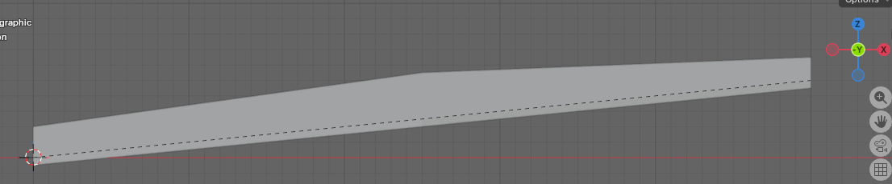
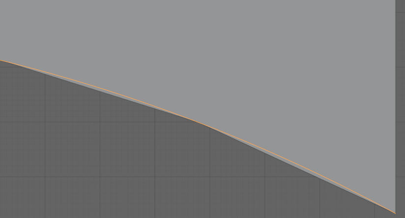

# Chapter 10 - Sectioned Surfaces and Solids

## 10.0 Introduction

A common approach in roadway design software is template-based modeling: define a cross-section template, apply it at regular intervals along the alignment, and interpolate the geometry between positions. For simple, uniform roadways — constant width, constant cross-slope — this works well. But most roadways are not uniform. They taper in and out; include medians that appear and disappear; require superelevation transitions; and feature traffic islands, widenings, and complex intersection geometry. For these cases, interpolating between evenly-spaced template stamps produces piecewise-linear geometry that can only approximate the intended design.

Road design software has long addressed this limitation through the concept of *strings* — continuous three-dimensional threads tracing significant features along the route: the edge of travel path, the shoulder break, the top of curb, the back of curb. Rather than deriving edges from template interpolation, strings define the edges explicitly. The cross-sections through the design are understood as sections through the string model, not the primary definition.

IFC4x3 introduces two geometry entities specifically for infrastructure: `IfcSectionedSurface` and `IfcSectionedSolidHorizontal`. Both define geometry by sweeping cross-sections along a `Directrix` — typically an alignment curve. `IfcSectionedSurface` uses open cross-sections to produce a surface; `IfcSectionedSolidHorizontal` uses closed cross-sections to produce a volumetric solid. Both support two complementary approaches to defining the geometry: template-based (cross-sections at defined distances along the directrix, linearly interpolated between) and stringline-based (guide curves that control where tagged cross-section points travel between sections). The IFC specification leaves several aspects of these entities underspecified — particularly around guide curve behavior, tag scoping, and the interaction between authored sections and guide curves. These gaps are significant enough that consistent implementations cannot be guaranteed without additional guidance; they are identified and discussed in §10.5.

## 10.1 Template-Based Approach

In the template-based approach, cross-sections are defined at discrete distances along the `Directrix`. The geometry engine interpolates linearly between consecutive cross-section positions to generate the surface or solid. The cross-sections need not be identical — width, slope, and shape can all vary from one distance to the next — but the transition between any two consecutive sections is linear.

For simple geometry this is entirely adequate. A road with a constant typical section can be fully described by two cross-sections with linear interpolation between them. A superelevation transition with a uniform rotation rate can be captured with sections at each end of the transition. The template approach becomes strained when the geometry between defined sections is not linear — a curved edge taper through a widening, for example — requiring progressively denser section spacing to reduce the approximation error.

Inevitably all roadways encounter other roadways, requiring complex intersection designs that must move smoothly through 3D space. This is where template-based design becomes difficult.

## 10.2 Stringlines

A stringline is a continuous three-dimensional curve tracing the path of a specific feature — edge of pavement, shoulder break, top of curb — along the full extent of the design. Where the template approach interpolates linearly between section endpoints, a stringline defines the exact trajectory of a tagged cross-section point, independent of section density.

In IFC, stringlines are represented as `IfcOffsetCurveByDistances` instances. The `Tag` attribute on `IfcOffsetCurveByDistances` connects a guide curve to the cross-section points that carry the matching tag value. A tagged point in a cross-section profile is constrained to follow the guide curve carrying the same tag. Throughout this chapter, the industry term *stringline* and the IFC term *guide curve* refer to the same construct — a tagged `IfcOffsetCurveByDistances` — and are used interchangeably.

The tag mechanism differs between the two entities:

- For `IfcSectionedSurface`, tags are carried by `IfcOpenCrossProfileDef.Tags` — a list of $N+1$ labels, one per vertex of the open profile. Each vertex can be independently associated with a guide curve.
- For `IfcSectionedSolidHorizontal`, tags are carried by `IfcCartesianPointList2D.TagList` — one label per coordinate in the point list. Closed profiles are typically `IfcArbitraryClosedProfileDef` whose `OuterCurve` is an `IfcIndexedPolyCurve` referencing an `IfcCartesianPointList2D`; the `TagList` on that point list provides a label for each profile vertex. Any point in the closed profile can be tagged. See §10.4 for the full profile structure.

In both cases, the intended behavior is that the geometry at a tagged cross-section point follows the corresponding guide curve — allowing, for example, a widening with a curved edge taper to be defined by sections only at the start and end of the transition, with the guide curve carrying the taper geometry between them. The IFC specification does not state this explicitly. Several related questions — whether tagged points follow guide curves or are linearly interpolated between sections, what `BasisCurve` a guide curve is required or permitted to use, and what happens when a guide curve and an authored section disagree — are all specification gaps discussed in §10.5.

The stringline approach is not an alternative to the template approach but an augmentation of it. Cross-sections are always required; guide curves control interpolation between them.

## 10.3 IfcSectionedSurface

`IfcSectionedSurface` defines a surface by sweeping open cross-sections along a directrix curve.

| Attribute | Type | Description |
|-----------|------|-------------|
| `Directrix` | `IfcCurve` | The curve along which sections are swept |
| `CrossSectionPositions` | `LIST [2:?] OF IfcAxis2PlacementLinear` | Positions along the directrix at which sections are placed |
| `CrossSections` | `LIST [2:?] OF IfcProfileDef` | Open cross-section profiles, one per position |

*Table 10.3-1 — IfcSectionedSurface attributes*

The surface is generated by sweeping the cross-sections between the defined `CrossSectionPositions`. It does not extend to the head or tail of the `Directrix` — the surface is bounded by its first and last cross-section positions. The `CrossSectionPositions` and `CrossSections` lists must be equal in length. Figure 10.3-1 illustrates a sectioned surface through a superelevation transition, showing how the open cross-section profile varies along the directrix.

*Figure 10.3-1 — Sectioned surface illustrating a superelevation transition*

### 10.3.1 Breaklines

In the context of `IfcSectionedSurface`, a breakline is a line along the surface where the cross-slope changes abruptly — an edge of travel path, a shoulder break, the face of a curb. This usage is distinct from DTM breaklines, which force TIN triangulation to honor a feature edge. Here the term describes a topological feature of the swept surface itself: a ridge or valley line where adjacent surface facets meet at a non-tangent angle.

Breaklines arise from the tag mechanism when consecutive cross-sections have different numbers of segments. A widening lane introduces a new vertex at the distance along the directrix where the widening begins. Tags identify which vertices in one section correspond to vertices in the next, even when the two sections have different segment counts. A vertex present in one section but absent in the adjacent section causes the surface to initiate or terminate at that longitudinal position, which is the geometric definition of a breakline in this context. `IfcOpenCrossProfileDef` is the only profile that supports breaklines. Figure 10.3.1-1 illustrates a sectioned surface with breaklines resulting from cross-section topology changes along the route.

*Figure 10.3.1-1 — Sectioned surface with breaklines at cross-section topology changes. (source bSI)*

Figure 10.3.1-2 shows a sectioned surface inspired by Figure 10.3.1-1 with both a widening and narrowing of the surface.

*Figure 10.3.1-2 — Sectioned surface with breaklines at cross-section topology changes. This figure shows the surface widening and returning to its original width.*

Although the IFC specification does not state this explicitly, the `Slope` and `Width` of an `IfcOpenCrossProfileDef` segment must be zero at the distance along the directrix where a breakline initiates or terminates. When a new feature vertex first appears — the start of a widening lane, for example — the cross-section at that distance must include the new tagged vertex with a zero-width segment. In Figure 10.3.1-1, this is why points B and D coincide in the second cross-section: the zero-width segment collapses those tagged vertices to the same position, establishing the breakline origin without introducing lateral extent. Without a zero-width segment at the breakpoint position, the surface has no defined starting position for the new feature and the geometry is ambiguous. The branching example in §10.6.1.2 illustrates this pattern for a surface where breaklines branch from the main cross-section.

The tag mechanism serves both breaklines and stringlines simultaneously. A tag on a profile vertex identifies that vertex's correspondence across sections with different topology and, when a matching `IfcOffsetCurveByDistances` guide curve exists, controls the vertex's trajectory between sections. The two functions — topological correspondence and geometric guidance — share the same tag infrastructure.

### 10.3.2 Stringlines

Within `IfcSectionedSurface`, stringlines are implemented through the `Tags` attribute of `IfcOpenCrossProfileDef`. This attribute holds a list of $N+1$ labels — one per vertex of the open profile, where $N$ is the number of segments. An `IfcOffsetCurveByDistances` guide curve whose `Tag` matches one of these vertex labels takes control of that vertex's trajectory along the surface. Though not specified by IFC, where a guide curve governs a vertex, the vertex position at any distance along the directrix is read from the guide curve rather than interpolated from the authored cross-section positions.

The `OffsetPoint` attribute of `IfcOpenCrossProfileDef` positions the first tagged vertex in the directrix's local coordinate system. Subsequent vertices are derived from there by accumulating the segment `Widths` and `Slopes`. It is unclear if all tagged vertices participate in the matching process independently allowing for a surface to have some vertices guided by offset curves and others governed by linear interpolation between authored sections.

## 10.4 IfcSectionedSolidHorizontal

`IfcSectionedSolidHorizontal` defines a solid by sweeping closed cross-sections along a directrix curve. It follows the same fundamental structure as `IfcSectionedSurface` but produces a volumetric solid bounded by the swept faces and the cross-section planes at each end.

| Attribute | Type | Description |
|-----------|------|-------------|
| `Directrix` | `IfcCurve` | The curve along which sections are swept |
| `CrossSections` | `LIST [2:?] OF IfcProfileDef` | Closed cross-section profiles, one per position |
| `CrossSectionPositions` | `LIST [2:?] OF IfcAxis2PlacementLinear` | Positions along the directrix at which sections are placed |

*Table 10.4-1 — IfcSectionedSolidHorizontal attributes*

As with `IfcSectionedSurface`, the solid is generated by sweeping only between the defined `CrossSectionPositions`. It does not extend to the head or tail of the `Directrix` (see §10.5 "Extent Along the Directrix"). The `CrossSections` and `CrossSectionPositions` lists must be equal in length, and the position expressions must not use longitudinal offsets.

Cross-sections are typically `IfcArbitraryClosedProfileDef` profiles. The profile outline is defined as an `IfcIndexedPolyCurve` referencing an `IfcCartesianPointList2D`. Profile points are listed in counter-clockwise order when viewed from the direction the profile normal points. The `IfcCartesianPointList2D.TagList` attribute assigns a label to each point in the coordinate list, enabling the stringline mechanism of Section 10.2. The same two guide curve authoring approaches available for `IfcSectionedSurface` apply equally here: guide curves whose `BasisCurve` is the same curve as the solid `Directrix` are scoped to that directrix and their tags need only be unique within that scope; guide curves with an independent `BasisCurve` require globally unique tags across the model. The trade-offs between these approaches are discussed through `IfcSectionedSurface` examples in §10.6.1.4 and §10.6.1.5, but the analysis applies without change to `IfcSectionedSolidHorizontal`.

For a note on a documentation error in the profile orientation specification for this entity, see Section 10.5.

### 10.4.1 Rotations

Cross-section rotation accommodates superelevation — the banking of a road or rail cross-section along a curve. `IfcSectionedSolidHorizontal` supports two approaches.

**Single superelevation** applies a uniform rotation to the entire cross-section at each defined position along the directrix. `IfcDerivedProfileDef` expresses this rotation, with its `ParentProfile` referencing the base (unrotated) profile. Each entry in `CrossSections` can reference its own `IfcDerivedProfileDef` instance with a different rotation angle, allowing the rotation to vary along the directrix while the underlying profile shape remains constant.

**Multiple independent superelevations** apply when different parts of the cross-section rotate independently — for example, a divided highway where left and right carriageways have different cross-slopes, or a cross-section with a varying median shape. In this case each `CrossSection` is a distinct profile instance. The tagged points in `IfcCartesianPointList2D.TagList` and their corresponding `IfcOffsetCurveByDistances` guide curves control where each point travels independently along the route. The guide curves effectively encode the superelevation variation for each tagged feature point without requiring explicit rotation parameters.

## 10.5 Specification Gaps and Implementation Notes

### Guide Curve BasisCurve and Tag Scoping

The IFC specification does not require or restrict the `BasisCurve` of an `IfcOffsetCurveByDistances` guide curve to be the same curve as the `Directrix` of the surface or solid it serves. This silence permits two distinct approaches with different implications for tag scoping and geometric capability.

**Same BasisCurve as the Directrix.** When a guide curve's `BasisCurve` is the same curve as the `Directrix`, the guide curve's offsets are expressed in the same distance parameterization as the `CrossSectionPositions`. This provides a natural tag scoping boundary: only guide curves sharing that `BasisCurve` are candidates for the surface or solid's tag matching, and tags need only be unique within that scope. However, `IfcOffsetCurveByDistances` interpolates lateral offsets linearly between its defined `IfcPointByDistanceExpression` entries. Because the guide curve and the cross-section template share the same linear-along-the-directrix model, this approach produces results geometrically equivalent to placing cross-sections at the guide curve's defined distances — no geometric advantage over the pure template approach is gained.

**Independent BasisCurve.** When a guide curve's `BasisCurve` is an independent curve it carries geometric shape not constrained to be linear relative to the `Directrix` distance parameter. This is the configuration closest to the industry concept of a stringline: an edge path defined by its own geometry rather than by linearly interpolated offsets from a centerline. Because an independent `BasisCurve` has its own distance parameterization, there is no shared axis along which to scope tag matching; tags must be treated as globally unique across the entire model to avoid ambiguity. The trade-offs of this approach are illustrated in §10.6.1.5.

The IFC specification does not state that tags must be unique within any particular scope, and there currently is no machine-verifiable rule to enforce either uniqueness constraint. Without clarity on the `BasisCurve` requirement and tag scoping rules, differing interpretations across implementations will produce incompatible results and undermine the ability to reliably exchange stringline-based geometry. These two uniquness constraints are not mutually exclusive - an implementation agreement is necessary to allow developers to confidently implement sectioned surfaces and solids.

### Extent Along the Directrix

`IfcSectionedSurface` and `IfcSectionedSolidHorizontal` are bounded by their `CrossSectionPositions` — geometry is generated by sweeping only between the first and last defined position and does not extend to the head or tail of the `Directrix`. Figure 8.8.3.35.C in the IFC specification incorrectly depicts the solid extending to the head and tail of the `Directrix` when `CrossSectionPositions` are at interior distances, contradicting the specification text. The practical consequence of such extension would be severe: multiple `IfcSectionedSolidHorizontal` instances modeling sequential prisms along the same alignment — pavement layers, cut sections, fill sections — would each extend to the full alignment endpoints and overlap one another. Implementers should follow the specification text, not the figure.

Guide curve extent follows the opposite rule. The `IfcOffsetCurveByDistances` specification states that if the defined offset values do not span the full extent of the basis curve, the offsets implicitly continue with the same value toward the head and tail. For guide curves this means a constant offset stringline — such as the edge of a uniform-width shoulder — can be expressed with a single `IfcPointByDistanceExpression` without requiring offset values at every cross-section position. The two behaviors are independent: guide curves extend implicitly because they control interpolation *within* the surface or solid's defined span, not because they extend that span.

### Disagreement Between Section Endpoint and Guide Curve

When a cross-section endpoint is authored at a specific position and a guide curve with a matching tag passes through a different position at that same distance along the directrix, the specification provides no guidance on which governs. Implementers should treat the authored section positions as exact and design guide curves to be consistent with them at all defined section positions. The undefined behavior of a geometry kernel when a section endpoint and its guide curvewill lead to issues with interoperability including visualization, surface area and volume estimates, and clash detection to name a few. 

### Cross-Section Orientation: Default Axis Direction

Each `IfcAxis2PlacementLinear` entry in `CrossSectionPositions` defines the local coordinate system at which its corresponding cross-section is placed. The `Axis` attribute specifies the local "up" direction — the Z-axis of that coordinate system — which determines how the cross-section is oriented in 3D space. As discussed in §8.3.2, the default value of `Axis` when the attribute is omitted is not unambiguously defined in the IFC schema.

**Historical context.** During early development of `IfcSectionedSolidHorizontal` under IFC 4.3, the `Axis` direction at each cross-section position was envisioned as always vertical — `(0, 0, 1)` in global coordinates. As the standard evolved through RC1–RC4 and ADD1, this assumption was replaced with an author-controlled `IfcAxis2PlacementLinear` allowing `Axis` to be specified explicitly per cross-section position. The resolved specification permits both interpretations, but the default when `Axis` is omitted remains undefined (see §8.3.2).

**Geometric consequence.** On a flat (zero-grade) alignment the two interpretations produce identical results. On a graded alignment they diverge:

- **Axis = (0, 0, 1).** The cross-section "up" direction is always global vertical. Cross-section faces are plumb — their planes are perpendicular to the horizontal projection of the directrix, not to the 3D curve tangent. For infrastructure design this is the natural interpretation: end views and cross sections are in a vertical plane, heights are measured verticall, widths are measured horizontally.

- **Axis perpendicular to the 3D tangent.** The cross-section "up" direction tilts with the grade, remaining in the vertical plane containing the 3D tangent. Cross-section faces are truly perpendicular to the 3D curve. On a graded alignment the faces lean forward or backward relative to the direction of travel, producing a different solid with different volume and cross-sectional area at any given distance. This interpretation yields the same solid that `IfcExtrudedAreaSolid` would produce for the same profile swept along the same path.

On alignments with cant, the Axis = (0,0,1) interpretation would exclude the cross section rotation from the sweep requiring it to be explicily constructed into `IfcSectionedSurface` profile or the `IfcSectionedSurfaceHorizontal` section rotation mechanism. The other interpretation would allow for cant defined rotation to occur by simply using the default axis diecrtion as discussed in §10.6.1.1 and §10.6.2.1.

Figures 10.5-1 and 10.5-2 show the retaining wall example of §10.6.2.2 swept along a 10% graded directrix. In Figure 10.5-1, `Axis` is supplied explicitly as `(0, 0, 1)` at each cross-section position and the end face is plumb. Figure 10.5-2 shows the same scenario with `Axis` omitted, rendered by two different IFC viewers that have adopted opposite defaults: the upper half uses the perpendicular-to-3D-tangent interpretation; the lower half uses `(0, 0, 1)`. The divergence is most apparent at the start and end of the wall, where the two viewers produce noticeably different face orientations from an identical input file.

*Figure 10.5-1 — Elevation view of `IfcSectionedSolidHorizontal` on a 10% graded alignment with `Axis = (0, 0, 1)`: end face is vertical (plumb).*

*Figure 10.5-2 — The same `IfcSectionedSolidHorizontal` model (retaining wall, 10% grade, `Axis` omitted) rendered by two IFC viewers: the upper half assumes `Axis` perpendicular to the 3D tangent (inclined end face); the lower half assumes `Axis = (0, 0, 1)` (plumb end face).*

**Practical consequences.** The discrepancy extends beyond geometry. Quantity takeoffs derived from these two solids yield different volumes — the differing end-face angles shift the amount of material at each terminus, and the effect grows with grade steepness. A bill-of-materials or payment verification workflow can produce measurably different results from the same model file depending solely on which viewer performed the calculation.

Clash detection is similarly affected. The two solids occupy different regions of 3D space: an element near a wall endpoint may show as clear in one viewer and conflicting in another. A clash report's findings become tool-dependent, with nothing in the model file to signal the ambiguity.

In construction, the disagreement extends to physical work. Formwork geometry, excavation limits, and bearing surface angles at the wall ends all differ between interpretations. A contractor working from one viewer's output and an inspector referencing another's may reach opposite conclusions about what was designed — each correctly reading what their own tool shows.

**Recommendation.** Until such time this descrepency and be resolved, authors should always supply `Axis` explicitly in every `IfcAxis2PlacementLinear` entry within `CrossSectionPositions`. While this is ownerous and redundant for cant alignments, it will accurately convey the modeling intent.

### Profile Orientation Documentation Error

The specification for `IfcSectionedSolidHorizontal` states:

> The profile X axis is the direction of `RefDirection` from `IfcAxis2PlacementLinear`, and the profile Y axis is the direction of `Axis`.

This is incorrect. The profile is defined in a 2D XY plane and has a normal — the axis perpendicular to that plane — which determines how the profile is oriented in 3D space when swept along the directrix. It is that normal, not the profile X axis, that is the direction of `RefDirection`. When `RefDirection` is omitted from `IfcAxis2PlacementLinear` it defaults to the curve tangent direction. If the profile X axis were to align with the tangent, the profile plane would lie parallel to the sweep direction rather than perpendicular to it, producing degenerate geometry. The correct behavior is that the profile normal aligns with `RefDirection` (or the curve tangent when `RefDirection` is absent), placing the profile face perpendicular to the sweep path.

The specification for `IfcSectionedSurface` states this correctly: "the profile normal is derived from the associated `IfcAxis2PlacementLinear`." The `IfcSectionedSolidHorizontal` documentation should be read consistently with the `IfcSectionedSurface` text. This error is documented in buildingSMART issues [IFC4.x-IF #147](https://github.com/buildingSMART/IFC4.x-IF/issues/147) and [IFC4.x-development #1010](https://github.com/buildingSMART/IFC4.x-development/issues/1010).

### Validation Service: IfcOffsetCurveByDistances Must Be Referenced by a Rooted Entity

As discussed in [§5.2](5_OffsetCurves.md#52-offset-curves-and-ifcalignment), `IfcOffsetCurveByDistances` is a resource entity and must be directly associated with a rooted entity to satisfy validation rule [IFC105](https://buildingsmart.github.io/ifc-gherkin-rules/branches/main/features/IFC105_Resource-entities-need-to-be-referenced-by-rooted-entity.html). This requirement has an extra complication in the guide curve context: although a guide curve is geometrically referenced through the surface or solid (itself a rooted entity), the validation service does not trace that indirect path and flags guide curves not directly associated with a rooted entity.

In practice, each `IfcOffsetCurveByDistances` guide curve must be assigned as the shape representation of an `IfcAlignment`. If the model does not already contain an alignment that naturally owns the guide curve, a placeholder alignment must be created for this purpose. Each such placeholder alignment must also have stationing defined, or additional validation warnings will be raised.

## 10.6 Example Models

Twelve example models illustrate the concepts of this chapter in progressively more complex configurations, organized by entity type.

### 10.6.1 IfcSectionedSurface

#### 10.6.1.1 Minimal Definition

The file [`IfcSectionedSurface.ifc`](examples/IfcSectionedSurface.ifc) demonstrates `IfcSectionedSurface` with an `IfcSegmentedReferenceCurve` as the `Directrix`, so the open cross-section profile rotates with cant at each station along the alignment.

The alignment comprises three stacked layouts:

- **Horizontal**: a 50 m Bloss transition from infinite radius (tangent entry) to a 100 m radius curve curving left.
- **Vertical**: a 50 m flat grade at zero gradient.
- **Cant**: a 50 m Bloss transition from zero cant to 500 mm of right-rail elevation, consistent with the left-curving horizontal alignment. The cant value is exaggerated to make the banking effect clearly visible in renderings.

The horizontal and vertical layouts combine into an `IfcGradientCurve`; adding the cant layout produces an `IfcSegmentedReferenceCurve`, which serves as the `Directrix`. The cross-section is a single `IfcOpenCrossProfileDef` instance shared at both positions: a single segment of width 1.5 m (the rail head distance) with zero slope. The `OffsetPoint` is at `(0.75, 0)` — half the rail head distance to the right of the directrix — so the profile spans the track gauge between the two rails. The same profile instance is placed at distances 0 m and 50 m along the directrix.

Because the profile slope is zero, the top surface of the ballast bed is flat in the profile's local coordinate frame at every station. The banking visible in the rendered model comes entirely from the `IfcSegmentedReferenceCurve` rotating the profile frame at each station by the cant-derived angle. At the start (distance 0) the cant is zero and the surface is level; by distance 50 m the cant has reached 500 mm and the surface is banked accordingly. The geometry engine interpolates the cant continuously between stations following the Bloss parametric equations — there is no step change.

*Figure 10.6.1.1-1 — `IfcSectionedSurface` (ballast bed top surface, 1.5 m track gauge) swept along an `IfcSegmentedReferenceCurve` directrix. The 50 m Bloss cant transition banks the surface from level at the start to 500 mm right-rail elevation at the end.*

#### 10.6.1.2 Superelevation

The file [`IfcSectionedSurface_superelevation.ifc`](examples/IfcSectionedSurface_superelevation.ifc) is a template-based `IfcSectionedSurface` illustrating a superelevation transition, shown in Figure 10.3-1. The surface is defined by cross-sections at discrete positions along a `Directrix`, with linear interpolation between them. No guide curves are used. This is the simplest configuration and produces adequate geometry when the variation between sections is itself linear — which is the case for uniform superelevation rotation. The model also includes `IfcReferent` instances marking the superelevation events along the alignment.

#### 10.6.1.3 Sectioned Surface with Branching

The file [`IfcSectionedSurface_with_branching.ifc`](examples/IfcSectionedSurface_with_branching.ifc) is shown in Figure 10.3.1-2. It is based on the breakline example given in the `IfcSectionedSurface` documentation, enhanced to show both a widening and a subsequent narrowing of the section — a median or auxiliary lane that emerges from the main roadway and then returns.

#### 10.6.1.4 Stringlines — Guide Curves as Resource Entities

The file [`IfcSectionedSurface_with_stringlines_as_resource_entities.ifc`](examples/IfcSectionedSurface_with_stringlines_as_resource_entities.ifc) is the baseline stringline example. The directrix is a 200 m straight alignment with a flat vertical profile. The symmetric open profile has two segments and three tagged vertices: `A` (right edge), `B` (centerline), and `C` (left edge), each with a corresponding `IfcOffsetCurveByDistances` guide curve sharing the same basis curve as the surface directrix.

Only two cross-sections are authored — one at each end of the surface. The guide curves carry all intermediate geometry. Guide curves A and C define a variable-width surface: both edges begin at ±30 m, widen to ±45 m at the 100 m midpoint, and return to ±30 m at 200 m. Guide curve B holds the centerline at a constant zero offset throughout. Without the guide curves, linear interpolation between the two end sections would produce a uniform 30 m width along the full 200 m — the guide curves are what create the widening.

Note that `Main-Line` cannot itself serve as the guide curve for the centerline vertex: `IfcAlignment` does not have a `Tag` attribute. Guide curve B is therefore an `IfcOffsetCurveByDistances` with a zero lateral offset from `Main-Line`, existing solely to carry the tag `"B"` on behalf of the alignment.

Figure 10.6.1.4-1 shows the expected geometry of this example.

*Figure 10.6.1.4-1 — Expected geometry of `IfcSectionedSurface` with stringline guide curves. This rendering has been synthesised to illustrate the correct geometry; no viewer capable of resolving stringline guide curves has been found at the time of writing.*

**Validation note.** The three `IfcOffsetCurveByDistances` instances in this model are bare resource entities: they are referenced by the surface but not assigned as representations of any rooted entity. The IFC validation service flags this as an [IFC105](https://buildingsmart.github.io/ifc-gherkin-rules/branches/main/features/IFC105_Resource-entities-need-to-be-referenced-by-rooted-entity.html) violation. The model is geometrically correct but does not conform to industry best-practice validation rules.

#### 10.6.1.5 Stringlines — Guide Curves as Alignments

The file [`IfcSectionedSurface_with_stringlines_guide_curves_as_alignments.ifc`](examples/IfcSectionedSurface_with_stringlines_guide_curves_as_alignments.ifc) contains the same geometry as §10.6.1.4 but wraps each guide curve as an `IfcAlignment` instance — `A-line`, `B-line`, and `C-line` — aggregated under the project. The `Tag` is set on the `IfcOffsetCurveByDistances` carried by each alignment's shape representation. This structure satisfies the [IFC105](https://buildingsmart.github.io/ifc-gherkin-rules/branches/main/features/IFC105_Resource-entities-need-to-be-referenced-by-rooted-entity.html) rooted-entity requirement and eliminates the validation service warning.

Because all three guide curves in this example share the same `BasisCurve` as the surface `Directrix`, tag matching is scoped to that shared basis curve. Tags `"A"`, `"B"`, and `"C"` need only be unique within the set of guide curves on `Main-Line` — they do not need to be globally unique across the model. The IFC specification does not state this scoping rule explicitly, but it follows from the interpretation discussed in §10.5.

The expected geometry is the same as that shown in Figure 10.6.1.4-1.

#### 10.6.1.6 Stringlines — Independent Edge Alignments

The file [`IfcSectionedSurface_with_stringlines_independent_edge_alignments.ifc`](examples/IfcSectionedSurface_with_stringlines_independent_edge_alignments.ifc) takes a different approach: the edge stringlines are derived from independent `IfcAlignment` instances whose geometry is circular arcs, rather than parametric offsets from the centerline. `Main-Line` is a 200 m straight alignment. `Left_Edge` and `Right_Edge` are 150 m circular arcs (radius 300 m) starting at ±30 m from the centerline. The guide curves for tags A and C are zero-offset curves from these arc alignments; the guide curve for tag B is a zero-offset from `Main-Line`. As previously discussed, the alignments themselves cannot carry tags, so zero-offset `IfcOffsetCurveByDistances` instances are used.

Because the guide curves for tags A and C have a different `BasisCurve` than the surface `Directrix`, the basis-curve scoping rule from §10.5 no longer provides a natural disambiguation boundary. There is no shared parameterization to define which guide curves belong to which surface or solid, so tags must be treated as globally unique across the entire model. The IFC specification is silent on this distinction — it neither requires global uniqueness nor defines when surface-scoped uniqueness is sufficient.

This configuration is the most conceptually faithful to the idea of stringlines — each edge path is an independent geometric entity — but it exposes two further specification gaps. First, `Left_Edge` and `Right_Edge` are 150 m long while the surface directrix is 200 m long. The guide curves' parameterization ends before the surface does, and the IFC specification's implicit extension rule (the last offset value continues to the end of the basis curve) does not resolve the inconsistency because the guide curves' basis curves are different from the surface directrix. Second, the cross-section at distance 200 m authors a width of 60 m each side, but the circular arc guide curves would position the edge vertices at a different lateral distance at that station. The specification does not state which governs — the authored section or the guide curve.

Figure 10.6.1.6-1 shows a plan view of the example stringline model. The specification ambiguities identified above leave the correct output geometry undefined, and no implementation producing a verifiable result has been found.

*Figure 10.6.1.6-1 — Plan view of `IfcSectionedSurface_with_stringlines_independent_edge_alignments.ifc`. The centerline (`Main-Line`) and arc edge alignments (`Left_Edge`, `Right_Edge`) are shown; the surface geometry between them is indeterminate due to the specification gaps described above.*

Figure 10.6.1.6-2 shows the expected geometry of this example.

*Figure 10.6.1.6-2 — Expected geometry of `IfcSectionedSurface_with_stringlines_independent_edge_alignments.ifc`. This rendering has been synthesised to illustrate the correct geometry; no viewer capable of resolving stringline guide curves has been found at the time of writing.*

#### 10.6.1.7 Stringlines — Dense Section Approximation

The file [`IfcSectionedSurface_with_stringlines_dense_section_approximation.ifc`](examples/IfcSectionedSurface_with_stringlines_dense_section_approximation.ifc) reproduces the same edge geometry as §10.6.1.5 — a straight centerline with curved edges defined by 300 m radius arcs — but using the template approach rather than guide curves. Cross-section widths at five evenly-spaced stations are computed analytically from the arc geometry, and the resulting `IfcOpenCrossProfileDef` instances embed the exact width at each station. The edge alignment instances from v3 are retained in the model to provide a visual reference. Figure 10.6.6-1 shows the resulting surface; the mesh lines mark each cross-section boundary and the curved overall shape reflects the analytically computed widths.

*Figure 10.6.6-1 — Sectioned surface with five cross-sections approximating curved edge geometry. Mesh lines mark cross-section boundaries; the edge paths between them are piecewise-linear.*

Figure 10.6.6-2 zooms in on the far-right corner of the surface, where the gap between the exact circular arc guide curve (shown in orange) and the piecewise-linear surface edge is most visible. With only five sections, the approximation error is perceptible at the scale of the model.

*Figure 10.6.6-2 — Zoomed view of the far-right corner showing the gap between the piecewise-linear surface edge and the exact circular arc guide curve (orange). The error is largest at the midpoint between cross-sections.*

This example illustrates the trade-off between the two approaches. The template approach with dense sections can approximate curved edge geometry to any desired tolerance, but requires explicit computation of profile widths at each station and produces a model with many cross-section instances. The stringline approach of §10.6.1.6 requires only two sections and lets the guide curves carry the geometry exactly — but leaves the specification gaps noted there unresolved.

### 10.6.2 IfcSectionedSolidHorizontal

#### 10.6.2.1 Minimal Definition

The file [`IfcSectionedSolidHorizontal.ifc`](examples/IfcSectionedSolidHorizontal.ifc) is the solid counterpart to [`IfcSectionedSurface.ifc`](examples/IfcSectionedSurface.ifc) (§10.6.1.1). It is the minimal definition of `IfcSectionedSolidHorizontal`: a uniform cross-section placed at two positions along a 3D alignment, with linear interpolation between them. No profile rotation, superelevation, or guide curves are used. This isolates the core solid sweep mechanism from the additional complexity addressed in §10.6.2.2–10.6.2.6.

The alignment comprises three stacked layouts identical to the surface counterpart:

- **Horizontal**: a 50 m Bloss transition from infinite radius (tangent entry) to a 100 m radius curve to the left.
- **Vertical**: a 50 m flat grade at zero gradient.
- **Cant**: a 50 m Bloss transition from zero cant to 500 mm of right-rail elevation, consistent with the left-curving horizontal alignment. The cant value is exaggerated to make the banking effect clearly visible in renderings.

The horizontal and vertical layouts combine into an `IfcGradientCurve`; adding the cant layout produces an `IfcSegmentedReferenceCurve`, which serves as the `Directrix` of the solid. The cross-section is a trapezoidal ballast bed profile defined by four vertices — `(-0.9, 0)`, `(0.9, 0)`, `(0.75, 0.25)`, `(-0.75, 0.25)` — wider at the base (1.8 m) than at the top (1.5 m, matching the rail head distance), and 0.25 m deep. It is encoded as an `IfcArbitraryClosedProfileDef` whose `OuterCurve` is an `IfcIndexedPolyCurve` with an explicit `IfcLineIndex` closing the loop back to the first vertex. The same profile is placed at distances 0 m and 50 m along the directrix, and the geometry engine interpolates linearly between them.

*Figure 10.6.2.1-1 — `IfcSectionedSolidHorizontal` (trapezoidal ballast bed, 1.5 m top width) swept along an `IfcSegmentedReferenceCurve` directrix. The 50 m Bloss cant transition banks the solid from level at the start to 500 mm right-rail elevation at the end.*

#### 10.6.2.2 Crown Cross-Section with Superelevation

The file [`IfcSectionedSolidHorizontal_superelevation.ifc`](examples/IfcSectionedSolidHorizontal_superelevation.ifc) is the solid counterpart to [`IfcSectionedSurface_superelevation.ifc`](examples/IfcSectionedSurface_superelevation.ifc). It demonstrates `IfcSectionedSolidHorizontal` with a distinct `IfcArbitraryClosedProfileDef` at each cross-section position, each directly encoding the cross-slope geometry for that station. The alignment structure, station pattern, and superelevation progression match the surface example; the difference is that the cross-section here is a closed solid profile rather than an open surface profile.

The alignment is a tangent–arc–tangent sequence: a 600 m leading straight, a 300 m radius circular arc of 585 m arc length, and a 600 m trailing straight, at a constant 0 % grade starting at elevation 30 m. The directrix is an `IfcGradientCurve`. Start station is 3000 m.

Each cross-section is a V-shaped pavement slab 60 m wide and 0.5 m thick. The crown point is at the profile origin $(0, 0)$ — the top centerline. From the crown, the road surface slopes to each shoulder at a rate defined by the superelevation state at that station. The soffit is 0.5 m vertically below each top-surface point. There are no beveled edges.

Six `IfcArbitraryClosedProfileDef` instances — one per position — directly encode the cross-slope at each station, mirroring the six `IfcOpenCrossProfileDef` instances in the surface counterpart. Without guide curves, vertex trajectories between stations are linearly interpolated; explicit guide curve control is illustrated in §10.6.2.5 and §10.6.2.6.

#### 10.6.2.3 Retaining Wall with Variable Section

Two files demonstrate `IfcSectionedSolidHorizontal` with a cross-section whose shape transforms along the alignment:

- [`IfcSectionedSolidHorizontal_retaining_wall_explicit_axis.ifc`](examples/IfcSectionedSolidHorizontal_retaining_wall_explicit_axis.ifc) — `Axis = (0, 0, 1)` supplied explicitly at each `CrossSectionPosition`; cross-section faces are plumb (Figure 10.5-1).
- [`IfcSectionedSolidHorizontal_retaining_wall_implicit_axis.ifc`](examples/IfcSectionedSolidHorizontal_retaining_wall_implicit_axis.ifc) — `Axis` omitted; the resulting orientation is implementation-defined (Figure 10.5-2).

The alignment is a 50 m straight grade at 10% due East. Three cross-sections are defined — at 0 m, 25 m, and 50 m — and the geometry engine interpolates linearly between them. The cross-section is a retaining wall with footing; the stem height varies from 2.0 m at the start, to 3.0 m at the midpoint, and back to 1.5 m at the end. The footing width also varies: 2.0 m at the start and end, widening to 2.5 m at the midpoint, while the toe and wall thickness remain constant throughout. See §10.5 for a discussion of the `Axis` direction and its geometric consequences.

#### 10.6.2.4 Single Superelevation

The file [`IfcSectionedSolidHorizontal_single_superelevation.ifc`](examples/IfcSectionedSolidHorizontal_single_superelevation.ifc) demonstrates the `IfcDerivedProfileDef` superelevation approach described in §10.4.1. The cross-slope transitions from flat (0 %) at station 0 m to a 10 % superelevation at station 50 m, with the geometry engine interpolating linearly between the two defined positions.

The alignment is a 50 m straight line due East at zero grade with no cant. The directrix is therefore an `IfcGradientCurve` — no `IfcSegmentedReferenceCurve` is needed because the superelevation is encoded entirely in the profile rotation rather than in the alignment cant.

The base cross-section is the same trapezoid used in §10.6.2.1: vertices `(-30, 0)`, `(30, 0)`, `(29.5, 0.5)`, `(-29.5, 0.5)`, encoded as an `IfcArbitraryClosedProfileDef`. A single instance of this base profile is shared by both cross-section positions; each position wraps it in its own `IfcDerivedProfileDef` whose `IfcCartesianTransformationOperator2D` carries the rotation.

The rotation angle is $\theta = \arctan(e)$, where $e$ is the cross-slope (rise/run): $\theta = 0$ at station 0 m and $\theta \approx 5.71°$ at station 50 m. The geometry engine interpolates the rotation linearly between the two positions.

#### 10.6.2.5 Stringlines — Guide Curves as Alignments

The file [`IfcSectionedSolidHorizontal_with_stringlines_guide_curves_as_alignments.ifc`](examples/IfcSectionedSolidHorizontal_with_stringlines_guide_curves_as_alignments.ifc) is the solid counterpart to [`IfcSectionedSurface_with_stringlines_guide_curves_as_alignments.ifc`](examples/IfcSectionedSurface_with_stringlines_guide_curves_as_alignments.ifc) (§10.6.1.5). It demonstrates guide curves controlling tagged vertices of an `IfcArbitraryClosedProfileDef`, replacing the `IfcOpenCrossProfileDef.Tags` mechanism of the surface with `IfcCartesianPointList2D.TagList`. The alignment, guide curve alignments, and variable-width parameters are identical to the surface example.

The directrix is the same 200 m straight alignment (`Main-Line`) at flat grade. Two cross-section positions are authored — one at each end. Three guide curve alignments (`A-line`, `B-line`, `C-line`) wrap `IfcOffsetCurveByDistances` instances whose `BasisCurve` is `Main-Line`, the same curve as the solid `Directrix`. The tags `"A"`, `"B"`, `"C"` are set on the offset curves; because all share the same basis curve as the directrix, tag matching is scoped to that parameterization (see §10.5). The guide curve offsets are unchanged from §10.6.1.5: `A-line` and `C-line` widen from ±30 m to ±45 m at the 100 m midpoint and return; `B-line` holds the crown at zero offset throughout.

The closed cross-section is a V-shaped pavement slab 60 m wide (nominal) and 1 m thick, with a 20 % crown slope. Tags are assigned through `IfcCartesianPointList2D.TagList`: the three top-surface vertices carry matching guide curve tags (`"A"`, `"B"`, `"C"`), while the three bottom-surface vertices carry non-matching tags (`"A_bot"`, `"B_bot"`, `"C_bot"`) so the soffit falls back to linear interpolation between positions.

**Key difference from the surface counterpart.** In `IfcOpenCrossProfileDef`, the `Tags` attribute is a list of vertex labels on the open profile. In `IfcArbitraryClosedProfileDef`, there is no `Tags` attribute; vertex labels are carried by `IfcCartesianPointList2D.TagList`. Both attributes achieve the same match — an offset curve's `Tag` is compared against the vertex label, and matching vertices are guided. A vertex with a tag that matches no guide curve behaves as an unguided vertex: its position at any distance along the directrix is linearly interpolated between its authored positions at the `CrossSectionPositions`.

#### 10.6.2.6 Stringlines — Independent Edge Alignments

The file [`IfcSectionedSolidHorizontal_with_stringlines_independent_edge_alignments.ifc`](examples/IfcSectionedSolidHorizontal_with_stringlines_independent_edge_alignments.ifc) is the solid counterpart to [`IfcSectionedSurface_with_stringlines_independent_edge_alignments.ifc`](examples/IfcSectionedSurface_with_stringlines_independent_edge_alignments.ifc) (§10.6.1.6). It demonstrates `IfcSectionedSolidHorizontal` where the edge guide curves are derived from independent `IfcAlignment` instances with circular arc geometry, rather than parametric offsets from the centerline directrix. The overall structure mirrors §10.6.2.5, but the guide curves for tags `"A"` and `"C"` have a different `BasisCurve` than the solid `Directrix`.

The directrix is the same 200 m straight `Main-Line` alignment at flat grade. Two additional alignments define the edge paths:

- `Left_Edge` — a 150 m circular arc with radius 300 m, curving left, starting at $(0,\ +30)$ m from the origin.
- `Right_Edge` — a 150 m circular arc with radius −300 m (curving right), starting at $(0,\ -30)$ m from the origin.

Both edge alignments carry a constant-grade vertical layout with a start height of $-\frac{1}{2} \times 30 \times 0.2 = -3\ \mathrm{m}$, placing each shoulder 3 m below the crown at the start. As in the surface counterpart, guide curve alignments (`A-line`, `B-line`, `C-line`) are zero-offset `IfcOffsetCurveByDistances` wrappers: `A-line` wraps `Left_Edge`, `B-line` wraps `Main-Line`, and `C-line` wraps `Right_Edge`. The tags `"A"`, `"B"`, `"C"` are set on the offset curves.

Because the guide curves for tags `"A"` and `"C"` have a `BasisCurve` independent of the solid `Directrix`, the basis-curve scoping rule from §10.5 no longer provides a natural disambiguation boundary. Tags must therefore be treated as globally unique across the entire model. The `"A_bot"`, `"B_bot"`, and `"C_bot"` tags on the bottom vertices serve as distinct identifiers that match no guide curve, ensuring the soffit falls back to linear interpolation.

Two profiles are authored: `cs1` at distance 0 m (half-width 30 m) and `cs2` at distance 200 m (half-width 60 m). Tags follow the same `IfcCartesianPointList2D.TagList` pattern as §10.6.2.5 — top vertices guided, bottom vertices non-matching and linearly interpolated.

The same two specification gaps documented in §10.6.1.6 apply here. First, `Left_Edge` and `Right_Edge` are 150 m long while the solid directrix is 200 m long. The guide curves' parameterization ends before the solid does, and the IFC specification does not define how a guide curve whose basis curve differs from the solid directrix should extend beyond its end. Second, the authored `cs2` template places the top shoulder vertices at ±60 m, but the circular arc guide curves would position those vertices at a different lateral distance at station 200 m. The specification does not state which governs — the authored section or the guide curve position.
