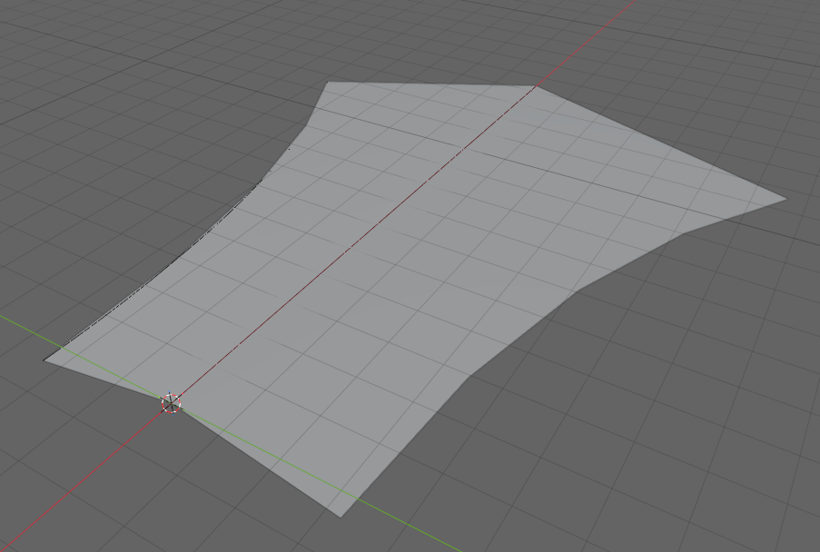

todo
* need to create sample models for sectioned solid horizontal that show the various transition supported.
* Add `IfcReferent` widening event markers to `IfcSectionedSurface_with_branching.ifc` (§10.6.2), similar to the superelevation event referents in `Superelevation.ifc`.
* This section needs a lot of validation with models to support the claims
* Need to be clear with the stringline stuff - for the basic stringline where offset curves all use the same directrix, tags are surface unique. If stringlines are used with different basis curves, then tags must be globally unique. This is not clear in the IFC specification.

# Chapter 10 - Sectioned Surfaces and Solids

## 10.0 Introduction

A common approach in roadway design software is template-based modeling: define a cross-section template, apply it at regular intervals along the alignment, and interpolate the geometry between positions. For simple, uniform roadways — constant width, constant cross-slope — this works well. But most roadways are not uniform. They taper in and out; include medians that appear and disappear; require superelevation transitions; and feature traffic islands, widenings, and complex intersection geometry. For these cases, interpolating between evenly-spaced template stamps produces piecewise-linear geometry that can only approximate the intended design.

Road design software has long addressed this limitation through the concept of *strings* — continuous three-dimensional threads tracing significant features along the route: the edge of travel path, the shoulder break, the top of curb, the back of curb. Rather than deriving edges from template interpolation, strings define the edges explicitly. The cross-sections through the design are understood as sections through the string model, not the primary definition.

IFC4x3 introduces two geometry entities specifically for infrastructure: `IfcSectionedSurface` and `IfcSectionedSolidHorizontal`. Both define geometry by sweeping cross-sections along a `Directrix` — typically an alignment curve. `IfcSectionedSurface` uses open cross-sections to produce a surface; `IfcSectionedSolidHorizontal` uses closed cross-sections to produce a volumetric solid. Both support two complementary approaches to defining the geometry: template-based (cross-sections at defined distances along the directrix, linearly interpolated between) and stringline-based (guide curves that control where tagged cross-section points travel between sections).

## 10.1 Template-Based Approach

In the template-based approach, cross-sections are defined at discrete distances along the `Directrix`. The geometry engine interpolates linearly between consecutive cross-section positions to generate the surface or solid. The cross-sections need not be identical — width, slope, and shape can all vary from one distance to the next — but the transition between any two consecutive sections is linear.

For simple geometry this is entirely adequate. A road with a constant typical section can be fully described by two cross-sections with linear interpolation between them. A superelevation transition with a uniform rotation rate can be captured with sections at each end of the transition. The template approach becomes strained when the geometry between defined sections is not linear — a curved edge taper through a widening, for example — requiring progressively denser section spacing to reduce the approximation error.

Inevitably all roadways encounter other roadways, requiring complex intersection designs that must move smoothly through 3D space. This is where template-based design becomes difficult.

## 10.2 Stringlines

A stringline is a continuous three-dimensional curve tracing the path of a specific feature — edge of pavement, shoulder break, top of curb — along the full extent of the design. Where the template approach interpolates linearly between section endpoints, a stringline defines the exact trajectory of a tagged cross-section point, independent of section density.

In IFC, stringlines are represented as `IfcOffsetCurveByDistances` instances. The `Tag` attribute on `IfcOffsetCurveByDistances` connects a guide curve to the cross-section points that carry the matching tag value. A tagged point in a cross-section profile is constrained to follow the guide curve carrying the same tag. Throughout this chapter, the industry term *stringline* and the IFC term *guide curve* refer to the same construct — a tagged `IfcOffsetCurveByDistances` — and are used interchangeably.

The tag mechanism differs between the two entities:

- For `IfcSectionedSurface`, tags are carried by `IfcOpenCrossProfileDef.Tags` — a list of $N+1$ labels, one per vertex of the open profile. Each vertex can be independently associated with a guide curve.
- For `IfcSectionedSolidHorizontal`, tags are carried by `IfcCartesianPointList2D.TagList` — one label per coordinate in the point list. Any point in the closed profile can be tagged.

**todo - clarify what uses the pointlist2d, polylines?**

In both cases, the geometry of the surface or solid at a tagged point follows the corresponding guide curve rather than relying on linear interpolation between the authored section positions. A widening with a curved edge taper can be represented exactly with sections only at the start and end of the transition — the guide curve carries the taper geometry between them.

The stringline approach is not an alternative to the template approach but an augmentation of it. Cross-sections are always required; guide curves control interpolation between them. In the limiting case with infinitely dense sections, both approaches produce the same geometry. In practice, stringlines allow compact models with few sections and geometrically exact results where section-only interpolation would require dense section spacing to achieve acceptable approximation.

## 10.3 IfcSectionedSurface

`IfcSectionedSurface` defines a surface by sweeping open cross-sections along a directrix curve.

| Attribute | Type | Description |
|-----------|------|-------------|
| `Directrix` | `IfcCurve` | The curve along which sections are swept |
| `CrossSectionPositions` | `LIST [2:?] OF IfcAxis2PlacementLinear` | Positions along the directrix at which sections are placed |
| `CrossSections` | `LIST [2:?] OF IfcProfileDef` | Open cross-section profiles, one per position |

*Table 10.3-1 — IfcSectionedSurface attributes*

The surface is generated by sweeping the cross-sections between the defined `CrossSectionPositions`. It does not extend to the head or tail of the `Directrix` — the surface is bounded by its first and last cross-section positions. The `CrossSectionPositions` and `CrossSections` lists must be equal in length. Figure 10.3-1 illustrates a sectioned surface through a superelevation transition, showing how the open cross-section profile varies along the directrix.

*Figure 10.3-1 — Sectioned surface illustrating a superelevation transition*

### 10.3.1 Breaklines

In the context of `IfcSectionedSurface`, a breakline is a line along the surface where the cross-slope changes abruptly — an edge of travel path, a shoulder break, the face of a curb. This usage is distinct from DTM breaklines, which force TIN triangulation to honor a feature edge. Here the term describes a topological feature of the swept surface itself: a ridge or valley line where adjacent surface facets meet at a non-tangent angle.

Breaklines arise from the tag mechanism when consecutive cross-sections have different numbers of segments. A widening lane introduces a new vertex at the distance along the directrix where the widening begins. Tags identify which vertices in one section correspond to vertices in the next, even when the two sections have different segment counts. A vertex present in one section but absent in the adjacent section causes the surface to initiate or terminate at that longitudinal position, which is the geometric definition of a breakline in this context. `IfcOpenCrossProfileDef` is the only profile that supports breaklines. Figure 10.3.1-1 illustrates a sectioned surface with breaklines resulting from cross-section topology changes along the route.

*Figure 10.3.1-1 — Sectioned surface with breaklines at cross-section topology changes. (source bSI)*

Figure 10.3.1-2 shows a sectioned surface inspired by Figure 10.3.1-1 with both a widening and narrowing of the surface.

*Figure 10.3.1-2 — Sectioned surface with breaklines at cross-section topology changes. This figure shows the surface widening and returning to its original width.*

Although the IFC specification does not state this explicitly, the `Slope` and `Width` of an `IfcOpenCrossProfileDef` segment must be zero at the distance along the directrix where a breakline initiates or terminates. When a new feature vertex first appears — the start of a widening lane, for example — the cross-section at that distance must include the new tagged vertex with a zero-width segment. In Figure 10.3.1-1, this is why points B and D coincide in the second cross-section: the zero-width segment collapses those tagged vertices to the same position, establishing the breakline origin without introducing lateral extent. Without a zero-width segment at the breakpoint position, the surface has no defined starting position for the new feature and the geometry is ambiguous. The branching example in §10.6.2 illustrates this pattern for a surface where breaklines branch from the main cross-section.

The tag mechanism serves both breaklines and stringlines simultaneously. A tag on a profile vertex identifies that vertex's correspondence across sections with different topology and, when a matching `IfcOffsetCurveByDistances` guide curve exists, controls the vertex's trajectory between sections. The two functions — topological correspondence and geometric guidance — share the same tag infrastructure.

### 10.3.2 Stringlines

Within `IfcSectionedSurface`, stringlines are implemented through the `Tags` attribute of `IfcOpenCrossProfileDef`. This attribute holds a list of $N+1$ labels — one per vertex of the open profile, where $N$ is the number of segments. An `IfcOffsetCurveByDistances` guide curve whose `Tag` matches one of these vertex labels takes control of that vertex's trajectory along the surface. Where a guide curve governs a vertex, the vertex position at any distance along the directrix is read from the guide curve rather than interpolated from the authored cross-section positions.

The `OffsetPoint` attribute of `IfcOpenCrossProfileDef` positions the first tagged vertex in the directrix's local coordinate system. Subsequent vertices are derived from there by accumulating the segment `Widths` and `Slopes`. All tagged vertices participate in the matching process independently: a surface can have some vertices guided by offset curves and others governed by linear interpolation between authored sections.

Because guide curves carry the intermediate geometry, very few authored cross-sections are needed in practice. A widening surface that spans 200 m of alignment can be fully described by two cross-sections — one at the start, one at the end — with the edge guide curves encoding the widening trajectory between them. The same surface described purely by template interpolation would require progressively denser section spacing to approximate the same edge path.

For a guide curve to be well-defined relative to the surface, its `BasisCurve` must be the same curve as the surface `Directrix`. The `OffsetLateral` and `OffsetVertical` values in the guide curve's `IfcPointByDistanceExpression` entries position the tagged vertex laterally and vertically from the directrix at each defined distance, and those values are linearly interpolated between explicitly defined points. When a guide curve's `BasisCurve` differs from the surface `Directrix`, the distance parameterization is inconsistent and the tag-matching interpolation is undefined — a specification gap discussed further in §10.5.

## 10.4 IfcSectionedSolidHorizontal

`IfcSectionedSolidHorizontal` defines a solid by sweeping closed cross-sections along a directrix curve. It follows the same fundamental structure as `IfcSectionedSurface` but produces a volumetric solid bounded by the swept faces and the cross-section planes at each end.

| Attribute | Type | Description |
|-----------|------|-------------|
| `Directrix` | `IfcCurve` | The curve along which sections are swept |
| `CrossSections` | `LIST [2:?] OF IfcProfileDef` | Closed cross-section profiles, one per position |
| `CrossSectionPositions` | `LIST [2:?] OF IfcAxis2PlacementLinear` | Positions along the directrix at which sections are placed |

*Table 10.4-1 — IfcSectionedSolidHorizontal attributes*

As with `IfcSectionedSurface`, the solid is generated by sweeping only between the defined `CrossSectionPositions`. It does not extend to the head or tail of the `Directrix`. The `CrossSections` and `CrossSectionPositions` lists must be equal in length, and the position expressions must not use longitudinal offsets.

Cross-sections are typically `IfcArbitraryClosedProfileDef` profiles. The profile outline is defined as an `IfcIndexedPolyCurve` referencing an `IfcCartesianPointList2D`. Profile points are listed in counter-clockwise order when viewed from the direction the profile normal points. The `IfcCartesianPointList2D.TagList` attribute assigns a label to each point in the coordinate list, enabling the stringline mechanism of Section 10.2.

For a note on a documentation error in the profile orientation specification for this entity, see Section 10.5.

### 10.4.1 Rotations

Cross-section rotation accommodates superelevation — the banking of a road or rail cross-section along a curve. `IfcSectionedSolidHorizontal` supports two approaches.

**Single superelevation** applies a uniform rotation to the entire cross-section at each defined position along the directrix. `IfcDerivedProfileDef` expresses this rotation, with its `ParentProfile` referencing the base (unrotated) profile. Each entry in `CrossSections` can reference its own `IfcDerivedProfileDef` instance with a different rotation angle, allowing the rotation to vary along the directrix while the underlying profile shape remains constant.

**Multiple independent superelevations** apply when different parts of the cross-section rotate independently — for example, a divided highway where left and right carriageways have different cross-slopes, or a cross-section with a varying median shape. In this case each `CrossSection` is a distinct profile instance. The tagged points in `IfcCartesianPointList2D.TagList` and their corresponding `IfcOffsetCurveByDistances` guide curves control where each point travels independently along the route. The guide curves effectively encode the superelevation variation for each tagged feature point without requiring explicit rotation parameters.

## 10.5 Specification Gaps and Implementation Notes

### BasisCurve of Guide Curves Must Equal the Directrix

The specification does not require the `BasisCurve` of an `IfcOffsetCurveByDistances` guide curve to be the same curve as the `Directrix` of the surface or solid it serves. This constraint is nevertheless geometrically necessary. `CrossSectionPositions` are parameterized along the `Directrix` — each position is a distance along that curve. A guide curve must share the same distance parameterization for tag-matching interpolation to be well-defined. A guide curve relative to a different basis curve carries a different parameterization, making the correspondence between section distances and guide curve positions undefined.

The intended interpretation is that guide curves are always `IfcOffsetCurveByDistances` instances whose `BasisCurve` is the same curve as the surface or solid `Directrix`. This interpretation also provides a natural scoping mechanism for tag matching: in a model with multiple surfaces each having their own directrix, only guide curves sharing the same `BasisCurve` as a given surface's `Directrix` are candidates for that surface's tag matching. Global tag uniqueness across the entire model is therefore not required — only uniqueness within the set of guide curves sharing a common basis curve with the surface or solid.

### Tag Uniqueness Within Scope

The IFC specification does not state that tags must be unique within the scope of a given surface or solid. Uniqueness is nevertheless a necessary precondition for the tag-matching mechanism to function. If three `IfcOffsetCurveByDistances` guide curves all carry `Tag = "A"` and three cross-section vertices all carry `Tag = "A"`, there is no defined rule for which guide curve governs which vertex. Implementers authoring models with guide curves should treat tag uniqueness as a required constraint within each surface or solid. Validators currently have no machine-verifiable rule to enforce this, which is a gap in the formal rules.

### Extent Along the Directrix

`IfcSectionedSurface` and `IfcSectionedSolidHorizontal` are bounded by their `CrossSectionPositions` — geometry is generated by sweeping only between the first and last defined position and does not extend to the head or tail of the `Directrix`. Figure 8.8.3.35.C in the IFC specification incorrectly depicts the solid extending to the head and tail of the `Directrix` when `CrossSectionPositions` are at interior distances, contradicting the specification text. The practical consequence of such extension would be severe: multiple `IfcSectionedSolidHorizontal` instances modeling sequential prisms along the same alignment — pavement layers, cut sections, fill sections — would each extend to the full alignment endpoints and overlap one another. Implementers should follow the specification text, not the figure.

Guide curve extent follows the opposite rule. The `IfcOffsetCurveByDistances` specification states that if the defined offset values do not span the full extent of the basis curve, the offsets implicitly continue with the same value toward the head and tail. For guide curves this means a constant offset stringline — such as the edge of a uniform-width shoulder — can be expressed with a single `IfcPointByDistanceExpression` without requiring offset values at every cross-section position. The two behaviors are independent: guide curves extend implicitly because they control interpolation *within* the surface or solid's defined span, not because they extend that span.

### Disagreement Between Section Endpoint and Guide Curve

When a cross-section endpoint is authored at a specific position and a guide curve with a matching tag passes through a different position at that same distance along the directrix, the specification provides no guidance on which governs. Implementers should treat the authored section positions as exact and design guide curves to be consistent with them at all defined section positions. The behavior of a geometry kernel when a section endpoint and its guide curve disagree is implementation-defined.

### Profile Orientation Documentation Error

The specification for `IfcSectionedSolidHorizontal` states:

> The profile X axis is the direction of `RefDirection` from `IfcAxis2PlacementLinear`, and the profile Y axis is the direction of `Axis`.

This is incorrect. The profile is defined in a 2D XY plane and has a normal — the axis perpendicular to that plane — which determines how the profile is oriented in 3D space when swept along the directrix. It is that normal, not the profile X axis, that is the direction of `RefDirection`. When `RefDirection` is omitted from `IfcAxis2PlacementLinear` it defaults to the curve tangent direction. If the profile X axis were to align with the tangent, the profile plane would lie parallel to the sweep direction rather than perpendicular to it, producing degenerate geometry. The correct behavior is that the profile normal aligns with `RefDirection` (or the curve tangent when `RefDirection` is absent), placing the profile face perpendicular to the sweep path.

The specification for `IfcSectionedSurface` states this correctly: "the profile normal is derived from the associated `IfcAxis2PlacementLinear`." The `IfcSectionedSolidHorizontal` documentation should be read consistently with the `IfcSectionedSurface` text. This error is documented in buildingSMART issues [IFC4.x-IF #147](https://github.com/buildingSMART/IFC4.x-IF/issues/147) and [IFC4.x-development #1010](https://github.com/buildingSMART/IFC4.x-development/issues/1010).

### Validation Service: IfcOffsetCurveByDistances Must Be Referenced by a Rooted Entity

As discussed in [§5.2](5_OffsetCurves.md#52-offset-curves-and-ifcalignment), `IfcOffsetCurveByDistances` is a resource entity and must be directly associated with a rooted entity to satisfy validation rule [IFC105](https://buildingsmart.github.io/ifc-gherkin-rules/branches/main/features/IFC105_Resource-entities-need-to-be-referenced-by-rooted-entity.html). This requirement has an extra complication in the guide curve context: although a guide curve is geometrically referenced through the surface or solid (itself a rooted entity), the validation service does not trace that indirect path and flags guide curves not directly associated with a rooted entity.

In practice, each `IfcOffsetCurveByDistances` guide curve must be assigned as the shape representation of an `IfcAlignment`. If the model does not already contain an alignment that naturally owns the guide curve, a placeholder alignment must be created for this purpose. Each such placeholder alignment must also have stationing defined, or additional validation warnings will be raised.

## 10.6 Example Models

Seven example models illustrate the concepts of this chapter in progressively more complex configurations. The first two demonstrate `IfcSectionedSurface` without stringlines; the next four form a series that explores stringline authoring approaches and their trade-offs; the final example demonstrates `IfcSectionedSolidHorizontal` with a full 3D alignment including cant.

### 10.6.1 Superelevation

The file [`Superelevation.ifc`](examples/Superelevation.ifc) is a template-based `IfcSectionedSurface` illustrating a superelevation transition, shown in Figure 10.3-1. The surface is defined by cross-sections at discrete positions along a `Directrix`, with linear interpolation between them. No guide curves are used. This is the simplest configuration and produces adequate geometry when the variation between sections is itself linear — which is the case for uniform superelevation rotation. The model also includes `IfcReferent` instances marking the superelevation events along the alignment.

### 10.6.2 Sectioned Surface with Branching

The file [`IfcSectionedSurface_with_branching.ifc`](examples/IfcSectionedSurface_with_branching.ifc) is shown in Figure 10.3.1-2. It is based on the breakline example given in the `IfcSectionedSurface` documentation, enhanced to show both a widening and a subsequent narrowing of the section — a median or auxiliary lane that emerges from the main roadway and then returns.

### 10.6.3 Stringlines — Guide Curves as Resource Entities

The file [`IfcSectionedSurface_with_stringlines_as_resource_entities.ifc`](examples/IfcSectionedSurface_with_stringlines_as_resource_entities.ifc) is the baseline stringline example. The directrix is a 200 m straight alignment with a flat vertical profile. The symmetric open profile has two segments and three tagged vertices: `A` (right edge), `B` (centerline), and `C` (left edge), each with a corresponding `IfcOffsetCurveByDistances` guide curve sharing the same basis curve as the surface directrix.

Only two cross-sections are authored — one at each end of the surface. The guide curves carry all intermediate geometry. Guide curves A and C define a variable-width surface: both edges begin at ±30 m, widen to ±45 m at the 100 m midpoint, and return to ±30 m at 200 m. Guide curve B holds the centerline at a constant zero offset throughout. Without the guide curves, linear interpolation between the two end sections would produce a uniform 30 m width along the full 200 m — the guide curves are what create the widening.

Note that `Main-Line` cannot itself serve as the guide curve for the centerline vertex: `IfcAlignment` does not have a `Tag` attribute. Guide curve B is therefore an `IfcOffsetCurveByDistances` with a zero lateral offset from `Main-Line`, existing solely to carry the tag `"B"` on behalf of the alignment.

**Validation note.** The three `IfcOffsetCurveByDistances` instances in this model are bare resource entities: they are referenced by the surface but not assigned as representations of any rooted entity. The IFC validation service flags this as an [IFC105](https://buildingsmart.github.io/ifc-gherkin-rules/branches/main/features/IFC105_Resource-entities-need-to-be-referenced-by-rooted-entity.html) violation. The model is geometrically correct but does not conform to industry best-practice validation rules.

### 10.6.4 Stringlines — Guide Curves as Alignments

The file [`IfcSectionedSurface_with_stringlines_guide_curves_as_alignments.ifc`](examples/IfcSectionedSurface_with_stringlines_guide_curves_as_alignments.ifc) contains the same geometry as v1 but wraps each guide curve as an `IfcAlignment` instance — `A-line`, `B-line`, and `C-line` — aggregated under the project. The `Tag` is set on the `IfcOffsetCurveByDistances` carried by each alignment's shape representation. This structure satisfies the [IFC105](https://buildingsmart.github.io/ifc-gherkin-rules/branches/main/features/IFC105_Resource-entities-need-to-be-referenced-by-rooted-entity.html) rooted-entity requirement and eliminates the validation service warning from v1.

Because all three guide curves in this example (and in v1) share the same `BasisCurve` as the surface `Directrix`, tag matching is scoped to that shared basis curve. Tags `"A"`, `"B"`, and `"C"` need only be unique within the set of guide curves on `Main-Line` — they do not need to be globally unique across the model. The IFC specification does not state this scoping rule explicitly, but it follows from the interpretation discussed in §10.5.

### 10.6.5 Stringlines — Independent Edge Alignments

The file [`IfcSectionedSurface_with_stringlines_independent_edge_alignments.ifc`](examples/IfcSectionedSurface_with_stringlines_independent_edge_alignments.ifc) takes a different approach: the edge stringlines are derived from independent `IfcAlignment` instances whose geometry is circular arcs, rather than parametric offsets from the centerline. `Main-Line` is a 200 m straight alignment. `Left_Edge` and `Right_Edge` are 150 m circular arcs (radius 300 m) starting at ±30 m from the centerline. The guide curves for tags A and C are zero-offset curves from these arc alignments; the guide curve for tag B is a zero-offset from `Main-Line`. As previously discussed, the alignments themselves cannot carry tags, so zero-offset `IfcOffsetCurveByDistances` instances are used.

Because the guide curves for tags A and C have a different `BasisCurve` than the surface `Directrix`, the basis-curve scoping rule from §10.5 no longer provides a natural disambiguation boundary. There is no shared parameterization to define which guide curves belong to which surface, so tags must be treated as globally unique across the entire model to avoid ambiguity. The IFC specification is silent on this distinction — it neither requires global uniqueness nor defines when surface-scoped uniqueness is sufficient.

This configuration is the most conceptually faithful to the idea of stringlines — each edge path is an independent geometric entity — but it exposes two further specification gaps. First, `Left_Edge` and `Right_Edge` are 150 m long while the surface directrix is 200 m long. The guide curves' parameterization ends before the surface does, and the IFC specification's implicit extension rule (the last offset value continues to the end of the basis curve) does not resolve the inconsistency because the guide curves' basis curves are different from the surface directrix. Second, the cross-section at distance 200 m authors a width of 60 m each side, but the circular arc guide curves would position the edge vertices at a different lateral distance at that station. The specification does not state which governs — the authored section or the guide curve.

### 10.6.6 Stringlines — Dense Section Approximation

The file [`IfcSectionedSurface_with_stringlines_dense_section_approximation.ifc`](examples/IfcSectionedSurface_with_stringlines_dense_section_approximation.ifc) reproduces the same edge geometry as v3 — a straight centerline with curved edges defined by 300 m radius arcs — but using the template approach rather than guide curves. Cross-section widths at five evenly-spaced stations are computed analytically from the arc geometry, and the resulting `IfcOpenCrossProfileDef` instances embed the exact width at each station. The edge alignment instances from v3 are retained in the model to provide a visual reference. Figure 10.6.6-1 shows the resulting surface; the mesh lines mark each cross-section boundary and the curved overall shape reflects the analytically computed widths.

*Figure 10.6.6-1 — Sectioned surface with five cross-sections approximating curved edge geometry. Mesh lines mark cross-section boundaries; the edge paths between them are piecewise-linear.*

Figure 10.6.6-2 zooms in on the far-right corner of the surface, where the gap between the exact circular arc guide curve (shown in orange) and the piecewise-linear surface edge is most visible. With only five sections, the approximation error is perceptible at the scale of the model.

*Figure 10.6.6-2 — Zoomed view of the far-right corner showing the gap between the piecewise-linear surface edge and the exact circular arc guide curve (orange). The error is largest at the midpoint between cross-sections.*

This example illustrates the trade-off between the two approaches. The template approach with dense sections can approximate curved edge geometry to any desired tolerance, but requires explicit computation of profile widths at each station and produces a model with many cross-section instances. The stringline approach of v3 requires only two sections and lets the guide curves carry the geometry exactly — but leaves the specification gaps noted in §10.6.5 unresolved.

### 10.6.7 IfcSectionedSolidHorizontal — Bloss Cant Transition

The file [`IfcSectionedSolidHorizontal_bloss_cant.ifc`](examples/IfcSectionedSolidHorizontal_bloss_cant.ifc) demonstrates `IfcSectionedSolidHorizontal` swept along a complete 3D alignment that includes a cant component. The alignment comprises three stacked layouts:

- **Horizontal**: a 100 m Bloss transition starting from infinite radius (tangent entry) and transitioning to a 300 m radius curve to the left.
- **Vertical**: a 100 m flat grade at zero gradient.
- **Cant**: a 100 m Bloss transition from zero cant to 500 mm of right-rail elevation, consistent with the left-curving horizontal alignment. The 500 mm value is intentionally exaggerated beyond realistic railway practice to make the banking effect clearly visible in a viewer.

The horizontal and vertical layouts combine into an `IfcGradientCurve`; adding the cant layout produces an `IfcSegmentedReferenceCurve`, which serves as the `Directrix` of the solid. The cross-section is a trapezoid defined by four vertices — `(-30, 0)`, `(30, 0)`, `(28, 0.5)`, `(-28, 0.5)` — wider at the base than at the top. It is encoded as an `IfcArbitraryClosedProfileDef` whose `OuterCurve` is an `IfcIndexedPolyCurve` with an explicit `IfcLineIndex` closing the loop back to the first vertex. The same profile is placed at distances 0 and 100 m along the directrix, and the geometry engine interpolates linearly between them.

The solid is contained in an `IfcBuildingElementProxy` assigned to an `IfcRailwayPart` with `PredefinedType = TRACK`, which is aggregated under an `IfcRailway`.
