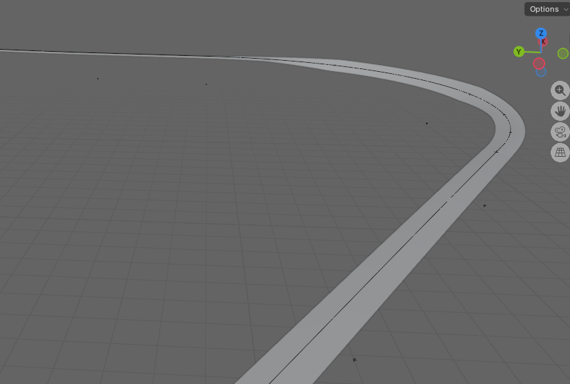
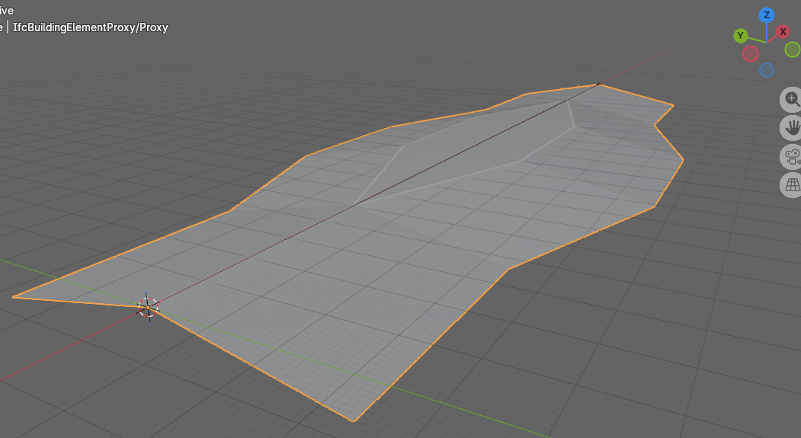

todo
* Figure 10.3.1-1 either eliminate the second surface or explain it.
* add IFC example files for Figure 10.3-1 and 10.3.1-1
* create new example files to illustrate string lines
* create example that shows a section on a horizontal curve. With templates, they are conneced with straight lines. With stringlines, the edges of the surface follow the curve.

# Section 10 - Sectioned Surfaces and Solids

## 10.0 Introduction

A common approach in roadway design software is template-based modeling: define a cross-section template, apply it at regular intervals along the alignment, and interpolate the geometry between positions. For simple, uniform roadways — constant width, constant cross-slope — this works well. But most roadways are not uniform. They taper in and out; include medians that appear and disappear; require superelevation transitions; and feature traffic islands, widenings, and complex intersection geometry. For these cases, interpolating between evenly-spaced template stamps produces piecewise-linear geometry that can only approximate the intended design.

Road design software has long addressed this limitation through the concept of *strings* — continuous three-dimensional threads tracing significant features along the route: the edge of travel path, the shoulder break, the top of curb, the back of curb. Rather than deriving edges from template interpolation, strings define the edges explicitly. The cross-sections through the design are understood as sections through the string model, not the primary definition.

IFC4x3 introduces two geometry entities specifically for infrastructure: `IfcSectionedSurface` and `IfcSectionedSolidHorizontal`. Both define geometry by sweeping cross-sections along a `Directrix` — typically an alignment curve. `IfcSectionedSurface` uses open cross-sections to produce a surface; `IfcSectionedSolidHorizontal` uses closed cross-sections to produce a volumetric solid. Both support two complementary approaches to defining the geometry: template-based (cross-sections at defined distances along the directrix, linearly interpolated between) and stringline-based (guide curves that control where tagged cross-section points travel between sections).

## 10.1 Template-Based Approach

In the template-based approach, cross-sections are defined at discrete distances along the `Directrix`. The geometry engine interpolates linearly between consecutive cross-section positions to generate the surface or solid. The cross-sections need not be identical — width, slope, and shape can all vary from one distance to the next — but the transition between any two consecutive sections is linear.

For simple geometry this is entirely adequate. A road with a constant typical section can be fully described by two cross-sections with linear interpolation between them. A superelevation transition with a uniform rotation rate can be captured with sections at each end of the transition. The template approach becomes strained when the geometry between defined sections is not linear — a curved edge taper through a widening, for example — requiring progressively denser section spacing to reduce the approximation error.

### Profile Types

The cross-section profile type differs between the two entities.

`IfcSectionedSurface` uses `IfcOpenCrossProfileDef`, an infrastructure-specific profile type introduced in IFC4x3. It defines an open profile as a series of segments radiating from a starting point, each characterized by a width and a slope.

| Attribute | Type | Description |
|-----------|------|-------------|
| `HorizontalWidths` | `IfcBoolean` | If true, `Widths` are measured horizontally; if false, along the slope |
| `Widths` | `LIST [1:?] OF IfcNonNegativeLengthMeasure` | Width of each segment |
| `Slopes` | `LIST [1:?] OF IfcPlaneAngleMeasure` | Slope of each segment |
| `Tags` | `OPTIONAL LIST [2:?] OF IfcLabel` | Label for each vertex; one more entry than the number of segments |
| `OffsetPoint` | `OPTIONAL IfcCartesianPoint` | Starting point; if absent, the profile originates at the alignment |

*Table 10.1-1 — IfcOpenCrossProfileDef attributes*

The profile starts at `OffsetPoint` (or at the alignment if `OffsetPoint` is absent) and extends segment by segment. With $N$ segments there are $N+1$ vertices — the starting point plus the far endpoint of each segment. This is enforced by the formal proposition `CorrespondingTags`, which requires the `Tags` list to contain exactly one more entry than the `Slopes` list. A typical half-section for a two-lane road might have three segments: crown to edge of travel path, edge of travel path to shoulder break, and shoulder break to edge of roadway.

`IfcSectionedSolidHorizontal` uses closed profile types — typically `IfcArbitraryClosedProfileDef` with an `IfcIndexedPolyCurve` referencing an `IfcCartesianPointList2D`. The profile polygon is defined in two dimensions with points listed in counter-clockwise order when viewed from the direction the profile normal points. The `IfcCartesianPointList2D` entity includes a `TagList` attribute, introduced in IFC4x3, that assigns a label to each coordinate in the list and enables the stringline mechanism described in Section 10.2.

## 10.2 Stringlines

A stringline is a continuous three-dimensional curve tracing the path of a specific feature — edge of pavement, shoulder break, top of curb — along the full extent of the design. Where the template approach interpolates linearly between section endpoints, a stringline defines the exact trajectory of a tagged cross-section point, independent of section density.

In IFC, stringlines are represented as `IfcOffsetCurveByDistances` instances. The `Tag` attribute on `IfcOffsetCurveByDistances` — an optional `IfcLabel` — connects a guide curve to the cross-section points that carry the matching tag value. A tagged point in a cross-section profile is constrained to follow the guide curve carrying the same tag.

The tag mechanism differs between the two entities:

- For `IfcSectionedSurface`, tags are carried by `IfcOpenCrossProfileDef.Tags` — a list of $N+1$ labels, one per vertex of the open profile. Each vertex can be independently associated with a guide curve.
- For `IfcSectionedSolidHorizontal`, tags are carried by `IfcCartesianPointList2D.TagList` — one label per coordinate in the point list. Any point in the closed profile can be tagged.

In both cases, the geometry of the surface or solid at a tagged point follows the corresponding guide curve rather than relying on linear interpolation between the authored section positions. A widening with a curved edge taper can be represented exactly with sections only at the start and end of the transition — the guide curve carries the taper geometry between them.

The stringline approach is not an alternative to the template approach but an augmentation of it. Cross-sections are always required; guide curves control interpolation between them. In the limiting case with infinitely dense sections, both approaches produce the same geometry. In practice, stringlines allow compact models with few sections and geometrically exact results where section-only interpolation would require dense section spacing to achieve acceptable approximation.

## 10.3 IfcSectionedSurface

`IfcSectionedSurface` defines a surface by sweeping open cross-sections along a directrix curve.

| Attribute | Type | Description |
|-----------|------|-------------|
| `Directrix` | `IfcCurve` | The curve along which sections are swept |
| `CrossSectionPositions` | `LIST [2:?] OF IfcAxis2PlacementLinear` | Positions along the directrix at which sections are placed |
| `CrossSections` | `LIST [2:?] OF IfcProfileDef` | Open cross-section profiles, one per position |

*Table 10.3-1 — IfcSectionedSurface attributes*

The surface is generated by sweeping the cross-sections between the defined `CrossSectionPositions`. It does not extend to the head or tail of the `Directrix` — the surface is bounded by its first and last cross-section positions. The `CrossSectionPositions` and `CrossSections` lists must be equal in length.

The profile orientation for `IfcSectionedSurface` is correctly described in the specification: the profile normal is derived from the associated `IfcAxis2PlacementLinear`. The corresponding attribute in `IfcSectionedSolidHorizontal` contains a documentation error discussed in Section 10.5. Figure 10.3-1 illustrates a sectioned surface through a superelevation transition, showing how the open cross-section profile varies along the directrix.

*Figure 10.3-1 — Sectioned surface illustrating a superelevation transition*

### 10.3.1 Breaklines

In the context of `IfcSectionedSurface`, a breakline is a line along the surface where the cross-slope changes abruptly — an edge of travel path, a shoulder break, the face of a curb. This usage is distinct from DTM breaklines, which force TIN triangulation to honor a feature edge. Here the term describes a topological feature of the swept surface itself: a ridge or valley line where adjacent surface facets meet at a non-tangent angle.

Breaklines arise from the tag mechanism when consecutive cross-sections have different numbers of segments. A widening lane introduces a new vertex at the distance along the directrix where the widening begins. Tags identify which vertices in one section correspond to vertices in the next, even when the two sections have different segment counts. A vertex present in one section but absent in the adjacent section causes the surface to initiate or terminate at that longitudinal position, which is the geometric definition of a breakline in this context. Figure 10.3.1-1 illustrates a sectioned surface with breaklines resulting from cross-section topology changes along the route.

*Figure 10.3.1-1 — Sectioned surface with breaklines at cross-section topology changes. Conceptually based on IFC Figure 8.8.3.37.B; unlike that figure, which shows only a widening, this figure shows the surface widening and returning to its original width.*

Although the IFC specification does not state this explicitly, the `Width` of an `IfcOpenCrossProfileDef` segment must be zero at the distance along the directrix where a breakline initiates or terminates. When a new feature vertex first appears — the start of a widening lane, for example — the cross-section at that distance must include the new tagged vertex with a zero-width segment. This zero-width entry establishes the vertex at a defined position without introducing any lateral extent, allowing the geometry to grow from that point as subsequent sections carry non-zero widths. Without a zero-width segment at the breakpoint position, the surface has no defined starting position for the new feature and the geometry is ambiguous. IFC Figure 8.8.3.37.B — *Sectioned surface with branching longitudinal breaklines* — illustrates this pattern for a surface where breaklines branch from the main cross-section.

The tag mechanism serves both breaklines and stringlines simultaneously. A tag on a profile vertex identifies that vertex's correspondence across sections with different topology and, when a matching `IfcOffsetCurveByDistances` guide curve exists, controls the vertex's trajectory between sections. The two functions — topological correspondence and geometric guidance — share the same tag infrastructure.

## 10.4 IfcSectionedSolidHorizontal

`IfcSectionedSolidHorizontal` defines a solid by sweeping closed cross-sections along a directrix curve. It follows the same fundamental structure as `IfcSectionedSurface` but produces a volumetric solid bounded by the swept faces and the cross-section planes at each end.

| Attribute | Type | Description |
|-----------|------|-------------|
| `Directrix` | `IfcCurve` | The curve along which sections are swept |
| `CrossSections` | `LIST [2:?] OF IfcProfileDef` | Closed cross-section profiles, one per position |
| `CrossSectionPositions` | `LIST [2:?] OF IfcAxis2PlacementLinear` | Positions along the directrix at which sections are placed |

*Table 10.4-1 — IfcSectionedSolidHorizontal attributes*

As with `IfcSectionedSurface`, the solid is generated by sweeping only between the defined `CrossSectionPositions`. It does not extend to the head or tail of the `Directrix`. The `CrossSections` and `CrossSectionPositions` lists must be equal in length, and the position expressions must not use longitudinal offsets.

Cross-sections are typically `IfcArbitraryClosedProfileDef` profiles. The profile outline is defined as an `IfcIndexedPolyCurve` referencing an `IfcCartesianPointList2D`. Profile points are listed in counter-clockwise order when viewed from the direction the profile normal points. The `IfcCartesianPointList2D.TagList` attribute assigns a label to each point in the coordinate list, enabling the stringline mechanism of Section 10.2.

For a note on a documentation error in the profile orientation specification for this entity, see Section 10.5.

### 10.4.1 Rotations

Cross-section rotation accommodates superelevation — the banking of a road or rail cross-section along a curve. `IfcSectionedSolidHorizontal` supports two approaches.

**Single superelevation** applies a uniform rotation to the entire cross-section at each defined position along the directrix. `IfcDerivedProfileDef` expresses this rotation, with its `ParentProfile` referencing the base (unrotated) profile. Each entry in `CrossSections` can reference its own `IfcDerivedProfileDef` instance with a different rotation angle, allowing the rotation to vary along the directrix while the underlying profile shape remains constant.

**Multiple independent superelevations** apply when different parts of the cross-section rotate independently — for example, a divided highway where left and right carriageways have different cross-slopes, or a cross-section with a varying median shape. In this case each `CrossSection` is a distinct profile instance. The tagged points in `IfcCartesianPointList2D.TagList` and their corresponding `IfcOffsetCurveByDistances` guide curves control where each point travels independently along the route. The guide curves effectively encode the superelevation variation for each tagged feature point without requiring explicit rotation parameters.

## 10.5 Specification Gaps and Implementation Notes

### BasisCurve of Guide Curves Must Equal the Directrix

The specification does not require the `BasisCurve` of an `IfcOffsetCurveByDistances` guide curve to be the same curve as the `Directrix` of the surface or solid it serves. This constraint is nevertheless geometrically necessary. `CrossSectionPositions` are parameterized along the `Directrix` — each position is a distance along that curve. A guide curve must share the same distance parameterization for tag-matching interpolation to be well-defined. A guide curve relative to a different basis curve carries a different parameterization, making the correspondence between section distances and guide curve positions undefined.

The intended interpretation is that guide curves are always `IfcOffsetCurveByDistances` instances whose `BasisCurve` is the same curve as the surface or solid `Directrix`. This interpretation also provides a natural scoping mechanism for tag matching: in a model with multiple surfaces each having their own directrix, only guide curves sharing the same `BasisCurve` as a given surface's `Directrix` are candidates for that surface's tag matching. Global tag uniqueness across the entire model is therefore not required — only uniqueness within the set of guide curves sharing a common basis curve with the surface or solid.

### Tag Uniqueness Within Scope

The IFC specification does not state that tags must be unique within the scope of a given surface or solid. Uniqueness is nevertheless a necessary precondition for the tag-matching mechanism to function. If three `IfcOffsetCurveByDistances` guide curves all carry `Tag = "A"` and three cross-section vertices all carry `Tag = "A"`, there is no defined rule for which guide curve governs which vertex. Implementers authoring models with guide curves should treat tag uniqueness as a required constraint within each surface or solid. Validators currently have no machine-verifiable rule to enforce this, which is a gap in the formal rules.

### Extent Along the Directrix

`IfcSectionedSurface` and `IfcSectionedSolidHorizontal` are bounded by their `CrossSectionPositions` — geometry is generated by sweeping only between the first and last defined position and does not extend to the head or tail of the `Directrix`. Figure 8.8.3.35.C in the IFC specification incorrectly depicts the solid extending to the head and tail of the `Directrix` when `CrossSectionPositions` are at interior distances, contradicting the specification text. The practical consequence of such extension would be severe: multiple `IfcSectionedSolidHorizontal` instances modeling sequential prisms along the same alignment — pavement layers, cut sections, fill sections — would each extend to the full alignment endpoints and overlap one another. Implementers should follow the specification text, not the figure.

Guide curve extent follows the opposite rule. The `IfcOffsetCurveByDistances` specification states that if the defined offset values do not span the full extent of the basis curve, the offsets implicitly continue with the same value toward the head and tail. For guide curves this means a constant offset stringline — such as the edge of a uniform-width shoulder — can be expressed with a single `IfcPointByDistanceExpression` without requiring offset values at every cross-section position. The two behaviors are independent: guide curves extend implicitly because they control interpolation *within* the surface or solid's defined span, not because they extend that span.

### Disagreement Between Section Endpoint and Guide Curve

When a cross-section endpoint is authored at a specific position and a guide curve with a matching tag passes through a different position at that same distance along the directrix, the specification provides no guidance on which governs. Implementers should treat the authored section positions as exact and design guide curves to be consistent with them at all defined section positions. The behavior of a geometry kernel when a section endpoint and its guide curve disagree is implementation-defined.

### Profile Orientation Documentation Error

The specification for `IfcSectionedSolidHorizontal` states:

> The profile X axis is the direction of `RefDirection` from `IfcAxis2PlacementLinear`, and the profile Y axis is the direction of `Axis`.

This is incorrect. The profile is defined in a 2D XY plane and has a normal — the axis perpendicular to that plane — which determines how the profile is oriented in 3D space when swept along the directrix. It is that normal, not the profile X axis, that is the direction of `RefDirection`. When `RefDirection` is omitted from `IfcAxis2PlacementLinear` it defaults to the curve tangent direction. If the profile X axis were to align with the tangent, the profile plane would lie parallel to the sweep direction rather than perpendicular to it, producing degenerate geometry. The correct behavior is that the profile normal aligns with `RefDirection` (or the curve tangent when `RefDirection` is absent), placing the profile face perpendicular to the sweep path.

The specification for `IfcSectionedSurface` states this correctly: "the profile normal is derived from the associated `IfcAxis2PlacementLinear`." The `IfcSectionedSolidHorizontal` documentation should be read consistently with the `IfcSectionedSurface` text. This error is documented in buildingSMART issues [IFC4.x-IF #147](https://github.com/buildingSMART/IFC4.x-IF/issues/147) and [IFC4.x-development #1010](https://github.com/buildingSMART/IFC4.x-development/issues/1010).

### Validation Service: IfcOffsetCurveByDistances Must Be Referenced by a Rooted Entity

The buildingSMART validation service enforces rule [IFC105](https://buildingsmart.github.io/ifc-gherkin-rules/branches/main/features/IFC105_Resource-entities-need-to-be-referenced-by-rooted-entity.html), which requires all resource entities to be referenced by a rooted entity. `IfcOffsetCurveByDistances` is a resource entity. Although guide curves are geometrically referenced by a surface or solid, which in turn is referenced by a rooted entity, the validation service does not trace this indirect path and flags guide curves not directly associated with a rooted entity.

In practice, each `IfcOffsetCurveByDistances` guide curve must be directly associated with an `IfcAlignment`. If the model does not already contain an alignment whose geometry includes the guide curve naturally, a placeholder alignment is required. Each such placeholder alignment must also have stationing defined, or additional validation warnings will be raised.
