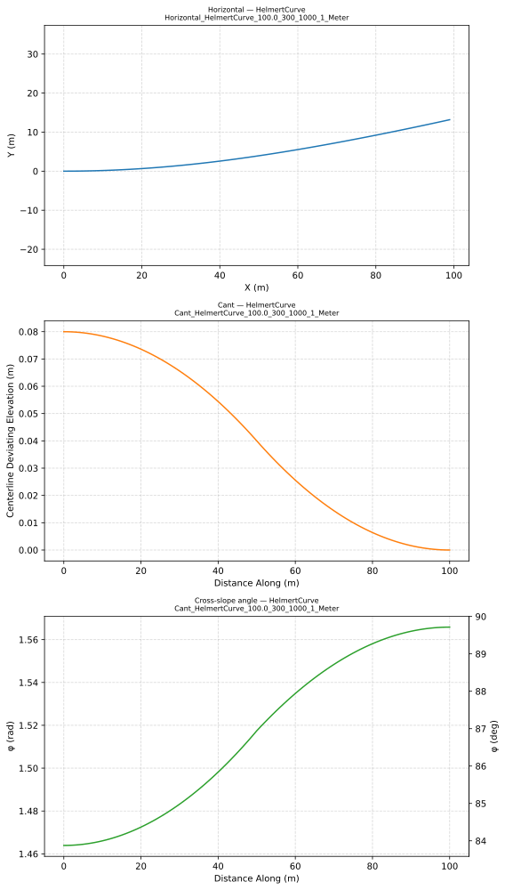

# Chapter 12 — Alignment Geometry Testset

## 12.1 Background

The test cases in this chapter are inspired by the alignment test sets developed by
Andreas Pinzenöhler for the buildingSMART Germany chapter's BIM Fit Check competition,
and by the EnrichIFC4x3 reference implementation developed by Peter Bonsma and published
in the [IFC-Rail-Unit-Test-Reference-Code](https://github.com/bSI-RailwayRoom/IFC-Rail-Unit-Test-Reference-Code)
repository. Both bodies of work established the principle of pairing semantic IFC files
with independently computed reference coordinates as a practical validation strategy.

The goal of this testset is to give implementors a concrete, mechanically verifiable
check for their alignment geometry code. Each test case is deliberately simple: a single
100 m segment of one curve type, with known input parameters and published reference
coordinates sampled at 1 m intervals. Each test case is provided in three unit variants — SI meters, US survey feet, and international feet — making the set a direct check for unit-conversion correctness as well as geometric accuracy.

---

## 12.2 Testset Structure

The testset provides each test case in three complementary forms, together with plots
for visual inspection, all located under the `testset/` folder in this repository.

```
testset/
├── Alignment-semantic-testset/    # Semantic IFC files (no geometry)
├── Alignment-geometry-testset/    # IFC files with geometric representations
├── Alignment-reference-testset/   # Reference coordinates sampled at 1 m intervals
├── Alignment-plots/               # SVG plots for visual inspection
└── RealWorldAlignments/           # Real-world IFC files with 3D reference coordinates
```

All four folders share the same internal hierarchy: alignment type then curve type subfolder.

**Table 12.2-1 — Curve type subfolders by alignment type**

| Alignment type | Curve type subfolders |
|---|---|
| HorizontalAlignment | Line, CircularArc, Clothoid, BlossCurve, CosineCurve, HelmertCurve, SineCurve, VienneseBend |
| VerticalAlignment | ConstantGradient, ParabolicArc, CircularArc |
| CantAlignment | ConstantCant, LinearTransition, BlossCurve, CosineCurve, HelmertCurve, SineCurve, VienneseBend |

### 12.2.1 Unit Systems

Every test case is provided in three unit variants, identified by the `{Unit}` token at
the end of each filename:

| Token | Unit | Conversion to meters |
|---|---|---|
| `Meter` | SI meter | 1.0 (exact) |
| `SurveyFoot` | US survey foot | 1200 / 3937 ≈ 0.304 800 609 … m |
| `IntlFoot` | International foot | 0.3048 m (exact) |

All dimensional quantities in each IFC file — segment lengths, curve radii, elevations,
cant values, `RailHeadDistance`, and spiral coefficients — are expressed in the declared project unit.
Gradients are dimensionless percentage values and are identical across all three variants.
The reference coordinates are likewise in project units, so a `SurveyFoot` file
contains distances and positions in survey feet.

### 12.2.2 Semantic IFC Files

The semantic IFC files express the design intent of each alignment through
`IfcAlignmentSegment` subtypes (`IfcAlignmentHorizontalSegment`,
`IfcAlignmentVerticalSegment`, `IfcAlignmentCantSegment`). No geometric representation
(`IfcCurveSegment`) is attached. These files are useful for testing the semantic layer
of an implementation: can the software read the alignment parameters, classify the
segment type, and display or export the design intent without requiring geometric
evaluation? They also serve as inputs for testing geometric representation generation —
an implementation can construct its own geometry IFC files from the semantic definitions
and benchmark the result against the reference geometry files in `Alignment-geometry-testset/`.

### 12.2.3 Geometry IFC Files

The geometry IFC files extend the semantic files with `IfcCurveSegment`-based geometric
representations attached to each layout curve (`IfcCompositeCurve`,
`IfcGradientCurve`, `IfcSegmentedReferenceCurve`). Each geometric curve also carries a
zero-length terminator segment that marks the end of the parametric domain.

The primary purpose of these files is to validate an implementation's mapping from
semantic to geometric alignment definitions — specifically, whether the
`IfcAlignmentSegment` attributes are correctly translated into the corresponding
`IfcCurveSegment` representations. They also provide everything needed to evaluate the
alignment curve at any point along its length, making them the input for coordinate
comparison against the reference values in `Alignment-reference-testset/`.

### 12.2.4 Reference Coordinates

The reference coordinate files are CSV tables of coordinates sampled at every 1 m of
horizontal distance along each alignment, from 0.0 m to 100.0 m inclusive (101 rows per
file). Their purpose is to provide concrete values that any implementation can compare
its output against, independent of the IFC files. The CSV file format and column
definitions are described in Section 12.5.

The following excerpt shows the first five rows of
`HorizontalAlignment/BlossCurve/Horizontal_BlossCurve_100.0_300_1000_1_Meter.csv` — a Bloss
arc-to-arc transition from R = +300 m to R = +1000 m:

```
dist_along,X,Y,RefDir_dx,RefDir_dy
0.000000,0.000000,0.000000,1.000000,0.000000
1.000000,0.999998,0.001667,0.999994,0.003333
2.000000,1.999985,0.006666,0.999978,0.006665
3.000000,2.999950,0.014995,0.999950,0.009994
4.000000,3.999882,0.026652,0.999911,0.013318
```

At the start of the segment the position is at the origin, the tangent points due East
(`RefDir_dx` = 1, `RefDir_dy` = 0), and the curve is already bending left — the
Y coordinate and `RefDir_dy` both increase as the alignment curves away from the
initial straight.

### 12.2.5 Plots

The `Alignment-plots/` folder contains plots for visual inspection, organized into
three subfolders that mirror the alignment type structure:

- **`HorizontalAlignment/{type}/`** — one plan-view plot per horizontal file.
- **`VerticalAlignment/{type}/`** — one elevation profile plot per vertical file.
- **`CantAlignment/{type}/`** — one two-panel plot per cant file, pairing the cant profile with its matching horizontal plan view.

Figure 12.2.5-1 shows a representative example: a Helmert arc-to-arc transition from
R = +300 m to R = +1000 m. The upper panel shows the horizontal plan view; the lower
panel shows the corresponding cant profile.



**Figure 12.2.5-1** — Combined horizontal and cant plot for `Cant_HelmertCurve_100.0_300_1000_1_Meter`.

---

## 12.3 Test Cases

The test cases are organized by alignment component — horizontal, vertical, and cant —
and each component is tested in isolation. Horizontal cases contain no vertical or cant
layouts. Vertical cases use a straight horizontal to avoid introducing horizontal
curvature. Cant cases use a flat zero-grade vertical for the same reason. This isolation
strategy means that discrepancies in the reference coordinates can be attributed
unambiguously to a single geometric component. Real-world alignments combining all three
components are covered in Section 12.3.4.

### 12.3.1 Horizontal Alignment

All horizontal segments are 100 m long. These cases contain only a horizontal layout —
no vertical or cant layouts are present — so any coordinate discrepancy is attributable
entirely to horizontal curve evaluation. Table 12.3.1-1 summarises the curve types and
case counts. All six transition types share the same eight geometry cases shown in
Table 12.3.1-2.

**Table 12.3.1-1 — Horizontal curve types**

| Curve type | IFC predefined type | Cases |
|---|---|---|
| Line | `LINE` | 1 |
| Circular arc | `CIRCULARARC` | 4 |
| Clothoid | `CLOTHOID` | 8 |
| Bloss curve | `BLOSSCURVE` | 8 |
| Cosine curve | `COSINECURVE` | 8 |
| Helmert curve | `HELMERTCURVE` | 8 |
| Sine curve | `SINECURVE` | 8 |
| Viennese bend | `VIENNESEBEND` | 8 |

**Table 12.3.1-2 — Horizontal transition cases (applied to all six transition types)**

| Start radius | End radius | Description |
|---|---|---|
| ∞ | +300 m | Entry spiral — straight to tight left arc |
| +300 m | ∞ | Exit spiral — tight left arc to straight |
| ∞ | −300 m | Entry spiral — straight to tight right arc |
| −300 m | ∞ | Exit spiral — tight right arc to straight |
| +300 m | +1000 m | Arc-to-arc — tighter to looser (left) |
| +1000 m | +300 m | Arc-to-arc — looser to tighter (left) |
| −300 m | −1000 m | Arc-to-arc — tighter to looser (right) |
| −1000 m | −300 m | Arc-to-arc — looser to tighter (right) |

**Viennese bend note.** The Viennese bend (`VIENNESEBEND`) is unique among horizontal
transition types: its geometric representation requires cant parameters to be present.
The VienneseBend files in `HorizontalAlignment/VienneseBend/` therefore include all
three alignment layouts (horizontal, vertical, and cant), with the same parameter values
as the corresponding `CantAlignment/VienneseBend/` files. When extracting horizontal
coordinates, only the horizontal layout is evaluated; the vertical and cant layouts are
present solely to satisfy the geometry generation requirement.

### 12.3.2 Vertical Alignment

All vertical segments are 100 m horizontal length, starting at an elevation of 10.0 m.
Gradients are expressed in percent (e.g. `0.5` = 0.5 %).

Each vertical test file includes a horizontal layout consisting of a single straight
`LINE` segment of the same length. A straight horizontal alignment satisfies the IFC
schema constraint that a vertical layout must have an associated horizontal, while
isolating the vertical geometry so results can be verified independently.

**Table 12.3.2-1 — Vertical curve types**

| Curve type | IFC predefined type | Cases |
|---|---|---|
| Constant gradient | `CONSTANTGRADIENT` | 5 |
| Parabolic arc | `PARABOLICARC` | 12 |
| Circular arc | `CIRCULARARC` | 12 |

*Note: clothoid vertical curves are not included. See Chapter 3 for discussion.*

The five constant gradient cases cover 0.0 %, ±0.5 %, and ±1.0 % grade. The twelve
vertical transition cases cover the full range of sag and crest combinations across
flat, ascending, and descending grade pairs.

### 12.3.3 Cant Alignment

All cant segments are 100 m horizontal length. The `RailHeadDistance` is 1.5 m for all cases.

Each cant file includes a matching horizontal layout of the corresponding curve type and
a flat vertical layout at 0.0 % grade and elevation 0.0 m. The flat vertical isolates
the cant geometry from vertical curvature, so reference coordinate errors reflect only
the cant evaluation. Table 12.3.3-1 lists the cant curve types, their paired horizontal
types, and case counts.

**Table 12.3.3-1 — Cant curve types**

| Cant type | IFC predefined type | Paired horizontal type | Cases | Cant range |
|---|---|---|---|---|
| Constant cant | `CONSTANTCANT` | `CIRCULARARC` | 4 | 0.16 m constant |
| Linear transition | `LINEARTRANSITION` | `CLOTHOID` | 8 | 0.0 ↔ 0.16 m |
| Bloss curve | `BLOSSCURVE` | `BLOSSCURVE` | 8 | 0.0 ↔ 0.16 m |
| Cosine curve | `COSINECURVE` | `COSINECURVE` | 8 | 0.0 ↔ 0.16 m |
| Helmert curve | `HELMERTCURVE` | `HELMERTCURVE` | 8 | 0.0 ↔ 0.16 m |
| Sine curve | `SINECURVE` | `SINECURVE` | 8 | 0.0 ↔ 0.16 m |
| Viennese bend | `VIENNESEBEND` | `VIENNESEBEND` | 8 | 0.03 ↔ 0.10 m |

### 12.3.4 Real-World Alignments

Three real-world alignments are provided as 3D test cases under `testset/RealWorldAlignments/`. Unlike the
single-component cases in Sections 12.3.1–12.3.3, these exercise the complete evaluation
pipeline — from combined horizontal, vertical, and (where present) cant layouts — and
produce full 3D placement matrices at each sample point.

#### FHWA Bridge Geometry Manual

The first case is an alignment from Appendix B of the US Federal Highway
Administration *Bridge Geometry Manual* (see Chapter 1). It combines horizontal and
vertical layouts only — no cant is present — and exercises `IfcGradientCurve` evaluation.
The alignment is approximately 12,337 ft (3,760 m) long and is expressed in international
feet.

| | |
|---|---|
| IFC file | `testset/RealWorldAlignments/FHWA_Alignment.ifc` |
| Reference coordinates | `testset/RealWorldAlignments/FHWA_Alignment.csv` |
| Alignment name | Unnamed Alignment |
| Project unit | International foot |
| 3D curve type | `IfcGradientCurve` |

#### FHWA Bridge Geometry Manual — Linear Placement Variant

A second variant of the FHWA alignment is provided to support validation of `IfcLinearPlacement` evaluation. It carries the same horizontal and vertical geometry as the base case and adds 124 `IfcReferent` objects, one at every 100 ft station from 100+00 to 223+00, each with a populated `CartesianPosition` fallback. Linear placement is discussed in [Chapter 8](8_LinearPlacement.md).

| | |
|---|---|
| IFC file | `testset/RealWorldAlignments/FHWA_Alignment_with_Linear_Placement.ifc` |
| Reference coordinates | `testset/RealWorldAlignments/FHWA_Alignment_with_Linear_Placement.csv` |
| Alignment name | E-Line |
| Project unit | International foot |
| 3D curve type | `IfcGradientCurve` |

The reference CSV uses the same 13-column format as the other real-world alignment files (Section 12.5.2), but contains 124 rows rather than 101 — one row per `IfcLinearPlacement`, evaluated at the corresponding station distance rather than at uniform intervals. An implementation validates its linear placement support by reading each placement's `DistanceAlong`, evaluating the 3D gradient curve at that distance, and comparing the result against the matching row in the CSV.

#### BPaimio–Kupittaa

The second case is alignment `001` from the BPaimio–Kupittaa railway line in Finland.
The IFC file was provided by the Finnish Transport Infrastructure Agency (Väylävirasto)
and distributed as part of the buildingSMART Germany BIM Fit Check competition. It is a
full 3D railway alignment including horizontal, vertical, and cant layouts, exercising the
complete `IfcSegmentedReferenceCurve` evaluation pipeline. The alignment is approximately
25.6 km long and is expressed in SI meters with ETRS-TM35FIN coordinates.

| | |
|---|---|
| IFC file | `testset/RealWorldAlignments/BPaimio-Kupittaa_GK23_N2000_2020.ifc` |
| Reference coordinates | `testset/RealWorldAlignments/BPaimio-Kupittaa_GK23_N2000_2020.csv` |
| Alignment name | 001 |
| Project unit | Meter (ETRS-TM35FIN) |
| 3D curve type | `IfcSegmentedReferenceCurve` |

#### Exit Turnout — Huni Valley Station

The third case is the mainline alignment of an exit turnout at Huni Valley Station on a
Swiss railway line. The IFC file was created using IfcOpenShell from LandXML source data.
It is a full 3D railway alignment including horizontal, vertical, and cant layouts,
exercising the complete `IfcSegmentedReferenceCurve` evaluation pipeline. The alignment
runs from station 84+521.000 to 88+524.656 (approximately 4003.656 m) and is expressed in
SI meters with LV95 coordinates (Swiss national coordinate system). The horizontal layout
consists of clothoid transitions and circular arcs; the vertical layout is a single flat
constant-gradient segment; and the cant layout uses linear transitions and constant-cant
segments with a rail head distance of 1.0 m.

| | |
|---|---|
| IFC file | `testset/RealWorldAlignments/Exit_Turnout_Huni_Valley_Station.ifc` |
| Reference coordinates | `testset/RealWorldAlignments/Exit_Turnout_Huni_Valley_Station.csv` |
| Alignment name | Centerline |
| Project unit | Meter (LV95) |
| 3D curve type | `IfcSegmentedReferenceCurve` |

#### Reference coordinate format

All three CSV files contain 101 rows sampled at 100 equal intervals along the full alignment
length. All positions are in project units; direction components are dimensionless. The
column definitions are given in Section 12.5.2.

---

## 12.4 File Naming

Each filename is prefixed with the alignment type — `Horizontal`, `Vertical`, or `Cant` —
so the alignment type is unambiguous without inspecting the file or its folder path.
Geometry IFC files carry an additional `Generated_` prefix to distinguish machine-generated
files from the hand-authored semantic definitions.

### 12.4.1 Semantic IFC files

**Horizontal and cant:**

```
Horizontal_{CurveType}_{Length}_{StartRadius}_{EndRadius}_{Version}_{Unit}.ifc
Cant_{CurveType}_{Length}_{StartRadius}_{EndRadius}_{Version}_{Unit}.ifc
```

The radius tokens use `inf` and `-inf` for infinite radius (straight tangent). Positive
radii denote left curves; negative radii denote right curves.

The `{Unit}` token is one of `Meter`, `SurveyFoot`, or `IntlFoot`. All numeric tokens in
the filename (length, radii) use the meter-based values regardless of unit system, so
the same filename prefix identifies the same physical alignment across all three variants.

Examples:
- `Horizontal_Clothoid_100.0_inf_300_1_Meter.ifc` — Clothoid entry spiral, R = ∞ → +300 m, SI units
- `Horizontal_Clothoid_100.0_inf_300_1_SurveyFoot.ifc` — same alignment, US survey feet
- `Horizontal_HelmertCurve_100.0_-300_-1000_1_Meter.ifc` — Helmert arc-to-arc, R = −300 → −1000 m
- `Cant_BlossCurve_100.0_-inf_-300_1_Meter.ifc` — Bloss cant entry spiral, right curve

**Vertical:**

```
Vertical_{CurveType}_{Length}_{StartHeight}_{StartGrade}_{EndGrade}_{Version}_{Unit}.ifc
```

Examples:
- `Vertical_ParabolicArc_100.0_10.0_0.5_-1.0_1_Meter.ifc` — parabolic crest, +0.5 % to −1.0 %,
  starting at elevation 10.0 m
- `Vertical_ConstantGradient_100.0_10.0_-0.5_-0.5_1_Meter.ifc` — constant descent at −0.5 %

### 12.4.2 Geometry IFC files

Geometry files carry the same name as their semantic counterpart with `Generated_`
prepended:

```
Generated_Horizontal_{CurveType}_{Length}_{StartRadius}_{EndRadius}_{Version}_{Unit}.ifc
Generated_Vertical_{CurveType}_{Length}_{StartHeight}_{StartGrade}_{EndGrade}_{Version}_{Unit}.ifc
Generated_Cant_{CurveType}_{Length}_{StartRadius}_{EndRadius}_{Version}_{Unit}.ifc
```

### 12.4.3 Reference CSV files

Reference CSV files use the same name as the corresponding semantic IFC file with the
`.ifc` extension replaced by `.csv`:

```
Horizontal_{CurveType}_{Length}_{StartRadius}_{EndRadius}_{Version}_{Unit}.csv
Vertical_{CurveType}_{Length}_{StartHeight}_{StartGrade}_{EndGrade}_{Version}_{Unit}.csv
Cant_{CurveType}_{Length}_{StartRadius}_{EndRadius}_{Version}_{Unit}.csv
```

---

## 12.5 Reference Coordinates

### 12.5.1 File Format

Each reference file contains 101 rows plus a header row. The rows are sampled at 1 m
intervals of horizontal distance (0.0 m to 100.0 m), so `dist_along` values in
`SurveyFoot` and `IntlFoot` files are not round numbers. All length columns (`dist_along`,
`X`, `Y`) are in the project unit declared by the corresponding IFC file. Direction
columns (`RefDir_dx`, `RefDir_dy`, `Axis_dy`, `Axis_dz`) are dimensionless and identical across all
three unit variants. The columns differ by alignment type.

**Horizontal alignment** — `HorizontalAlignment/**/*.csv`

| Column | Description |
|---|---|
| `dist_along` | Distance along the alignment from the segment start (project units) |
| `X` | Easting in the alignment plane (project units) |
| `Y` | Northing in the alignment plane (project units) |
| `RefDir_dx` | X component of the forward tangent unit vector (`RefDirection`) |
| `RefDir_dy` | Y component of the forward tangent unit vector (`RefDirection`) |

The segment starts at the origin (0, 0) with a forward tangent pointing due East
(+X direction). `RefDir_dx` and `RefDir_dy` together form a unit vector; the tangent angle
$\theta = \arctan(dy / dx)$.

**Vertical alignment** — `VerticalAlignment/**/*.csv`

| Column | Description |
|---|---|
| `dist_along` | Horizontal distance from the segment start (project units) |
| `Y` | Elevation (project units) |
| `RefDir_dx` | X component of the tangent direction ($\cos\theta$) |
| `RefDir_dy` | Z component of the tangent direction ($\sin\theta$, proportional to grade) |

The parameter passed to the evaluator is horizontal distance, not arc length, even
though `SegmentLength` in the IFC file stores the arc length of the curve. This is
consistent with the IFC specification for `IfcAlignmentVerticalSegment.HorizontalLength`.

**Cant alignment** — `CantAlignment/**/*.csv`

| Column | Description |
|---|---|
| `dist_along` | Distance along the horizontal alignment (project units) |
| `Y` | Track centerline deviating elevation due to cant (project units) |
| `RefDir_dx` | X component of the forward tangent (`RefDirection`) |
| `RefDir_dy` | Y component of the forward tangent (`RefDirection`) |
| `Axis_dy` | Y component of the banked "up" axis vector |
| `Axis_dz` | Z component of the banked "up" axis vector |

The banked axis (`Axis_dy`, `Axis_dz`) is the cross-track "up" direction after applying
the cant rotation about the forward tangent. For a planar track the X component of
the axis is always 0.0 and `Axis_dz` approaches 1.0 when cant is zero.

### 12.5.2 3D Alignment Reference Coordinates

The 3D CSV files under `testset/RealWorldAlignments/` are produced by evaluating the combined 3D curve
(`IfcGradientCurve` or `IfcSegmentedReferenceCurve`) at each sample point. Each
evaluation returns a 4 × 4 placement matrix; the CSV extracts all three orientation
vectors and the position.

| Column | Description |
|---|---|
| `DistAlong` | Distance along the 3D curve from the start (project units) |
| `X` | X coordinate of the point (project units) |
| `Y` | Y coordinate of the point (project units) |
| `Z` | Z (vertical) coordinate of the point (project units) |
| `RefDir_dx` | X component of the forward tangent unit vector |
| `RefDir_dy` | Y component of the forward tangent unit vector |
| `RefDir_dz` | Z component of the forward tangent unit vector |
| `Y_dx` | X component of the cross-track unit vector |
| `Y_dy` | Y component of the cross-track unit vector |
| `Y_dz` | Z component of the cross-track unit vector |
| `Axis_dx` | X component of the "up" axis unit vector |
| `Axis_dy` | Y component of the "up" axis unit vector |
| `Axis_dz` | Z component of the "up" axis unit vector |

The three direction vectors (`RefDir`, `Y`, `Axis`) form an orthonormal right-handed
frame at each point. For alignments without cant, `Axis` is perpendicular to the
horizontal plane and `Y_dz` is zero. For railway alignments with cant, `Axis` is banked
about the forward tangent and both `Y_dz` and `Axis_dy` become non-zero.

---

## 12.6 Validation Guidance

### 12.6.1 What to Check

The three forms of the testset support three distinct validation activities:

**Semantic round-trip.** Read a semantic IFC file and verify that the
`IfcAlignmentSegment` attributes (`StartRadiusOfCurvature`, `EndRadiusOfCurvature`,
`SegmentLength`, `PredefinedType`, etc.) are correctly parsed and preserved. This test
does not require any geometric evaluation.

**Geometric representation.** Verify that each `IfcAlignmentSegment` maps to the
correct `IfcCurveSegment` parent curve type, placement, and zero-length terminator.
This applies both when constructing a geometry IFC file from a semantic file and when
reading a reference geometry file — in either case no numerical evaluation is required.

**Geometric accuracy.** Evaluate a geometry IFC alignment at 1 m intervals and compare
the resulting coordinates against the reference values. This is the primary numerical test.

### 12.6.2 Comparison Approach

Load a geometry IFC file, evaluate the alignment curve at
$d = 0.0, 1.0, 2.0, \ldots, 100.0$ meters, and compare each computed value against the
corresponding row in the reference file.

The most useful comparisons are:

- **Position** (`X`, `Y` for horizontal; `Y` for vertical and cant) — the absolute
  coordinate values.
- **Tangent direction** (`RefDir_dx`, `RefDir_dy`) — the forward tangent components.
- **Banked axis** (`Axis_dy`, `Axis_dz`, cant only) — the cross-track "up" direction.
  Errors here indicate a problem in the cant rotation logic.

### 12.6.3 Cross-Unit Validation

Because the three unit variants encode the same physical alignment, they provide an
independent check for unit-handling correctness that does not require any external
ground truth. The procedure is:

1. Evaluate the `Meter`, `SurveyFoot`, and `IntlFoot` variants of the same test case.
2. Convert all `SurveyFoot` coordinates to meters by multiplying by 1200/3937.
3. Convert all `IntlFoot` coordinates to meters by multiplying by 0.3048.
4. Compare the three meter-equivalent result sets row by row.

If the implementation handles units correctly, the differences should be below 10⁻⁶ m
at every sample point — consistent with double-precision floating-point rounding in the
unit conversion arithmetic. Differences larger than 10⁻³ m, or differences that grow
systematically with distance along the alignment, indicate a unit-handling defect.

This cross-unit check is most effective at isolating unit bugs from algorithmic bugs,
because a geometric error will appear in all three variants while a unit error will
appear only in the scaled variants.
