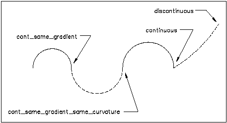

# Section 12 - Precision and Tolerance

## 12.0 Introduction

Alignment geometry is rarely mathematically perfect. Design parameters are rounded to convenient values, segment coordinates are computed independently by different tools, and transition curve ordinates are approximated by numerical integration — all of which introduce small discrepancies at segment joints. Alignments derived from historical sources carry additional uncertainty from the original survey or drafting. IFC provides mechanisms for both declaring the intended geometric continuity at segment joints and communicating the tolerance within which that continuity should be evaluated.

The primary declaration mechanism is `IfcCurveSegment.Transition`, which specifies the intended relationship between the end of one segment and the start of the next. Table 12.0-1 lists the available transition codes.

|Transition Value               |Description                                                                                                                                                                                                                                                                                                                    |
|-------------------------------|-------------------------------------------------------------------------------------------------------------------------------------------------------------------------------------------------------------------------------------------------------------------------------------------------------------------------------|
|`CONTINUOUS`                   |The segments join but no condition on their tangents is implied.                                                                                                                                                                                                                                                               |
|`CONTSAMEGRADIENT`             |The segments join and their tangent vectors or tangent planes are parallel and have the same direction at the joint; equality of derivative is not required.                                                                                                                                                                   |
|`CONTSAMEGRADIENTSAMECURVATURE`|For a curve, the segments join, their tangent vectors are parallel and in the same direction and their curvatures are equal at the joint: equality of derivatives is not required. For a surface this implies that the principle curvatures are the same and the principle directions are coincident along the common boundary.|
|`DISCONTINUOUS`                |The segments do not join. This is permitted only at the boundary of the curve or surface to indicate that it is not closed.                                                                                                                                                                                                |

*Table 12.0-1 — IfcCurveSegment transition codes*

Figure 12.0-1 illustrates the various transition types. 

*Figure 12.0-1 - Illustration of segment transition types*

These transition codes declare intent, not guarantee. Adjacent segment end and start points may not exactly line up in position, gradient, or curvature for several reasons:

* **Rounded design parameters.** Designers routinely round curve parameters — radius, arc length, tangent bearing — to convenient values. Geometry computed from those rounded values does not land exactly on the next segment's stored start point.
* **Independent segment computation.** Each segment's coordinates are often computed independently from its own parameters rather than chained forward from the previous segment's computed end. Floating-point rounding differences between two independent computations of the same nominal point produce small gaps or overlaps at joints.
* **Numerical integration of transition curves.** The x/y ordinates at the end of a spiral are transcendental integrals — Fresnel integrals for Clothoids, analogous forms for Bloss, Cosine, and the other spiral types — that different software approximates with different precision. The same nominal parameters can yield slightly different endpoint coordinates depending on the tool that produced them.
* **Unit conversion.** Converting between feet and meters, or between degrees/minutes/seconds and decimal degrees, introduces rounding that propagates to all downstream coordinates.
* **Legacy source fidelity.** Alignments derived from historical plan sheets, right-of-way plats, or field surveys carry the measurement uncertainty inherent in the original source material.

`Pset_Tolerance` indicates the acceptable tolerance under which the calculated end point of a preceding segment would be considered geometrically continuous with the provided start point of the following segment. No implementation agreement exists for how its properties should be used; the `OverallTolerance` property is recommended. Similarly, `Pset_Uncertainty` indicates the uncertainty inherent in historical information gleaned from plan sets and other historic sources, and carries no implementation agreement; the `LinearUncertainty` property is recommended. As a fallback if `Pset_Tolerance` is not provided, tolerance can be taken from `IfcGeometricRepresentationContext.Precision`.
