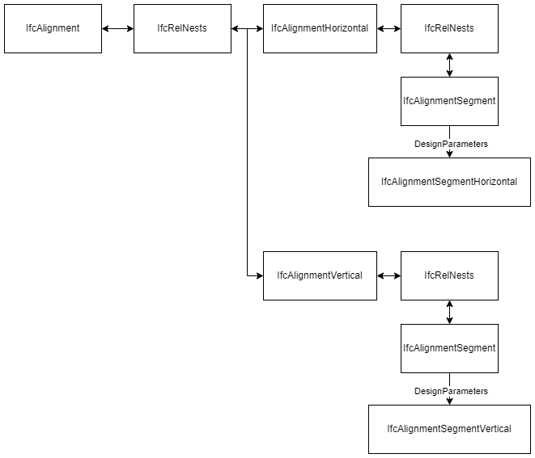
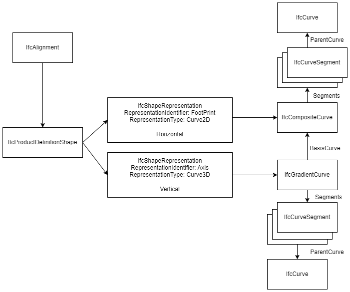
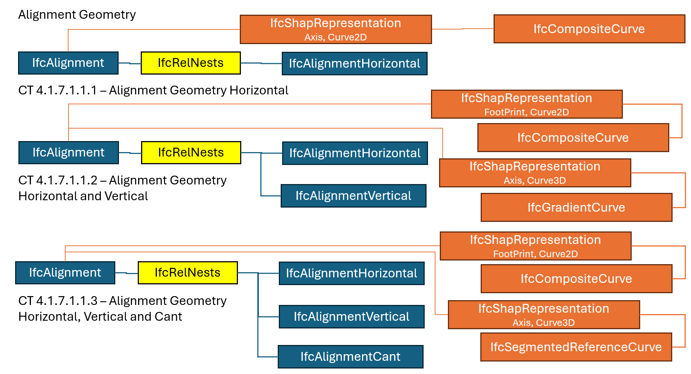
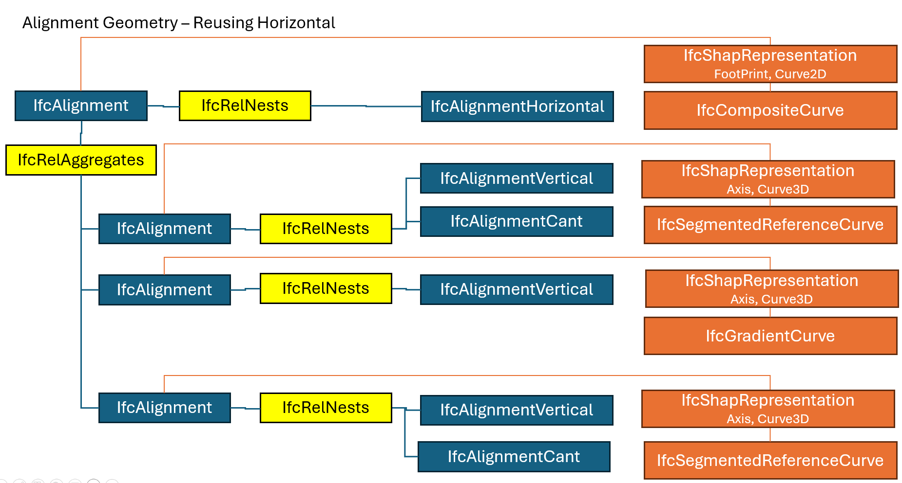
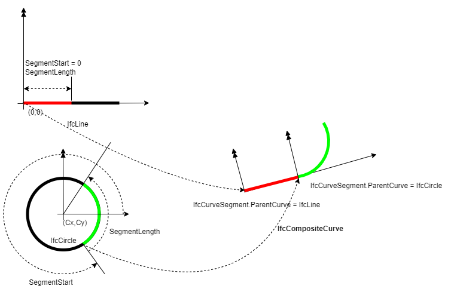
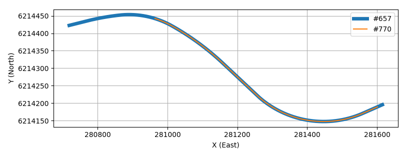

# Section 1 - Introduction

IFC 4.3.2 finalized the adoption of alignments for infrastructure works.
Since the concept of alignment is relatively new to IFC, few details and
examples are provided in the available literature. This guide aims to
document the relevant mathematic concepts and equations a software
developer would need to implement alignment-based geometry. It also
provides example calculations.

## Horizontal Alignment

A horizontal alignment typically consists of straight lines called
tangents that are connect by curves. The curves are usually circular
arcs. Easement or transition curves in the form of spirals can be used
to provide gradual transitions between tangents and circular curves. The
horizontal alignment is a plan view curvilinear path in a Cartesian
coordinate system aligned with East and North. Positions along an
alignment, measured along the plan view projection of the 3D alignment
curve, are denoted with stations or chainage.

## Vertical Alignment

A vertical alignment consists of straight sections of grade lines
connected by vertical curves. The vertical curves are typically
parabolas, though sometimes circular arcs or clothoid curves are used. A
vertical alignment is defined along the curvilinear path of a horizontal
alignment in a "Distance Along, Elevation" coordinate system. Combined,
the horizontal and vertical alignments define a 3D curve. This
combination of two 2D curves is sometimes referred to as a 2.5D
geometry.

## Cant Alignment

A cant alignment defines the cross-section rotation and superelevation
of a rail line. The superelevation is a deviation from the vertical
alignment caused by rotation about one of the rails.

## Semantic Definition (Business Logic)

The semantic definition of alignment allows for the alignment to be
described as close as possible to the terminology and concepts used in a
business context. Examples include horizontal, vertical and cant
layouts, stationing, and anchor points for domain specific properties
such as design speed, cant deficiency, superelevation transitions, and
widenings.

Specialized applications can analyze alignments using the semantic
information. Alignments can be evaluated against design criteria such as
speed requirements, sight distances, and maximum gradient, to name a
few.

The `IfcAlignment` semantic definition is composed of an instance of
`IfcAlignmentHorizontal` and `IfcAlignmentVertical` through an `IfcRelNests`
relationship. The `IfcAlignmentHorizontal` and `IfcAlignmentVertical` are in
turn composed of one or more `IfcAlignmentSegment` entities through
`IfcRelNests` relationships. The `IfcAlignmentSegment` models the segment
design parameters in a subtype of `IfcAlignmentParameterSegment`,
`IfcAlignmentHorizontalSegment` and `IfcAlignmentVerticalSegment` in this
case. The semantic definition model is shown in Figure 1.

*Figure 1 IFC 4.3.2 semantic alignment model*

`IfcRelNests.RelatedObjects` is an ordered collection. That means there is a specific order for the alignment layouts and the alignment segments. The IFC specification doesn't explicitly define a ranking for ordering. The ordering of the alignment layous can be infered from the images in the [`IfcAlignment` documentation 5.4.3.1.5](https://ifc43-docs.standards.buildingsmart.org/IFC/RELEASE/IFC4x3/HTML/lexical/IfcAlignment.htm#5.4.3.1.5-Concept-usage) as horizontal preceeds vertical, which preceeds cant. The ordering of `IfcAlignmentSegment` in an alignment layout is equally nebulus. For `IfcAlignmentHorizontalSegment` the only logical ordering is start to end. For `IfcAlignmentVerticalSegment` and `IfcAlignmentCantSegment` ordering in `IfcRelNests.RelatedObjects` could be anything because positional ordering can be derived from the `StartDistAlong` attribute. Such an approach is unnecessarily difficult. Segments should always be ordered in `IfcRelNests.RelatedObjects` in a start to end sequence.

An interesting caveat of `IfcAlignmentHorizontal` and `IfcAlignmentVertical`
(and `IfcAlignmentCant`) is that the last
`IfcAlignmentSegment.DesignParameters` must be zero length. If a geometric
representation is provided, then its corresponding last segment must
also be zero length. For a continuous composition of segments, the end
of one segment is at the same location as the start of the next segment.
The zero-length segment is intended to provide the end point of the last
segment.

## Geometric Representation

### Overview

Section 4.1.7.1.1 of the IFC 4x3 specification indicates that the valid
representations of `IfcAlignment` are:

- `IfcCompositeCurve` as a 2D horizontal alignment (represented by its
  horizontal alignment segments), without a vertical layout.

- `IfcGradientCurve` as a 3D horizontal and vertical alignment
  (represented by their alignment segments), without a cant layout.

- `IfcSegmentedReferenceCurve` as a 3D curve defined relative to an
  IfcGradientCurve to incorporate the application of cant.

- `IfcOffsetCurveByDistances` as a 2D or 3D curve defined relative to an
  `IfcGradientCurve` or another `IfcOffsetCurveByDistances`.

- `IfcPolyline` or `IfcIndexedPolyCurve` as a 3D alignment by a 3D polyline
  representation (such as coming from a survey).

- `IfcPolyline` or `IfcIndexedPolyCurve` as a 2D horizontal alignment by a
  2D polyline representation (such as in very early planning phases or
  as a map representation).

`IfcGradientCurve` and `IfcSegmentReferenceCurve` inherit from
`IfcCompositeCurve`. These curves consist of a sequence of segments
defined by `IfcCurveSegment`. The mathematical computations for
`IfcCurveSegment` geometry are the primary focus of this document.

`IfcPolyline` and `IfcIndexedPolyCurve` are trivial mathematically and are
not discussed in this document.

`IfcOffsetCurveByDistances` is treated in a dedication section.

### Understanding Geometric Representation of Alignment

The semantic definition of an alignment contains a lot of geometric
information, such as segment type (line, curve, spiral) and parameters
such as length, radius, and gradient. The geometric definition seems
redundant. While related, the semantic definition and geometric
definition serve different purposes.

Since the semantic and geometric definitions of an alignment are so
similar, it's easier to understand the difference by examining a
different type of entity. Consider a highway sign. The semantic
definition describes an object as a sign that says "Exit 101" with an
arrow pointing upwards to the right and it is positioned at a specific
location (station and offset) relative to an alignment. The geometric
definition describes the sign as a rectangle of certain dimension and
thickness and is located precisely at a point X, Y, Z and the face of
the sign oriented in a certain plane. The distinction between the
business and geometric information is clearer in this example, the same
concept of separate business logic and geometric definition are
applicable to alignments.

The semantic definition of an alignment describes its business
attributes (e.g. design speed) while the geometric definition describes
the precise geometry (e.g. line from point A to point B followed by an
arc of radius R starting at point B and ending at point C).

The geometric representation of the `IfcAlignment` consists of an
`IfcShapeRepresentation` for the plan view horizontal alignment as well as
a 3D curve for the combined horizontal and vertical alignment. This is
illustrated in Figure 2, Figure 2.1 and Figure 2.2.

Geometrically, the horizontal alignment is defined by an
`IfcCompositeCurve` and the vertical alignment is defined by an
`IfcGradientCurve`. The horizontal alignment is the basis curve for the
vertical alignment.

*Figure 2 IFC 4.3.2 geometric representation of horizontal and vertical
alignment*

*Figure 2.1 Geometric representations for the three basic alignment constructs (H, H+V, H+V+C).*

*Figure 2.2 Geometric representations for reusing horizontal alignment.*

The horizontal alignment is defined by a sequence of straight tangent
runs and circular horizontal curves. Transition spirals are used as
well, primarily for rail but sometimes for roads.

The geometric elements are modeled with `IfcCurveSegment`. `IfcCurveSegment`
cuts a segment from a parent curve and places it in the alignment
coordinate system. A horizontal circular arc is modeled with an
`IfcCurveSegment` that cuts an arc from an `IfcCircle`. Figure 3 shows an
alignment consisting of a tangent run (red) and a horizontal curve
(green). The line and curve segments are cut from their `IfcLine` and
`IfcCircle` parent curves, respectively. The process of defining a parent
curve, cutting a segment from that curve, and placing the cut segment
into the alignment is repeated to define the entire horizontal
alignment. All the horizontal alignment `IfcCurveSegment` objects are then
combined to create an `IfcCompositeCurve` to complete the plan view
geometric representation of the horizontal alignment.

A similar process is used to create the vertical alignment.
`IfcCurveSegment` objects are cut from parent curves and combined to
create an `IfcGradientCurve`. `IfcGradientCurve` is a sub-type of
IfcCompositeCurve with the additional attribute BaseCurve. The segments
of the gradient curve are positions in a 2-dimensional plane in a
"distance along the horizontal alignment, elevation" coordinate system.
The `IfcGradientCurve` uses the horizontal alignment `IfcCompositeCurve` as
its base curve, which means the horizontal coordinates of the vertical
alignment are taken from the horizontal alignment curve as illustrated
in Figures 1 and 2.

`IfcSegmentedReferenceCurve` is also a sub-type of `IfcCompositeCurve`. It
defines a deviating elevation and rail head cross slope along the base
curve. The base curve can be either an `IfcGradientCurve` or
`IfcCompositeCurve`. If it is an `IfcGradientCurve`, the "distance along"
coordinate is along the gradient curve's base curve.

*Figure 3 Illustration of parent curves and their placement with
`IfcCurveSegment.Placement`*

When defining an `IfcCurveSegment`, the location and orientation of the
parent curve are not particularly important. The Placement attribute of
`IfcCurveSegment` defines the location of the start point of the trimmed
curve as well as the orientation of the tangent at the start of the
trimmed curve.

For `IfcGradientCurve` and `IfcSegmentedReferenceCurve` the segments do not
need to start or end at the same location of their base curve. These
curves can be shorter than the horizontal alignment. This is illustrated
in Figure 4 where the blue curve is the full horizontal curve and the
orange curve is the portion of the horizontal curve coinciding with the
vertical curve. The `IfcGradientCurve` (#770) has the `IfcCompositeCurve`
(#657) as its base curve. The placement of the first `IfcCurveSegment`
(#771) in the `IfcGradientCurve` is defined by `IfcAxis2Placement2D` (#777)
with Location as `IfcCartesianPoint` (#778). The first segment is located
at a distance of 250.0036 along the horizontal `IfcCompositeCurve` at an
elevation of 145.3129 m.

~~~
#657=IFCCOMPOSITECURVE((#658,#671,#684,#697,#710,#723,#736,#749,#762),.F.)
#770=IFCGRADIENTCURVE((#771,#784,#796,#809,#821,#834,#846,#859,#871),.F.,#657,#887)
#771 = IFCCURVESEGMENT(.CONTSAMEGRADIENTSAMECURVATURE., #777, FCNONNEGATIVELENGTHMEASURE(0.),
IFCNONNEGATIVELENGTHMEASURE(40.0002408172751), #780);
#777 = IFCAXIS2PLACEMENT2D(#778, #779);
#778 = IFCCARTESIANPOINT((250.003634293681, 145.312908277025));
~~~

*Figure 4 - Example of `IfcGradientCurve` with a start
location different than the start of the `IfcCompositeCurve`
BaseCurve.*

### Horizontal Alignment -- IfcCompositeCurve

The geometric representation of a horizontal is accomplished with an
`IfcCompositeCurve`. The composite curve consists of a sequence of
`IfcCurveSegment` entities. The curve segment geometry is cut from a
parent curve as discussed above.

Table 1 maps the `IfcAlignmentHorizontal.PredefinedType` to the
appropriate parent curve type.

  Business Logic (`IfcAlignmentHorizontal.PredefinedType`)|Geometric Representation (`IfcCurveSegment.ParentCurve`)
  -----------------------------------------|-----------------------------------
  LINE                                     |`IfcLine`
  CIRCULARARC                              |`IfcCircle`
  CLOTHOID                                 |`IfcClothoid`
  CUBIC                                    |`IfcPolynomialCurve`
  HELMERTCURVE                             |`IfcSecondOrderPolynomialSpiral`
  BLOSSCURVE                               |`IfcThirdOrderPolynomialSpiral`
  COSINECURVE                              |`IfcCosineSpiral`
  SINECURVE                                |`IfcSineSpiral`
  VIENNESEBEND                             |`IfcSeventhOrderPolynomialSpiral`

  *Table 1- Mapping of business logic to geometric representation for
  horizontal alignment*

A general algorithm for evaluating a point on an `IfcCurveSegment` is as
follows:

- Evaluate parent curve equation to get a point as well as tangent
  vector (RefDirection) and normal vector. The tangent vector is
  obtained by evaluating the derivative of the parent curve equation.
  The normal vector is a 90-degree counter-clockwise rotation of the
  tangent vector.

- Translate the point so it is relative to (0,0). This is accomplished
  by subtracting the trimmed curve point at 0.0 from the start of the
  trimmed curve from the point under consideration.

- Apply a rotation in the opposite direction of the parent curve axes so
  the tangent at the start of the trimmed curve is in the direction
  (1,0).

- Apply the rotation of the curve segment placement.

- Apply the transitional of the curve segment placement

This algorithm can be represented as follows:

1.  Evaluate the parent curve at `IfcCurveSegment.SegmentStart`. This
    results in a 4x4 matrix, $M_{PCS}$, for the tangent and normal
    vectors as well at the coordinate point.

2.  Create a 4x4 identity matrix. Assign -X, -Y, -Z from $M_{PCS}$,
    found in column 4, to column 4 of the new matrix. Call this $M_{T}$.

3.  Copy $M_{PCS}$ to a new matrix, $M_{R}$. Assign (0,0,0,1) to
    column 4. Multiply the values in (1,2) and (2,1) by -1. This is the
    "dy" value of the vectors. This operation is rotation of the curve
    to make the tangent direction (1,0).

4.  Represent the `IfcCurveSegment.Placement` in matrix form, $M_{CSP}$.
    This information is given in the `IfcCurveSegment` definition.

5.  For each point to be evaluated along the `IfcCurveSegment`

    a.  Evaluate parent curve at distance from start of trimmed parent
        curve. Represent this point in matrix form, $M_{PC}$

    b.  Map to curve segment, $M_{h} = M_{CSP}M_{R}M_{T}M_{PC}$

A numerical example of these calculations will be illustrated below.

### Vertical Alignment -- IfcGradientCurve

The geometric representation of a vertical alignment is accomplished
with `IfcGradientCurve`. This defines the vertical alignment in a
"distance along, elevation" coordinate system. Distance along is a
distance measured along `IfcGradientCurve.BaseCurve`=`IfcCompositeCurve`.

  Business Logic (`IfcAlignmentVertical.PredefinedType`) | Geometric Representation (`IfcCurveSegment.ParentCurve`)
  ---------------------------------------|-----------------------------------
  CONSTANTGRADIENT                       |`IfcLine`
  CIRCULARARC                            |`IfcCircle`
  CLOTHOID                               |`IfcClothoid`
  PARABOLICARC                           |`IfcPolynomialCurve`

### Cant Alignment -- IfcSegmentedReferenceCurve

Cant alignment geometry is defined by a `IfcSegmentedReferenceCurve`. This
defines a "Distance along, deviating elevation" coordinate system.
Distance along is that of the base curve (`IfcCompositeCurve`) and
deviating elevation is a deviation from the BaseCurve elevation
(typically `IfcGradientCurve`, but could be `IfcCompositeCurve`). The curve
segments of an `IfcSegmentReferenceCurve` also define railhead cross
slope.

  Business Logic (`IfcAlignmentCant.PredefinedType`) | Geometric Representation (`IfcCurveSegment.ParentCurve`)
  -----------------------------------------|-----------------------------------
  CONSTANTCANT                             |`IfcLine`
  LINEARTRANSITION                         |`IfcClothoid`
  HELMERTCURVE                             |`IfcSecondOrderPolynomialSpiral`
  BLOSSCURVE                               |`IfcThirdOrderPolynomialSpiral`
  COSINECURVE                              |`IfcCosineSpiral`
  SINECURVE                                |`IfcSineSpiral`
  VIENNESEBEND                             |`IfcSeventhOrderPolynomialSpiral`
  
## Mapping of Business Logic to Geometric Representation

The major topic in the sections that follow is mapping of the business
logic (`IfcAlignmentSegment`) to its geometric representation
(`IfcCurveSegment`). In general, the mapping formulas are given, not
derived. The formulas have been taken from the reference implementation,
EnrichIFC4x3, published at
[IFC-Rail-Unit-Test-Reference-Code/EnrichIFC4x3/EnrichIFC4x3/business2geometry
at master · bSI-RailwayRoom/IFC-Rail-Unit-Test-Reference-Code
(github.com)](https://github.com/bSI-RailwayRoom/IFC-Rail-Unit-Test-Reference-Code/tree/master/EnrichIFC4x3/EnrichIFC4x3/business2geometry).

In some cases, the EnrichIFC4x3 program uses incorrect formulas. These
issues will be highlighted in this document, so the reader understands
why the information presented herein deviates from the reference
implementation.

The example calculations use the alignment models defined with the
reference implementation repository at
[IFC-Rail-Unit-Test-Reference-Code/alignment_testset/IFC-WithGeneratedGeometry
at master ·
bSI-RailwayRoom/IFC-Rail-Unit-Test-Reference-Code](https://github.com/bSI-RailwayRoom/IFC-Rail-Unit-Test-Reference-Code/tree/master/alignment_testset/IFC-WithGeneratedGeometry).
A source document will be cited for each calculation example.

## Units of measure

Unless otherwise specified, the unit of length measure all the
calculations in this document is meter.

