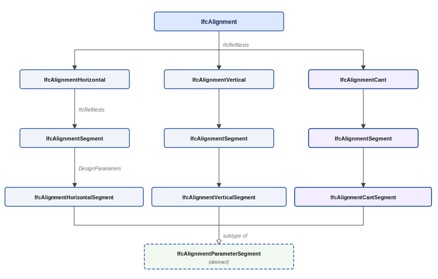
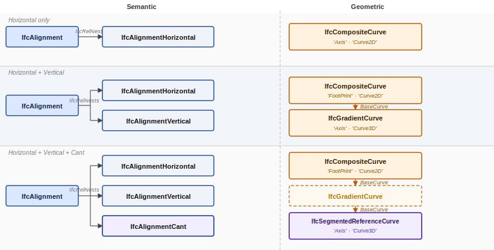
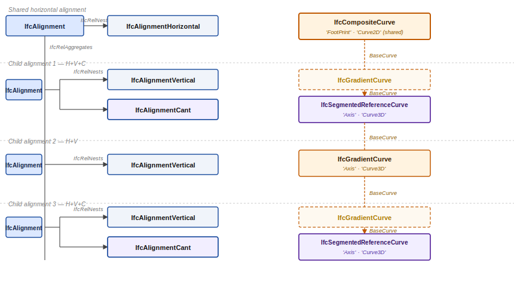
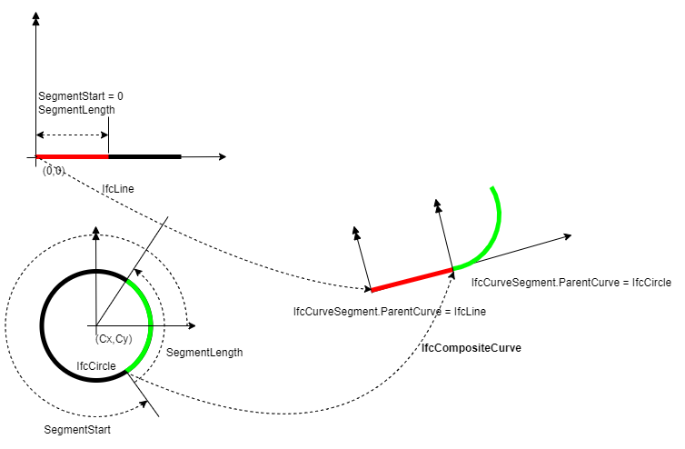
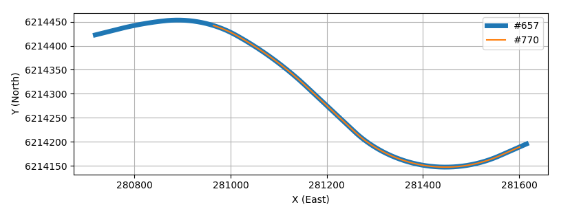

# Section 1 - Introduction

IFC 4.3 ADD 2 finalized the adoption of alignments for infrastructure works.
Since the concept of alignment is relatively new to IFC, few details and
examples are provided in the available literature. This guide aims to
document the relevant concepts and mathematics a software
developer might need to implement alignment-based geometry.

If you are unfamilar with infrastructure alignment geometry, information is available in a multitude of highway engineering, rail engineering, and surveying texts. A concise primer is available in the US Federal Highway Adminstration (FHWA), [Bridge Geometry Manual](https://rosap.ntl.bts.gov/view/dot/62673), Chapters 1 - 5 and Appendix B. 

The IFC specification identifies concept templates as the mechanism for
mapping semantic alignment representations to their geometric
counterparts. The concept templates — covering aggregation to
project, alignment layout nesting, and the four alignment geometry
variants (horizontal; horizontal+vertical; horizontal+vertical+cant; segments) —
provide the minimum information required to properly structure alignment semantic and geometric entities an IFC model. The *partial* concept templates that
cover individual curve segment geometry types, however, are sparse: they show class relationships but provide no
mathematical equations or parameter mappings. This guide fills that gap. It assumes the reader has a basic working knowledge of IFC — familiarity with the schema structure, entity relationships, and how IFC files are organized — and focuses specifically on the alignment geometry that IFC 4.3 ADD 2 introduced.

## 1.1 Horizontal Alignment

A horizontal alignment typically consists of straight lines called
tangents (or tangent runs) that are connected by curves. The curves are usually circular
arcs. Easement or transition curves in the form of spirals can be used
to provide gradual transitions between tangents and circular curves. The
horizontal alignment is a plan view curvilinear path in a Cartesian
coordinate system aligned with East and North. Positions along an
alignment, measured along the plan view projection of the 3D alignment
curve, are typically denoted with stations.

## 1.2 Vertical Alignment

A vertical alignment (often referred to as the vertical profile by civil engineers) consists of straight sections of grade lines
connected by vertical curves. The vertical curves are typically
parabolas, though sometimes circular arcs or clothoid curves are used. A
vertical alignment is defined along the curvilinear path of a horizontal
alignment in a 2D "Distance Along, Elevation" coordinate system. Combined,
the horizontal and vertical alignments define a 3D curve. This
combination of two 2D curves is sometimes referred to as a 2.5D or 2D+1D
geometry. The IFC specification notes that contemporary alignment design
almost always implements this 2.5D approach, with precision varying
based on management priorities, design era, and available software tools.

## 1.3 Cant Alignment

When a rail vehicle traverses a horizontal curve, centrifugal force acts laterally on passengers and cargo. Tilting the track cross-section — raising the outer (high) rail above the inner (low) rail — converts part of that lateral force into a downward component, improving ride comfort and permitting higher operating speeds through curves. This tilt is called **cant** (or *superelevation* in road engineering, though the two are geometrically analogous).

Cant is measured as the height difference between the two rail heads, perpendicular to the track. The low (inner-curve) rail is the conventional pivot for rotation; the high (outer-curve) rail rises by the cant amount.

A cant alignment is structured similarly to the horizontal and vertical alignments: **constant-cant zones** — corresponding to the circular arc sections of the horizontal alignment, where cant is held at a fixed value — are connected by **cant transitions** that ramp over the length of the horizontal transition spiral. Transitions may be linear or may follow the same non-linear curve families used for horizontal spirals.

Like the vertical alignment, the cant alignment is defined in a two-dimensional profile: distance along the horizontal alignment on one axis, cant value on the other. The cant profile encodes not only a deviating elevation but also the cross slope of the rail head, fully defining the rotated cross-section. This profile is then layered onto the combined horizontal and vertical alignment to produce a full 3D alignment curve incorporating cross-sectional banking.

## 1.4 Semantic Definition (Business Logic)

The semantic definition of alignment allows for the alignment to be
described as close as possible to the terminology and concepts used in a
business context. Examples include horizontal, vertical and cant
layouts, stationing, and anchor points for domain specific properties
such as design speed, cant deficiency, superelevation transitions, and
widenings.

Specialized applications can analyze alignments using the semantic
information. Alignments can be evaluated against design criteria such as
speed requirements, sight distances, and maximum gradient, to name a
few.

Importantly, the semantic and geometric representations are independent
and can be used and exchanged separately. A proper IFC file may contain only the semantic definition without any geometric
representation, which is common in early design stages when geometry
has not yet been computed.

An `IfcAlignment` may be defined with a horizontal layout only, a horizontal and vertical layout, or a full horizontal, vertical, and cant layout. Each layout type is composed through an `IfcRelNests` relationship: `IfcAlignmentHorizontal`, `IfcAlignmentVertical`, and `IfcAlignmentCant` are nested within the `IfcAlignment` as applicable. Each layout is in turn composed of one or more `IfcAlignmentSegment` entities, also through `IfcRelNests`. The `IfcAlignmentSegment` models the segment design parameters in a subtype of `IfcAlignmentParameterSegment`: `IfcAlignmentHorizontalSegment`, `IfcAlignmentVerticalSegment`, or `IfcAlignmentCantSegment`, depending on the layout. The semantic definition model is shown in Figure 1.

*Figure 1 Semantic alignment model*

`IfcRelNests.RelatedObjects` is an ordered collection. That means there is a specific order for the alignment layouts and the alignment segments. The IFC specification doesn't explicitly define a ranking for ordering. The ordering of the alignment layouts can be infered from the images in the [`IfcAlignment` documentation 5.4.3.1.5](https://ifc43-docs.standards.buildingsmart.org/IFC/RELEASE/IFC4x3/HTML/lexical/IfcAlignment.htm#5.4.3.1.5-Concept-usage) as horizontal preceeds vertical, which preceeds cant. The ordering of `IfcAlignmentSegment` in an alignment layout is equally nebulus. For `IfcAlignmentHorizontalSegment` the only logical ordering is start to end. For `IfcAlignmentVerticalSegment` and `IfcAlignmentCantSegment` ordering in `IfcRelNests.RelatedObjects` could be anything because positional ordering can be derived from the `StartDistAlong` attribute. Such an approach is unnecessarily difficult. Segments should always be ordered in `IfcRelNests.RelatedObjects` in a start to end sequence.

An interesting caveat of the alignment layout entities (`IfcAlignmentHorizontal`, `IfcAlignmentVertical`, and `IfcAlignmentCant`) is that the last
`IfcAlignmentSegment.DesignParameters` must be zero length. If a geometric
representation is provided, then its corresponding last segment must
also be zero length. For a continuous composition of segments, the end
of one segment is at the same location as the start of the next segment.
The zero-length segment is intended to provide the end point of the last
segment.

**Aggregation to project.** `IfcAlignment` is a mandatory participant
in the IFC spatial structure. Every alignment must be aggregated to
`IfcProject` — directly, or indirectly through a parent alignment —
via an `IfcRelAggregates` relationship. An alignment not connected to
the project is invalid.

**Referencing to site.** Because an alignment typically traverses
multiple administrative or physical sites, `IfcAlignment` associates
with `IfcSite` using `IfcRelReferencedInSpatialStructure` rather than
`IfcRelContainedInSpatialStructure`. The referenced-in relationship is
non-exclusive: a single alignment may be referenced by every `IfcSite`
it crosses. This is the key distinction between *containment* (one
element, one spatial zone) and *referencing* (one element, many zones).

## 1.5 Geometric Representation

### 1.5.1 Overview

[Section 4.1.7.1.1](https://ifc43-docs.standards.buildingsmart.org/IFC/RELEASE/IFC4x3/HTML/concepts/Product_Shape/Product_Geometric_Representation/Alignment_Geometry/content.html) of the IFC 4x3 specification indicates that the valid
representations of `IfcAlignment` are:

- `IfcCompositeCurve` as a 2D horizontal alignment (represented by its
  horizontal alignment segments), without a vertical layout.

- `IfcGradientCurve` as a 3D horizontal and vertical alignment
  (represented by their alignment segments), without a cant layout.

- `IfcSegmentedReferenceCurve` as a 3D curve defined relative to an
  IfcGradientCurve to incorporate the application of cant.

- `IfcOffsetCurveByDistances` as a 2D or 3D curve defined relative to an
  `IfcGradientCurve` or another `IfcOffsetCurveByDistances`.

- `IfcPolyline` or `IfcIndexedPolyCurve` as a 3D alignment by a 3D polyline
  representation (such as coming from a survey).

- `IfcPolyline` or `IfcIndexedPolyCurve` as a 2D horizontal alignment by a
  2D polyline representation (such as in very early planning phases or
  as a map representation).

The `RepresentationIdentifier` and `RepresentationType` values required
by the IFC concept templates for each alignment geometry variant are listed in Table 0.

| Alignment variant | Curve entity | `RepresentationIdentifier` | `RepresentationType` |
|---|---|---|---|
| Horizontal only | `IfcCompositeCurve` | `'Axis'` | `'Curve2D'` |
| Horizontal + Vertical | `IfcCompositeCurve` (plan view) | `'FootPrint'` | `'Curve2D'` |
| Horizontal + Vertical | `IfcGradientCurve` (3D) | `'Axis'` | `'Curve3D'` |
| Horizontal + Vertical + Cant | `IfcCompositeCurve` (plan view) | `'FootPrint'` | `'Curve2D'` |
| Horizontal + Vertical + Cant | `IfcSegmentedReferenceCurve` (3D) | `'Axis'` | `'Curve3D'` |

*Table 0 — Required RepresentationIdentifier and RepresentationType for each alignment geometry variant*

`IfcGradientCurve` and `IfcSegmentReferenceCurve` inherit from
`IfcCompositeCurve`. These curves consist of a sequence of segments
defined by `IfcCurveSegment`. The mathematical computations for
`IfcCurveSegment` geometry are the primary focus of this document.

`IfcPolyline` and `IfcIndexedPolyCurve` are trivial mathematically and are
not discussed in this document.

`IfcOffsetCurveByDistances` is treated in a dedication section.

### 1.5.2 Understanding Geometric Representation of Alignment

The semantic definition of an alignment and its geometric representation carry overlapping information — both describe segment types, lengths, and radii — but they serve different consumers. The semantic representation encodes design intent in domain vocabulary: a horizontal segment typed as `CLOTHOID` with a `StartRadius` of infinity, an `EndRadius` of 300 m, and a `SegmentLength` of 100 m tells a design application *what* the engineer specified and enables evaluation against standards for minimum radius, design speed, and sight distance. The geometric representation encodes the computed mathematical form: the exact start coordinates, the tangent bearing at each point, and parametric equations that yield position and direction at any arc-length along the curve — the form that a rendering engine, clash-detection tool, or quantity-takeoff calculation requires. Because the two representations serve different consumers, an IFC file may legally contain only the semantic definition, only the geometric representation, or both.

The geometric representation of `IfcAlignment` consists of one or more `IfcShapeRepresentation` instances: a plan-view 2D curve and, where vertical or cant geometry is present, a 3D curve. These are illustrated in Figure 2.

Geometrically, the horizontal alignment is defined by an
`IfcCompositeCurve` and the vertical alignment is defined by an
`IfcGradientCurve`. The horizontal alignment is the basis curve for the
vertical alignment.

*Figure 2 Geometric representation variants for the three alignment constructs (H, H+V, H+V+C). The dashed `IfcGradientCurve` box in the H+V+C row appears as a `BaseCurve` intermediate only — it is not itself a shape representation.*

*Figure 2.1 Reuse of a shared `IfcCompositeCurve` across multiple child alignments. Each child `IfcAlignment` nests only its own vertical and cant layouts; the horizontal `IfcCompositeCurve` is referenced as `BaseCurve` by each child's gradient or segmented reference curve.*

The geometric elements are modeled with `IfcCurveSegment`. `IfcCurveSegment`
cuts a segment from a parent curve and places it in the alignment
coordinate system. A horizontal circular arc is modeled with an
`IfcCurveSegment` that cuts an arc from an `IfcCircle`. Figure 3 shows an
alignment consisting of a tangent run (red) and a horizontal curve
(green). The line and curve segments are cut from their `IfcLine` and
`IfcCircle` parent curves, respectively. The process of defining a parent
curve, cutting a segment from that curve, and placing the cut segment
into the alignment is repeated to define the entire horizontal
alignment. All the horizontal alignment `IfcCurveSegment` objects are then
combined to create an `IfcCompositeCurve` to complete the plan view
geometric representation of the horizontal alignment.

*Figure 3 Illustration of parent curves and their placement with
`IfcCurveSegment.Placement`*

A similar process is used to create the vertical alignment.
`IfcCurveSegment` trim geometry from parent curves and combine end to start to
create an `IfcGradientCurve`. `IfcGradientCurve` is a sub-type of
`IfcCompositeCurve` with the additional attribute `BaseCurve`. The segments
of the gradient curve are positions in a 2-dimensional plane in a
"distance along the horizontal alignment, elevation" coordinate system.
The `IfcGradientCurve` uses the horizontal alignment `IfcCompositeCurve` as
its base curve.

`IfcSegmentedReferenceCurve` is also a sub-type of `IfcCompositeCurve`. It
defines a deviating elevation and rail head cross slope along the base
curve. The base curve is typically an `IfcGradientCurve`, though the IFC specification would permit it to be any
`IfcCompositeCurve`. The "distance along"
coordinate is along the gradient curve's base curve, which is the horizontal alignment curve.

#### 1.5.2.1 Curve segment geometry

When defining curve segment geometry with an `IfcCurveSegment`, the location and orientation of the
parent curve are not particularly important. The `IfcCurveSegment.Placement` defines the location of the start point of the trimmed
curve as well as the orientation of the tangent at the start of the trimmed curve. In the example above, the `IfcLine` parent curve is
starts at (0,0) and progresses in horizontal direction, but the tangent segment of the alignment starts an specific (X,Y) position and is oriented in a North-East direction. The `IfcCurveSegment.Placement` attribute establishes this position and orientation.

#### 1.5.2.2 Vertical and Cant Curve Extents

For `IfcGradientCurve` and `IfcSegmentedReferenceCurve` the segments do not
need to start or end at the same location of their base curve. These
curves can be shorter or longer than the horizontal alignment. This is illustrated
in Figure 4 where the blue curve is the full horizontal curve and the
orange curve is the portion of the horizontal curve coinciding with the
vertical curve. The `IfcGradientCurve` (#770) has the `IfcCompositeCurve`
(#657) as its base curve. The placement of the first `IfcCurveSegment`
(#771) in the `IfcGradientCurve` is defined by `IfcAxis2Placement2D` (#777)
with Location as `IfcCartesianPoint` (#778). The first segment is located
at a distance of 250.0036 along the horizontal `IfcCompositeCurve` at an
elevation of 145.3129 m. The IFC specification does not provide guidance
on how to define complete 3D geometry in the regions of the horizontal
alignment that do not overlap with the vertical or cant curves.

~~~
#657=IFCCOMPOSITECURVE((#658,#671,#684,#697,#710,#723,#736,#749,#762),.F.)
#770=IFCGRADIENTCURVE((#771,#784,#796,#809,#821,#834,#846,#859,#871),.F.,#657,#887)
#771 = IFCCURVESEGMENT(.CONTSAMEGRADIENTSAMECURVATURE., #777, FCNONNEGATIVELENGTHMEASURE(0.),
IFCNONNEGATIVELENGTHMEASURE(40.0002408172751), #780);
#777 = IFCAXIS2PLACEMENT2D(#778, #779);
#778 = IFCCARTESIANPOINT((250.003634293681, 145.312908277025));
~~~

*Figure 4 - Example of `IfcGradientCurve` with a start
location and length different than the `IfcCompositeCurve`
BaseCurve.*

## 1.6 Segment Mapping: Sources and Examples

The sections that follow cover the mapping of business logic (`IfcAlignmentSegment` subtypes) to their geometric representation (`IfcCurveSegment.ParentCurve`). In general, the mapping formulas are given without derivation and have been developed from the reference implementation, EnrichIFC4x3, published at
[IFC-Rail-Unit-Test-Reference-Code/EnrichIFC4x3/EnrichIFC4x3/business2geometry
at master · bSI-RailwayRoom/IFC-Rail-Unit-Test-Reference-Code
(github.com)](https://github.com/bSI-RailwayRoom/IFC-Rail-Unit-Test-Reference-Code/tree/master/EnrichIFC4x3/EnrichIFC4x3/business2geometry).

The cant segment mappings in EnrichIFC4x3 use incorrect formulas — the spiral coefficients it produces are not in units of length, contrary to the IFC specification. These errors are documented in Section 4, which presents corrected formulas and explains why the results differ from the reference implementation.

Example calculations use the IFC alignment test cases included in this repository under `examples/Alignment-atomic-testset/`. The source file is cited for each calculation example.

## 1.7 Units of Measure

Unless otherwise specified, the following unit conventions apply throughout this guide:

| Quantity | Unit |
|---|---|
| Length, distance, elevation, offset, cant | meter (m) |
| Spiral and polynomial coefficients ($A$, $A_0$, $A_1$, …) | meter (m) |
| Curvature ($\kappa = 1/R$) | reciprocal meter (m⁻¹) |
| Angles (bearings, grade angles, cross-slope angles) | radian (rad) |
| Gradient (vertical slope) | dimensionless ratio (m/m) |

Gradient is expressed as a decimal rise-over-run value — 0.02 represents a 2% grade — not as a percentage or angle.

