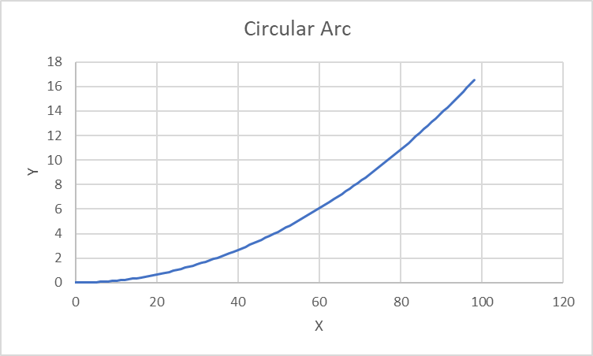
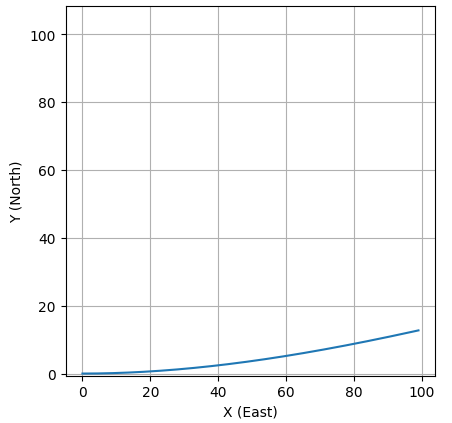
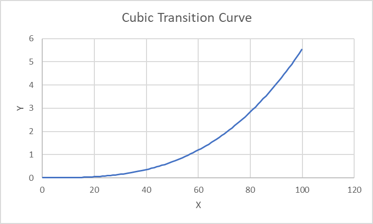
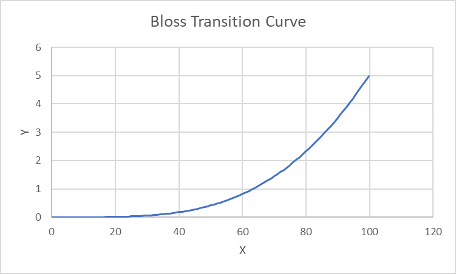
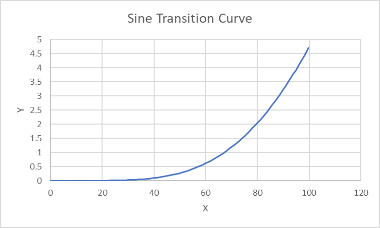

# Section 2 - Horizontal Alignment

This section will define the mathematical relationships and equations
for parent curve segments used to define the geometry of horizontal
alignments.

## General

Parameter | Equation
----------|-----------------------------------
Start Curvature | $$\kappa_{s} = \frac{1}{R_{s}}$$
End Curvature | $$\kappa_{e} = \frac{1}{R_{e}}$$
Cumulative change in curvature | $$f = \frac{L}{R_{e}} - \frac{L}{R_{s}} = L\left( \frac{1}{R_{e}} - \frac{1}{R_{s}} \right)$$
Angle of tangent line, RefDirection = $$\cos\left( \theta(s) \right),\sin\left( \theta(s) \right)$$ | $$\theta(s) = \int_{}^{}{\kappa(s)ds}$$    
X-ordinate as a function of curve length s | $$x(s) = \int_{}^{}{\cos\left( \theta(s) \right)ds}$$
Y-ordinate as a function of curve length s | $$y(s) = \int_{}^{}{\sin{\left( \theta(s) \right)\ ds}}$$
  

### IfcCurveSegment Placement

The `IfcCurveSegment` placement is provided in the IFC. This placement is
represented in matrix form as

$$M_{PC} = \begin{bmatrix}
dx & - dy & 0 & x \\
dy & dx & 0 & y \\
0 & 0 & 1 & 0 \\
0 & 0 & 0 & 1
\end{bmatrix}$$

Column 1 represents the RefDirection (dx,dy,0)

Column 3 represents the Axis (0,0,1). Axis is always "up" normal to the
2D plane

Column 4 represents the Location (x,y,0). Z is always zero because the
horizontal curve lies in the X-Y plane

Column 2 is the Y direction is the cross product of RefDirection and
Axis.

## Line

When `IfcLine` is used as a parent curve, it represents a tangent run of
the alignment.

**Source Model: FHWA Alignment Model**

1.  Parent Curve Parametric Equations

The equation of a line is parameterized as

$$\theta(t) = \theta$$

$$\kappa(t) = 0$$

$$\lambda(u) = C + L\left( \int_{0}^{u = 1}{\cos\left( \theta(t) \right)}dt\ x,\ \int_{0}^{u = 1}{\sin\left( \theta(t) \right)}dt\ y \right)$$

$$\lambda(u) = C + \left( \int_{0}^{u = L}{\cos\left( \theta(t) \right)}dt\ x,\ \int_{0}^{u = L}{\sin\left( \theta(t) \right)}dt\ y \right)$$

:warning: **[Discuss that a line (and the other parent curves) can be parametetized
differently and there isn't a standards therefore the rule that
`IfcCurveSegment.Start` and Length `IfcCurveMeasureSelect` must be
`IfcLengthMeasure`.]** :warning:

### Semantic Definition to Geometry Mapping

Mapping of the semantic definition of the linear segment to the
geometric definition is described with the following example.

Given a horizontal alignment segment is a line segment starting at point
(500,2500), bearing in the direction 5.70829654085293 and has a length
of 1956.785654. This segment is represented as

~~~
#23=IFCCARTESIANPOINT((500.,2500.));
#32=IFCALIGNMENTHORIZONTALSEGMENT($,$,#23,5.70829654085293,0.,0.,1956.785654,$,.LINE.);
~~~

The geometric representation is an `IfcLine`. The line can be defined in
different ways and is generally not important, as will be shown in the
example below. `IfcLine` is an infinitely long line that passes through a
specified point at some direction in the X-Y plane. An easy way to
define the `IfcLine` parent curve is to have in the X-axis direction
passing through point (0,0).

Define the parent curve

~~~
#51=IFCCARTESIANPOINT((0.,0.));
#52=IFCDIRECTION((1.,0.));
#53=IFCVECTOR(#52,1.);
#54=IFCLINE(#51,#53);
~~~

`IfcCurveSegment` defines the portion of the line used and how it is
placed and oriented in the X-Y plane.

`IfcCurveSegment.SegmentStart` defines where the parent curve trimming
begins. It can be anywhere along the line. It's easiest to begin the
trimming at the origin but could be anywhere. The SegmentStart attribute
is 0.0 in this case.

`IfcCurveSegment.SegmentLength` defines where the parent curve trimming
ends relative to SegmentStart. This is the length of the curve we want
to trim. The SegmentLength attribute is 1956.785654 for this example.

The SegmentStart and SegmentLength attributes trims a portion of the
`IfcLine` parent curve, which is oriented in the direction (1,0) with
origin at (0,0). The trimmed portion of the curve needs to be placed and
oriented into the horizontal alignment, but in this case, it is trivial
and the `IfcCurveSegment.Placement` is sufficient to place and orient the
trimmed line segment.

From `IfcCurveSegment.Placement`, the direction of the segment is

$$dy = \sin{(5.70829654085293)} = -0.54374144087698$$

$$dx = \cos{(5.70829654085293)} = 0.839252789970355$$

~~~
#49=IFCDIRECTION((0.839252789970355,-0.54374144087698));
~~~

The trimmed line segment is placed at (500,2500). The curve segment
placement is

~~~
#50=IFCAXIS2PLACEMENT2D(#23,#49);
~~~

Finally, the `IfcCurveSegment` can be defined as

~~~
#55=IFCCURVESEGMENT(.CONTSAMEGRADIENT.,#50,IFCLENGTHMEASURE(0.),IFCLENGTHMEASURE(1956.785654),#54);
~~~

### Compute Point on Curve

Compute the position matrix for a point 100 m from the start of the
curve segment.

The `IfcCurveSegment.Placement` is sufficient to locate a point on the
segment. The position and orientation of the parent curve are irrelevant
for `IfcLine`.

From the curve segment placement

$$C = (500,2500)$$

$$dx\  = 0.839252789970355,\ dy\  = -0.54374144087698$$

$$\theta = \tan^{-1}{\left( \frac{-0.54374144087698}{0.839252789970355} \right) = -0.574888766\ }$$

The point on the curve segment can be computed as

$$\lambda(u) = C + \left( \int_{0}^{u = L}{\cos\left( \theta(t) \right)}dt\ x,\ \int_{0}^{u = L}{\sin\left( \theta(t) \right)}dt\ y \right)$$

$$x = 500 + \int_{0}^{100}{\cos{(-0.574888766)}} = 500 + ( - \sin{(-0.574888766))(100m - 0m) = 583.925249}$$

$$y = 2500 + \int_{0}^{100}{\sin{( -0.574888766)}} = 2500 + (\cos{(-0.574888766))(100m - 0m) = 2445.625886}$$

Though it is much easier to use the following calculation

$$x(u) = p_{x} + u(dx)$$

$$y(u) = p_{y} + u(dy)$$

$$x = 500 + 0.839252789970355(100) = 583.925249$$

$$y = 2500 - 0.54374144087698(100) = 2445.625886$$

The resulting position matrix is

$$M_{h} = \begin{bmatrix}
0.83925279 & 0.54374114 & 0 & 583.925249 \\
 -0.54374114 & 0.83925279 & 0 & 2445.625886 \\
0 & 0 & 1 & 0 \\
0 & 0 & 0 & 1
\end{bmatrix}$$

## Circular Arc

When `IfcCircle` is used as a parent curve, it represents a circular curve
of the alignment.

Source Model:
[GENERATED\_\_HorizontalAlignment_CircularArc_100.0_300_1000_1_Meter.ifc](https://github.com/bSI-RailwayRoom/IFC-Rail-Unit-Test-Reference-Code/blob/master/alignment_testset/IFC-WithGeneratedGeometry/GENERATED__HorizontalAlignment_CircularArc_100.0_300_1000_1_Meter.ifc)

### Parent Curve Parametric Equations

$$\theta(s) = \frac{s}{R}$$

$$\kappa(s) = \frac{1}{R}$$

$$x(s) = \int_{}^{}{\cos\left( \theta(s) \right)ds}$$

$$y(s) = \int_{}^{}{\sin{\left( \theta(s) \right)\ ds}}$$

### Semantic Definition to Geometry Mapping

`IfcCircle` is defined by its center (`IfcCircle.Position`) and radius
(`IfcCircle.Radius`). The position of the circle is irrelevant. The
mapping from the semantic definition of radius to the geometric
definition of radius is trivial.

Consider a horizontal curve segment that starts at (0,0), has a radius
of 300 m, and an arc length of 100 m. The semantic definition is

~~~
#28 = IFCCARTESIANPOINT((0., 0.));
#29 = IFCALIGNMENTHORIZONTALSEGMENT($, $, #28, 0., 300., 300., 100., $, .CIRCULARARC.);
~~~

The parent curve can be defined as follows:

~~~
#45 = IFCCIRCLE(#46, 300.);
#46 = IFCAXIS2PLACEMENT2D(#47, #48);
#47 = IFCCARTESIANPOINT((0., 300.));
#48 = IFCDIRECTION((0., -1.));
~~~

This is a circle centered at point (0,300) with the local X-axis aligned
with the negative global Y-axis. This aligns the trimmed curve with its
final placement.

The trimmed curve segment is placed such that the start point is at
(0,0) and the tangent at the start point is in the direction (1,0).

~~~
#42 = IFCAXIS2PLACEMENT2D(#43, #44);
#43 = IFCCARTESIANPOINT((0., 0.));
#44 = IFCDIRECTION((1., 0.));
~~~

The curve segment is defined by its placement at a segment trimmed from
the parent curve starting at 0.0 for a length of 100.0 along the curve.

~~~
#36 = IFCCURVESEGMENT(.CONTINUOUS., #42, IFCLENGTHMEASURE(0.),IFCLENGTHMEASURE(100.), #45);
~~~

### Compute Point on Curve

Compute the placement matrix for a point 50 m from the start of the
curve segment.

Compute point on parent curve at $u = 50$

$$\theta(s) = \frac{s}{R}$$

$$x(s) = \int_{}^{}{\cos\left( \theta(s) \right)ds}$$

$$y(s) = \int_{}^{}{\sin{\left( \theta(s) \right)\ ds}}$$

$$x(50) = \int_{0}^{50}{\cos\left( \frac{s}{300} \right)ds} = 300\sin\frac{50}{300} - 300\sin\frac{0}{300} = 49.76883981$$

$$y(50) = \int_{0}^{50}{\sin{\left( \frac{s}{300} \right)\ ds}} = - 300\cos\frac{50}{300} - \left( - 300\cos\frac{0}{300} \right) = 4.1570305$$

This is the point on the parent curve relative to the start of the trim.

Position this point using the curve segment placement. Direction of the
curve tangent (RefDirection) is (1,0). Apply the rotation

$$x = 49.76883981(1) + 4.1570305(0) = 49.76883981$$

$$y = - 49.76883981(0) + 4.1570305(1) = 4.1570305$$

The curve segment is placed at (0,0). Apply the translation

$$x = 49.76883981 + 0 = 49.76883981$$

$$y = 4.1570305 + 0 = 4.1570305$$

The resulting placement matrix is

$$M_{h} = \begin{bmatrix}
1 & 0 & 0 & 49.76883981 \\
0 & 1 & 0 & 4.1570305 \\
0 & 0 & 1 & 0 \\
0 & 0 & 0 & 1
\end{bmatrix}$$

## Clothoid

Source Model:
[GENERATED\_\_HorizontalAlignment_Clothoid_100.0_300_1000_1_Meter.ifc](https://github.com/bSI-RailwayRoom/IFC-Rail-Unit-Test-Reference-Code/blob/master/alignment_testset/IFC-WithGeneratedGeometry/GENERATED__HorizontalAlignment_Clothoid_100.0_300_1000_1_Meter.ifc)

### Parent Curve Parametric Equations

$$\kappa(s) = \frac{A}{\left| A^{3} \right|}s$$

$$\theta(s) = \int_{}^{}{\kappa(s)ds} = \frac{\pi}{2}\frac{A}{|A|}s^{2}$$

$$x(u) = A\sqrt{\pi}\int_{0}^{u}{\cos{\left( \frac{\pi}{2}\frac{A}{|A|}t^{2} \right)\ }dt}$$

$$y(u) = A\sqrt{\pi}\int_{0}^{u}{\sin{\left( \frac{\pi}{2}\frac{A}{|A|}t^{2} \right)\ }dt}$$

A clothoid curve is parameterized by
$$u = \frac{s}{\left| A\sqrt{\pi} \right|}\ $$ with
$- \infty < u < \infty$. When $\theta = \pi/2$, $u = 1.0$.

### Semantic Definition to Geometry Mapping

$$f = \frac{L}{R_{e}} - \frac{L}{R_{s}}$$

$$A = \frac{L}{\sqrt{|f|}}\frac{f}{|f|}$$

Consider a horizontal clothoid segment that starts at (0,0) with a start
direction of (1.0,0.0). The radii at the start and end of the segment
are 300 and 1000, respectively. The arc length of the segment is 100.
The semantic definition is

~~~
#28 = IFCCARTESIANPOINT((0., 0.));
#29 = IFCALIGNMENTHORIZONTALSEGMENT($, $, #28, 0., 300., 1000., 100., $, .CLOTHOID.);
~~~

From the semantic definition, compute the clothoid constant, $A$

$$R_{s} = 300,\ R_{e} = 1000,\ L = 100$$

$$f = \frac{100}{1000} - \frac{100}{300} = -0.23333$$

$$A = \frac{100}{\sqrt{| -0.23333|}}\frac{-0.23333}{| -0.23333|} = -207.0196678$$

The curve segment starts where the radius is 300. The distance from the
origin where this radius occurs can be computed from the curvature
equation. The curvature at the start is 1/300 and the clothoid constant
is -207.0196678. Solve for distance from origin.

$$\kappa(s) = \frac{A}{\left| A^{3} \right|}s$$

$$\frac{1}{300} = \frac{- 207.0196678}{\left| - {207.0196678}^{3} \right|}s$$

$$s = - 142.8571429$$

Place the parent curve at (0,0) with a tangent of (1,0)

~~~
#45 = IFCCLOTHOID(#46, -207.019667802706);
#46 = IFCAXIS2PLACEMENT2D(#47, $);
#47 = IFCCARTESIANPOINT((0., 0.));
~~~

Place the curve segment at (0,0) with the tangent in the direction
(1,0).

~~~
#42 = IFCAXIS2PLACEMENT2D(#43, #44);
#43 = IFCCARTESIANPOINT((0., 0.));
#44 = IFCDIRECTION((1., 0.));
~~~

Define the curve segment

~~~
#36 = IFCCURVESEGMENT(.CONTINUOUS., #42, IFCLENGTHMEASURE(-142.857142857143), IFCLENGTHMEASURE(100.), #45);
~~~

### Compute Point on Curve

These example calculations will reference the steps in the algorithm
presented in 1.5.3.

Step 1 -- Evaluate the parent curve at `IfcCurveSegment.SegmentStart`

Compute the placement matrix for a point 50 m from the start of the
curve segment.

Start by computing the point and curve tangent at the start of the
parent curve trim.

Compute point on parent curve at
$u = \frac{-142.8571428}{\left| - 207.0196678\sqrt{\pi} \right|} = -0.3893278$

$$x(-0.3893278) = - 207.0196678\sqrt{\pi}\int_{0}^{-0.3893278}{\cos{\left( \frac{\pi}{2}\frac{-207.0196678}{| - 207.0196678|}t^{2} \right)\ }dt} = -142.04941746210602$$

$$y(-0.3893278) = -207.0196678\sqrt{\pi}\int_{0}^{-0.3893278}{\sin{\left( \frac{\pi}{2}\frac{-207.0196678}{| - 207.0196678|}t^{2} \right)\ }dt} = 11.292042785713347$$

$$\theta(-0.3893278) = \frac{\pi}{2}\frac{-207.0196678}{|-207.0196678|}(-0.3893278)^{2} = -0.238095237$$

$$dx = \cos(-0.238095237) = 0.971788979$$

$$dy = \sin{(-0.238095237) = -0.235852028}$$

In matrix form

$$M_{PCS} = \begin{bmatrix}
0.971788979 & 0.235852028 & 0 & -142.04941746210602 \\
 -0.235852028 & 0.971788979 & 0 & 11.292042785713347 \\
0 & 0 & 1 & 0 \\
0 & 0 & 0 & 1
\end{bmatrix}$$

Step 2 -- Create parent curve translation matrix

Remove the start point location so the point under consideration is
relative to (0,0).

$$M_{T} = \begin{bmatrix}
1 & 0 & 0 & 142.04941746210602 \\
0 & 1 & 0 & -11.292042785713347 \\
0 & 0 & 1 & 0 \\
0 & 0 & 0 & 1
\end{bmatrix}$$

Step 3 -- Create parent curve rotation matrix

Remove the start point rotation so the point under consideration tangent
at the start point in the direction (1,0).

$$M_{R} = \begin{bmatrix}
0.971788979 & -0.235852028 & 0 & 0 \\
0.235852028 & 0.971788979 & 0 & 0 \\
0 & 0 & 1 & 0 \\
0 & 0 & 0 & 1
\end{bmatrix}$$

Step 4 -- Create matrix for `IfcCurveSegment.Placement`

Represent `IfcCurveSegment.Placement` in matrix form. In this example, the
placement is at (0,0) with RefDirection (1,0) which results in an
identity matrix. This is not true in all cases.

$$M_{CSP} = \begin{bmatrix}
1 & 0 & 0 & 0 \\
0 & 1 & 0 & 0 \\
0 & 0 & 1 & 0 \\
0 & 0 & 0 & 1
\end{bmatrix}$$

Step 5 -- Compute position on `IfcCurveSegment`

Step 5a -- Evaluate parent curve at `IfcCurveSegment.SegmentStart` +
`IfcCurveSegment.SegmentLength`

Compute point and curve tangent at 50 m from the start,

$$ -142.8571428 + 50 = -92.8571428$$

$$u = \frac{-92.8571428}{\left|-207.0196678\sqrt{\pi} \right|} = -0.25306307$$

$$x(-0.25306307) = -207.0196678\sqrt{\pi}\int_{0}^{-0.25306307}{\cos{\left( \frac{\pi}{2}\frac{-207.0196678}{|-207.0196678|}s^{2} \right)\ }ds} = - 92.763220844871512$$

$$y(-0.25306307) = -207.0196678\sqrt{\pi}\int_{0}^{-0.25306307}{\sin{\left( \frac{\pi}{2}\frac{-207.0196678}{|-207.0196678|}s^{2} \right)\ }ds} = 3.1114126254443812$$

$$\theta(-0.25306307) = \frac{\pi}{2}\frac{-207.0196678}{|-207.0196678|}(-0.25306307)^{2} = -0.100595238$$

$$dx = \cos(-0.100595238) = 0.994944564$$

$$dy = \sin{(-0.100595238) = -0.100425663}$$

In matrix form

$$M_{PC} = \begin{bmatrix}
0.994944564 & 0.100425663 & 0 & -92.763220844871512 \\
 -0.100425663 & 0.994944564 & 0 & 3.1114126254443812 \\
0 & 0 & 1 & 0 \\
0 & 0 & 0 & 1
\end{bmatrix}$$

Step 5b -- Map the parent curve point to the curve segment.

Apply the translation, rotation, and curve segment placement to the
parent curve point

$$M_{h} = M_{CSP} M_{R} M_{T} M_{PC} = \begin{bmatrix}
1 & 0 & 0 & 0 \\
0 & 1 & 0 & 0 \\
0 & 0 & 1 & 0 \\
0 & 0 & 0 & 1
\end{bmatrix}
\begin{bmatrix}
0.971788979 & -0.235852028 & 0 & 0 \\
0.235852028 & 0.971788979 & 0 & 0 \\
0 & 0 & 1 & 0 \\
0 & 0 & 0 & 1
\end{bmatrix}
\begin{bmatrix}
1 & 0 & 0 & 142.04941746210602 \\
0 & 1 & 0 & -11.292042785713347 \\
0 & 0 & 1 & 0 \\
0 & 0 & 0 & 1
\end{bmatrix}
\begin{bmatrix}
0.994944564 & 0.100425663 & 0 & -92.763220844871512 \\
 -0.100425663 & 0.994944564 & 0 & 3.1114126254443812 \\
0 & 0 & 1 & 0 \\
0 & 0 & 0 & 1
\end{bmatrix}$$

$$M_{h} = \begin{bmatrix}
0.99056175921247780 & -0.13706714116038599 & 0 & 49.825200930152405 \\
0.13706714116038599 & 0.99056175921247780 & 0 & 3.6744032279728032 \\
0 & 0 & 1 & 0 \\
0 & 0 & 0 & 1
\end{bmatrix}$$

## Cubic Transition Curve

Source Model:
[GENERATED\_\_HorizontalAlignment_Cubic_100.0_inf_300_1_Meter.ifc](https://github.com/bSI-RailwayRoom/IFC-Rail-Unit-Test-Reference-Code/blob/master/alignment_testset/IFC-WithGeneratedGeometry/GENERATED__HorizontalAlignment_Cubic_100.0_inf_300_1_Meter.ifc)

### Parent Curve Parametric Equations

The approach for calculating the coordinates of a horizontal cubic curve
is unique compared to the other curve types. For a horizontal alignment,
the coordinate point and curve tangent angle is generally defined by
parametric equations where the parameter is the distance along the
curve. A cubic curve is represented with the `IfcPolynomialCurve` parent
curve type. When `IfcPolynomialCurve` is used as a cubic transition curve,
the $x$ coefficients are \[0,1\] and the $y$ coefficients are
\[0,0,0, $A_{3}$\] resulting in a function of the form
$y(x) = A_{3}x^{3}$.

The distance along the curve is defined by

$$s = \int_{}^{}{\sqrt{\left( y'(x) \right)^{2} + 1}\ dx}$$

$$y'(x) = 3A_{3}x^{2}$$

$$s = \int_{}^{}{\sqrt{9A_{3}^{2}x^{4} + 1}\ dx}$$

This equation is solved for $x$ and then $y$ can be computed. This can
be accomplished with numeric methods.

1.  For a distance $u$ along the curve, find $x$ for $s - u = 0$

2.  Compute $y(x) = A_{3}x^{3}$

3.  Compute curve tangent slope as $\frac{dy}{dx} = 3A_{3}x^{2}$

### Semantic Definition to Geometry Mapping

$$A_{0} = A_{1} = A_{2} = 0$$

$$A_{3} = \frac{1}{6R_{e}L} - \frac{1}{6R_{s}L}$$

Consider a horizontal cubic transition curve segment that starts at
(0,0) with a start direction of 0.0. The radius at the start is infinite
and the radius at the end is 300. The arc length of the segment is 100.
The semantic definition is
~~~
#28 = IFCCARTESIANPOINT((0., 0.));
#29 = IFCALIGNMENTHORIZONTALSEGMENT($, $, #28, 0., 0., 300., 100., $,.CUBIC.);
~~~

Compute the polynomial curve constants

$$A_{3} = \frac{1}{6(300m)(100m)} - \frac{1}{6(\infty)(100m)} = 5.55555 \bullet 10^{- 6}\ m^{- 2}$$

---
:warning:

There is a flaw in the IFC Specification. [IfcAlignmentHorizontalSegment](https://ifc43-docs.standards.buildingsmart.org/IFC/RELEASE/IFC4x3/HTML/lexical/IfcAlignmentHorizontalSegmentTypeEnum.htm) indicates the cubic formula is $y=\frac{x^3}{6RL}$ which means the `IfcPolynomialCurve.CoefficentY[3]` attribute must have unit of $Length^{-2}$. This is a direct contradiction to [IfcPolynomialCurve](https://ifc43-docs.standards.buildingsmart.org/IFC/RELEASE/IFC4x3/HTML/lexical/IfcPolynomialCurve.htm) which clearly states the coefficent are real values (i.e. scalar values) with `IfcReal`.

Why is this a problem? The calculation of a point on the polynomal curve is different depending on how the coefficients are defined.

The parametric form of the polynomial curve is $Q(u) = ( x(u), y(u), z(u) )$. The polynomial curve represents real geometry so the resulting values, $x$, $y$, and $z$ must have units of $Length$.

When $u$ is parametrized as a Length measure, as required by [IfcCurveSegment](https://ifc43-docs.standards.buildingsmart.org/IFC/RELEASE/IFC4x3/HTML/lexical/IfcCurveSegment.htm), the parametric terms of the polynomal equation are:

$x(u) = \sum\limits_{i=0}^{l} a_i u^i $

$y(u) = \sum\limits_{j=0}^{m} b_j u^j $

$z(u) = \sum\limits_{k=0}^{n} c_k u^k $

For $x$, $y$, and $z$ to have values in $Length$ measure, the implicit unit of measure of the coefficients must be:

$Length^{(1-i)}$ for $a_i$

$Length^{(1-j)}$ for $b_j$

$Length^{(1-k)}$ for $c_k$

When $u$ is parametrized as a scalar, as required by [IfcPolynomialCurve](https://ifc43-docs.standards.buildingsmart.org/IFC/RELEASE/IFC4x3/HTML/lexical/IfcPolynomialCurve.htm), the parametric terms of the polynomial equation are:

$x(u) = L\sum\limits_{i=0}^{l} a_i u^i $

$y(u) = L\sum\limits_{j=0}^{m} b_j u^j $

$z(u) = L\sum\limits_{k=0}^{n} c_k u^k $

The parameter $u$ and the coefficients are scalar so they must be multipled with the curve length $L$ to result values of Length.

**The equations for $x$, $y$, and $z$ differ depending on the parameterization.**

Concept Template [4.2.2.1.5 Cubic Transition Segment](https://ifc43-docs.standards.buildingsmart.org/IFC/RELEASE/IFC4x3/HTML/concepts/Partial_Templates/Geometry/Curve_Segment_Geometry/Cubic_Transition_Segment/content.html) and [IfcAlignmentHorizontalSegment](https://ifc43-docs.standards.buildingsmart.org/IFC/RELEASE/IFC4x3/HTML/lexical/IfcAlignmentHorizontalSegmentTypeEnum.htm) provide clear direction (not withstanding typographical errors) that `IfcPolynomalCurve` is to be evaluated as $y = CoefficientsY[3]x^3$ which dictates that $CoefficientsY[3]$ must be in units of $Length^{-2}$ and must be encoded in the `IfcPolynomialCurve.CoefficientY` attribute as an `IfcReal`.

While I've never been able to find an offically documented Implementer's Agreement, this interpetation is consistent with several different discussions on GitHub. 

:warning:

---

The geometric representation is

~~~
#45 = IFCPOLYNOMIALCURVE(#46, (0., 1.), (0., 0., 0., 5.55555555555556E-6), $);
#46 = IFCAXIS2PLACEMENT2D(#47, $);
#47 = IFCCARTESIANPOINT((0., 0.));
~~~

### Evaluate Point on Curve

Compute the curve coordinates at a distance along the curve, $u = 100$

X Coefficients = ($0 m^1$, $1 m^0$)

Y Coefficients = ($0 m^1$, $0 m^{0}$, $0 m^{-1}$, $5.55555E{-06} m^{-2}$)

$$y(x) = \left( 5.55555 \bullet 10^{-6} m^{-2}\right)x^{3}$$

Find $x$ such that

$$s - u = \int_{0}^{x}\sqrt{\left( y'(x) \right)^{2} + 1}dx - u = 0$$

$$y'(x) = 3\left( 5.55555 \bullet 10^{-6}  m^{-2}\right)x^{2}$$

Solve numerically

$$x = 99.72593255 m$$

Check solution

$$s = \int_{0}^{99.72593255m}\sqrt{\left( 3 \bullet (5.55555 \bullet 10^{-6} m^{-2})(x m)^{2} \right)^{2} + 1}dx = 100m$$

Compute y

$$y(x) = (5.55555 \bullet 10^{-6} m^{-2}{)(99.72593255m)}^{3} = 5.5100m$$

The tangent vector at $u = 100m$ along the curve is

$$dy = y'(99.72593255m) = 3\left( 5.55555 \bullet 10^{-6} m^{-2}\right)(99.72593255m)^{2} = 0.165753$$

$$dx = 1.0$$

Normalizing the tangent vector (RefDirection)

$$dx = \frac{1}{\sqrt{1^{2} + {0.615753}^{2}}} = 0.986539$$

$$dy = \frac{0.165753}{\sqrt{1^{2} + {0.615753}^{2}}} = 0.1635219$$

The Y-direction vector is (-dy,dx)

Axis vector is (0,0,1)

The resulting matrix is

$$M_{PC} = \begin{bmatrix}
0.986539 & -0.1635219 & 0 & 99.72593255 \\
0.1635219 & 0.986539 & 0 & 5.5100 \\
0 & 0 & 1 & 0 \\
0 & 0 & 0 & 1
\end{bmatrix}$$

For this example, $M_{CSP}$, $M_{R}$, and $M_{T}$ are identity matrices.
The resulting point is

$$M_{h} = \begin{bmatrix}
0.986539 & -0.1635219 & 0 & 99.72593255 \\
0.1635219 & 0.986539 & 0 & 5.5100 \\
0 & 0 & 1 & 0 \\
0 & 0 & 0 & 1
\end{bmatrix}$$

## Helmert Transition Curve

The Helmert curve is unique in that it is modeled in two halves. The
business logic is represented geometrically by two
`IfcSecondOrderPolynomialSpiral` objects.

Source Model:
[GENERATED\_\_HorizontalAlignment_HelmertCurve_100.0_inf_300_1_Meter.ifc](https://github.com/bSI-RailwayRoom/IFC-Rail-Unit-Test-Reference-Code/blob/master/alignment_testset/IFC-WithGeneratedGeometry/GENERATED__HorizontalAlignment_HelmertCurve_100.0_inf_300_1_Meter.ifc)

### Parent Curve Parametric Equations

$$\theta(t) = \frac{t^{3}}{3A_{2}^{3}} + \frac{A_{1}}{2\left| A_{1}^{3} \right|}t^{2} + \frac{t}{A_{0}}$$

$$\kappa(t) = \frac{1}{A_{2}^{3}}t^{2} + \frac{A_{1}}{\left| A_{1}^{3} \right|}t + \frac{1}{A_{0}}$$

### Semantic Definition to Geometry Mapping

$$f = \frac{L}{R_{e}} - \frac{L}{R_{s}}$$

First Half

$$a_{0} = \frac{L}{R_{s}},\ A_{0} = \frac{L}{\left| a_{0} \right|}\ \frac{a_{0}}{\left| a_{0} \right|}$$

$$a_{1} = 0,\ A_{1} = 0$$

$$a_{2} = 2f,\ A_{2} = \frac{L}{\sqrt[3]{\left| a_{2} \right|}}\ \frac{a_{2}}{\left| a_{2} \right|}$$

Second Half

$$a_{0} = -f + \frac{L}{R_{s}},\ A_{0} = \frac{L}{\left| a_{0} \right|}\ \frac{a_{0}}{\left| a_{0} \right|}$$

$$a_{1} = 4f,\ A_{1} = \frac{L}{\sqrt{\left| a_{1} \right|}}\ \frac{a_{1}}{\left| a_{1} \right|}$$

$$a_{2} = -2f,\ A_{2} = \frac{L}{\sqrt[3]{\left| a_{2} \right|}}\ \frac{a_{2}}{\left| a_{2} \right|}$$

Consider a horizontal Helmert transition curve segment that starts at
(0,0) with a start direction of 0.0. The radius at the start is infinite
and the radius at the end is 300. The arc length of the segment is 100.
The semantic definition is

~~~
#28 = IFCCARTESIANPOINT((0., 0.));
#29 = IFCALIGNMENTHORIZONTALSEGMENT($, $, #28, 0., 0., 300., 100., $, .HELMERTCURVE.);
~~~

Compute the curve parameters

$$L = 100\ m$$

$$R_{s} = \infty$$

$$R_{e} = 300\ m$$

$$f = \frac{100}{300} - \frac{100}{\infty} = 0.33333$$

First Half

$$a_{0} = \frac{100}{\infty} = 0,\ A_{0} = 0$$

$$A_{1} = 0$$

$$a_{2} = 2(0.33333) = 0.66667,\ A_{2} = \frac{100\ m}{\sqrt[3]{|0.66667|}}\frac{0.66667}{|0.66667|} = 114.4714255\ m$$

Second Half

$$a_{0} = -0.33333 + \frac{100}{\infty} = -0.33333,\ A_{0} = \frac{100\ m}{| -0.33333|}\frac{-0.33333}{|-0.33333|} = - 300\ m$$

$$a_{1} = 4(0.33333) = 1.33333,\ A_{1} = \frac{100\ m}{\sqrt{|1.33333|}}\frac{1.33333}{|1.33333|} = 86.602540378\ m$$

$$a_{2} = -2(0.33333) = -0.66667,\  A_{2} = \frac{100\ m}{\sqrt[3]{| -0.66667|}}\frac{-0.66667}{|-0.66667|} = -114.4714255\ m$$

End point and end slope of first half is the placement of the second
half.

$$\theta(t) = \frac{t^{3}}{3A_{2}^{3}} + \frac{A_{1}}{2\left| A_{1}^{3} \right|}t^{2} + \frac{t}{A_{0}} = \frac{t^{3}}{3(114.4714255)^{3}}$$

$$x_{1} = \int_{0}^{L/2}{\cos{\theta(t)}}\ dt = 49.99724\ m$$

$$y_{1} = \int_{0}^{L/2}{\sin{\theta(t)}}\ dt = 0.347204\ m$$

$$\theta_{1}\left( \frac{L}{2} \right) = \frac{{(50m)}^{3}}{3(114.4714255m)^{3}} = 0.0277777777$$

$$dx = \cos{0.027777777} = 0.999614$$

$$dy = \sin{0.027777777} = 0.0277742$$

Start point of second parent curve

$$\theta(t) = \frac{t^{3}}{3A_{2}^{3}} + \frac{A_{1}}{2\left| A_{1}^{3} \right|}t^{2} + \frac{t}{A_{0}} = \frac{t^{3}}{3( - 114.4714255\ m)^{3}} + \frac{86.602540378\ m}{2\left| (86.602540378\ m)^{3} \right|}t^{2} + \frac{t}{- 300\ m}$$

$$x_{2} = \int_{0}^{L/2}{\cos{\theta(t)}}\ dt = 49.9664\ m\ $$

$$y_{2} = \int_{0}^{L/2}{\sin{\theta(t)}}\ dt = - 1.73556\ m$$

$$\theta_{2}\left( \frac{L}{2} = 50\ m \right) = \frac{{(50\ m)}^{3}}{3( - 114.4714255\ m)^{3}} + \frac{86.602540378\ m}{2\left| (86.602540378\ m)^{3} \right|}({50\ m)}^{2} + \frac{50\ m}{- 300\ m} = - 0.0277777$$

The end point of the first parent curve and the start point of the
second parent curve are offset so a rotation and translation for the
placement of the second parent curve is needed.

$$\theta_{p} = \theta_{1} - \theta_{2} = 0.0277777777 - (-0.0277777777) = 0.05555555$$

$$dx = \cos{0.05555555} = 0.998457$$

$$dy = \sin{0.05555555} = 0.055526$$

$$x_{p} = x_{1} - x_{2}\cos\theta_{p} + y_{2}\sin\theta_{p}$$

$$y_{p} = y_{1} - x_{2}\sin\theta_{p} - y_{2}\cos\theta_{p}$$

$$x_{p} = 49.9972 - 49.9664\cos{0.0555555} - 1.73556\sin{0.0555555 =}0.011503\ m$$

$$y_{p} = 0.347204 - 49.9664\sin{0.055555} + 1.73556\cos{0.0555555} = -0.6943693\ m$$

The geometric representations are

First half

~~~
#45 = IFCSECONDORDERPOLYNOMIALSPIRAL(#46, 114.471424255333, $, $);
#46 = IFCAXIS2PLACEMENT2D(#47, $);
#47 = IFCCARTESIANPOINT((0., 0.));
~~~

Second half

~~~
#52 = IFCSECONDORDERPOLYNOMIALSPIRAL(#53, -114.471424255333, 86.6025403784439, -300.);
#53 = IFCAXIS2PLACEMENT2D(#54, #55);
#54 = IFCCARTESIANPOINT((0.0115725277555399, -0.694297741112199));
#55 = IFCDIRECTION((0.998457186998745, 0.0555269820047339));
~~~

The curve segments are

First half

~~~
#36 = IFCCURVESEGMENT(.CONTSAMEGRADIENTSAMECURVATURE., #42, IFCLENGTHMEASURE(0.), IFCLENGTHMEASURE(50.), #45);
#37 = IFCLOCALPLACEMENT($, #38);
#38 = IFCAXIS2PLACEMENT3D(#39, $, $);
#39 = IFCCARTESIANPOINT((0., 0., 0.));
~~~

Second half

:warning: **[Write this up better]** :warning:

The start placement of the second half is

$$x = x_s + x_1 cos(\theta_s) - y_1 sin(\theta_s)$$
$$y = y_s + x_1 sin(\theta_s) + y_2 cos(\theta_s)$$
$$dx = cos(\theta_s + \theta_1)$$
$$dy = sin(\theta_s + \theta_1)$$

where $x_s, y_s, \theta_s$ are the start point and angle at start of the first half

$$x = 0.0 + 49.99724 cos(0.0) - 0.347204 sin(0.0) = 49.99724$$
$$y = 0.0 + 49.99724 sin(0.0) + 0.347204 cos(0.0) = 0.347204$$
$$dx = cos(0. + 0.02777777) = 0.999614$$
$$dy = sin(0. + 0.02777777) = 0.027774$$

~~~
#48 = IFCCURVESEGMENT(.CONTINUOUS., #49, IFCLENGTHMEASURE(50.), IFCLENGTHMEASURE(50.), #52);
#49 = IFCAXIS2PLACEMENT2D(#50, #51);
#50 = IFCCARTESIANPOINT((49.9972443634885, 0.347204361427475));
#51 = IFCDIRECTION((0.999614222337484, 0.0277742056705088));
~~~

3.  Evaluate Point on Curve

See clothoid curve for general calculation procedure.

:warning: **[Add calculation]** :warning:

## Bloss Transition Curve

Parent curve type: `IfcThirdOrderPolynomialSpiral`

Source Model:
[GENERATED\_\_HorizontalAlignment_BlossCurve_100.0_inf_300_1_Meter.ifc](https://github.com/bSI-RailwayRoom/IFC-Rail-Unit-Test-Reference-Code/blob/master/alignment_testset/IFC-WithGeneratedGeometry/GENERATED__HorizontalAlignment_BlossCurve_100.0_inf_300_1_Meter.ifc)

### Parent Curve Parametric Equations

$$\theta(t) = \frac{A_{3}}{4\left| A_{3}^{5} \right|}t^{4} + \frac{1}{3A_{2}^{3}}t^{3} + \frac{A_{1}}{2\left| A_{1}^{3} \right|}t^{2} + \frac{t}{A_{0}}$$

$$\kappa(t) = \frac{A_{3}}{\left| A_{3}^{5} \right|}t^{3} + \frac{t^{2}}{A_{2}^{3}} + \frac{A_{1}}{2\left| A_{1}^{3} \right|}t + \frac{1}{A_{0}}$$

### Semantic Definition to Geometry Mapping

$$f = \frac{L}{R_{e}} - \frac{L}{R_{s}}$$

$$a_{0} = \frac{L}{R_{s}},\ A_{0} = \frac{L}{\left| a_{0} \right|}\frac{a_{0}}{\left| a_{0} \right|}$$

$$A_{1} = 0$$

$$a_{2} = 3f,\ A_{2} = \frac{L}{\sqrt[3]{\left| a_{2} \right|}}\frac{a_{2}}{\left| a_{2} \right|}$$

$$a_{3} = - 2f,\ A_{3} = \frac{L}{\sqrt[4]{\left| a_{3} \right|}}\frac{a_{3}}{\left| a_{3} \right|}$$

Consider a horizontal Bloss transition curve segment that starts at
(0,0) with a start direction of 0.0. The radius at the start is infinite
and the radius at the end is 300. The arc length of the segment is 100.
The semantic definition is

~~~
#28 = IFCCARTESIANPOINT((0., 0.));
#29 = IFCALIGNMENTHORIZONTALSEGMENT($, $, #28, 0., 0., 300., 100., $, .BLOSSCURVE.);
~~~

$$L = 100\ m$$

$$R_{s} = \infty$$

$$R_{e} = 300\ m$$

$$f = \frac{100}{300} - \frac{100}{\infty} = 0.33333$$

$$a_{0} = \frac{100}{\infty} = 0,\ A_{o} = 0$$

$$a_{2} = 3(0.33333) = 1,\ A_{2} = \frac{100}{\sqrt[3]{|1|}}\frac{1}{|1|} = 100\ m$$

$$a_{3} = - 2(0.33333) = -0.66667,\ A_{3} = \frac{100\ m}{\sqrt[4]{| -0.66667|}}\frac{-0.66667}{|-0.66667|} = - 110.668192\ m$$

~~~
#45 = IFCTHIRDORDERPOLYNOMIALSPIRAL(#46, -110.668191970032, 100., $, $);
#46 = IFCAXIS2PLACEMENT2D(#47, $);
#47 = IFCCARTESIANPOINT((0., 0.));
~~~

### Evaluate Point on Curve

Evaluate at the end of the curve $u = 100$

$$\theta(t) = \frac{-110.668192}{4\left|-{110.668192}^{5} \right|}t^{4} + \frac{1}{3(100)^{3}}t^{3}$$

$$x = \int_{0}^{100}{\cos{\theta(t)}}\ dt = 99.7486$$

$$y = \int_{0}^{100}{\sin{\theta(t)}}\ dt = 4.98981$$

$$\theta(100) = \frac{-110.668192}{4\left|-{110.668192}^{5} \right|}(100)^{4} + \frac{1}{3(100)^{3}}(100)^{3} = \frac{1}{6} = 0.1666667$$

$$dx = \cos\left( \frac{1}{6} \right) = 0.98614$$

$$dy = \sin{\left( \frac{1}{6} \right) = 0.16589}$$

The parent curve point is then positioned using the curve segment start
point and orientation as illustrated for the clothoid curve example.

## Cosine Transition Curve

Source Model:
[GENERATED\_\_HorizontalAlignment_CosineCurve_100.0_inf_300_1_Meter.ifc](https://github.com/bSI-RailwayRoom/IFC-Rail-Unit-Test-Reference-Code/blob/master/alignment_testset/IFC-WithGeneratedGeometry/GENERATED__HorizontalAlignment_CosineCurve_100.0_inf_300_1_Meter.ifc)

### Parent Curve Parametric Equations

$$\kappa(t) = \frac{1}{A_{0}} + \frac{1}{A_{1}}\cos\left( \frac{\pi}{L}t \right)$$

$$\theta(t) = \frac{1}{A_{0}}t + \frac{L}{\pi A_{1}}\sin\left( \frac{\pi}{L}t \right)$$

$$x = \int_{0}^{L}{\cos{\theta(t)}}\ dt$$

$$y = \int_{0}^{L}{\sin{\theta(t)}}\ dt$$

### Semantic Definition to Geometry Mapping 

$$f = \frac{L}{R_{e}} - \frac{L}{R_{s}}$$

Constant Term:
$a_{0} = 0.5f + \frac{L}{R_{s}},\ A_{0} = \frac{L}{\left| a_{0} \right|}\frac{a_{0}}{\left| a_{0} \right|}$

Cosine Term:
$a_{1} = \ -0.5f,\ A_{1} = \frac{L}{\left| a_{1} \right|}\frac{a_{1}}{\left| a_{1} \right|}$

Consider a horizontal cosine transition curve segment that starts at
(0,0) with a start direction of 0.0. The radius at the start is infinite
and the radius at the end is 300. The arc length of the segment is 100.
The semantic definition is

~~~
#28 = IFCCARTESIANPOINT((0., 0.));
#29 = IFCALIGNMENTHORIZONTALSEGMENT($, $, #28, 0., 0., 300., 100., $, .COSINECURVE.);
~~~

$$R_{s} = \infty,\ R_{e} = 300\ m,\ L = 100\ m$$

$$f = \frac{100}{300} - \frac{100}{\infty} = 0.33333$$

$$a_{0} = 0.5(0.33333) + \frac{100}{\infty} = 0.16667,\ A_{0} = \frac{100\ m}{|0.16667|}\ \frac{0.16667}{|0.16667|} = 600\ m$$

$$a_{1} = -0.5(0.33333) = -0.16667,\ A_{1} = \frac{100}{|-0.16667|}\ \frac{-0.16667}{|-0.16667|} = - 600\ m$$

~~~
#45 = IFCCOSINESPIRAL(#46, -600., 600.);
#46 = IFCAXIS2PLACEMENT2D(#47, $);
#47 = IFCCARTESIANPOINT((0., 0.));
~~~

### Evaluate Point on Curve

Evaluate at the end of the curve $u = 100$

$$\theta(t) = \frac{1}{600}t - \frac{100}{600\pi}\sin\left( \frac{\pi}{100}t \right)$$

$$x = \int_{0}^{100}{\cos{\theta(t)}}\ dt = 99.7485\ m$$

$$y = \int_{0}^{100}{\sin{\theta(t)}}\ dt = 4.9458\ m$$

$$\theta(100) = \frac{1}{600}100 - \frac{100}{600\pi}\sin\left( \frac{\pi}{100}100 \right) = \frac{1}{6} = 0.1666667$$

$$dx = \cos\left( \frac{1}{6} \right) = 0.98614$$

$$dy = \sin{\left( \frac{1}{6} \right) = 0.16589}$$

The parent curve point is then positioned using the curve segment start
point and orientation as illustrated for the clothoid curve example.

## Sine Transition Curve

Source Model:
[GENERATED\_\_HorizontalAlignment_SineCurve_100.0_inf_300_1_Meter.ifc](https://github.com/bSI-RailwayRoom/IFC-Rail-Unit-Test-Reference-Code/blob/master/alignment_testset/IFC-WithGeneratedGeometry/GENERATED__HorizontalAlignment_SineCurve_100.0_inf_300_1_Meter.ifc)

### Parent Curve Parametric Equations

$$\kappa(t) = \frac{1}{A_{0}} + \frac{A_{1}}{\left| A_{1} \right|}\left( \frac{1}{A_{1}} \right)^{2}t + \frac{1}{A_{2}}\sin\left( \frac{2\pi}{L}t \right)\ \ $$

$$\theta(t) = \frac{1}{A_{0}}t + \frac{1}{2}\left( \frac{A_{1}}{\left| A_{1} \right|} \right)\left( \frac{t}{A_{1}} \right)^{2} - \frac{L}{2\pi A_{2}}\left( \cos\left( \frac{2\pi}{L}t \right) - 1 \right)$$

$$x = \int_{0}^{L}{\cos{\theta(t)}}\ dt$$

$$y = \int_{0}^{L}{\sin{\theta(t)}}\ dt$$

### Semantic Definition to Geometry Mapping 

$$f = \frac{L}{R_{e}} - \frac{L}{R_{s}}$$

Constant Term:
$a_{0} = \frac{L}{R_{s}},\ A_{o} = \frac{L}{\left| a_{0} \right|}\frac{a_{0}}{\left| a_{0} \right|}$

Linear Term:
$a_{1} = f,\ A_{1} = \frac{L}{\sqrt{\left| a_{1} \right|}}\frac{a_{1}}{\left| a_{1} \right|}$

Sine Term:
$a_{2} = -\frac{1}{2\pi}f,\ A_{2} = \frac{L}{\left| a_{2} \right|}\frac{a_{2}}{\left| a_{2} \right|}$

Consider a horizontal sine transition curve segment that starts at (0,0)
with a start direction of 0.0. The radius at the start is infinite and
the radius at the end is 300. The arc length of the segment is 100. The
semantic definition is

~~~
#28 = IFCCARTESIANPOINT((0., 0.));
#29 = IFCALIGNMENTHORIZONTALSEGMENT($, $, #28, 0., 0., 300., 100., $, .SINECURVE.);
~~~

$$R_{s} = \infty,\ R_{e} = 300\ m,\ L = 100\ m$$

$$f = \frac{100}{300} - \frac{100}{\infty} = 0.33333$$

$$a_{0} = \frac{100}{\infty} = 0,\ A_{0} = 0$$

$$a_{1} = 0.33333,\ A_{1} = \frac{100}{\sqrt{|0.33333|}}\frac{0.33333}{|0.33333|} = 173.2050808\ m$$

$$a_{2} = -\frac{1}{2\pi}(0.33333) = -0.053051647,\ A_{2} = \frac{100}{|-0.053051647|}\frac{-0.053051647}{|-0.053051647|} = -1884.955592\ m$$

~~~
#45 = IFCSINESPIRAL(#46, -1884.95559215388, 173.205080756888, $);
#46 = IFCAXIS2PLACEMENT2D(#47, $);
#47 = IFCCARTESIANPOINT((0., 0.));
~~~

### Evaluate Point on Curve

Evaluate at the end of the curve $u = 100$

$$\theta(t) = \frac{1}{2}\left( \frac{t}{173.2050808} \right)^{2} + \frac{100}{2\pi(1884.955592)}\left( \cos\left( \frac{2\pi}{100}t \right) - 1 \right)$$

$$x = \int_{0}^{100}{\cos{\theta(t)}}\ dt = 99.757\ m$$

$$y = \int_{0}^{100}{\sin{\theta(t)}}\ dt = 4.70132\ m$$

$$\theta(100) = \frac{1}{2}\left( \frac{100}{173.2050808} \right)^{2} + \frac{100}{2\pi(1884.955592)}\left( \cos\left( \frac{2\pi}{100}100 \right) - 1 \right) = \frac{1}{6} = 0.1666667$$

$$dx = \cos\left( \frac{1}{6} \right) = 0.98614$$

$$dy = \sin{\left( \frac{1}{6} \right) = 0.16589}$$

The parent curve point is then positioned using the curve segment start
point and orientation as illustrated for the clothoid curve example.

## Viennese Transition Curve

Parent curve type: `IfcSeventhOrderPolynomialSpiral`

Source Model: https://github.com/bSI-RailwayRoom/IFC-Rail-Unit-Test-Reference-Code/blob/master/alignment_testset/IFC-WithGeneratedGeometry/GENERATED__HorizontalAlignment_VienneseBend_100.0_inf_300_1_Meter.ifc

### Parent Curve Parametric Equations ###

$$\theta(s) = \frac{A_{7}}{8\left| A_{7}^{9} \right|} s^{8} + \frac{1}{7 A_{6}^{7}} s^{7} + \frac{A_{5}}{6\left| A_{5}^{7} \right|} s^{6} + \frac{1}{5 A_{4}^{5}} s^{5} + \frac{A_{3}}{4\left| A_{3}^{5} \right|} s^{4} + \frac{1}{3 A_{2}^{3}} s^{3} + \frac{A_{1}}{2\left| A_{1}^{3} \right|} s^{2} + \frac{1}{A_{0}} s$$

$$\kappa(s) = \frac{A_{7}}{\left| A_{7}^{9} \right|}s^{7} + \frac{1}{A_{6}^{7}}s^{6} + \frac{A_{5}}{\left| A_{5}^{7} \right|}s^{5} + \frac{1}{A_{4}^{5}}s^{4} + \frac{A_{3}}{\left| A_{3}^{5} \right|}s^{3} + \frac{1}{A_{2}^{3}}s^{2} + \frac{A_{1}}{\left| A_{1}^{3} \right|}s + \frac{1}{A_{0}}$$

### Semantic Definition to Geometry Mapping

$h_{cg}$ = Gravity Center Line Height = `IfcAlignmentHorizontalSegment.GravityCenterLineHeight`

$d_{rh}$ = Rail Head Distance = `IfcAlignmentCant.RaliHeadDistance`

$D_{sl}$ = `IfcAlignmentCantSegment.StartCantLeft`

$D_{el}$ = `IfcAlignmentCantSegment.EndCantLeft`

$D_{sr}$ = `IfcAlignmentCantSegment.StartCantRight`

$D_{er}$ = `IfcAlignmentCantSegment.EndCantRight`

$$\theta_s = \frac{(D_{sr} - D_{sl})}{d_{rh}}$$,  Start Cant Angle

$$\theta_e = \frac{(D_{er} - D_{el})}{d_{rh}}$$,  End Cant Angle

$$cf = -420.\left ( \frac{h_{cg}}{L} \right) \left( \theta_e - \theta_s \right)$$, Cant Factor

$$f = \frac{L}{R_{e}} - \frac{L}{R_{s}}$$

Constant term $$a_{0} = \frac{L}{R_{s}}, A_{0} = \frac{L}{\left| a_{0} \right|}\frac{a_{0}}{\left| a_{0} \right|}$$

Linear term $$a_{1} = 0, A_{1} = 0$$

Quadratic term $$a_{2} = cf, A_{2} = \frac{L}{\sqrt[3]{\left| a_{2} \right|}}\frac{a_{2}}{\left| a_{2} \right|}$$

Cubic term $$a_{3} = -4cf, A_{3} = \frac{L}{\sqrt[4]{\left| a_{3} \right|}}\frac{a_{3}}{\left| a_{3} \right|}$$

Quartic term $$a_{4} = 5cf + 35f, A_{4} = \frac{L}{\sqrt[5]{\left| a_{4} \right|}}\frac{a_{4}}{\left| a_{4} \right|}$$

Quintic  term $$a_{5} = -2cf - 84f, A_{5} = \frac{L}{\sqrt[6]{\left| a_{5} \right|}}\frac{a_{5}}{\left| a_{5} \right|}$$

Sextic term term $$a_{6} = 70f, A_{6} = \frac{L}{\sqrt[7]{\left| a_{6} \right|}}\frac{a_{6}}{\left| a_{6} \right|}$$

Septic term $$a_{7} = -20f, A_{7} = \frac{L}{\sqrt[8]{\left| a_{7} \right|}}\frac{a_{7}}{\left| a_{7} \right|}$$

### Example

Consider a horizontal Viennese Bend transition curve segment that starts at (0,0) with a start direction of 0.0. The radius at the start is infinite and the radius at the end is 300. The arc length is 100. The Gravity Center Line Height is 1.8 (this optional parameter is required for the Viennese Bend). The semantic definition is

~~~
#28 = IFCCARTESIANPOINT((0., 0.));
#29 = IFCALIGNMENTHORIZONTALSEGMENT($, $, #28, 0., 0., 300., 100., 1.8, .VIENNESEBEND.);
~~~

Viennese Bend transition curves are unique in that the horizontal geometry of the curve depends on the cant. For the example, the cant segment horizontal length is 100, the start cant is 0.0 and the end cant is 0 at the left rail and 0.1 at the right rail. The semantic definition is

~~~
#64 = IFCALIGNMENTCANTSEGMENT($, $, 0., 100., 0., 0., 0., 1.E-1, .VIENNESEBEND.);
~~~

$$R_{s} = \infty,\ R_{e} = 300\ m,\ L = 100\ m$$

$$f = \frac{100}{300} - \frac{100}{\infty} = 0.33333$$

$$ \theta_s = \frac{(0. - 0.)}{1.5} = 0.0$$

$$ \theta_e = \frac{0.1 - 0.0}{1.5} = 0.066667$$

$$ cf = -420\left(\frac{1.8}{100}\right)(0.066667-0.)= -0.504$$

$$ a_{0} = \frac{100}{\infty} = 0, A_{0} = 0 $$

$$ a_{1} = 0, A_{1} = 0 $$

$$ a_{2} = -0.504, A_{2} = \frac{100}{\sqrt[3]{\left| -0.504 \right|}}\frac{-0.504}{\left| -0.504 \right|} = -125.6579069m$$

$$ a_{3} = -4(-0.504) = 2.016, A_{3} = \frac{100}{\sqrt[4]{\left| 2.016 \right|}}\frac{2.016}{\left| 2.016 \right|} = 83.92229813m$$

$$ a_{4} = 5(-0.504) + 35(0.33333) = 9.1466655, A_{4} = \frac{100}{\sqrt[5]{\left| 9.1466655 \right|}}\frac{9.1466655}{\left| 9.1466655 \right|} = 64.231406m$$

$$ a_{5} = -2(-0.504) - 84(0.33333) = -26.9919999, A_{5} = \frac{100}{\sqrt[6]{\left| -26.9919999 \right|}}\frac{-26.9919999}{\left| -26.9919999 \right|} = -57.7378785m$$

$$ a_{6} = 70(0.33333) = 23.33333333, A_{6} = \frac{100}{\sqrt[7]{\left| 23.33333333 \right|}}\frac{23.33333333}{\left| 23.33333333 \right|} = 63.76388134m$$

$$ a_{7} = -20(0.33333) = -6.66666666, A_{7} = \frac{100}{\sqrt[8]{\left| -6.66666666 \right|}}\frac{-6.66666666}{\left| -6.66666666 \right|} = -78.8880838m$$

~~~
#75 = IFCSEVENTHORDERPOLYNOMIALSPIRAL(#76, -78.8880838459446, 63.7638813456506, -57.7378785242934, 64.2314061308743, 83.922298125931, -125.657906854859, $, $);
#76 = IFCAXIS2PLACEMENT2D(#77, $);
#77 = IFCCARTESIANPOINT((0., 0.));
~~~

The parent curve point is then positioned using the curve segment start
point and orientation as illustrated for the clothoid curve example.
