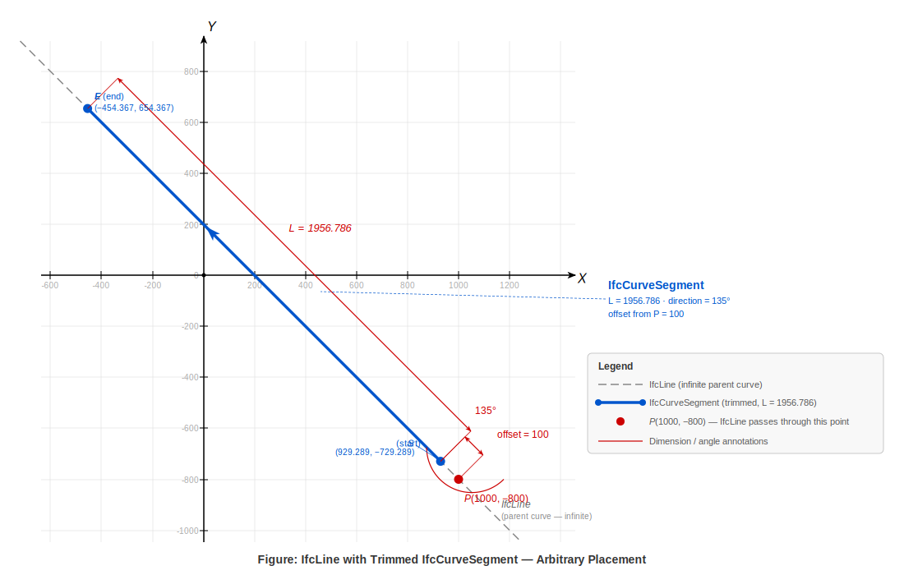
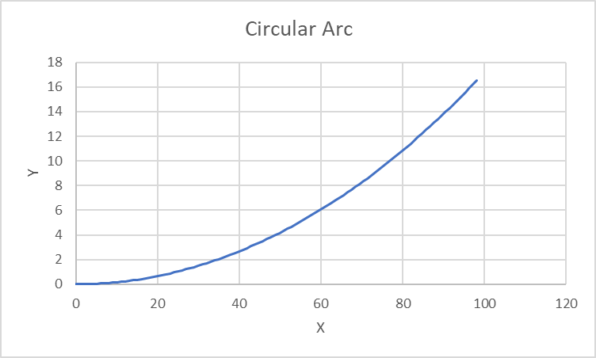
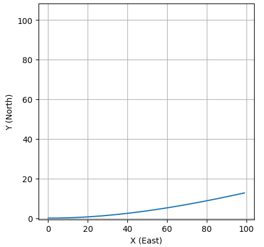
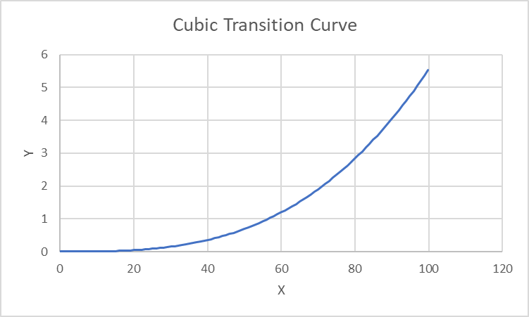
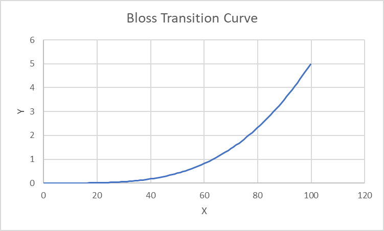
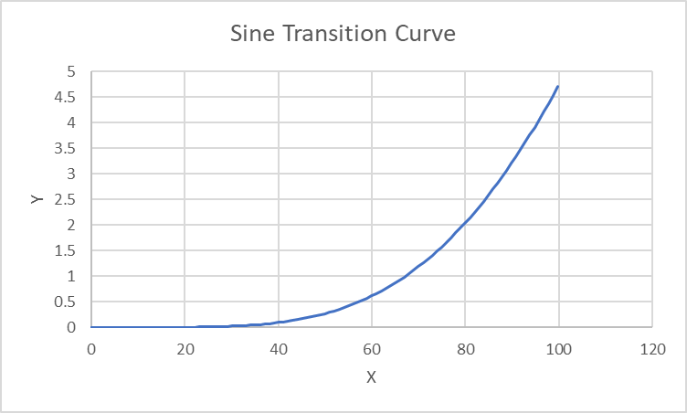

# Section 2 - Horizontal Alignment

outline:
* this chapter is in good shape, add the following
* introduction to example test files
* use the example files instead of linking to the EnrichIFC repo

The geometric representation of a horizontal alignment is accomplished with an `IfcCompositeCurve`. The composite curve consists of a sequence of `IfcCurveSegment` entities whose geometry is defined by a parent curve. This section defines the mathematical relationships and equations for each parent curve type and the algorithm for evaluating points on those curves.

Table 2.1 maps each `IfcAlignmentHorizontal.PredefinedType` to its corresponding parent curve type.

  Business Logic (`IfcAlignmentHorizontal.PredefinedType`)|Geometric Representation (`IfcCurveSegment.ParentCurve`)
  ————————————————————-|—————————————————-
  LINE                                     |`IfcLine`
  CIRCULARARC                              |`IfcCircle`
  CLOTHOID                                 |`IfcClothoid`
  CUBIC                                    |`IfcPolynomialCurve`
  HELMERTCURVE                             |`IfcSecondOrderPolynomialSpiral`
  BLOSSCURVE                               |`IfcThirdOrderPolynomialSpiral`
  COSINECURVE                              |`IfcCosineSpiral`
  SINECURVE                                |`IfcSineSpiral`
  VIENNESEBEND                             |`IfcSeventhOrderPolynomialSpiral`

  *Table 2.1 — Mapping of business logic to geometric representation for horizontal alignment*

## 2.1 General

The following parameters are common to all horizontal alignment curve types. Each curve is parameterized by arc-length $s$, where $s = 0$ at the start of the parent curve. The start and end radii $R_s$ and $R_e$ are taken from `IfcAlignmentHorizontalSegment.StartRadius` and `EndRadius`; a value of zero indicates infinite radius (zero curvature, i.e. a straight line). The segment length $L$ is `IfcAlignmentHorizontalSegment.SegmentLength`. The tangent angle $\theta(s)$ is measured from the positive $x$-axis; its cosine and sine form the `RefDirection` of the curve at $s$.

Parameter | Equation
—————|—————————————————-
Start Curvature | $$\kappa_{s} = \frac{1}{R_{s}}$$
End Curvature | $$\kappa_{e} = \frac{1}{R_{e}}$$
Cumulative change in curvature | $$f = \frac{L}{R_{e}} - \frac{L}{R_{s}} = L\left( \frac{1}{R_{e}} - \frac{1}{R_{s}} \right)$$
Angle of tangent line, RefDirection = $$\cos\left( \theta(s) \right),\sin\left( \theta(s) \right)$$ | $$\theta(s) = \int_{}^{}{\kappa(s)ds}$$    
X-ordinate as a function of curve length s | $$x(s) = \int_{}^{}{\cos\left( \theta(s) \right)ds}$$
Y-ordinate as a function of curve length s | $$y(s) = \int_{}^{}{\sin{\left( \theta(s) \right)\ ds}}$$
  

## 2.2 Curve Segment Evaluation Algorithm

This algorithm evaluates the 2D position and tangent direction of a point on an `IfcCurveSegment` in the alignment coordinate system. Let $s_0$ = `SegmentStart` and $s$ = the arc-length parameter of the point to evaluate, where $s_0 \leq s < s_0 + \texttt{SegmentLength}$.

**Step 1 — Evaluate the parent curve at the trim start**

Compute the position $(x_0, y_0)$ and tangent angle $\theta_0$ of the parent curve at $s_0$. This establishes the frame of the parent curve at the point where trimming begins.

**Step 2 — Form the translation matrix $M_T$**

$M_T$ moves the trim-start point to the origin so that all subsequent calculations are relative to the beginning of the trimmed segment.

$$M_T = \begin{bmatrix} 
1 & 0 & 0 & -x_0 \\
 0 & 1 & 0 & -y_0 \\
  0 & 0 & 1 & 0 \\
  0 & 0 & 0 & 1 
  \end{bmatrix}$$

**Step 3 — Form the rotation matrix $M_R$**

$M_R$ rotates so that the tangent at the trim start aligns with the positive $x$-direction $(1, 0)$. This is the inverse of the rotational part of $M_{PCS}$, which for a pure rotation matrix equals the transpose.

$$M_R = \begin{bmatrix} 
\cos\theta_0 & \sin\theta_0 & 0 & 0 \\
 -\sin\theta_0 & \cos\theta_0 & 0 & 0 \\ 
 0 & 0 & 1 & 0 \\
  0 & 0 & 0 & 1
   \end{bmatrix}$$

**Step 4 — Form the curve segment placement matrix $M_{CSP}$**

$M_{CSP}$ places the trimmed segment into the alignment coordinate system. It is constructed directly from `IfcCurveSegment.Placement`, where $(x_p, y_p)$ is the `Location` and $\theta_p$ is the bearing of the `RefDirection`.

$$M_{CSP} = \begin{bmatrix} 
\cos\theta_p & -\sin\theta_p & 0 & x_p \\ 
\sin\theta_p & \cos\theta_p & 0 & y_p \\ 
0 & 0 & 1 & 0 \\ 
0 & 0 & 0 & 1 
\end{bmatrix}$$

**Step 5 — Evaluate and map each point**

For the point at arc-length $s$, compute the parent curve position $(x(s), y(s))$ and tangent angle $\theta(s)$ and form:

$$M_{PC} = \begin{bmatrix} 
\cos\theta(s) & -\sin\theta(s) & 0 & x(s) \\
 \sin\theta(s) & \cos\theta(s) & 0 & y(s) \\ 
 0 & 0 & 1 & 0 \\ 
 0 & 0 & 0 & 1 
 \end{bmatrix}$$

Apply the translation, rotation, and placement in sequence:

$$M_h = M_{CSP} M_R M_T M_{PC}$$

The position of the point in the alignment coordinate system is the fourth column of $M_h$, and its tangent direction is the first column. Numerical examples of this algorithm are given in Sections 2.3 through 2.11.

## 2.3 Line

When `IfcLine` is used as a parent curve, it represents a tangent run of
the alignment.

### 2.3.1 Parent Curve Parametric Equations

The curve tangent angle and curvature are given by the following equations

$$\theta(t) = \theta$$

$$\kappa(t) = 0$$

The point on line equation can be parameterized with a **unit parameterization** where the parameter $u$ ranges from $0$ to $1$ over the full extent of the curve, independent of its physical length.

$$\lambda(u) = C + L\left( \int_{0}^{u = 1}{\cos\left( \theta(t) \right)}dt\ x,\ \int_{0}^{u = 1}{\sin\left( \theta(t) \right)}dt\ y \right)$$

It can also be parameterized with an **arc length parameterization** where the parameter $u$ equals the distance along the line in units of length, so $u = s$.

$$\lambda(u) = C + \left( \int_{0}^{u = L}{\cos\left( \theta(t) \right)}dt\ x,\ \int_{0}^{u = L}{\sin\left( \theta(t) \right)}dt\ y \right)$$


Other parent curve types can also be parameterized by unit value or arc length. However, the polynomial spirals do not have a well defined unit value parameterization. For this reason, the IFC specification mandates that all parameterization for alignment geometry be by arc length. For 
`IfcCurveSegment`, the `SegmentStart` and `SegmentLength` attributes **must** 
be of type `IfcLengthMeasure`. See [Section 8.9.3.28 IfcCurveSegment](https://ifc43-docs.standards.buildingsmart.org/IFC/RELEASE/IFC4x3/HTML/lexical/IfcCurveSegment.htm), Informal Proposition 1.

This matters because `IfcCurveSegment.SegmentStart` and 
`IfcCurveSegment.SegmentLength` are of type `IfcCurveMeasureSelect`, which 
can be either `IfcParameterValue` (a dimensionless scalar based on unit value) or 
`IfcLengthMeasure` (a physical length). 


### 2.3.2 Semantic Definition to Geometry Mapping

Mapping of the semantic definition of the linear segment to the
geometric definition is described with the following example.

Given a horizontal alignment segment is a line segment starting at point
(500,2500), bearing in the direction S 57 E (5.70829654085293 radian) and has a length of 1956.785654. 


This semantic definition of this segment is:

~~~
#31=IFCCARTESIANPOINT((500.,2500.));
#32=IFCALIGNMENTHORIZONTALSEGMENT($,$,#31,5.70829654085293,0.,0.,1956.785654,$,.LINE.);
~~~

The geometric representation is an `IfcLine`. The line can be defined in
different ways and is generally not important, as will be shown in the
example below. `IfcLine` is an infinitely long line that passes through a
specified point at some direction in the X-Y plane. For example, a line passing through (1000, −100) at a bearing of 175° from the x-axis:

[todo: replace this figure with one with a segment length of 1956.786 at an angle of 175 deg - claude is working on this but it needs to be resumed around 5pm]



An easy way to define the `IfcLine` parent curve is to have it the X-axis direction
passing through point (0,0).


The parent curve definition is:

~~~
#51=IFCCARTESIANPOINT((0.,0.));
#52=IFCDIRECTION((1.,0.));
#53=IFCVECTOR(#52,1.);
#54=IFCLINE(#51,#53);
~~~

`IfcCurveSegment` defines the portion of the line used and how it is
placed and oriented in the X-Y plane.

`IfcCurveSegment.SegmentStart` defines where the parent curve trimming
begins. It can be anywhere along the line. It is easiest to begin the
trimming at the origin but could be anywhere. The `SegmentStart` attribute
is 0.0 in this case.

`IfcCurveSegment.SegmentLength` defines where the parent curve trimming
ends relative to `SegmentStart`. This is the length of the curve we want
to trim. The `SegmentLength` attribute is 1956.785654 for this example.

The `SegmentStart` and `SegmentLength` attributes trims a portion of the
`IfcLine` parent curve, which is oriented in the direction (1,0) with
origin at (0,0). 

The trimmed portion of the curve needs to be placed and
oriented into the horizontal alignment. The tangent segment begins at (500,2500) and runs in the direction 5.70829654085293 radian.

From the segment direction, 

$$dy = \sin{(5.70829654085293)} = -0.54374144087698$$

$$dx = \cos{(5.70829654085293)} = 0.839252789970355$$

The segment placement is 
~~~
#31=IFCCARTESIANPOINT((500.,2500.));
#49=IFCDIRECTION((0.839252789970355,-0.54374144087698));
#50=IFCAXIS2PLACEMENT2D(#31,#49);
~~~

The `IfcCurveSegment` is be defined as:

~~~
#55=IFCCURVESEGMENT(.CONTSAMEGRADIENT.,#50,IFCLENGTHMEASURE(0.),IFCLENGTHMEASURE(1956.785654),#54);
~~~

### 2.3.3 Compute Point on Curve

Compute the position matrix for a point 100 m from the start of the
curve segment.

**Step 1 - Evaluate the parent curve at the trim start**

Because the parent curve is located at (0,0) in the direction (1,0), $x_0 = 0, y_0 = 0, \theta_0 = 0$.

**Step 2 - Form the translation matrix $M_T$**

The trimmed curve starts at (0,0) so $M_T$ is an identity matrix.

**Step 3 - Form the rotation matrix $M_R$**

The trimmed curve in the direction (1,0) so $M_R$ is an identity matrix.

**Step 4 - Form the curve segment placement matrix $M_{CSP}$**

From the `IfcCurveSegment.Placement`:

$$x = 500, y = 2500$$

$$dx\  = 0.839252789970355,\ dy\  = -0.54374144087698$$

$$M_{CSP} = \begin{bmatrix}
0.839252789970355 & 0.54374144087698 & 0 & 500 \\
 -0.54374144087698 & 0.839252789970355 & 0 & 2500 \\
0 & 0 & 1 & 0 \\
0 & 0 & 0 & 1
\end{bmatrix}$$

**Step 5 - Evaluate and map each point**

Evaluate the parent curve at $u = 100$

$$\lambda(u) = C + \left( \int_{0}^{u = L}{\cos\left( \theta(t) \right)}dt\ x,\ \int_{0}^{u = L}{\sin\left( \theta(t) \right)}dt\ y \right)$$

$$\theta(100) = \arctan\left(\frac{0}{1}\right) = 0$$

$$x = 0 + \cos(0)\int_{0}^{100}{dt} = 0 + 1(100m - 0m) = 100$$

$$y = 0 + \sin(0)\int_{0}^{100}{dt} = 0 + 0(100m - 0m) = 0$$

Though it is much easier to use the following calculation

$$x(u) = p_{x} + u(dx)$$

$$y(u) = p_{y} + u(dy)$$

$$x = 0 + 1(100) = 100$$

$$y = 0 - 0(100) = 0$$

$$M_{PC} = \begin{bmatrix}
1 & 0 & 0 & 100 \\
0 & 1 & 0 & 0\\
0 & 0 & 1 & 0\\
0 & 0 & 0 & 1
\end{bmatrix}$$

The resulting position matrix is

$$M_h = M_{CSP} M_T M_R M_{PC}$$

$$M_h = \begin{bmatrix}
0.839252789970355 & 0.54374144087698 & 0 & 500 \\
 -0.54374144087698 & 0.839252789970355 & 0 & 2500 \\
0 & 0 & 1 & 0 \\
0 & 0 & 0 & 1
\end{bmatrix} 
\begin{bmatrix}
I
\end{bmatrix} 
\begin{bmatrix}
I
\end{bmatrix} 
\begin{bmatrix}
1 & 0 & 0 & 100\\
0 & 1 & 0 & 0\\
0 & 0 & 1 & 0 \\
0 & 0 & 0 & 1
 \end{bmatrix}$$

$$M_{h} = \begin{bmatrix}
0.83925279 & 0.54374114 & 0 & 583.925249 \\
 -0.54374114 & 0.83925279 & 0 & 2445.625886 \\
0 & 0 & 1 & 0 \\
0 & 0 & 0 & 1
\end{bmatrix}$$

## 2.4 Circular Arc

When `IfcCircle` is used as a parent curve, it represents a circular curve
of the alignment.

Source Model:
[GENERATED\_\_HorizontalAlignment_CircularArc_100.0_300_1000_1_Meter.ifc](https://github.com/bSI-RailwayRoom/IFC-Rail-Unit-Test-Reference-Code/blob/master/alignment_testset/IFC-WithGeneratedGeometry/GENERATED__HorizontalAlignment_CircularArc_100.0_300_1000_1_Meter.ifc)

### 2.4.1 Parent Curve Parametric Equations

The curve tangent angle, curvature, and point on the curve are given by the following equations

$$\theta(s) = \frac{s}{R}$$

$$\kappa(s) = \frac{1}{R}$$

$$x(s) = \int_{}^{}{\cos\left( \theta(s) \right)ds}$$

$$y(s) = \int_{}^{}{\sin{\left( \theta(s) \right)\ ds}}$$

### 2.4.2 Semantic Definition to Geometry Mapping

`IfcCircle` is defined by its center (`IfcCircle.Position`) and radius
(`IfcCircle.Radius`).

Consider a horizontal curve segment that starts at (0,0), has a radius
of 300 m, and an arc length of 100 m. The semantic definition is

~~~
#28 = IFCCARTESIANPOINT((0., 0.));
#29 = IFCALIGNMENTHORIZONTALSEGMENT($, $, #28, 0., 300., 300., 100., $, .CIRCULARARC.);
~~~

The parent curve can be defined as follows:

~~~
#45 = IFCCIRCLE(#46, 300.);
#46 = IFCAXIS2PLACEMENT2D(#47, #48);
#47 = IFCCARTESIANPOINT((0., 300.));
#48 = IFCDIRECTION((0., -1.));
~~~

This is a circle centered at point (0,300) with the local X-axis aligned
with the negative global Y-axis.

[todo: add a figure of the circle along with the local and global coordinate systems.]

The parent curve is placed such that a trim starting at 0.0 is at
(0,0) and the tangent is in the direction (1,0).

The curve segment is defined by its placement at a segment trimmed from
the parent curve starting at 0.0 for a length of 100.0 along the curve.

~~~
#42 = IFCAXIS2PLACEMENT2D(#43, #44);
#43 = IFCCARTESIANPOINT((0., 0.));
#44 = IFCDIRECTION((1., 0.));
#36 = IFCCURVESEGMENT(.CONTINUOUS., #42, IFCLENGTHMEASURE(0.),IFCLENGTHMEASURE(100.), #45);
~~~

### 2.4.3 Compute Point on Curve

Compute the placement matrix for a point 50 m from the start of the
curve segment.

**Step 1 — Evaluate the parent curve at the trim start**

The trim begins where the local x-axis of the circle intersects the circumfrance. The circle is centered at (0,300) with radius = 300 and the local x-axis is in the direction of the global y-axis. This puts the trim start point at $x_0 = 0, y_0 = 0$ and the tangent direction (1,0) with $\theta_0 = 0$

**Step 2 — Form the translation matrix $M_T$**

$M_T = I$

**Step 3 — Form the rotaton matrix $M_R$**

$M_R = I$

**Step 4 — Form the curve segment placement matrix $M_{CSP}$**

$M_{CSP} = I$

**Step 5 — Evaluate and map each point**

Compute point on parent curve at $u = 50$

$$\theta(s) = \frac{s}{R} = \frac{50}{300} $$

$$d_x = \cos(\theta(s)) = \cos(\frac{50}{300}) = 0.98614323$$

$$d_y = \sin(\theta(s)) = \sin(\frac{50}{300}) = 0.16589613$$

$$x(s) = \int_{}^{}{\cos\left( \theta(s) \right)ds} = \int_{0}^{50}{\cos\left( \frac{s}{300} \right)ds} = 300\sin\frac{50}{300} - 300\sin\frac{0}{300} = 49.76883981$$

$$y(s) = \int_{}^{}{\sin{\left( \theta(s) \right)\ ds}} = \int_{0}^{50}{\sin{\left( \frac{s}{300} \right)\ ds}} = - 300\cos\frac{50}{300} - \left( - 300\cos\frac{0}{300} \right) = 4.1570305$$


$$M_{PC} = 
\begin{bmatrix}
0.98614323 & -0.16589613 & 0 & 49.76883981\\
0.16589613 & 0.98614323 & 0 & 4.1570305\\
0 & 0 & 1 & 0\\
0 & 0 & 0 & 1
\end{bmatrix}
$$

The resulting position matrix is

$$M_h = M_{CSP} M_T M_R M_{PC}$$

$$M_h = \begin{bmatrix}
I
\end{bmatrix} 
\begin{bmatrix}
I
\end{bmatrix} 
\begin{bmatrix}
I
\end{bmatrix} 
\begin{bmatrix}
0.98614323 & -0.16589613 & 0 & 49.76883981\\
0.16589613 & 0.98614323 & 0 & 4.1570305\\
0 & 0 & 1 & 0\\
0 & 0 & 0 & 1
 \end{bmatrix}$$

$$M_{h} = \begin{bmatrix}
0.98614323 & -0.16589613 & 0 & 49.76883981\\
0.16589613 & 0.98614323 & 0 & 4.1570305\\
0 & 0 & 1 & 0\\
0 & 0 & 0 & 1
\end{bmatrix}$$



## 2.5 Clothoid

When `IfcClothoid` is used as a parent curve, it represents a spiral transition curve

Source Model:
[GENERATED\_\_HorizontalAlignment_Clothoid_100.0_300_1000_1_Meter.ifc](https://github.com/bSI-RailwayRoom/IFC-Rail-Unit-Test-Reference-Code/blob/master/alignment_testset/IFC-WithGeneratedGeometry/GENERATED__HorizontalAlignment_Clothoid_100.0_300_1000_1_Meter.ifc)

### 2.5.1 Parent Curve Parametric Equations

The curve tangent angle, curvature, and point on the curve are given by the following equations

$$\theta(s) = \int_{}^{}{\kappa(s)ds} = \frac{\pi}{2}\frac{A}{|A|}s^{2}$$

$$\kappa(s) = \frac{A}{\left| A^{3} \right|}s$$

$$x(u) = A\sqrt{\pi}\int_{0}^{u}{\cos{\left( \frac{\pi}{2}\frac{A}{|A|}t^{2} \right)\ }dt}$$

$$y(u) = A\sqrt{\pi}\int_{0}^{u}{\sin{\left( \frac{\pi}{2}\frac{A}{|A|}t^{2} \right)\ }dt}$$

IFC provides a unit parametrization of clothoid curve.

$$u = \frac{s}{\left| A\sqrt{\pi} \right|}$$
with
$-\infty < u < \infty$. When $\theta = \pi/2$, $u = 1.0$.

Care must be taken when evaluating clothoids because `IfcCurveSegment.SegmentStart` and `IfcCurveSegment.SegmentLength` are defined with arc length. The details are illustreated in the example calculations.

### 2.5.2 Semantic Definition to Geometry Mapping

Consider a horizontal clothoid segment that starts at (0,0) with a start
direction of (1.0,0.0). The radii at the start and end of the segment
are 300 and 1000, respectively. The arc length of the segment is 100.
The semantic definition is

~~~
#28 = IFCCARTESIANPOINT((0., 0.));
#29 = IFCALIGNMENTHORIZONTALSEGMENT($, $, #28, 0., 300., 1000., 100., $, .CLOTHOID.);
~~~

From the semantic definition, compute the clothoid constant, $A$

$$R_{s} = 300,\ R_{e} = 1000,\ L = 100$$

$$f = \frac{L}{R_{e}} - \frac{L}{R_{s}}= \frac{100}{1000} - \frac{100}{300} = -0.23333$$

$$A = \frac{L}{\sqrt{|f|}}\frac{f}{|f|} = \frac{100}{\sqrt{| -0.23333|}}\frac{-0.23333}{| -0.23333|} = -207.0196678$$

The curve segment starts where the radius is 300. The distance from the
origin where this radius occurs can be computed from the curvature
equation. The curvature at the start is 1/300 and the clothoid constant
is -207.0196678. Solve for distance from origin.

$$\kappa(s) = \frac{A}{\left| A^{3} \right|}s$$

$$\frac{1}{300} = \frac{- 207.0196678}{\left| - {207.0196678}^{3} \right|}s$$

$$s = -142.8571429$$

Place the parent curve at (0,0) with a tangent direction of (1,0)

~~~
#45 = IFCCLOTHOID(#46, -207.019667802706);
#46 = IFCAXIS2PLACEMENT2D(#47, $);
#47 = IFCCARTESIANPOINT((0., 0.));
~~~

Place the curve segment at (0,0) with the tangent in the direction
(1,0).

~~~
#42 = IFCAXIS2PLACEMENT2D(#43, #44);
#43 = IFCCARTESIANPOINT((0., 0.));
#44 = IFCDIRECTION((1., 0.));
~~~

Define the curve segment

~~~
#36 = IFCCURVESEGMENT(.CONTINUOUS., #42, IFCLENGTHMEASURE(-142.857142857143), IFCLENGTHMEASURE(100.), #45);
~~~

### 2.5.3 Compute Point on Curve

Compute the placement matrix for a point 50 m from the start of the
curve segment.

**Step 1 — Evaluate the parent curve at the trim start**

Start by computing the point and curve tangent at the start of the parent curve trim.

Recall that the clothoid equations are in terms of a unit parameterization. Compute the parametric position on the curve.

$$u = \frac{-142.8571428}{\left| - 207.0196678\sqrt{\pi} \right|} = -0.3893278$$

Compute the point on curve tangent direction

$$\theta_0(-0.3893278) = \frac{\pi}{2}\frac{-207.0196678}{|-207.0196678|}(-0.3893278)^{2} = -0.238095237$$

and compute the point on the curve

$$x_0(-0.3893278) = - 207.0196678\sqrt{\pi}\int_{0}^{-0.3893278}{\cos{\left( \frac{\pi}{2}\frac{-207.0196678}{| - 207.0196678|}t^{2} \right)\ }dt} = -142.04941746210602$$

$$y_0(-0.3893278) = -207.0196678\sqrt{\pi}\int_{0}^{-0.3893278}{\sin{\left( \frac{\pi}{2}\frac{-207.0196678}{| - 207.0196678|}t^{2} \right)\ }dt} = 11.292042785713347$$

**Step 2 — Form the translation matrix $M_T$**

$$M_T = \begin{bmatrix}
 1 & 0 & 0 & -x_0 \\ 
 0 & 1 & 0 & -y_0 \\ 
 0 & 0 & 1 & 0 \\ 
 0 & 0 & 0 & 1 
 \end{bmatrix}
=
\begin{bmatrix}
1 & 0 & 0 & 142.04941746210602 \\
0 & 1 & 0 & -11.292042785713347 \\
0 & 0 & 1 & 0 \\
0 & 0 & 0 & 1
\end{bmatrix}
$$

**Step 3 — Form the rotation matrix $M_R$**

$$M_R = \begin{bmatrix}
 \cos\theta_0 & \sin\theta_0 & 0 & 0 \\
  -\sin\theta_0 & \cos\theta_0 & 0 & 0 \\
   0 & 0 & 1 & 0 \\
    0 & 0 & 0 & 1 
    \end{bmatrix}
=\begin{bmatrix}
\cos(-0.238095237) & \sin(-0.238095237) & 0 & 0 \\
-\sin(-0.238095237) & \cos(-0.238095237) & 0 & 0 \\
0 & 0 & 1 & 0 \\
0 & 0 & 0 & 1
\end{bmatrix}
 = \begin{bmatrix}
0.971788979 & -0.235852028 & 0 & 0 \\
0.235852028 & 0.971788979 & 0 & 0 \\
0 & 0 & 1 & 0 \\
0 & 0 & 0 & 1
\end{bmatrix}
$$

**Step 4 — Form the curve segment placement matrix $M_{CSP}$**

Represent `IfcCurveSegment.Placement` in matrix form. In this example, the
placement is at (0,0) with RefDirection (1,0) which results in an
identity matrix. This is not true in all cases.

$$M_{CSP} = I$$

**Step 5 — Evaluate and map each point**

Compute point and curve tangent at 50 m from the start,

$$ s = -142.8571428 + 50 = -92.8571428$$

$$u = \frac{-92.8571428}{\left|-207.0196678\sqrt{\pi} \right|} = -0.25306307$$

$$x(-0.25306307) = -207.0196678\sqrt{\pi}\int_{0}^{-0.25306307}{\cos{\left( \frac{\pi}{2}\frac{-207.0196678}{|-207.0196678|}s^{2} \right)\ }ds} = - 92.763220844871512$$

$$y(-0.25306307) = -207.0196678\sqrt{\pi}\int_{0}^{-0.25306307}{\sin{\left( \frac{\pi}{2}\frac{-207.0196678}{|-207.0196678|}s^{2} \right)\ }ds} = 3.1114126254443812$$

$$\theta(-0.25306307) = \frac{\pi}{2}\frac{-207.0196678}{|-207.0196678|}(-0.25306307)^{2} = -0.100595238$$

$$dx = \cos(-0.100595238) = 0.994944564$$

$$dy = \sin{(-0.100595238) = -0.100425663}$$

In matrix form

$$M_{PC} = \begin{bmatrix}
0.994944564 & 0.100425663 & 0 & -92.763220844871512 \\
 -0.100425663 & 0.994944564 & 0 & 3.1114126254443812 \\
0 & 0 & 1 & 0 \\
0 & 0 & 0 & 1
\end{bmatrix}$$

Apply the translation, rotation, and curve segment placement to the
parent curve point

$$M_{h} = M_{CSP} M_{R} M_{T} M_{PC} = \begin{bmatrix}
I
\end{bmatrix}
\begin{bmatrix}
0.971788979 & -0.235852028 & 0 & 0 \\
0.235852028 & 0.971788979 & 0 & 0 \\
0 & 0 & 1 & 0 \\
0 & 0 & 0 & 1
\end{bmatrix}
\begin{bmatrix}
1 & 0 & 0 & 142.04941746210602 \\
0 & 1 & 0 & -11.292042785713347 \\
0 & 0 & 1 & 0 \\
0 & 0 & 0 & 1
\end{bmatrix}
\begin{bmatrix}
0.994944564 & 0.100425663 & 0 & -92.763220844871512 \\
 -0.100425663 & 0.994944564 & 0 & 3.1114126254443812 \\
0 & 0 & 1 & 0 \\
0 & 0 & 0 & 1
\end{bmatrix}$$

$$M_{h} = \begin{bmatrix}
0.99056175921247780 & -0.13706714116038599 & 0 & 49.825200930152405 \\
0.13706714116038599 & 0.99056175921247780 & 0 & 3.6744032279728032 \\
0 & 0 & 1 & 0 \\
0 & 0 & 0 & 1
\end{bmatrix}$$



## 2.6 Cubic Transition Curve

When `IfcPolynomalCurve` is used as a parent curve, it represents a spiral transition curve

Source Model:
[GENERATED\_\_HorizontalAlignment_Cubic_100.0_inf_300_1_Meter.ifc](https://github.com/bSI-RailwayRoom/IFC-Rail-Unit-Test-Reference-Code/blob/master/alignment_testset/IFC-WithGeneratedGeometry/GENERATED__HorizontalAlignment_Cubic_100.0_inf_300_1_Meter.ifc)

### 2.6.1 Parent Curve Parametric Equations

The approach for calculating the coordinates of a horizontal cubic curve
is unique compared to the other curve types. For a horizontal alignment,
the coordinate point and curve tangent angle is generally defined by
parametric equations where the parameter is the distance along the
curve. A cubic curve is represented with the `IfcPolynomialCurve` parent
curve type. When `IfcPolynomialCurve` is used as a cubic transition curve,
the $x$ coefficients are \[0,1\] and the $y$ coefficients are
\[0,0,0, $A_{3}$\] resulting in a function of the form
$y(x) = A_{3}x^{3}$. See [4.2.2.1.5 Cubic Transition Segment](https://ifc43-docs.standards.buildingsmart.org/IFC/RELEASE/IFC4x3/HTML/concepts/Partial_Templates/Geometry/Curve_Segment_Geometry/Cubic_Transition_Segment/content.html).

The distance along a curve is defined by

$$d = \int_{}^{}{\sqrt{\left( y'(x) \right)^{2} + 1}\ dx}$$

$$y'(x) = 3A_{3}x^{2}$$

$$d = \int_{}^{}{\sqrt{9A_{3}^{2}x^{4} + 1}\ dx}$$

This equation is solved for $x$ and then $y$ can be computed. This can
be accomplished with numeric methods. [todo: is there a closed form solution - i think i used one with in the cant section]

1.  For a distance $u$ along the curve, find $x$ for $d - u = 0$

2.  Compute $y(x) = A_{3}x^{3}$

3.  Compute curve tangent slope as $\frac{dy}{dx} = 3A_{3}x^{2}$

### 2.6.2 Semantic Definition to Geometry Mapping

Consider a horizontal cubic transition curve segment that starts at
(0,0) with a start direction of 0.0. The radius at the start is infinite
and the radius at the end is 300. The arc length of the segment is 100.
The semantic definition is
~~~
#28 = IFCCARTESIANPOINT((0., 0.));
#29 = IFCALIGNMENTHORIZONTALSEGMENT($, $, #28, 0., 0., 300., 100., $,.CUBIC.);
~~~

Compute the polynomial curve coefficients

$$A_{0} = A_{1} = A_{2} = 0$$

$$A_{3} = \frac{1}{6R_{e}L} - \frac{1}{6R_{s}L} = \frac{1}{6(300m)(100m)} - \frac{1}{6(\infty)(100m)} = 5.55555 \cdot 10^{- 6}\ m^{- 2}$$

The geometric representation is

~~~
#42 = IFCAXIS2PLACEMENT2D(#43, #44);
#43 = IFCCARTESIANPOINT((0., 0.));
#44 = IFCDIRECTION((1., 0.));
#45 = IFCPOLYNOMIALCURVE(#46, (0., 1.), (0., 0., 0., 5.55555555555556E-6), $);
#46 = IFCAXIS2PLACEMENT2D(#47, $);
#47 = IFCCARTESIANPOINT((0., 0.));
#36 = IFCCURVESEGMENT(.CONTINUOUS., #42, IFCLENGTHMEASURE(0.), IFCLENGTHMEASURE(100.), #45);
~~~

—-
:warning:

There is a flaw in the IFC Specification. [IfcAlignmentHorizontalSegment](https://ifc43-docs.standards.buildingsmart.org/IFC/RELEASE/IFC4x3/HTML/lexical/IfcAlignmentHorizontalSegmentTypeEnum.htm) indicates the cubic formula is $y=\frac{x^3}{6RL}$ which means the `IfcPolynomialCurve.CoefficentY[3]` attribute must have unit of $Length^{-2}$. This is a direct contradiction to [IfcPolynomialCurve](https://ifc43-docs.standards.buildingsmart.org/IFC/RELEASE/IFC4x3/HTML/lexical/IfcPolynomialCurve.htm) which clearly states the coefficent are real values (i.e. scalar values) with `IfcReal`.

Why is this a problem? The calculation of a point on the polynomal curve is different depending on how the coefficients are defined.

The parametric form of the polynomial curve is $\lambda(u) = ( x(u), y(u), z(u) )$. The polynomial curve represents real geometry so the resulting values, $x$, $y$, and $z$ must have units of $Length$.

When $u$ is parametrized as a Length measure, as required by [IfcCurveSegment](https://ifc43-docs.standards.buildingsmart.org/IFC/RELEASE/IFC4x3/HTML/lexical/IfcCurveSegment.htm), the parametric terms of the polynomal equation are:

$x(u) = \sum\limits_{i=0}^{l} a_i u^i $

$y(u) = \sum\limits_{j=0}^{m} b_j u^j $

$z(u) = \sum\limits_{k=0}^{n} c_k u^k $

For $x$, $y$, and $z$ to have values in $Length$ measure, the implicit unit of measure of the coefficients must be:

$Length^{(1-i)}$ for $a_i$

$Length^{(1-j)}$ for $b_j$

$Length^{(1-k)}$ for $c_k$

When $u$ is parametrized as a scalar, as required by [IfcPolynomialCurve](https://ifc43-docs.standards.buildingsmart.org/IFC/RELEASE/IFC4x3/HTML/lexical/IfcPolynomialCurve.htm), the parametric terms of the polynomial equation are:

$x(u) = L\sum\limits_{i=0}^{l} a_i u^i $

$y(u) = L\sum\limits_{j=0}^{m} b_j u^j $

$z(u) = L\sum\limits_{k=0}^{n} c_k u^k $

The parameter $u$ and the coefficients are scalar so they must be multipled with the curve length $L$ to result values of Length.

**The equations for $x$, $y$, and $z$ differ depending on the parameterization.**

Concept Template [4.2.2.1.5 Cubic Transition Segment](https://ifc43-docs.standards.buildingsmart.org/IFC/RELEASE/IFC4x3/HTML/concepts/Partial_Templates/Geometry/Curve_Segment_Geometry/Cubic_Transition_Segment/content.html) and [IfcAlignmentHorizontalSegment](https://ifc43-docs.standards.buildingsmart.org/IFC/RELEASE/IFC4x3/HTML/lexical/IfcAlignmentHorizontalSegmentTypeEnum.htm) provide clear direction (not withstanding typographical errors) that `IfcPolynomalCurve` is to be evaluated as $y = CoefficientsY[3]x^3$ which dictates that $CoefficientsY[3]$ must be in units of $Length^{-2}$ and must be encoded in the `IfcPolynomialCurve.CoefficientY` attribute as an `IfcReal`.

An offical [Implementation Agreement](https://standards.buildingsmart.org/documents/Implementation/IFC_Implementation_Agreements/) doesn't seem to exist, however, this interpetation is consistent with several different discussions on [GitHub](https://github.com/buildingSMART/IFC4.x-IF/issues/169). 

:warning:

—-

### 2.6.3 Evaluate Point on Curve

Compute the curve coordinates at a distance along the curve, $u = 100$

**Step 1 — Evaluate the parent curve at the trim start**

Because the parent curve is located at (0,0) in the direction (1,0), $x_0 = 0, y_0 = 0, \theta_0=0$.

**Step 2 - Form the translation matrix $M_T$**

The trimmed curve starts at (0,0) so $M_T$ is an identity matrix.

**Step 3 - Form the rotation matrix $M_R$**

The trimmed curve in the direction (1,0) so $M_R$ is an identity matrix.

**Step 4 — Form the curve segment placement matrix $M_{CSP}$**

Represent `IfcCurveSegment.Placement` in matrix form. In this example, the
placement is at (0,0) with RefDirection (1,0) which results in an
identity matrix.

$$M_{CSP} = I$$

**Step 5 — Evalute and map each point**

Compute point and curve tangent at 100 m from the start.

From the `IfcPolynomalCurve` definition, 

X Coefficients = ($0 m^1$, $1 m^0$)

Y Coefficients = ($0 m^1$, $0 m^{0}$, $0 m^{-1}$, $5.55555 \cdot 10^{-6} m^{-2}$)

$$y(x) = \left( 5.55555 \cdot 10^{-6} m^{-2}\right)x^{3}$$

Find $x$ such that

$$d - u = \int_{0}^{x}\sqrt{\left( y'(x) \right)^{2} + 1}dx - u = 0$$

$$y'(x) = 3\left( 5.55555 \cdot 10^{-6}  m^{-2}\right)x^{2}$$

Solve numerically

$$x = 99.72593255 m$$

Check solution

$$d = \int_{0}^{99.72593255m}\sqrt{\left( 3 \cdot (5.55555 \cdot 10^{-6} m^{-2})(x m)^{2} \right)^{2} + 1}dx = 100m$$

Compute y

$$y(x) = (5.55555 \cdot 10^{-6} m^{-2}{)(99.72593255m)}^{3} = 5.5100m$$

The tangent vector at $u = 100m$ along the curve is

$$y'(99.72593255m) = 3\left( 5.55555 \cdot 10^{-6} m^{-2}\right)(99.72593255m)^{2} = 0.165753$$

Normalizing the tangent vector

$$dx = \frac{1}{\sqrt{1^{2} + {0.615753}^{2}}} = 0.986539$$

$$dy = \frac{0.165753}{\sqrt{1^{2} + {0.615753}^{2}}} = 0.1635219$$

The resulting matrix is

$$M_{PC} = \begin{bmatrix}
0.986539 & -0.1635219 & 0 & 99.72593255 \\
0.1635219 & 0.986539 & 0 & 5.5100 \\
0 & 0 & 1 & 0 \\
0 & 0 & 0 & 1
\end{bmatrix}$$

Apply the translation, rotation, and curve segment placement to the
parent curve point

$$M_{h} = M_{CSP} M_{R} M_{T} M_{PC} = 
\begin{bmatrix}
I
\end{bmatrix}
\begin{bmatrix}
I
\end{bmatrix}
\begin{bmatrix}
I
\end{bmatrix}
\begin{bmatrix}
0.986539 & -0.1635219 & 0 & 99.72593255 \\
0.1635219 & 0.986539 & 0 & 5.5100 \\
0 & 0 & 1 & 0 \\
0 & 0 & 0 & 1
\end{bmatrix}
=
\begin{bmatrix}
0.986539 & -0.1635219 & 0 & 99.72593255 \\
0.1635219 & 0.986539 & 0 & 5.5100 \\
0 & 0 & 1 & 0 \\
0 & 0 & 0 & 1
\end{bmatrix}$$



## 2.7 Helmert Transition Curve

The Helmert curve is unique in that it is semantically defined as a single layout segment but geometrically defined with two composite curve segments, each representing half of the transition curve. The parent curve for a helmert transition curve is `IfcSecondOrderPolynomialSpiral`.

Source Model:
[GENERATED\_\_HorizontalAlignment_HelmertCurve_100.0_inf_300_1_Meter.ifc](https://github.com/bSI-RailwayRoom/IFC-Rail-Unit-Test-Reference-Code/blob/master/alignment_testset/IFC-WithGeneratedGeometry/GENERATED__HorizontalAlignment_HelmertCurve_100.0_inf_300_1_Meter.ifc)

### 2.7.1 Parent Curve Parametric Equations

$$\theta(t) = \frac{t^{3}}{3A_{2}^{3}} + \frac{A_{1}}{2\left| A_{1}^{3} \right|}t^{2} + \frac{t}{A_{0}}$$

$$\kappa(t) = \frac{1}{A_{2}^{3}}t^{2} + \frac{A_{1}}{\left| A_{1}^{3} \right|}t + \frac{1}{A_{0}}$$

### 2.7.2 Semantic Definition to Geometry Mapping

$$f = \frac{L}{R_{e}} - \frac{L}{R_{s}}$$

First Half

$$a_{0} = \frac{L}{R_{s}},\ A_{0} = \frac{L}{\left| a_{0} \right|}\ \frac{a_{0}}{\left| a_{0} \right|}$$

$$a_{1} = 0,\ A_{1} = 0$$

$$a_{2} = 2f,\ A_{2} = \frac{L}{\sqrt[3]{\left| a_{2} \right|}}\ \frac{a_{2}}{\left| a_{2} \right|}$$

Second Half

$$a_{0} = -f + \frac{L}{R_{s}},\ A_{0} = \frac{L}{\left| a_{0} \right|}\ \frac{a_{0}}{\left| a_{0} \right|}$$

$$a_{1} = 4f,\ A_{1} = \frac{L}{\sqrt{\left| a_{1} \right|}}\ \frac{a_{1}}{\left| a_{1} \right|}$$

$$a_{2} = -2f,\ A_{2} = \frac{L}{\sqrt[3]{\left| a_{2} \right|}}\ \frac{a_{2}}{\left| a_{2} \right|}$$

Consider a horizontal Helmert transition curve segment that starts at
(0,0) with a start direction of 0.0. The radius at the start is infinite
and the radius at the end is 300. The arc length of the segment is 100.
The semantic definition is

~~~
#28 = IFCCARTESIANPOINT((0., 0.));
#29 = IFCALIGNMENTHORIZONTALSEGMENT($, $, #28, 0., 0., 300., 100., $, .HELMERTCURVE.);
~~~

Compute the curve parameters

$$L = 100\ m$$

$$R_{s} = \infty$$

$$R_{e} = 300\ m$$

$$f = \frac{100}{300} - \frac{100}{\infty} = 0.33333$$

First Half

$$a_{0} = \frac{100}{\infty} = 0,\ A_{0} = 0$$

$$A_{1} = 0$$

$$a_{2} = 2(0.33333) = 0.66667,\ A_{2} = \frac{100\ m}{\sqrt[3]{|0.66667|}}\frac{0.66667}{|0.66667|} = 114.4714255\ m$$

Second Half

$$a_{0} = -0.33333 + \frac{100}{\infty} = -0.33333,\ A_{0} = \frac{100\ m}{| -0.33333|}\frac{-0.33333}{|-0.33333|} = - 300\ m$$

$$a_{1} = 4(0.33333) = 1.33333,\ A_{1} = \frac{100\ m}{\sqrt{|1.33333|}}\frac{1.33333}{|1.33333|} = 86.602540378\ m$$

$$a_{2} = -2(0.33333) = -0.66667,\  A_{2} = \frac{100\ m}{\sqrt[3]{| -0.66667|}}\frac{-0.66667}{|-0.66667|} = -114.4714255\ m$$

End point and end slope of first half is the placement of the second
half.

$$\theta(t) = \frac{t^{3}}{3A_{2}^{3}} + \frac{A_{1}}{2\left| A_{1}^{3} \right|}t^{2} + \frac{t}{A_{0}} = \frac{t^{3}}{3(114.4714255)^{3}}$$

$$x_{1} = \int_{0}^{L/2}{\cos{\theta(t)}}\ dt = 49.99724\ m$$

$$y_{1} = \int_{0}^{L/2}{\sin{\theta(t)}}\ dt = 0.347204\ m$$

$$\theta_{1}\left( \frac{L}{2} \right) = \frac{{(50m)}^{3}}{3(114.4714255m)^{3}} = 0.0277777777$$

$$dx = \cos{0.027777777} = 0.999614$$

$$dy = \sin{0.027777777} = 0.0277742$$

Start point of second parent curve

$$\theta(t) = \frac{t^{3}}{3A_{2}^{3}} + \frac{A_{1}}{2\left| A_{1}^{3} \right|}t^{2} + \frac{t}{A_{0}} = \frac{t^{3}}{3( - 114.4714255\ m)^{3}} + \frac{86.602540378\ m}{2\left| (86.602540378\ m)^{3} \right|}t^{2} + \frac{t}{- 300\ m}$$

$$x_{2} = \int_{0}^{L/2}{\cos{\theta(t)}}\ dt = 49.9664\ m\ $$

$$y_{2} = \int_{0}^{L/2}{\sin{\theta(t)}}\ dt = - 1.73556\ m$$

$$\theta_{2}\left( \frac{L}{2} = 50\ m \right) = \frac{{(50\ m)}^{3}}{3( - 114.4714255\ m)^{3}} + \frac{86.602540378\ m}{2\left| (86.602540378\ m)^{3} \right|}({50\ m)}^{2} + \frac{50\ m}{- 300\ m} = - 0.0277777$$

The end point of the first parent curve and the start point of the
second parent curve are offset so a rotation and translation for the
placement of the second parent curve is needed.

$$\theta_{p} = \theta_{1} - \theta_{2} = 0.0277777777 - (-0.0277777777) = 0.05555555$$

$$dx = \cos{0.05555555} = 0.998457$$

$$dy = \sin{0.05555555} = 0.055526$$

$$x_{p} = x_{1} - x_{2}\cos\theta_{p} + y_{2}\sin\theta_{p}$$

$$y_{p} = y_{1} - x_{2}\sin\theta_{p} - y_{2}\cos\theta_{p}$$

$$x_{p} = 49.9972 - 49.9664\cos{0.0555555} - 1.73556\sin{0.0555555 =}0.011503\ m$$

$$y_{p} = 0.347204 - 49.9664\sin{0.055555} + 1.73556\cos{0.0555555} = -0.6943693\ m$$

The geometric representations are

First half

~~~
#45 = IFCSECONDORDERPOLYNOMIALSPIRAL(#46, 114.471424255333, $, $);
#46 = IFCAXIS2PLACEMENT2D(#47, $);
#47 = IFCCARTESIANPOINT((0., 0.));
~~~

Second half

~~~
#52 = IFCSECONDORDERPOLYNOMIALSPIRAL(#53, -114.471424255333, 86.6025403784439, -300.);
#53 = IFCAXIS2PLACEMENT2D(#54, #55);
#54 = IFCCARTESIANPOINT((0.0115725277555399, -0.694297741112199));
#55 = IFCDIRECTION((0.998457186998745, 0.0555269820047339));
~~~

The curve segments are

First half

~~~
#36 = IFCCURVESEGMENT(.CONTSAMEGRADIENTSAMECURVATURE., #42, IFCLENGTHMEASURE(0.), IFCLENGTHMEASURE(50.), #45);
#37 = IFCLOCALPLACEMENT($, #38);
#38 = IFCAXIS2PLACEMENT3D(#39, $, $);
#39 = IFCCARTESIANPOINT((0., 0., 0.));
~~~

Second half

:warning: **[Write this up better]** :warning:

The start placement of the second half is

$$x = x_s + x_1 cos(\theta_s) - y_1 sin(\theta_s)$$
$$y = y_s + x_1 sin(\theta_s) + y_2 cos(\theta_s)$$
$$dx = cos(\theta_s + \theta_1)$$
$$dy = sin(\theta_s + \theta_1)$$

where $x_s, y_s, \theta_s$ are the start point and angle at start of the first half

$$x = 0.0 + 49.99724 cos(0.0) - 0.347204 sin(0.0) = 49.99724$$
$$y = 0.0 + 49.99724 sin(0.0) + 0.347204 cos(0.0) = 0.347204$$
$$dx = cos(0. + 0.02777777) = 0.999614$$
$$dy = sin(0. + 0.02777777) = 0.027774$$

~~~
#48 = IFCCURVESEGMENT(.CONTINUOUS., #49, IFCLENGTHMEASURE(50.), IFCLENGTHMEASURE(50.), #52);
#49 = IFCAXIS2PLACEMENT2D(#50, #51);
#50 = IFCCARTESIANPOINT((49.9972443634885, 0.347204361427475));
#51 = IFCDIRECTION((0.999614222337484, 0.0277742056705088));
~~~

3.  Evaluate Point on Curve

See clothoid curve for general calculation procedure.

:warning: **[Add calculation]** :warning:

## 2.8 Bloss Transition Curve

Parent curve type: `IfcThirdOrderPolynomialSpiral`

Source Model:
[GENERATED\_\_HorizontalAlignment_BlossCurve_100.0_inf_300_1_Meter.ifc](https://github.com/bSI-RailwayRoom/IFC-Rail-Unit-Test-Reference-Code/blob/master/alignment_testset/IFC-WithGeneratedGeometry/GENERATED__HorizontalAlignment_BlossCurve_100.0_inf_300_1_Meter.ifc)

### 2.8.1 Parent Curve Parametric Equations

$$\theta(t) = \frac{A_{3}}{4\left| A_{3}^{5} \right|}t^{4} + \frac{1}{3A_{2}^{3}}t^{3} + \frac{A_{1}}{2\left| A_{1}^{3} \right|}t^{2} + \frac{t}{A_{0}}$$

$$\kappa(t) = \frac{A_{3}}{\left| A_{3}^{5} \right|}t^{3} + \frac{t^{2}}{A_{2}^{3}} + \frac{A_{1}}{2\left| A_{1}^{3} \right|}t + \frac{1}{A_{0}}$$

### 2.8.2 Semantic Definition to Geometry Mapping

$$f = \frac{L}{R_{e}} - \frac{L}{R_{s}}$$

$$a_{0} = \frac{L}{R_{s}},\ A_{0} = \frac{L}{\left| a_{0} \right|}\frac{a_{0}}{\left| a_{0} \right|}$$

$$A_{1} = 0$$

$$a_{2} = 3f,\ A_{2} = \frac{L}{\sqrt[3]{\left| a_{2} \right|}}\frac{a_{2}}{\left| a_{2} \right|}$$

$$a_{3} = - 2f,\ A_{3} = \frac{L}{\sqrt[4]{\left| a_{3} \right|}}\frac{a_{3}}{\left| a_{3} \right|}$$

Consider a horizontal Bloss transition curve segment that starts at
(0,0) with a start direction of 0.0. The radius at the start is infinite
and the radius at the end is 300. The arc length of the segment is 100.
The semantic definition is

~~~
#28 = IFCCARTESIANPOINT((0., 0.));
#29 = IFCALIGNMENTHORIZONTALSEGMENT($, $, #28, 0., 0., 300., 100., $, .BLOSSCURVE.);
~~~

$$L = 100\ m$$

$$R_{s} = \infty$$

$$R_{e} = 300\ m$$

$$f = \frac{100}{300} - \frac{100}{\infty} = 0.33333$$

$$a_{0} = \frac{100}{\infty} = 0,\ A_{o} = 0$$

$$a_{2} = 3(0.33333) = 1,\ A_{2} = \frac{100}{\sqrt[3]{|1|}}\frac{1}{|1|} = 100\ m$$

$$a_{3} = - 2(0.33333) = -0.66667,\ A_{3} = \frac{100\ m}{\sqrt[4]{| -0.66667|}}\frac{-0.66667}{|-0.66667|} = - 110.668192\ m$$

~~~
#45 = IFCTHIRDORDERPOLYNOMIALSPIRAL(#46, -110.668191970032, 100., $, $);
#46 = IFCAXIS2PLACEMENT2D(#47, $);
#47 = IFCCARTESIANPOINT((0., 0.));
~~~

### 2.8.3 Evaluate Point on Curve

Evaluate at the end of the curve $u = 100$

$$\theta(t) = \frac{-110.668192}{4\left|-{110.668192}^{5} \right|}t^{4} + \frac{1}{3(100)^{3}}t^{3}$$

$$x = \int_{0}^{100}{\cos{\theta(t)}}\ dt = 99.7486$$

$$y = \int_{0}^{100}{\sin{\theta(t)}}\ dt = 4.98981$$

$$\theta(100) = \frac{-110.668192}{4\left|-{110.668192}^{5} \right|}(100)^{4} + \frac{1}{3(100)^{3}}(100)^{3} = \frac{1}{6} = 0.1666667$$

$$dx = \cos\left( \frac{1}{6} \right) = 0.98614$$

$$dy = \sin{\left( \frac{1}{6} \right) = 0.16589}$$

The parent curve point is then positioned using the curve segment start
point and orientation as illustrated for the clothoid curve example.



### 2.8.4 Evaluate Point on Curve

Compute the placement matrix for a point **50 m** from the start of the
curve segment.

These example calculations follow the steps of the algorithm presented
in Section 2.2.

The parent curve for this example is

```
#45 = IFCTHIRDORDERPOLYNOMIALSPIRAL(#46, -110.668191970032, 100., $, $);
#46 = IFCAXIS2PLACEMENT2D(#47, $);
#47 = IFCCARTESIANPOINT((0., 0.));
```

The curve segment is defined as

```
#36 = IFCCURVESEGMENT(.CONTINUOUS., #42, IFCLENGTHMEASURE(0.), IFCLENGTHMEASURE(100.), #45);
#42 = IFCAXIS2PLACEMENT2D(#43, #44);
#43 = IFCCARTESIANPOINT((0., 0.));
#44 = IFCDIRECTION((1., 0.));
```

`IfcCurveSegment.SegmentStart` = 0.0, so the parent curve is trimmed
beginning at $t = 0$.

——-

**Step 1 — Evaluate the parent curve at `IfcCurveSegment.SegmentStart`**

The `IfcThirdOrderPolynomialSpiral` tangent angle function is

$$\theta(t) = \frac{A_3}{4\left|A_3^5\right|}t^4 + \frac{1}{3A_2^3}t^3 + \frac{A_1}{2\left|A_1^3\right|}t^2 + \frac{t}{A_0}$$

With $A_0 = 0$ (infinite start radius) and $A_1 = 0$, the equation reduces to

$$\theta(t) = \frac{A_3}{4\left|A_3^5\right|}t^4 + \frac{1}{3A_2^3}t^3$$

Evaluate at $t = 0$:

$$\theta(0) = 0$$

$$x(0) = \int_0^0 \cos\left(\theta(t)\right)dt = 0$$

$$y(0) = \int_0^0 \sin\left(\theta(t)\right)dt = 0$$

$$dx = \cos(0) = 1, \quad dy = \sin(0) = 0$$

Because the parent curve begins at the origin with a tangent in the
direction $(1, 0)$, the placement matrix at the start of the trim is the
identity matrix:

$$M_{PCS} = \begin{bmatrix}
1 & 0 & 0 & 0 \\
0 & 1 & 0 & 0 \\
0 & 0 & 1 & 0 \\
0 & 0 & 0 & 1
\end{bmatrix}$$

——-

**Step 2 — Create parent curve translation matrix $M_T$**

$M_T$ removes the start-point location from subsequent parent curve
evaluations, placing the result relative to $(0, 0)$. Because
$x(0) = y(0) = 0$, this is also the identity matrix:

$$M_T = \begin{bmatrix}
1 & 0 & 0 & 0 \\
0 & 1 & 0 & 0 \\
0 & 0 & 1 & 0 \\
0 & 0 & 0 & 1
\end{bmatrix}$$

——-

**Step 3 — Create parent curve rotation matrix $M_R$**

$M_R$ removes the start-point orientation so the tangent at the trim
start is aligned with the direction $(1, 0)$. Because $\theta(0) = 0$,
the inverse rotation is also the identity:

$$M_R = \begin{bmatrix}
1 & 0 & 0 & 0 \\
0 & 1 & 0 & 0 \\
0 & 0 & 1 & 0 \\
0 & 0 & 0 & 1
\end{bmatrix}$$

——-

**Step 4 — Create matrix for `IfcCurveSegment.Placement`**

The curve segment placement `#42` is at $(0, 0)$ with RefDirection
$(1, 0)$, so $M_{CSP}$ is also the identity matrix:

$$M_{CSP} = \begin{bmatrix}
1 & 0 & 0 & 0 \\
0 & 1 & 0 & 0 \\
0 & 0 & 1 & 0 \\
0 & 0 & 0 & 1
\end{bmatrix}$$

> **Note:** Steps 1–4 all yield identity matrices in this example
> because the parent curve and the curve segment share the same origin
> and orientation. This is a consequence of the convenient placement
> chosen for this example. In a real alignment, the segment will be
> positioned and oriented at an arbitrary location, and these matrices
> will generally not be identity matrices. See the Clothoid example for
> a case where all four matrices are non-trivial.

——-

**Step 5 — Compute position on `IfcCurveSegment`**

**Step 5a — Evaluate the parent curve at `SegmentStart` + distance**

To locate the point 50 m from the start, evaluate the parent curve at

$$t = \text{SegmentStart} + u = 0 + 50 = 50\ \text{m}$$

Compute $\theta(50)$:

$$\theta(50) = \frac{-110.668191970032}{4\left|-110.668191970032^5\right|}(50)^4 + \frac{1}{3(100)^3}(50)^3$$

$$= \frac{-110.668191970032}{4(110.668191970032^5)}(6{,}250{,}000) + \frac{125{,}000}{3{,}000{,}000}$$

$$= -0.010416\overline{6} + 0.041\overline{6} = \frac{1}{32} = 0.03125\ \text{rad}$$

Compute $x$ and $y$ by numerical integration:

$$x(50) = \int_0^{50} \cos\left(\theta(t)\right)dt = 49.9962110\ \text{m}$$

$$y(50) = \int_0^{50} \sin\left(\theta(t)\right)dt = 0.4166388\ \text{m}$$

The tangent direction at $t = 50$:

$$dx = \cos\left(\frac{1}{32}\right) = 0.9995118$$

$$dy = \sin\left(\frac{1}{32}\right) = 0.0312449$$

In matrix form:

$$M_{PC} = \begin{bmatrix}
0.9995118 & -0.0312449 & 0 & 49.9962110 \\
0.0312449 &  0.9995118 & 0 & 0.4166388 \\
0 & 0 & 1 & 0 \\
0 & 0 & 0 & 1
\end{bmatrix}$$

——-

**Step 5b — Map the parent curve point to the curve segment**

$$M_h = M_{CSP} M_R M_T M_{PC}$$

Because $M_{CSP}$, $M_R$, and $M_T$ are all identity matrices in this
example, the result is simply:

$$M_h = M_{PC} = \begin{bmatrix}
0.9995118 & -0.0312449 & 0 & 49.9962110 \\
0.0312449 &  0.9995118 & 0 & 0.4166388 \\
0 & 0 & 1 & 0 \\
0 & 0 & 0 & 1
\end{bmatrix}$$

The point 50 m from the start of the Bloss curve is located at

$$\left(49.9962110\ \text{m},\ 0.4166388\ \text{m}\right)$$

with a tangent bearing of $\theta = 1/32 \approx 0.03125\ \text{rad}$.

## 2.9 Cosine Transition Curve

Source Model:
[GENERATED\_\_HorizontalAlignment_CosineCurve_100.0_inf_300_1_Meter.ifc](https://github.com/bSI-RailwayRoom/IFC-Rail-Unit-Test-Reference-Code/blob/master/alignment_testset/IFC-WithGeneratedGeometry/GENERATED__HorizontalAlignment_CosineCurve_100.0_inf_300_1_Meter.ifc)

### 2.9.1 Parent Curve Parametric Equations

$$\kappa(t) = \frac{1}{A_{0}} + \frac{1}{A_{1}}\cos\left( \frac{\pi}{L}t \right)$$

$$\theta(t) = \frac{1}{A_{0}}t + \frac{L}{\pi A_{1}}\sin\left( \frac{\pi}{L}t \right)$$

$$x = \int_{0}^{L}{\cos{\theta(t)}}\ dt$$

$$y = \int_{0}^{L}{\sin{\theta(t)}}\ dt$$

### 2.9.2 Semantic Definition to Geometry Mapping

$$f = \frac{L}{R_{e}} - \frac{L}{R_{s}}$$

Constant Term:
$a_{0} = 0.5f + \frac{L}{R_{s}},\ A_{0} = \frac{L}{\left| a_{0} \right|}\frac{a_{0}}{\left| a_{0} \right|}$

Cosine Term:
$a_{1} = \ -0.5f,\ A_{1} = \frac{L}{\left| a_{1} \right|}\frac{a_{1}}{\left| a_{1} \right|}$

Consider a horizontal cosine transition curve segment that starts at
(0,0) with a start direction of 0.0. The radius at the start is infinite
and the radius at the end is 300. The arc length of the segment is 100.
The semantic definition is

~~~
#28 = IFCCARTESIANPOINT((0., 0.));
#29 = IFCALIGNMENTHORIZONTALSEGMENT($, $, #28, 0., 0., 300., 100., $, .COSINECURVE.);
~~~

$$R_{s} = \infty,\ R_{e} = 300\ m,\ L = 100\ m$$

$$f = \frac{100}{300} - \frac{100}{\infty} = 0.33333$$

$$a_{0} = 0.5(0.33333) + \frac{100}{\infty} = 0.16667,\ A_{0} = \frac{100\ m}{|0.16667|}\ \frac{0.16667}{|0.16667|} = 600\ m$$

$$a_{1} = -0.5(0.33333) = -0.16667,\ A_{1} = \frac{100}{|-0.16667|}\ \frac{-0.16667}{|-0.16667|} = - 600\ m$$

~~~
#45 = IFCCOSINESPIRAL(#46, -600., 600.);
#46 = IFCAXIS2PLACEMENT2D(#47, $);
#47 = IFCCARTESIANPOINT((0., 0.));
~~~

### 2.9.3 Evaluate Point on Curve

Evaluate at the end of the curve $u = 100$

$$\theta(t) = \frac{1}{600}t - \frac{100}{600\pi}\sin\left( \frac{\pi}{100}t \right)$$

$$x = \int_{0}^{100}{\cos{\theta(t)}}\ dt = 99.7485\ m$$

$$y = \int_{0}^{100}{\sin{\theta(t)}}\ dt = 4.9458\ m$$

$$\theta(100) = \frac{1}{600}100 - \frac{100}{600\pi}\sin\left( \frac{\pi}{100}100 \right) = \frac{1}{6} = 0.1666667$$

$$dx = \cos\left( \frac{1}{6} \right) = 0.98614$$

$$dy = \sin{\left( \frac{1}{6} \right) = 0.16589}$$

The parent curve point is then positioned using the curve segment start
point and orientation as illustrated for the clothoid curve example.

## 2.10 Sine Transition Curve

Source Model:
[GENERATED\_\_HorizontalAlignment_SineCurve_100.0_inf_300_1_Meter.ifc](https://github.com/bSI-RailwayRoom/IFC-Rail-Unit-Test-Reference-Code/blob/master/alignment_testset/IFC-WithGeneratedGeometry/GENERATED__HorizontalAlignment_SineCurve_100.0_inf_300_1_Meter.ifc)

### 2.10.1 Parent Curve Parametric Equations

$$\kappa(t) = \frac{1}{A_{0}} + \frac{A_{1}}{\left| A_{1} \right|}\left( \frac{1}{A_{1}} \right)^{2}t + \frac{1}{A_{2}}\sin\left( \frac{2\pi}{L}t \right)\ \ $$

$$\theta(t) = \frac{1}{A_{0}}t + \frac{1}{2}\left( \frac{A_{1}}{\left| A_{1} \right|} \right)\left( \frac{t}{A_{1}} \right)^{2} - \frac{L}{2\pi A_{2}}\left( \cos\left( \frac{2\pi}{L}t \right) - 1 \right)$$

$$x = \int_{0}^{L}{\cos{\theta(t)}}\ dt$$

$$y = \int_{0}^{L}{\sin{\theta(t)}}\ dt$$

### 2.10.2 Semantic Definition to Geometry Mapping

$$f = \frac{L}{R_{e}} - \frac{L}{R_{s}}$$

Constant Term:
$a_{0} = \frac{L}{R_{s}},\ A_{o} = \frac{L}{\left| a_{0} \right|}\frac{a_{0}}{\left| a_{0} \right|}$

Linear Term:
$a_{1} = f,\ A_{1} = \frac{L}{\sqrt{\left| a_{1} \right|}}\frac{a_{1}}{\left| a_{1} \right|}$

Sine Term:
$a_{2} = -\frac{1}{2\pi}f,\ A_{2} = \frac{L}{\left| a_{2} \right|}\frac{a_{2}}{\left| a_{2} \right|}$

Consider a horizontal sine transition curve segment that starts at (0,0)
with a start direction of 0.0. The radius at the start is infinite and
the radius at the end is 300. The arc length of the segment is 100. The
semantic definition is

~~~
#28 = IFCCARTESIANPOINT((0., 0.));
#29 = IFCALIGNMENTHORIZONTALSEGMENT($, $, #28, 0., 0., 300., 100., $, .SINECURVE.);
~~~

$$R_{s} = \infty,\ R_{e} = 300\ m,\ L = 100\ m$$

$$f = \frac{100}{300} - \frac{100}{\infty} = 0.33333$$

$$a_{0} = \frac{100}{\infty} = 0,\ A_{0} = 0$$

$$a_{1} = 0.33333,\ A_{1} = \frac{100}{\sqrt{|0.33333|}}\frac{0.33333}{|0.33333|} = 173.2050808\ m$$

$$a_{2} = -\frac{1}{2\pi}(0.33333) = -0.053051647,\ A_{2} = \frac{100}{|-0.053051647|}\frac{-0.053051647}{|-0.053051647|} = -1884.955592\ m$$

~~~
#45 = IFCSINESPIRAL(#46, -1884.95559215388, 173.205080756888, $);
#46 = IFCAXIS2PLACEMENT2D(#47, $);
#47 = IFCCARTESIANPOINT((0., 0.));
~~~

### 2.10.3 Evaluate Point on Curve

Evaluate at the end of the curve $u = 100$

$$\theta(t) = \frac{1}{2}\left( \frac{t}{173.2050808} \right)^{2} + \frac{100}{2\pi(1884.955592)}\left( \cos\left( \frac{2\pi}{100}t \right) - 1 \right)$$

$$x = \int_{0}^{100}{\cos{\theta(t)}}\ dt = 99.757\ m$$

$$y = \int_{0}^{100}{\sin{\theta(t)}}\ dt = 4.70132\ m$$

$$\theta(100) = \frac{1}{2}\left( \frac{100}{173.2050808} \right)^{2} + \frac{100}{2\pi(1884.955592)}\left( \cos\left( \frac{2\pi}{100}100 \right) - 1 \right) = \frac{1}{6} = 0.1666667$$

$$dx = \cos\left( \frac{1}{6} \right) = 0.98614$$

$$dy = \sin{\left( \frac{1}{6} \right) = 0.16589}$$

The parent curve point is then positioned using the curve segment start
point and orientation as illustrated for the clothoid curve example.



## 2.11 Viennese Transition Curve

Parent curve type: `IfcSeventhOrderPolynomialSpiral`

Source Model: https://github.com/bSI-RailwayRoom/IFC-Rail-Unit-Test-Reference-Code/blob/master/alignment_testset/IFC-WithGeneratedGeometry/GENERATED__HorizontalAlignment_VienneseBend_100.0_inf_300_1_Meter.ifc

### 2.11.1 Parent Curve Parametric Equations ###

$$\theta(s) = \frac{A_{7}}{8\left| A_{7}^{9} \right|} s^{8} + \frac{1}{7 A_{6}^{7}} s^{7} + \frac{A_{5}}{6\left| A_{5}^{7} \right|} s^{6} + \frac{1}{5 A_{4}^{5}} s^{5} + \frac{A_{3}}{4\left| A_{3}^{5} \right|} s^{4} + \frac{1}{3 A_{2}^{3}} s^{3} + \frac{A_{1}}{2\left| A_{1}^{3} \right|} s^{2} + \frac{1}{A_{0}} s$$

$$\kappa(s) = \frac{A_{7}}{\left| A_{7}^{9} \right|}s^{7} + \frac{1}{A_{6}^{7}}s^{6} + \frac{A_{5}}{\left| A_{5}^{7} \right|}s^{5} + \frac{1}{A_{4}^{5}}s^{4} + \frac{A_{3}}{\left| A_{3}^{5} \right|}s^{3} + \frac{1}{A_{2}^{3}}s^{2} + \frac{A_{1}}{\left| A_{1}^{3} \right|}s + \frac{1}{A_{0}}$$

### 2.11.2 Semantic Definition to Geometry Mapping

$h_{cg}$ = Gravity Center Line Height = `IfcAlignmentHorizontalSegment.GravityCenterLineHeight`

$d_{rh}$ = Rail Head Distance = `IfcAlignmentCant.RaliHeadDistance`

$D_{sl}$ = `IfcAlignmentCantSegment.StartCantLeft`

$D_{el}$ = `IfcAlignmentCantSegment.EndCantLeft`

$D_{sr}$ = `IfcAlignmentCantSegment.StartCantRight`

$D_{er}$ = `IfcAlignmentCantSegment.EndCantRight`

$\theta_s = \frac{(D_{sr} - D_{sl})}{d_{rh}}$,  Start Cant Angle

$\theta_e = \frac{(D_{er} - D_{el})}{d_{rh}}$,  End Cant Angle

$cf = -420.\left ( \frac{h_{cg}}{L} \right) \left( \theta_e - \theta_s \right)$, Cant Factor

$$f = \frac{L}{R_{e}} - \frac{L}{R_{s}}$$

Constant term $$a_{0} = \frac{L}{R_{s}}, A_{0} = \frac{L}{\left| a_{0} \right|}\frac{a_{0}}{\left| a_{0} \right|}$$

Linear term $$a_{1} = 0, A_{1} = 0$$

Quadratic term $$a_{2} = cf, A_{2} = \frac{L}{\sqrt[3]{\left| a_{2} \right|}}\frac{a_{2}}{\left| a_{2} \right|}$$

Cubic term $$a_{3} = -4cf, A_{3} = \frac{L}{\sqrt[4]{\left| a_{3} \right|}}\frac{a_{3}}{\left| a_{3} \right|}$$

Quartic term $$a_{4} = 5cf + 35f, A_{4} = \frac{L}{\sqrt[5]{\left| a_{4} \right|}}\frac{a_{4}}{\left| a_{4} \right|}$$

Quintic  term $$a_{5} = -2cf - 84f, A_{5} = \frac{L}{\sqrt[6]{\left| a_{5} \right|}}\frac{a_{5}}{\left| a_{5} \right|}$$

Sextic term term $$a_{6} = 70f, A_{6} = \frac{L}{\sqrt[7]{\left| a_{6} \right|}}\frac{a_{6}}{\left| a_{6} \right|}$$

Septic term $$a_{7} = -20f, A_{7} = \frac{L}{\sqrt[8]{\left| a_{7} \right|}}\frac{a_{7}}{\left| a_{7} \right|}$$

### 2.11.3 Example

Consider a horizontal Viennese Bend transition curve segment that starts at (0,0) with a start direction of 0.0. The radius at the start is infinite and the radius at the end is 300. The arc length is 100. The Gravity Center Line Height is 1.8 (this optional parameter is required for the Viennese Bend). The semantic definition is

~~~
#28 = IFCCARTESIANPOINT((0., 0.));
#29 = IFCALIGNMENTHORIZONTALSEGMENT($, $, #28, 0., 0., 300., 100., 1.8, .VIENNESEBEND.);
~~~

Viennese Bend transition curves are unique in that the horizontal geometry of the curve depends on the cant. For the example, the cant segment horizontal length is 100, the start cant is 0.0 and the end cant is 0 at the left rail and 0.1 at the right rail. The semantic definition is

~~~
#64 = IFCALIGNMENTCANTSEGMENT($, $, 0., 100., 0., 0., 0., 1.E-1, .VIENNESEBEND.);
~~~

$$R_{s} = \infty,\ R_{e} = 300\ m,\ L = 100\ m$$

$$f = \frac{100}{300} - \frac{100}{\infty} = 0.33333$$

$$ \theta_s = \frac{(0. - 0.)}{1.5} = 0.0$$

$$ \theta_e = \frac{0.1 - 0.0}{1.5} = 0.066667$$

$$ cf = -420\left(\frac{1.8}{100}\right)(0.066667-0.)= -0.504$$

$$ a_{0} = \frac{100}{\infty} = 0, A_{0} = 0 $$

$$ a_{1} = 0, A_{1} = 0 $$

$$ a_{2} = -0.504, A_{2} = \frac{100}{\sqrt[3]{\left| -0.504 \right|}}\frac{-0.504}{\left| -0.504 \right|} = -125.6579069m$$

$$ a_{3} = -4(-0.504) = 2.016, A_{3} = \frac{100}{\sqrt[4]{\left| 2.016 \right|}}\frac{2.016}{\left| 2.016 \right|} = 83.92229813m$$

$$ a_{4} = 5(-0.504) + 35(0.33333) = 9.1466655, A_{4} = \frac{100}{\sqrt[5]{\left| 9.1466655 \right|}}\frac{9.1466655}{\left| 9.1466655 \right|} = 64.231406m$$

$$ a_{5} = -2(-0.504) - 84(0.33333) = -26.9919999, A_{5} = \frac{100}{\sqrt[6]{\left| -26.9919999 \right|}}\frac{-26.9919999}{\left| -26.9919999 \right|} = -57.7378785m$$

$$ a_{6} = 70(0.33333) = 23.33333333, A_{6} = \frac{100}{\sqrt[7]{\left| 23.33333333 \right|}}\frac{23.33333333}{\left| 23.33333333 \right|} = 63.76388134m$$

$$ a_{7} = -20(0.33333) = -6.66666666, A_{7} = \frac{100}{\sqrt[8]{\left| -6.66666666 \right|}}\frac{-6.66666666}{\left| -6.66666666 \right|} = -78.8880838m$$

~~~
#75 = IFCSEVENTHORDERPOLYNOMIALSPIRAL(#76, -78.8880838459446, 63.7638813456506, -57.7378785242934, 64.2314061308743, 83.922298125931, -125.657906854859, $, $);
#76 = IFCAXIS2PLACEMENT2D(#77, $);
#77 = IFCCARTESIANPOINT((0., 0.));
~~~

The parent curve point is then positioned using the curve segment start
point and orientation as illustrated for the clothoid curve example.
