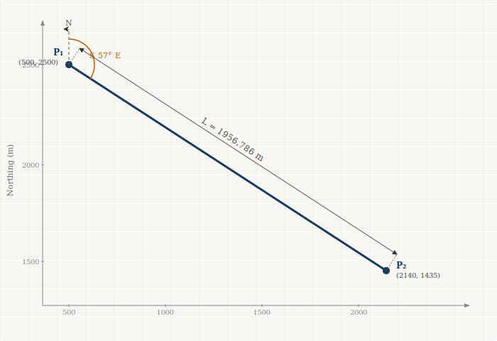
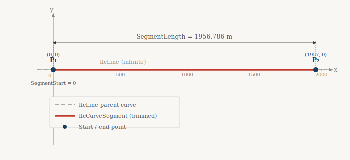
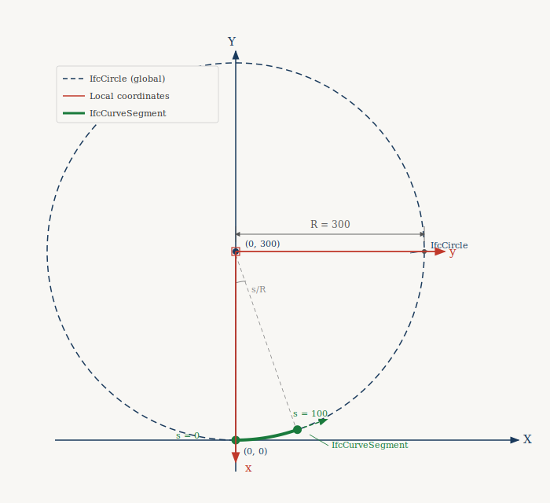
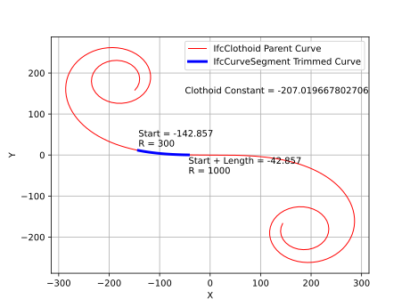
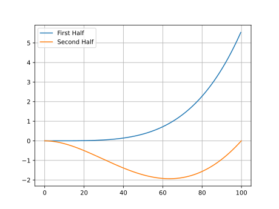
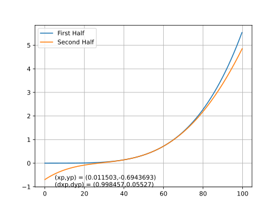
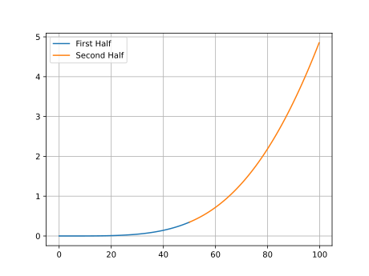

# Chapter 2 - Horizontal Alignments

## 2.0 Introduction

The geometric representation of a horizontal alignment is accomplished with an `IfcCompositeCurve`. The composite curve consists of a sequence of `IfcCurveSegment` entities whose geometry is defined by a parent curve. This section defines the mathematical relationships and equations for each parent curve type and the algorithm for evaluating points on those curves.

Table 2.0-1 maps each `IfcAlignmentHorizontalSegment.PredefinedType` to its corresponding parent curve type.

| Business Logic (`IfcAlignmentHorizontalSegment.PredefinedType`) | Geometric Representation (`IfcCurveSegment.ParentCurve`) |
|---|---|
| LINE | `IfcLine` |
| CIRCULARARC | `IfcCircle` |
| CLOTHOID | `IfcClothoid` |
| CUBIC | `IfcPolynomialCurve` |
| HELMERTCURVE | `IfcSecondOrderPolynomialSpiral` |
| BLOSSCURVE | `IfcThirdOrderPolynomialSpiral` |
| COSINECURVE | `IfcCosineSpiral` |
| SINECURVE | `IfcSineSpiral` |
| VIENNESEBEND | `IfcSeventhOrderPolynomialSpiral` |

*Table 2.0-1 — Mapping of business logic to geometric representation for horizontal alignment*

This chapter covers:

- The three-step evaluation algorithm for computing position and tangent direction at any point on a horizontal curve segment.
- Parametric equations and geometry mapping examples for all nine curve types in Table 2.0-1.
- The zero-length closing segment required at the end of every `IfcCompositeCurve`.

## 2.1 General

Each curve is parameterized by arc-length $s$, where $s = 0$ at the start of the parent curve. The start and end radii $R_s$ and $R_e$ are taken from `IfcAlignmentHorizontalSegment.StartRadius` and `EndRadius`; a value of zero indicates infinite radius (zero curvature, i.e. a straight line). The segment length $L$ is `IfcAlignmentHorizontalSegment.SegmentLength`. The tangent angle $\theta(s)$ is measured from the positive $x$-axis; its cosine and sine form the `RefDirection` of the curve at $s$.

The $x$ and $y$ coordinates of all horizontal parent curves are defined by the integrals:

$$x(s) = \int \cos\theta(s)\ ds \qquad y(s) = \int \sin\theta(s)\ ds$$

## 2.2 Curve Segment Evaluation Algorithm

This algorithm evaluates the 2D position and tangent direction of a point on an `IfcCurveSegment` in the alignment coordinate system. Let $s_0$ = `SegmentStart` and $s$ = the arc-length parameter of the point to evaluate, where $s_0 \leq s < s_0 + \texttt{SegmentLength}$.

**Step 1 — Form the curve segment placement matrix $M_{CSP}$**

$M_{CSP}$ places the trimmed segment into the alignment coordinate system. It is constructed directly from `IfcCurveSegment.Placement`, where $(x_p, y_p)$ is the `Location` and $\theta_p$ is the bearing of the `RefDirection`.

$$M_{CSP} = \begin{bmatrix} 
\cos\theta_p & -\sin\theta_p & 0 & x_p \\ 
\sin\theta_p & \cos\theta_p & 0 & y_p \\ 
0 & 0 & 1 & 0 \\ 
0 & 0 & 0 & 1 
\end{bmatrix}$$

**Step 2 — Evaluate the parent curve at the trim start and form the normalization matrix $M_N$**

Compute the position $(x_0, y_0)$ and tangent angle $\theta_0$ of the parent curve at $s_0$. This establishes the frame of the parent curve at the point where trimming begins.

$M_N$ simultaneously translates the trim-start point to the origin and rotates so that the tangent at $s_0$ aligns with the positive $x$-direction.

$$M_N = \begin{bmatrix}
\cos\theta_0 & \sin\theta_0 & 0 & -x_0\cos\theta_0 - y_0\sin\theta_0 \\
-\sin\theta_0 & \cos\theta_0 & 0 & x_0\sin\theta_0 - y_0\cos\theta_0 \\
0 & 0 & 1 & 0 \\
0 & 0 & 0 & 1
\end{bmatrix}$$

**Step 3 — Evaluate and map each point**

For the point at arc-length $s$, compute the parent curve position $(x(s), y(s))$ and tangent angle $\theta(s)$ and form:

$$M_{PC} = \begin{bmatrix} 
\cos(\theta(s)) & -\sin(\theta(s)) & 0 & x(s) \\
 \sin(\theta(s)) & \cos(\theta(s)) & 0 & y(s) \\ 
 0 & 0 & 1 & 0 \\ 
 0 & 0 & 0 & 1 
 \end{bmatrix}$$

Apply the normalization and placement in sequence:

$$M_h = M_{CSP} M_N M_{PC}$$

The position of the point in the alignment coordinate system is the fourth column of $M_h$, and its tangent direction is the first column. Numerical examples of this algorithm are given in Sections 2.3 through 2.11.

## 2.3 Line

A tangent run is geometrically represented with a segment trimmed from an `IfcLine` parent curve.

### 2.3.1 Parent Curve Parametric Equations

The curve tangent angle and curvature are given by the following equations

$$\theta(t) = \theta$$

$$\kappa(t) = 0$$

The point on line equation can be parameterized with a **unit parameterization** where the parameter $u$ ranges from $0$ to $1$ over the full extent of the curve, independent of its physical length.

$$\lambda(u) = C + L\left( \int_{0}^{u = 1}{\cos\left( \theta(t) \right)}dt\ x,\ \int_{0}^{u = 1}{\sin\left( \theta(t) \right)}dt\ y \right)$$

It can also be parameterized with an **arc length parameterization** where the parameter $u$ equals the distance along the line in units of length, so $u = s$.

$$\lambda(u) = C + \left( \int_{0}^{u = L}{\cos\left( \theta(t) \right)}dt\ x,\ \int_{0}^{u = L}{\sin\left( \theta(t) \right)}dt\ y \right)$$

Other parent curve types can also be parameterized by unit value or arc length. However, the polynomial spirals do not have a well defined unit value parameterization. For this reason, the IFC specification mandates that all parameterization for alignment geometry be by arc length. For 
`IfcCurveSegment`, the `SegmentStart` and `SegmentLength` attributes **must** 
be of type `IfcLengthMeasure`. See [Section 8.9.3.28 IfcCurveSegment](https://ifc43-docs.standards.buildingsmart.org/IFC/RELEASE/IFC4x3/HTML/lexical/IfcCurveSegment.htm), Informal Proposition 1.

This matters because `IfcCurveSegment.SegmentStart` and 
`IfcCurveSegment.SegmentLength` are of type `IfcCurveMeasureSelect`, which 
can be either `IfcParameterValue` (a dimensionless scalar based on unit value) or 
`IfcLengthMeasure` (a physical length). 

### 2.3.2 Semantic Definition to Geometry Mapping

Mapping of the semantic definition of the linear segment to the
geometric definition is described with the following example.

Given a horizontal alignment segment is a line segment starting at point
(500,2500), bearing in the direction S 57 E (5.70829654085293 radian) and has a length of 1956.785654. 

*Figure 2.3.2-1 Tangent segment*

This semantic definition of this segment is:

~~~
#31=IFCCARTESIANPOINT((500.,2500.));
#32=IFCALIGNMENTHORIZONTALSEGMENT($,$,#31,5.70829654085293,0.,0.,1956.785654,$,.LINE.);
~~~

The geometric representation is an `IfcLine`. The line can be defined in
different ways and is generally not important, as will be shown in the
example below. `IfcLine` is an infinitely long line that passes through a
specified point at some direction in the X-Y plane. A valid, but unnecessarily complex parent curve is shown in Figure 2.3.2-2. The `IfcLine` passes through point (1000,-800) and is directed at 135° from the x-axis. The `IfcCurveSegment` trim starts 10 m from (1000,-800) and the trimmed segment has a length of 1956.796 m.

*Figure 2.3.2-2 IfcLine at arbitrary placement*

Figure 2.3.2-2 represents a valid parent curve definition and implementations must be prepared to properly interpret this parent curve geometry. This guide defines general algorithms to accommodate this geometry.

In practice, it is far easier to define the parent curve passing through point (0,0) and in the direction of the X-axis. The trimming can begin at the origin as shown in Figure 2.3.2-3.

*Figure 2.3.2-3 IfcLine parent curve at origin*

The parent curve definition is:

~~~
#51=IFCCARTESIANPOINT((0.,0.));
#52=IFCDIRECTION((1.,0.));
#53=IFCVECTOR(#52,1.);
#54=IFCLINE(#51,#53);
~~~

`IfcCurveSegment` defines the portion of the line used and how it is
placed and oriented in the X-Y plane.

`IfcCurveSegment.SegmentStart` defines where the parent curve trimming
begins. It can be anywhere along the line. It is easiest to begin the
trimming at the origin but could be anywhere. The `SegmentStart` attribute
is 0.0 in this case.

`IfcCurveSegment.SegmentLength` defines where the parent curve trimming
ends relative to `SegmentStart`. This is the length of the curve we want
to trim. The `SegmentLength` attribute is 1956.785654 for this example.

The `SegmentStart` and `SegmentLength` attributes trims a portion of the
`IfcLine` parent curve, which is oriented in the direction (1,0) with
origin at (0,0). 

The trimmed portion of the curve needs to be placed and
oriented into the horizontal alignment. The tangent segment begins at (500,2500) and runs in the direction 5.70829654085293 radian.

From the segment direction, 

$$dy = \sin{(5.70829654085293)} = -0.54374144087698$$

$$dx = \cos{(5.70829654085293)} = 0.839252789970355$$

The segment placement is 
~~~
#31=IFCCARTESIANPOINT((500.,2500.));
#49=IFCDIRECTION((0.839252789970355,-0.54374144087698));
#50=IFCAXIS2PLACEMENT2D(#31,#49);
~~~

The `IfcCurveSegment` is defined as:

~~~
#55=IFCCURVESEGMENT(.CONTSAMEGRADIENT.,#50,IFCLENGTHMEASURE(0.),IFCLENGTHMEASURE(1956.785654),#54);
~~~

### 2.3.3 Compute Point on Curve

Compute the position matrix for a point 1500 m from the start of the
curve segment.

**Step 1 — Form the curve segment placement matrix $M_{CSP}$**

From the `IfcCurveSegment.Placement`:

$$x = 500, y = 2500$$

$$dx\  = 0.839252789970355,\ dy\  = -0.54374144087698$$

$$M_{CSP} = \begin{bmatrix}
0.839252789970355 & 0.54374144087698 & 0 & 500 \\
 -0.54374144087698 & 0.839252789970355 & 0 & 2500 \\
0 & 0 & 1 & 0 \\
0 & 0 & 0 & 1
\end{bmatrix}$$

**Step 2 — Evaluate the parent curve at the trim start and form the normalization matrix $M_N$**

Because the parent curve is located at (0,0) in the direction (1,0), $x_0 = 0, y_0 = 0, \theta_0 = 0$.

Since $x_0 = 0$, $y_0 = 0$, and $\theta_0 = 0$, $M_N = \begin{bmatrix}I\end{bmatrix}$.

**Step 3 — Evaluate and map each point**

Evaluate the parent curve at $u = 1500$

$$\lambda(u) = C + \left( \int_{0}^{u}{\cos\left( \theta(t) \right)}dt\ x,\ \int_{0}^{u}{\sin\left( \theta(t) \right)}dt\ y \right)$$

$$\theta(1500) = \arctan\left(\frac{0}{1}\right) = 0$$

$$x = 0 + \cos(0)\int_{0}^{1500}{dt} = 0 + 1(1500\ m - 0\ m) = 1500\ m$$

$$y = 0 + \sin(0)\int_{0}^{1500}{dt} = 0 + 0(1500\ m - 0\ m) = 0\ m$$

Though it is much easier to use the following calculation

$$x(u) = p_{x} + u(dx)$$

$$y(u) = p_{y} + u(dy)$$

$$x = 0 + 1(1500) = 1500$$

$$y = 0 - 0(1500) = 0$$

$$M_{PC} = \begin{bmatrix}
1 & 0 & 0 & 1500 \\
0 & 1 & 0 & 0\\
0 & 0 & 1 & 0\\
0 & 0 & 0 & 1
\end{bmatrix}$$

The resulting position matrix is

$$M_h = M_{CSP} M_N M_{PC}$$

$$M_h = \begin{bmatrix}
0.839252789970355 & 0.54374144087698 & 0 & 500 \\
 -0.54374144087698 & 0.839252789970355 & 0 & 2500 \\
0 & 0 & 1 & 0 \\
0 & 0 & 0 & 1
\end{bmatrix} 
\begin{bmatrix}
I
\end{bmatrix} 
\begin{bmatrix}
1 & 0 & 0 & 1500\\
0 & 1 & 0 & 0\\
0 & 0 & 1 & 0 \\
0 & 0 & 0 & 1
 \end{bmatrix}$$

$$M_{h} = \begin{bmatrix}
0.83925279 & 0.54374114 & 0 & 1758.879185 \\
 -0.54374114 & 0.83925279 & 0 & 1684.3878387 \\
0 & 0 & 1 & 0 \\
0 & 0 & 0 & 1
\end{bmatrix}$$

## 2.4 Circular Arc

Circular alignment curves are geometrically represented by an arc trimmed from an `IfcCircle` parent curve.

<!--
Source Model:
[GENERATED\_\_HorizontalAlignment_CircularArc_100.0_300_1000_1_Meter.ifc](https://github.com/bSI-RailwayRoom/IFC-Rail-Unit-Test-Reference-Code/blob/master/alignment_testset/IFC-WithGeneratedGeometry/GENERATED__HorizontalAlignment_CircularArc_100.0_300_1000_1_Meter.ifc)
-->

### 2.4.1 Parent Curve Parametric Equations

The curve tangent angle, curvature, and point on the curve are given by the following equations

$$\theta(s) = \frac{s}{R}$$

$$\kappa(s) = \frac{1}{R}$$

$$x(s) = \int{\cos\left( \theta(s) \right)ds} = R\sin\!\left(\theta(s)\right)$$

$$y(s) = \int{\sin\left( \theta(s) \right)ds} = R\!\left(1 - \cos\!\left(\theta(s)\right)\right)$$

### 2.4.2 Semantic Definition to Geometry Mapping

`IfcCircle` is defined by its center (`IfcCircle.Position`) and radius
(`IfcCircle.Radius`).

Consider a horizontal curve segment that starts at (0,0), has a radius
of 300 m, and an arc length of 100 m. The semantic definition is

~~~
#28 = IFCCARTESIANPOINT((0., 0.));
#29 = IFCALIGNMENTHORIZONTALSEGMENT($, $, #28, 0., 300., 300., 100., $, .CIRCULARARC.);
~~~

The parent curve can be defined as follows:

~~~
#45 = IFCCIRCLE(#46, 300.);
#46 = IFCAXIS2PLACEMENT2D(#47, #48);
#47 = IFCCARTESIANPOINT((0., 300.));
#48 = IFCDIRECTION((0., -1.));
~~~

This is a circle centered at point (0,300) with the local X-axis aligned
with the negative global Y-axis as shown in Figure 2.4.2-1.

*Figure 2.4.2-1 - Curve segment trimmed from an IfcCircle parent curve*

The parent curve is placed such that a trim starting at 0.0 is at
(0,0) and the tangent is in the direction (1,0).

The curve segment is defined by its placement at a segment trimmed from
the parent curve starting at 0.0 for a length of 100.0 along the curve.

~~~
#36 = IFCCURVESEGMENT(.CONTINUOUS., #42, IFCLENGTHMEASURE(0.),IFCLENGTHMEASURE(100.), #45);
#42 = IFCAXIS2PLACEMENT2D(#43, #44);
#43 = IFCCARTESIANPOINT((0., 0.));
#44 = IFCDIRECTION((1., 0.));
~~~

### 2.4.3 Compute Point on Curve

Compute the placement matrix for a point 50 m from the start of the
curve segment.

**Step 1 — Form the curve segment placement matrix $M_{CSP}$**

$M_{CSP} = \begin{bmatrix}I\end{bmatrix}$

**Step 2 — Evaluate the parent curve at the trim start and form the normalization matrix $M_N$**

The trim begins where the local x-axis of the circle intersects the circumference. The circle is centered at (0,300) with radius = 300 and the local x-axis is in the direction of the global y-axis. This puts the trim start point at $x_0 = 0, y_0 = 0$ and the tangent direction (1,0) with $\theta_0 = 0$

Since $x_0 = 0$, $y_0 = 0$, and $\theta_0 = 0$, $M_N = \begin{bmatrix}I\end{bmatrix}$.

**Step 3 — Evaluate and map each point**

Compute point on parent curve at $u = 50$

$$\theta(s) = \frac{s}{R} = \frac{50}{300} $$

$$d_x = \cos(\theta(s)) = \cos(\frac{50}{300}) = 0.98614323$$

$$d_y = \sin(\theta(s)) = \sin(\frac{50}{300}) = 0.16589613$$

$$x(s) = R\sin\!\left(\theta(s)\right) = 300\sin\!\left(\frac{50}{300}\right) = 49.76883981$$

$$y(s) = R\!\left(1 - \cos\!\left(\theta(s)\right)\right) = 300\!\left(1 - \cos\!\left(\frac{50}{300}\right)\right) = 4.1570305$$

$$M_{PC} = 
\begin{bmatrix}
0.98614323 & -0.16589613 & 0 & 49.76883981\\
0.16589613 & 0.98614323 & 0 & 4.1570305\\
0 & 0 & 1 & 0\\
0 & 0 & 0 & 1
\end{bmatrix}
$$

The resulting position matrix is

$$M_h = M_{CSP} M_N M_{PC}$$

$$M_h = \begin{bmatrix}
I
\end{bmatrix} 
\begin{bmatrix}
I
\end{bmatrix} 
\begin{bmatrix}
0.98614323 & -0.16589613 & 0 & 49.76883981\\
0.16589613 & 0.98614323 & 0 & 4.1570305\\
0 & 0 & 1 & 0\\
0 & 0 & 0 & 1
 \end{bmatrix}$$

$$M_{h} = \begin{bmatrix}
0.98614323 & -0.16589613 & 0 & 49.76883981\\
0.16589613 & 0.98614323 & 0 & 4.1570305\\
0 & 0 & 1 & 0\\
0 & 0 & 0 & 1
\end{bmatrix}$$

## 2.5 Clothoid

Spiral transition curves are geometrically represented by a segment trimmed from one of the many spiral types in IFC. `IfcClothoid` geometry is used for clothoid curves.

<!--
Source Model:
[GENERATED\_\_HorizontalAlignment_Clothoid_100.0_300_1000_1_Meter.ifc](https://github.com/bSI-RailwayRoom/IFC-Rail-Unit-Test-Reference-Code/blob/master/alignment_testset/IFC-WithGeneratedGeometry/GENERATED__HorizontalAlignment_Clothoid_100.0_300_1000_1_Meter.ifc)
-->

### 2.5.1 Parent Curve Parametric Equations

The curve tangent angle, curvature, and point on the curve are given by the following equations

$$\theta(s) = \frac{\pi}{2}\frac{A}{|A|}s^{2}$$

$$\kappa(s) = \frac{A}{\left| A^{3} \right|}s$$

$$x(u) = A\sqrt{\pi}\int_{0}^{u}{\cos{\left( \frac{\pi}{2}\frac{A}{|A|}t^{2} \right)\ }dt}$$

$$y(u) = A\sqrt{\pi}\int_{0}^{u}{\sin{\left( \frac{\pi}{2}\frac{A}{|A|}t^{2} \right)\ }dt}$$

IFC provides a unit parametrization of clothoid curve.

$$u = \frac{s}{\left| A\sqrt{\pi} \right|}$$
with
$-\infty < u < \infty$. When $\theta = \pi/2$, $u = 1.0$.

Care must be taken when evaluating clothoids because `IfcCurveSegment.SegmentStart` and `IfcCurveSegment.SegmentLength` are defined with arc length. The details are illustrated in the example calculations.

### 2.5.2 Semantic Definition to Geometry Mapping

Consider a horizontal clothoid segment that starts at (0,0) with a start
direction of (1.0,0.0). The radii at the start and end of the segment
are 300 and 1000, respectively. The arc length of the segment is 100.
The semantic definition is

~~~
#28 = IFCCARTESIANPOINT((0., 0.));
#29 = IFCALIGNMENTHORIZONTALSEGMENT($, $, #28, 0., 300., 1000., 100., $, .CLOTHOID.);
~~~

From the semantic definition, compute the clothoid constant, $A$

$$R_{s} = 300,\ R_{e} = 1000,\ L = 100$$

$$f = \frac{L}{R_{e}} - \frac{L}{R_{s}}= \frac{100}{1000} - \frac{100}{300} = -0.23333$$

$$A = \frac{L}{\sqrt{|f|}}\frac{f}{|f|} = \frac{100}{\sqrt{| -0.23333|}}\frac{-0.23333}{| -0.23333|} = -207.0196678$$

Place the parent curve at (0,0) with a tangent direction of (1,0)

~~~
#45 = IFCCLOTHOID(#46, -207.019667802706);
#46 = IFCAXIS2PLACEMENT2D(#47, $);
#47 = IFCCARTESIANPOINT((0., 0.));
~~~

The curve segment starts where the radius is 300. A positive radius indicates a counter-clockwise curve which is a curve towards the left. The distance from the
origin where this radius occurs can be computed from the curvature
equation. The curvature at the start is 1/300 and the clothoid constant
is -207.0196678. Solve for distance from origin.

$$\kappa(s) = \frac{A}{\left| A^{3} \right|}s$$

$$\frac{1}{300} = \frac{- 207.0196678}{\left| - {207.0196678}^{3} \right|}s$$

$$s = -142.8571429$$

Figure 2.5.2-1 shows the parent curve clothoid with the segment having $\kappa_s = \frac{1}{300}$ and $\kappa_e = \frac{1}{1000}$ highlighted. This is the segment that `IfcCurveSegment` must trim from the parent curve. The negative clothoid constant results in the parent curve in quadrants 2 and 4. The curvature is positive in quadrant 2. For this reason, the `SegmentStart` attribute is negative. From ths starting point, the trimming progresses to a larger radius, which is towards the origin. For this reason `SegmentLength` is a positive value. If the trimming were to progress to a smaller radius, `SegmentLength` would be a negative value. The `SegmentStart` and `SegmentLength` attributes can be positive and negative values in any combination. This is true for all parent curve types.

*Figure 2.5.2-1 - `IfcCurveSegment` trimmed from an `IfcClothoid` parent curve*

Place the curve segment at (0,0) with the tangent in the direction
(1,0).

~~~
#42 = IFCAXIS2PLACEMENT2D(#43, #44);
#43 = IFCCARTESIANPOINT((0., 0.));
#44 = IFCDIRECTION((1., 0.));
~~~

Define the curve segment

~~~
#36 = IFCCURVESEGMENT(.CONTINUOUS., #42, IFCLENGTHMEASURE(-142.857142857143), IFCLENGTHMEASURE(100.), #45);
~~~

### 2.5.3 Compute Point on Curve

Compute the placement matrix for a point 50 m from the start of the
curve segment.

**Step 1 — Form the curve segment placement matrix $M_{CSP}$**

Represent `IfcCurveSegment.Placement` in matrix form. In this example, the
placement is at (0,0) with RefDirection (1,0) which results in an
identity matrix. This is not true in all cases.

$$M_{CSP} = \begin{bmatrix}I\end{bmatrix}$$

**Step 2 — Evaluate the parent curve at the trim start and form the normalization matrix $M_N$**

Start by computing the point and curve tangent at the start of the parent curve trim.

Recall that the clothoid equations are in terms of a unit parameterization. Compute the parametric position on the curve.

$$u = \frac{-142.8571428}{\left| - 207.0196678\sqrt{\pi} \right|} = -0.3893278$$

Compute the point on curve tangent direction

$$\theta_0(-0.3893278) = \frac{\pi}{2}\frac{-207.0196678}{|-207.0196678|}(-0.3893278)^{2} = -0.238095237$$

and compute the point on the curve

$$x_0(-0.3893278) = - 207.0196678\sqrt{\pi}\int_{0}^{-0.3893278}{\cos{\left( \frac{\pi}{2}\frac{-207.0196678}{| - 207.0196678|}t^{2} \right)\ }dt} = -142.04941746210602\ m$$

$$y_0(-0.3893278) = -207.0196678\sqrt{\pi}\int_{0}^{-0.3893278}{\sin{\left( \frac{\pi}{2}\frac{-207.0196678}{| - 207.0196678|}t^{2} \right)\ }dt} = 11.292042785713347\ m$$

$$\cos(-0.238095237) = 0.971788979$$

$$\sin(-0.238095237) = -0.235852028$$

$$-(-142.04941746210602\ m) \cos(-0.238095237) - (11.292042785713347\ m) \sin(-0.238095237) = 140.705309648\ m$$

$$(-142.04941746210602\ m) \sin(-0.238095237) - (11.292042785713347\ m) \cos(-0.238095237) = 22.529160405\ m?$$

$$M_N = \begin{bmatrix}
\cos\theta_0 & \sin\theta_0 & 0 & -x_0\cos\theta_0 - y_0\sin\theta_0 \\
-\sin\theta_0 & \cos\theta_0 & 0 & x_0\sin\theta_0 - y_0\cos\theta_0 \\
0 & 0 & 1 & 0 \\
0 & 0 & 0 & 1
\end{bmatrix}
= \begin{bmatrix}
0.971788979 & -0.235852028 & 0 & 140.705309648 \\
0.235852028 & 0.971788979 & 0 & 22.529160405 \\
0 & 0 & 1 & 0 \\
0 & 0 & 0 & 1
\end{bmatrix}$$

**Step 3 — Evaluate and map each point**

Compute point and curve tangent at 50 m from the start,

$$ s = -142.8571428 + 50 = -92.8571428$$

$$u = \frac{-92.8571428}{\left|-207.0196678\sqrt{\pi} \right|} = -0.25306307$$

$$x(-0.25306307) = -207.0196678\sqrt{\pi}\int_{0}^{-0.25306307}{\cos{\left( \frac{\pi}{2}\frac{-207.0196678}{|-207.0196678|}s^{2} \right)\ }ds} = - 92.763220844871512$$

$$y(-0.25306307) = -207.0196678\sqrt{\pi}\int_{0}^{-0.25306307}{\sin{\left( \frac{\pi}{2}\frac{-207.0196678}{|-207.0196678|}s^{2} \right)\ }ds} = 3.1114126254443812$$

$$\theta(-0.25306307) = \frac{\pi}{2}\frac{-207.0196678}{|-207.0196678|}(-0.25306307)^{2} = -0.100595238$$

$$dx = \cos(-0.100595238) = 0.994944564$$

$$dy = \sin{(-0.100595238) = -0.100425663}$$

In matrix form

$$M_{PC} = \begin{bmatrix}
0.994944564 & 0.100425663 & 0 & -92.763220844871512 \\
 -0.100425663 & 0.994944564 & 0 & 3.1114126254443812 \\
0 & 0 & 1 & 0 \\
0 & 0 & 0 & 1
\end{bmatrix}$$

Apply the normalization and curve segment placement to the parent curve point

$$M_{h} = M_{CSP} M_N M_{PC} = \begin{bmatrix}I\end{bmatrix}
\begin{bmatrix}
0.971788979 & -0.235852028 & 0 & 140.705309648 \\
0.235852028 & 0.971788979 & 0 & 22.529160405 \\
0 & 0 & 1 & 0 \\
0 & 0 & 0 & 1
\end{bmatrix}
\begin{bmatrix}
0.994944564 & 0.100425663 & 0 & -92.763220844871512 \\
-0.100425663 & 0.994944564 & 0 & 3.1114126254443812 \\
0 & 0 & 1 & 0 \\
0 & 0 & 0 & 1
\end{bmatrix}$$

$$M_{h} = \begin{bmatrix}
0.99056175921247780 & -0.13706714116038599 & 0 & 49.825200930152405 \\
0.13706714116038599 & 0.99056175921247780 & 0 & 3.6744032279728032 \\
0 & 0 & 1 & 0 \\
0 & 0 & 0 & 1
\end{bmatrix}$$

## 2.6 Cubic Transition Curve

`IfcPolynomialCurve` is the geometric type for cubic transition spirals.

<!--
Source Model:
[GENERATED\_\_HorizontalAlignment_Cubic_100.0_inf_300_1_Meter.ifc](https://github.com/bSI-RailwayRoom/IFC-Rail-Unit-Test-Reference-Code/blob/master/alignment_testset/IFC-WithGeneratedGeometry/GENERATED__HorizontalAlignment_Cubic_100.0_inf_300_1_Meter.ifc)
-->

### 2.6.1 Parent Curve Parametric Equations

The approach for calculating the coordinates of a horizontal cubic curve
is unique compared to the other curve types. For a horizontal alignment,
the coordinate point and curve tangent angle is generally defined by
parametric equations where the parameter is the distance along the
curve. A cubic curve is represented with the `IfcPolynomialCurve` parent
curve type. When `IfcPolynomialCurve` is used as a cubic transition curve,
the $x$ coefficients are \[0,1\] and the $y$ coefficients are
\[0,0,0, $A_{3}$\] resulting in a function of the form
$y(x) = A_{3}x^{3}$. See [4.2.2.1.5 Cubic Transition Segment](https://ifc43-docs.standards.buildingsmart.org/IFC/RELEASE/IFC4x3/HTML/concepts/Partial_Templates/Geometry/Curve_Segment_Geometry/Cubic_Transition_Segment/content.html).

The distance along a curve is defined by

$$d = \int_{}^{}{\sqrt{\left( y'(x) \right)^{2} + 1}\ dx}$$

$$y'(x) = 3A_{3}x^{2}$$

$$d = \int_{}^{}{\sqrt{9A_{3}^{2}x^{4} + 1}\ dx}$$

This equation is solved for $x$ and then $y$ can be computed. This can
be accomplished with numerical methods.

1.  For a distance $u$ along the curve, find $x$ for $d - u = 0$, within a tolerance consistent with the modeled elements. See [Chapter 11](11_Precision_and_Tolerance.md) for a discussion on tolerances.

2.  Compute $y(x) = A_{3}x^{3}$

3.  Compute curve tangent slope as $\frac{dy}{dx} = 3A_{3}x^{2}$

### 2.6.2 Semantic Definition to Geometry Mapping

Consider a horizontal cubic transition curve segment that starts at
(0,0) with a start direction of 0.0. The radius at the start is infinite
and the radius at the end is 300. The arc length of the segment is 100.
The semantic definition is
~~~
#28 = IFCCARTESIANPOINT((0., 0.));
#29 = IFCALIGNMENTHORIZONTALSEGMENT($, $, #28, 0., 0., 300., 100., $,.CUBIC.);
~~~

Compute the polynomial curve coefficients

$$A_{0} = A_{1} = A_{2} = 0$$

$$A_{3} = \frac{1}{6R_{e}L} - \frac{1}{6R_{s}L} = \frac{1}{6(300\ m)(100\ m)} - \frac{1}{6(\infty)(100\ m)} = 5.55555 \cdot 10^{- 6}\ m^{- 2}$$

The geometric representation is

~~~
#36 = IFCCURVESEGMENT(.CONTINUOUS., #42, IFCLENGTHMEASURE(0.), IFCLENGTHMEASURE(100.), #45);
#42 = IFCAXIS2PLACEMENT2D(#43, #44);
#43 = IFCCARTESIANPOINT((0., 0.));
#44 = IFCDIRECTION((1., 0.));
#45 = IFCPOLYNOMIALCURVE(#46, (0., 1.), (0., 0., 0., 5.55555555555556E-6), $);
#46 = IFCAXIS2PLACEMENT2D(#47, $);
#47 = IFCCARTESIANPOINT((0., 0.));
~~~

> **Warning:** There is a flaw in the IFC Specification. [IfcAlignmentHorizontalSegment](https://ifc43-docs.standards.buildingsmart.org/IFC/RELEASE/IFC4x3/HTML/lexical/IfcAlignmentHorizontalSegmentTypeEnum.htm) indicates the cubic formula is $y=\frac{x^3}{6RL}$ which means the `IfcPolynomialCurve.CoefficentY[3]` attribute must have unit of $Length^{-2}$. This is a direct contradiction to [IfcPolynomialCurve](https://ifc43-docs.standards.buildingsmart.org/IFC/RELEASE/IFC4x3/HTML/lexical/IfcPolynomialCurve.htm) which clearly states the coefficients are real values (i.e. scalar values) with `IfcReal`.
>
> Why is this a problem? The calculation of a point on the polynomial curve is different depending on how the coefficients are defined.
>
> The parametric form of the polynomial curve is $\lambda(u) = ( x(u), y(u), z(u) )$. The polynomial curve represents real geometry so the resulting values, $x$, $y$, and $z$ must have units of $Length$.
>
> When $u$ is parametrized as a Length measure, as required by [IfcCurveSegment](https://ifc43-docs.standards.buildingsmart.org/IFC/RELEASE/IFC4x3/HTML/lexical/IfcCurveSegment.htm), the parametric terms of the polynomial equation are:
>
> $x(u) = \sum\limits_{i=0}^{l} a_i u^i $
>
> $y(u) = \sum\limits_{j=0}^{m} b_j u^j $
>
> $z(u) = \sum\limits_{k=0}^{n} c_k u^k $
>
> For $x$, $y$, and $z$ to have values in $Length$ measure, the implicit unit of measure of the coefficients must be:
>
> $Length^{(1-i)}$ for $a_i$
>
> $Length^{(1-j)}$ for $b_j$
>
> $Length^{(1-k)}$ for $c_k$
>
> When $u$ is parametrized as a scalar, as required by [IfcPolynomialCurve](https://ifc43-docs.standards.buildingsmart.org/IFC/RELEASE/IFC4x3/HTML/lexical/IfcPolynomialCurve.htm), the parametric terms of the polynomial equation are:
>
> $x(u) = L\sum\limits_{i=0}^{l} a_i u^i $
>
> $y(u) = L\sum\limits_{j=0}^{m} b_j u^j $
>
> $z(u) = L\sum\limits_{k=0}^{n} c_k u^k $
>
> The parameter $u$ and the coefficients are scalar so they must be multiplied with the curve length $L$ to result in values of Length.
>
> **The equations for $x$, $y$, and $z$ differ depending on the parameterization.**
>
> Concept Template [4.2.2.1.5 Cubic Transition Segment](https://ifc43-docs.standards.buildingsmart.org/IFC/RELEASE/IFC4x3/HTML/concepts/Partial_Templates/Geometry/Curve_Segment_Geometry/Cubic_Transition_Segment/content.html) and [IfcAlignmentHorizontalSegment](https://ifc43-docs.standards.buildingsmart.org/IFC/RELEASE/IFC4x3/HTML/lexical/IfcAlignmentHorizontalSegmentTypeEnum.htm) provide clear direction (not withstanding typographical errors) that `IfcPolynomialCurve` is to be evaluated as $y = CoefficientsY[3]x^3$ which dictates that $CoefficientsY[3]$ must be in units of $Length^{-2}$ and must be encoded in the `IfcPolynomialCurve.CoefficientY` attribute as an `IfcReal`.
>
> An official [Implementation Agreement](https://standards.buildingsmart.org/documents/Implementation/IFC_Implementation_Agreements/) does not appear to exist; however, this interpretation is consistent with discussions on [GitHub](https://github.com/buildingSMART/IFC4.x-IF/issues/169).

### 2.6.3 Compute Point on Curve

Compute the curve coordinates at a distance along the curve, $u = 100$

**Step 1 — Form the curve segment placement matrix $M_{CSP}$**

Represent `IfcCurveSegment.Placement` in matrix form. In this example, the
placement is at (0,0) with RefDirection (1,0) which results in an
identity matrix.

$$M_{CSP} = \begin{bmatrix}I\end{bmatrix}$$

**Step 2 — Evaluate the parent curve at the trim start and form the normalization matrix $M_N$**

Because the parent curve is located at (0,0) in the direction (1,0), $x_0 = 0, y_0 = 0, \theta_0=0$.

Since $x_0 = 0$, $y_0 = 0$, and $\theta_0 = 0$, $M_N = \begin{bmatrix}I\end{bmatrix}$.

**Step 3 — Evaluate and map each point**

Compute point and curve tangent at 100 m from the start.

From the `IfcPolynomialCurve` definition, 

X Coefficients = ($0 m^1$, $1 m^0$)

Y Coefficients = ($0 m^1$, $0 m^{0}$, $0 m^{-1}$, $5.55555 \cdot 10^{-6} m^{-2}$)

$$y(x) = \left( 5.55555 \cdot 10^{-6} m^{-2}\right)x^{3}$$

Find $x$ such that

$$|d - u| = \left| \int_{0}^{x}\left(\sqrt{\left( y'(x) \right)^{2} + 1}\right) dx - u \right| < 10^{-4} \approx 0$$

$$y'(x) = 3\left( 5.55555 \cdot 10^{-6} m^{-2}\right)x^{2}$$

Solve numerically

$$x = 99.72593255 m$$

Check solution

$$d = \int_{0}^{99.72593255\ m}\sqrt{\left( 3 \cdot (5.55555 \cdot 10^{-6} m^{-2})(x\ m)^{2} \right)^{2} + 1}dx = 100\ m$$

Compute y

$$y(x) = (5.55555 \cdot 10^{-6} m^{-2}{)(99.72593255\ m)}^{3} = 5.5100\ m$$

The tangent vector at $u = 100\ m$ along the curve is

$$y'(99.72593255\ m) = 3\left( 5.55555 \cdot 10^{-6} m^{-2}\right)(99.72593255\ m)^{2} = 0.165753$$

Normalizing the tangent vector

$$dx = \frac{1}{\sqrt{1^{2} + {0.615753}^{2}}} = 0.986539$$

$$dy = \frac{0.165753}{\sqrt{1^{2} + {0.615753}^{2}}} = 0.1635219$$

The resulting matrix is

$$M_{PC} = \begin{bmatrix}
0.986539 & -0.1635219 & 0 & 99.72593255 \\
0.1635219 & 0.986539 & 0 & 5.5100 \\
0 & 0 & 1 & 0 \\
0 & 0 & 0 & 1
\end{bmatrix}$$

Apply the normalization and curve segment placement to the parent curve point

$$M_{h} = M_{CSP}\ M_N\ M_{PC} = \begin{bmatrix}I\end{bmatrix} \, \begin{bmatrix}I\end{bmatrix}  
\begin{bmatrix}
0.986539 & -0.1635219 & 0 & 99.72593255 \\
0.1635219 & 0.986539 & 0 & 5.5100 \\
0 & 0 & 1 & 0 \\
0 & 0 & 0 & 1
\end{bmatrix}$$
$$M_{h} = 
\begin{bmatrix}
0.986539 & -0.1635219 & 0 & 99.72593255 \\ 
0.1635219 & 0.986539 & 0 & 5.5100 \\  
0 & 0 & 1 & 0 \\
0 & 0 & 0 & 1
\end{bmatrix}
$$

## 2.7 Helmert Transition Curve

The Helmert curve is unique in that it is semantically defined as a single layout segment (`IfcAlignmentHorizontalSegment`) but geometrically defined with two curve segments (`IfcCurveSegment`), each representing half of the transition curve. The parent curve for a helmert transition curve is `IfcSecondOrderPolynomialSpiral`.

<!--
Source Model:
[GENERATED\_\_HorizontalAlignment_HelmertCurve_100.0_inf_300_1_Meter.ifc](https://github.com/bSI-RailwayRoom/IFC-Rail-Unit-Test-Reference-Code/blob/master/alignment_testset/IFC-WithGeneratedGeometry/GENERATED__HorizontalAlignment_HelmertCurve_100.0_inf_300_1_Meter.ifc)
-->

### 2.7.1 Parent Curve Parametric Equations

The curve tangent angle and curvature are given by the following equations

$$\theta(t) = \frac{t^{3}}{3A_{2}^{3}} + \frac{A_{1}}{2\left| A_{1}^{3} \right|}t^{2} + \frac{t}{A_{0}}$$

$$\kappa(t) = \frac{1}{A_{2}^{3}}t^{2} + \frac{A_{1}}{\left| A_{1}^{3} \right|}t + \frac{1}{A_{0}}$$

The polynomial coefficients carry a second subscript to indicate first half, $1$, and second half, $2$. For example, $A_{21}$ is coefficient $A_2$ for the first half and $A_{02}$ is coefficient $A_0$ for the second half. 

First Half

$$a_{01} = \frac{L}{R_{s}},\ A_{01} = \frac{L}{\left| a_{0} \right|}\ \frac{a_{0}}{\left| a_{0} \right|}$$

$$a_{11} = 0,\ A_{11} = 0$$

$$a_{21} = 2f,\ A_{21} = \frac{L}{\sqrt[3]{\left| a_{2} \right|}}\ \frac{a_{2}}{\left| a_{2} \right|}$$

Second Half

$$a_{02} = -f + \frac{L}{R_{s}},\ A_{02} = \frac{L}{\left| a_{0} \right|}\ \frac{a_{0}}{\left| a_{0} \right|}$$

$$a_{12} = 4f,\ A_{12} = \frac{L}{\sqrt{\left| a_{1} \right|}}\ \frac{a_{1}}{\left| a_{1} \right|}$$

$$a_{22} = -2f,\ A_{22} = \frac{L}{\sqrt[3]{\left| a_{2} \right|}}\ \frac{a_{2}}{\left| a_{2} \right|}$$

### 2.7.2 Semantic Definition to Geometry Mapping

Consider a horizontal Helmert transition curve segment that starts at
(0,0) with a start direction of (1,0). The radius at the start is infinite
and the radius at the end is 300. The arc length of the segment is 100.
The semantic definition is

~~~
#28 = IFCCARTESIANPOINT((0., 0.));
#29 = IFCALIGNMENTHORIZONTALSEGMENT($, $, #28, 0., 0., 300., 100., $, .HELMERTCURVE.);
~~~

Compute the curve parameters

$$L = 100\ m$$

$$R_{s} = \infty$$

$$R_{e} = 300\ m$$

$$f = \frac{L}{R_{e}} - \frac{L}{R_{s}} = \frac{100}{300} - \frac{100}{\infty} = 0.33333$$

First Half

$$a_{01} = \frac{100}{\infty} = 0,\ A_{0} = 0$$

$$a_{00} = 0,\ A_{11} = 0$$

$$a_{21} = 2(0.33333) = 0.66667,\ A_{2} = \frac{100\ m}{\sqrt[3]{|0.66667|}}\frac{0.66667}{|0.66667|} = 114.4714255\ m$$

The geometric representation of the first half is

~~~
#36 = IFCCURVESEGMENT(.CONTSAMEGRADIENTSAMECURVATURE., #42, IFCLENGTHMEASURE(0.), IFCLENGTHMEASURE(50.), #45);
#37 = IFCLOCALPLACEMENT($, #38);
#38 = IFCAXIS2PLACEMENT3D(#39, $, $);
#39 = IFCCARTESIANPOINT((0., 0., 0.));
#42 = IFCAXIS2PLACEMENT2D(#43, #44);
#43 = IFCCARTESIANPOINT((0., 0.));
#44 = IFCDIRECTION((1., 0.));
#45 = IFCSECONDORDERPOLYNOMIALSPIRAL(#46, 114.471424255333, $, $);
#46 = IFCAXIS2PLACEMENT2D(#47, $);
#47 = IFCCARTESIANPOINT((0., 0.));
~~~
 
 > Note: when a polynomial coefficient is zero, the correspond term is unused and coded as `$` in the IFC entity

Second Half

$$a_{02} = -0.33333 + \frac{100}{\infty} = -0.33333,\ A_{0} = \frac{100\ m}{| -0.33333|}\frac{-0.33333}{|-0.33333|} = - 300\ m$$

$$a_{12} = 4(0.33333) = 1.33333,\ A_{1} = \frac{100\ m}{\sqrt{|1.33333|}}\frac{1.33333}{|1.33333|} = 86.602540378\ m$$

$$a_{22} = -2(0.33333) = -0.66667,\  A_{2} = \frac{100\ m}{\sqrt[3]{| -0.66667|}}\frac{-0.66667}{|-0.66667|} = -114.4714255\ m$$

Figure 2.7.2-1 shows the first and second half parent curves, without any adjustments.

*Figure 2.7.2-1 First and second half of parent curves, without placement adjustments*

#### Two-level placement for the second half

`IfcCurveSegment` evaluation normalizes the parent curve at `SegmentStart`, then applies the curve segment `Placement`. For the second half, `SegmentStart = L/2`, so the second half parent curve's value at $t = L/2$ is the normalization origin. The second half parent curve's own `Position` attribute is therefore set so that the point at $L/2$ exactly matches the endpoint of the first half.

With this alignment the normalization cancels the offset, and the curve segment `Placement` supplies only the world-space join position.

| Level | Attribute | Purpose |
|---|---|---|
| `IfcSecondOrderPolynomialSpiral.Position` | $(x_p,\ y_p,\ \theta_p)$ | Shift/rotate the raw spiral so its value at $t = L/2$ equals $(x_1, y_1, \theta_1)$ |
| `IfcCurveSegment.Placement` | World-space join point | Place the normalized second-half curve at the correct position in the composite curve |

*Table 2.7.2-1 — Two-level placement for the second Helmert half*

**Finding the parent curve Position**

Evaluate the raw second half spiral (with `Position` at origin) at $t = L/2$ to obtain $(x_2, y_2, \theta_2)$. The rigid-body transform that maps this to $(x_1, y_1, \theta_1)$ is

$$\theta_{p} = \theta_{1} - \theta_{2} = 0.0277777777 - (-0.0277777777) = 0.05555555$$

$$x_{p} = x_{1} - x_{2}\cos\theta_{p} + y_{2}\sin\theta_{p} = 49.9972 - 49.9664\cos(0.0555555) - 1.73556\sin(0.0555555) = 0.011503\ m$$

$$y_{p} = y_{1} - x_{2}\sin\theta_{p} - y_{2}\cos\theta_{p} = 0.347204 - 49.9664\sin(0.055555) + 1.73556\cos(0.0555555) = -0.6943693\ m$$

$$dx_p = \cos(\theta_p) = \cos(0.055555555) = 0.998457$$

$$dy_p = \sin(\theta_p) = \sin(0.055555555) = 0.055527$$

Figure 2.7.2-2 shows the same first and second half parent curves, with the origin of the second half curve translated $(x_p,y_p)$ and rotated so that the curve tangent is $(dx_p,dy_p)$

*Figure 2.7.2-2 - First and second half parent curves with second half curve positioned*

**Finding the curve segment Placement**

The `Placement` is the world-space position and direction at the join point, obtained by rotating $(x_1, y_1)$ by the overall segment start direction $\theta_s$ and translating by the start point $(x_s, y_s)$:

$$x_{join} = x_s + x_1\cos\theta_s - y_1\sin\theta_s$$

$$y_{join} = y_s + x_1\sin\theta_s + y_1\cos\theta_s$$

$$\theta_{join} = \theta_s + \theta_1$$

For the example with $\theta_s = 0$:

$$x_{join} = 0.0 + 49.99724\cos(0.0) - 0.347204\sin(0.0) = 49.99724\ \text{m}$$

$$y_{join} = 0.0 + 49.99724\sin(0.0) + 0.347204\cos(0.0) = 0.347204\ \text{m}$$

$$\theta_{join} = 0.0 + 0.02777777 = 0.02777777\ \text{rad}$$

The `RefDirection` of the curve segment `Placement` is $(\cos\theta_{join},\, \sin\theta_{join})$:

$$\cos\theta_{join} = \cos(0.02777777) = 0.999614$$

$$\sin\theta_{join} = \sin(0.02777777) = 0.027774$$

The geometric representation of the second half

~~~
#48 = IFCCURVESEGMENT(.CONTINUOUS., #49, IFCLENGTHMEASURE(50.), IFCLENGTHMEASURE(50.), #52);
#49 = IFCAXIS2PLACEMENT2D(#50, #51);
#50 = IFCCARTESIANPOINT((49.9972443634885, 0.347204361427475));
#51 = IFCDIRECTION((0.999614222337484, 0.0277742056705088));
#52 = IFCSECONDORDERPOLYNOMIALSPIRAL(#53, -114.471424255333, 86.6025403784439, -300.);
#53 = IFCAXIS2PLACEMENT2D(#54, #55);
#54 = IFCCARTESIANPOINT((0.0115725277555399, -0.694297741112199));
#55 = IFCDIRECTION((0.998457186998745, 0.0555269820047339));
~~~

Figure 2.7.2-3 shows the trimmed and positioned first and second half parent curves resulting in the full Helmert transition curve.

*Figure 2.7.2-3 - Final Helmert transition curve*

### 2.7.3 Compute Point on Curve

Compute the curve coordinates at a distance along the curve, $u = 100$ (the end of the full Helmert segment).

The point falls in the second half ($50 < u \leq 100$). The parent curve parameter is $t = \text{SegmentStart} + (u - 50) = 50 + 50 = 100$.

**Step 1 — Form the curve segment placement matrix $M_{CSP}$**

The curve segment `Placement` for the second half is at $(x_{join}, y_{join}) = (49.9972,\ 0.347204)$ with direction $\theta_{join} = 0.027778\ \text{rad}$:

$$M_{CSP} = \begin{bmatrix}
0.999614 & -0.027774 & 0 & 49.9972\\
0.027774 & 0.999614 & 0 & 0.347204\\
0 & 0 & 1 & 0\\
0 & 0 & 0 & 1
\end{bmatrix}$$

**Step 2 — Evaluate the second half parent curve at SegmentStart and form the normalization matrix $M_N$**

The second half parent curve has `Position` at $(x_p, y_p) = (0.011503,\ -0.694370)$ with direction $\theta_p = 0.055556\ \text{rad}$. This was chosen so that the parent curve at $t = L/2 = 50$ yields $(x_1, y_1, \theta_1) = (49.9972,\ 0.347204,\ 0.027778)$ — the endpoint of the first half.

$M_N$ maps $(x_1, y_1, \theta_1)$ to the origin with the $x$-axis tangent direction:

$$M_N = \begin{bmatrix}
\cos\theta_1 & \sin\theta_1 & 0 & -x_1\cos\theta_1 - y_1\sin\theta_1\\
-\sin\theta_1 & \cos\theta_1 & 0 & x_1\sin\theta_1 - y_1\cos\theta_1\\
0 & 0 & 1 & 0\\
0 & 0 & 0 & 1
\end{bmatrix}$$

$$M_N = \begin{bmatrix}
0.999614 & 0.027774 & 0 & -50.0\\
-0.027774 & 0.999614 & 0 & 0\\
0 & 0 & 1 & 0\\
0 & 0 & 0 & 1
\end{bmatrix}$$

**Step 3 — Evaluate and map each point**

Evaluate the second half parent curve at $t = 100$. The raw spiral (before applying `Position`) uses $(A_{0,2},\ A_{1,2},\ A_{2,2}) = (-300,\ 86.6025,\ -114.4714)$:

$$\theta_{raw}(t) = \frac{t^3}{3(-114.4714)^3} + \frac{86.6025}{2\left|86.6025^3\right|}t^2 + \frac{t}{-300}$$

$$\theta_{raw}(100) = -0.22222 + 0.66666 - 0.33333 = 0.11111\ \text{rad}$$

$$x_{raw} = \int_0^{100}\cos\theta_{raw}(t)\,dt = 99.8942272\ \text{m}$$

$$y_{raw} = \int_0^{100}\sin\theta_{raw}(t)\,dt = -0.00146765266\ \text{m}$$

Apply the parent curve `Position` $(x_p, y_p, \theta_p)$:

$$x_{pos} = x_p + x_{raw}\cos\theta_p - y_{raw}\sin\theta_p = 0.011503 + 99.8942272(0.998457) - (-0.00146765266)(0.055527) = 99.7517\ \text{m}$$

$$y_{pos} = y_p + x_{raw}\sin\theta_p + y_{raw}\cos\theta_p = -0.694370 + 99.8942272(0.055527) + (-0.00146765266)(0.998457) = 4.8510\ \text{m}$$

$$\theta_{pos}(100) = \theta_p + \theta_{raw}(100) = 0.055556 + 0.11111 = 0.16\overline{6}\ \text{rad}$$

Note: $\theta_{pos}(100) = \frac{1}{6} = \frac{L}{2R_e} = \frac{100}{2 \times 300}$, confirming the total tangent angle change matches a Clothoid with the same endpoints.

Form $M_{PC}$ from the parent curve point at $t = 100$:

$$M_{PC} = \begin{bmatrix}
\cos\theta_{pos} & -\sin\theta_{pos} & 0 & x_{pos}\\
\sin\theta_{pos} & \cos\theta_{pos} & 0 & y_{pos}\\
0 & 0 & 1 & 0\\
0 & 0 & 0 & 1
\end{bmatrix} = 
\begin{bmatrix}
0.98615 & -0.16590 & 0 & 99.8942272\\
0.16590 & 0.98615 & 0 & 4.8510\\
0 & 0 & 1 & 0\\
0 & 0 & 0 & 1
\end{bmatrix}$$

Apply normalization and curve segment placement:

$$M_h = M_{CSP}\,M_N\,M_{PC}$$

$$M_h = \begin{bmatrix}
0.999614 & -0.027774 & 0 & 49.9972\\
0.027774 & 0.999614 & 0 & 0.347204\\
0 & 0 & 1 & 0\\
0 & 0 & 0 & 1
\end{bmatrix}
\begin{bmatrix}
0.999614 & 0.027774 & 0 & -50.0\\
-0.027774 & 0.999614 & 0 & 0\\
0 & 0 & 1 & 0\\
0 & 0 & 0 & 1
\end{bmatrix}
\begin{bmatrix}
0.98615 & -0.16590 & 0 & 99.8942272\\
0.16590 & 0.98615 & 0 & 4.8510\\
0 & 0 & 1 & 0\\
0 & 0 & 0 & 1
\end{bmatrix}$$

$$M_{h} = \begin{bmatrix}
0.98614323 & -0.16589613 & 0. & 99.75176295 \\
0.16589613 & 0.98614323  & 0. & 4.85106157 \\
0 & 0 & 1 & 0\\
0 & 0 & 0 & 1
\end{bmatrix}$$

## 2.8 Bloss Transition Curve

`IfcThirdOrderPolynomialSpiral` is the geometric type for Bloss transition spirals.

<!--
Source Model:
[GENERATED\_\_HorizontalAlignment_BlossCurve_100.0_inf_300_1_Meter.ifc](https://github.com/bSI-RailwayRoom/IFC-Rail-Unit-Test-Reference-Code/blob/master/alignment_testset/IFC-WithGeneratedGeometry/GENERATED__HorizontalAlignment_BlossCurve_100.0_inf_300_1_Meter.ifc)
-->

### 2.8.1 Parent Curve Parametric Equations

The curve tangent angle and curvature are given by the following equations

$$\theta(t) = \frac{A_{3}}{4\left| A_{3}^{5} \right|}t^{4} + \frac{1}{3A_{2}^{3}}t^{3} + \frac{A_{1}}{2\left| A_{1}^{3} \right|}t^{2} + \frac{t}{A_{0}}$$

$$\kappa(t) = \frac{A_{3}}{\left| A_{3}^{5} \right|}t^{3} + \frac{t^{2}}{A_{2}^{3}} + \frac{A_{1}}{2\left| A_{1}^{3} \right|}t + \frac{1}{A_{0}}$$

### 2.8.2 Semantic Definition to Geometry Mapping

Consider a horizontal Bloss transition curve segment that starts at
(0,0) with a start direction of 0.0. The radius at the start is infinite
and the radius at the end is 300. The arc length of the segment is 100.
The semantic definition is

~~~
#28 = IFCCARTESIANPOINT((0., 0.));
#29 = IFCALIGNMENTHORIZONTALSEGMENT($, $, #28, 0., 0., 300., 100., $, .BLOSSCURVE.);
~~~

Compute the polynomial spiral parameters

$$L = 100\ m$$

$$R_{s} = \infty$$

$$R_{e} = 300\ m$$

$$f = \frac{L}{R_{e}} - \frac{L}{R_{s}} = \frac{100}{300} - \frac{100}{\infty} = 0.33333$$

$$a_{0} = \frac{L}{R_{s}}= \frac{100}{\infty} = 0$$
$$A_{0} = \frac{L}{\left| a_{0} \right|}\frac{a_{0}}{\left| a_{0} \right|} = 0$$

$$A_{1} = 0$$

$$a_{2} = 3f = 3(0.33333) = 1$$
$$A_{2} = \frac{L}{\sqrt[3]{\left| a_{2} \right|}}\frac{a_{2}}{\left| a_{2} \right|} = \frac{100}{\sqrt[3]{|1|}}\frac{1}{|1|} = 100\ m$$

$$a_{3} = -2f = -2(0.33333) = -0.66667$$
$$A_{3} = \frac{L}{\sqrt[4]{\left| a_{3} \right|}}\frac{a_{3}}{\left| a_{3} \right|} = \frac{100\ m}{\sqrt[4]{| -0.66667|}}\frac{-0.66667}{|-0.66667|} = -110.668192\ m$$

~~~
#36 = IFCCURVESEGMENT(.CONTINUOUS., #42, IFCLENGTHMEASURE(0.), IFCLENGTHMEASURE(100.), #45);
#42 = IFCAXIS2PLACEMENT2D(#43, #44);
#43 = IFCCARTESIANPOINT((0., 0.));
#44 = IFCDIRECTION((1., 0.));
#45 = IFCTHIRDORDERPOLYNOMIALSPIRAL(#46, -110.668191970032, 100., $, $);
#46 = IFCAXIS2PLACEMENT2D(#47, $);
#47 = IFCCARTESIANPOINT((0., 0.));
~~~

### 2.8.3 Compute Point on Curve

Compute the curve coordinates at a distance along the curve, $u = 50$

**Step 1 — Form the curve segment placement matrix $M_{CSP}$**

Represent `IfcCurveSegment.Placement` in matrix form. In this example, the
placement is at (0,0) with RefDirection (1,0) which results in an
identity matrix.

$$M_{CSP} = \begin{bmatrix}I\end{bmatrix}$$

**Step 2 — Evaluate the parent curve at the trim start and form the normalization matrix $M_N$**

Because the parent curve is located at (0,0) in the direction (1,0), $x_0 = 0, y_0 = 0, \theta_0=0$.

Since $x_0 = 0$, $y_0 = 0$, and $\theta_0 = 0$, $M_N = \begin{bmatrix}I\end{bmatrix}$.

**Step 3 — Evaluate and map each point**

Compute point and curve tangent at 50 m from the start.

$$x = \int_{0}^{50}{\cos{\theta(s)}}\ ds = 49.9962109$$

$$y = \int_{0}^{50}{\sin{\theta(s)}}\ ds = 0.416638875$$

$$\theta(50) = \frac{-110.668192}{4\left|-{110.668192}^{5} \right|}(50)^{4} + \frac{1}{3(100)^{3}}(50)^{3} = 0.03125$$

$$dx = \cos\left( 0.03125 \right) = 0.999512$$

$$dy = \sin\left( 0.03125 \right) = 0.031245$$

In matrix form

$$M_{PC} = \begin{bmatrix}
0.999512 & -0.031245 & 0 & 49.9962109\\
0.031245 & 0.999512 & 0 & 0.416638875\\
0 & 0 & 1 & 0\\
0 & 0 & 0 & 1 
\end{bmatrix}$$

Apply the normalization and curve segment placement to the parent curve point

$$M_{h} = M_{CSP} M_N M_{PC}= \begin{bmatrix}I\end{bmatrix} \, \begin{bmatrix}I\end{bmatrix}
\begin{bmatrix}
0.999512 & -0.031245 & 0 & 49.9962109\\
0.031245 & 0.999512 & 0 & 0.416638875\\
0 & 0 & 1 & 0\\
0&0&0&1
\end{bmatrix}$$
$$M_{h} = 
\begin{bmatrix}
0.999512 & -0.031245 & 0 & 49.9962109\\
0.031245 & 0.999512 & 0 & 0.416638875\\
0 & 0 & 1 & 0\\
0 & 0 & 0 & 1 
\end{bmatrix}$$

## 2.9 Cosine Transition Curve

`IfcCosineSpiral` is the geometric type for cosine transition spirals.

<!--
Source Model:
[GENERATED\_\_HorizontalAlignment_CosineCurve_100.0_inf_300_1_Meter.ifc](https://github.com/bSI-RailwayRoom/IFC-Rail-Unit-Test-Reference-Code/blob/master/alignment_testset/IFC-WithGeneratedGeometry/GENERATED__HorizontalAlignment_CosineCurve_100.0_inf_300_1_Meter.ifc)
-->

### 2.9.1 Parent Curve Parametric Equations

The curve tangent angle and curvature are given by the following equations

$$\kappa(t) = \frac{1}{A_{0}} + \frac{1}{A_{1}}\cos\left( \frac{\pi}{L}t \right)$$

$$\theta(t) = \frac{1}{A_{0}}t + \frac{L}{\pi A_{1}}\sin\left( \frac{\pi}{L}t \right)$$

### 2.9.2 Semantic Definition to Geometry Mapping

Consider a horizontal cosine transition curve segment that starts at
(0,0) with a start direction of 0.0. The radius at the start is infinite
and the radius at the end is 300. The arc length of the segment is 100.
The semantic definition is

~~~
#28 = IFCCARTESIANPOINT((0., 0.));
#29 = IFCALIGNMENTHORIZONTALSEGMENT($, $, #28, 0., 0., 300., 100., $, .COSINECURVE.);
~~~

Compute the cosine spiral parameters

$$R_{s} = \infty,\ R_{e} = 300\ m,\ L = 100\ m$$
$$f = \frac{L}{R_{e}} - \frac{L}{R_{s}} = \frac{100}{300} - \frac{100}{\infty} = 0.33333$$

Constant Term:

$$a_{0} = 0.5f + \frac{L}{R_{s}} = 0.5(0.33333) + \frac{100}{\infty} = 0.16667$$
$$A_{0} = \frac{L}{\left| a_{0} \right|}\frac{a_{0}}{\left| a_{0} \right|}= \frac{100\ m}{|0.16667|}\ \frac{0.16667}{|0.16667|} = 600\ m$$

Cosine Term:
$$a_{1} = -0.5f= -0.5(0.33333) = -0.16667$$
$$A_{1} = \frac{L}{\left| a_{1} \right|}\frac{a_{1}}{\left| a_{1} \right|}= \frac{100}{|-0.16667|}\ \frac{-0.16667}{|-0.16667|} = -600\ m$$

~~~
#36 = IFCCURVESEGMENT(.CONTINUOUS., #42, IFCLENGTHMEASURE(0.), IFCLENGTHMEASURE(100.), #45);
#42 = IFCAXIS2PLACEMENT2D(#43, #44);
#43 = IFCCARTESIANPOINT((0., 0.));
#44 = IFCDIRECTION((1., 0.));
#45 = IFCCOSINESPIRAL(#46, -600., 600.);
#46 = IFCAXIS2PLACEMENT2D(#47, $);
#47 = IFCCARTESIANPOINT((0., 0.));
~~~

### 2.9.3 Compute Point on Curve

Compute the curve coordinates at a distance along the curve, $u = 100$

**Step 1 — Form the curve segment placement matrix $M_{CSP}$**

Represent `IfcCurveSegment.Placement` in matrix form. In this example, the
placement is at (0,0) with RefDirection (1,0) which results in an
identity matrix.

$$M_{CSP} = \begin{bmatrix}I\end{bmatrix}$$

**Step 2 — Evaluate the parent curve at the trim start and form the normalization matrix $M_N$**

Because the parent curve is located at (0,0) in the direction (1,0), $x_0 = 0, y_0 = 0, \theta_0=0$.

Since $x_0 = 0$, $y_0 = 0$, and $\theta_0 = 0$, $M_N = \begin{bmatrix}I\end{bmatrix}$.

**Step 3 — Evaluate and map each point**

Compute point and curve tangent at 100 m from the start.

$$\theta(t) = \frac{1}{600}t - \frac{100}{600\pi}\sin\left( \frac{\pi}{100}t \right)$$

$$x = \int_{0}^{100}{\cos{\theta(t)}}\ dt = 99.7485\ m$$

$$y = \int_{0}^{100}{\sin{\theta(t)}}\ dt = 4.9458\ m$$

$$\theta(100) = \frac{1}{600}100 - \frac{100}{600\pi}\sin\left( \frac{\pi}{100}100 \right) = \frac{1}{6} = 0.1666667$$

$$dx = \cos\left( \frac{1}{6} \right) = 0.98614$$

$$dy = \sin\left( \frac{1}{6} \right) = 0.16589$$

In matrix form

$$M_{PC} = \begin{bmatrix}
0.98614 & -0.16589 & 0 & 99.7485\\
0.16589 & 0.98614 & 0 & 4.9458\\
0 & 0 & 1 & 0\\
0&0&0&1
\end{bmatrix}$$

Apply the normalization and curve segment placement to the parent curve point

$$M_{h} = M_{CSP} M_N M_{PC} = I\ I\ 
\begin{bmatrix}
0.98614 & -0.16589 & 0 & 99.7485\\
0.16589 & 0.98614 & 0 & 4.9458\\
0 & 0 & 1 & 0\\
0&0&0&1
\end{bmatrix}$$
$$M_{h} = 
\begin{bmatrix}
0.98614 & -0.16589 & 0 & 99.7485\\
0.16589 & 0.98614 & 0 & 4.9458\\
0 & 0 & 1 & 0\\
0 & 0 & 0 & 1 
\end{bmatrix}$$

## 2.10 Sine Transition Curve

`IfcSineSpiral` is the geometric type for sine transition spirals.

<!--
Source Model:
[GENERATED\_\_HorizontalAlignment_SineCurve_100.0_inf_300_1_Meter.ifc](https://github.com/bSI-RailwayRoom/IFC-Rail-Unit-Test-Reference-Code/blob/master/alignment_testset/IFC-WithGeneratedGeometry/GENERATED__HorizontalAlignment_SineCurve_100.0_inf_300_1_Meter.ifc)
-->

### 2.10.1 Parent Curve Parametric Equations

The curve tangent angle and curvature are given by the following equations

$$\kappa(t) = \frac{1}{A_{0}} + \frac{A_{1}}{\left| A_{1} \right|}\left( \frac{1}{A_{1}} \right)^{2}t + \frac{1}{A_{2}}\sin\left( \frac{2\pi}{L}t \right)\ \ $$

$$\theta(t) = \frac{1}{A_{0}}t + \frac{1}{2}\left( \frac{A_{1}}{\left| A_{1} \right|} \right)\left( \frac{t}{A_{1}} \right)^{2} - \frac{L}{2\pi A_{2}}\left( \cos\left( \frac{2\pi}{L}t \right) - 1 \right)$$

$$x = \int_{0}^{L}{\cos{\theta(t)}}\ dt$$

$$y = \int_{0}^{L}{\sin{\theta(t)}}\ dt$$

### 2.10.2 Semantic Definition to Geometry Mapping

Consider a horizontal sine transition curve segment that starts at (0,0)
with a start direction of 0.0. The radius at the start is infinite and
the radius at the end is 300. The arc length of the segment is 100. The
semantic definition is

~~~
#28 = IFCCARTESIANPOINT((0., 0.));
#29 = IFCALIGNMENTHORIZONTALSEGMENT($, $, #28, 0., 0., 300., 100., $, .SINECURVE.);
~~~

Compute the sine spiral parameters

$$R_{s} = \infty,\ R_{e} = 300\ m,\ L = 100\ m$$

$$f = \frac{L}{R_{e}} - \frac{L}{R_{s}} = \frac{100}{300} - \frac{100}{\infty} = 0.33333$$

Constant Term:
$$a_{0} = \frac{L}{R_{s}} = \frac{100}{\infty} = 0$$
$$A_{o} = \frac{L}{\left| a_{0} \right|}\frac{a_{0}}{\left| a_{0} \right|} = 0$$

Linear Term:
$$a_{1} = f = 0.33333$$
$$A_{1} = \frac{L}{\sqrt{\left| a_{1} \right|}}\frac{a_{1}}{\left| a_{1} \right|} = \frac{100}{\sqrt{|0.33333|}}\frac{0.33333}{|0.33333|} = 173.2050808\ m$$

Sine Term:
$$a_{2} = -\frac{1}{2\pi}f = -\frac{1}{2\pi}(0.33333) = -0.053051647$$
$$A_{2} = \frac{L}{\left| a_{2} \right|}\frac{a_{2}}{\left| a_{2} \right|} = \frac{100}{|-0.053051647|}\frac{-0.053051647}{|-0.053051647|} = -1884.955592\ m$$

~~~
#36 = IFCCURVESEGMENT(.CONTINUOUS., #42, IFCLENGTHMEASURE(0.), IFCLENGTHMEASURE(100.), #45);
#42 = IFCAXIS2PLACEMENT2D(#43, #44);
#43 = IFCCARTESIANPOINT((0., 0.));
#44 = IFCDIRECTION((1., 0.));
#45 = IFCSINESPIRAL(#46, -1884.95559215388, 173.205080756888, $);
#46 = IFCAXIS2PLACEMENT2D(#47, $);
#47 = IFCCARTESIANPOINT((0., 0.));
~~~

### 2.10.3 Compute Point on Curve

Compute the curve coordinates at a distance along the curve, $u = 100$

**Step 1 — Form the curve segment placement matrix $M_{CSP}$**

Represent `IfcCurveSegment.Placement` in matrix form. In this example, the
placement is at (0,0) with RefDirection (1,0) which results in an
identity matrix.

$$M_{CSP} = \begin{bmatrix}I\end{bmatrix}$$

**Step 2 — Evaluate the parent curve at the trim start and form the normalization matrix $M_N$**

Because the parent curve is located at (0,0) in the direction (1,0), $x_0 = 0, y_0 = 0, \theta_0=0$.

Since $x_0 = 0$, $y_0 = 0$, and $\theta_0 = 0$, $M_N = \begin{bmatrix}I\end{bmatrix}$.

**Step 3 — Evaluate and map each point**

Compute point and curve tangent at 100 m from the start.

$$\theta(t) = \frac{1}{2}\left( \frac{t}{173.2050808} \right)^{2} + \frac{100}{2\pi(1884.955592)}\left( \cos\left( \frac{2\pi}{100}t \right) - 1 \right)$$

$$x = \int_{0}^{100}{\cos{\theta(t)}}\ dt = 99.75698\ m$$

$$y = \int_{0}^{100}{\sin{\theta(t)}}\ dt = 4.70132\ m$$

$$\theta(100) = \frac{1}{2}\left( \frac{100}{173.2050808} \right)^{2} + \frac{100}{2\pi(1884.955592)}\left( \cos\left( \frac{2\pi}{100}100 \right) - 1 \right) = \frac{1}{6} = 0.1666667$$

$$dx = \cos\left( \frac{1}{6} \right) = 0.98614$$

$$dy = \sin\left( \frac{1}{6} \right) = 0.16589$$

In matrix form

$$M_{PC} = \begin{bmatrix}
0.98614 & -0.16589 & 0 & 99.75698\\
0.16589 & 0.98614 & 0 & 4.70132\\
0 & 0 & 1 & 0\\
0 & 0 & 0 & 1 
\end{bmatrix}$$

Apply the normalization and curve segment placement to the parent curve point

$$M_{h} = M_{CSP} M_N M_{PC} = \begin{bmatrix}I\end{bmatrix} \, \begin{bmatrix}I\end{bmatrix}
\begin{bmatrix}
0.98614 & -0.16589 & 0 & 99.75698\\
0.16589 & 0.98614 & 0 & 4.70132\\
0 & 0 & 1 & 0\\
0 & 0 & 0 & 1 
\end{bmatrix}$$
$$M_{h} = 
\begin{bmatrix}
0.98614 & -0.16589 & 0 & 99.75698\\
0.16589 & 0.98614 & 0 & 4.70132\\
0 & 0 & 1 & 0\\
0 & 0 & 0 & 1 
\end{bmatrix}$$

## 2.11 Viennese Transition Curve
The Viennese Bend is a transition spiral developed for high-speed railway applications. Unlike every other transition curve type in this guide — all of which define horizontal geometry purely from geometric parameters (start radius, end radius, and arc length) — the Viennese Bend incorporates vehicle dynamics: its curvature variation is shaped by the superelevation (cant) transition that accompanies it. The result is a curve that simultaneously satisfies continuity requirements for curvature, cant, and their first derivatives, producing lower lateral jerk experienced by passengers.

`IfcAlignmentHorizontalSegment.GravityCenterLineHeight` is required for `VIENNESEBEND` but is optional for all other horizontal segment types. The associated cant segment (`IfcAlignmentCantSegment` with `PredefinedType = VIENNESEBEND`) must span the same horizontal length.

The IFC geometric type is `IfcSeventhOrderPolynomialSpiral`.

<!--
Source Model: https://github.com/bSI-RailwayRoom/IFC-Rail-Unit-Test-Reference-Code/blob/master/alignment_testset/IFC-WithGeneratedGeometry/GENERATED__HorizontalAlignment_VienneseBend_100.0_inf_300_1_Meter.ifc
-->

### 2.11.1 Parent Curve Parametric Equations ###

The curve tangent angle and curvature are given by the following equations

$$\theta(s) = \frac{A_{7}}{8\left| A_{7}^{9} \right|} s^{8} + \frac{1}{7 A_{6}^{7}} s^{7} + \frac{A_{5}}{6\left| A_{5}^{7} \right|} s^{6} + \frac{1}{5 A_{4}^{5}} s^{5} + \frac{A_{3}}{4\left| A_{3}^{5} \right|} s^{4} + \frac{1}{3 A_{2}^{3}} s^{3} + \frac{A_{1}}{2\left| A_{1}^{3} \right|} s^{2} + \frac{1}{A_{0}} s$$

$$\kappa(s) = \frac{A_{7}}{\left| A_{7}^{9} \right|}s^{7} + \frac{1}{A_{6}^{7}}s^{6} + \frac{A_{5}}{\left| A_{5}^{7} \right|}s^{5} + \frac{1}{A_{4}^{5}}s^{4} + \frac{A_{3}}{\left| A_{3}^{5} \right|}s^{3} + \frac{1}{A_{2}^{3}}s^{2} + \frac{A_{1}}{\left| A_{1}^{3} \right|}s + \frac{1}{A_{0}}$$

### 2.11.2 Semantic Definition to Geometry Mapping

Consider a horizontal Viennese Bend transition curve segment that starts at (0,0) with a start direction of 0.0. The radius at the start is infinite and the radius at the end is 300. The arc length is 100. The Gravity Center Line Height is 1.8 (this optional parameter is required for the Viennese Bend). The semantic definition is

~~~
#28 = IFCCARTESIANPOINT((0., 0.));
#29 = IFCALIGNMENTHORIZONTALSEGMENT($, $, #28, 0., 0., 300., 100., 1.8, .VIENNESEBEND.);
~~~

Viennese Bend transition curves are unique in that the horizontal geometry of the curve depends on the cant. For the example, the cant segment horizontal length is 100, the start cant is 0.0 and the end cant is 0 at the left rail and 0.1 at the right rail. The semantic definition is

~~~
#64 = IFCALIGNMENTCANTSEGMENT($, $, 0., 100., 0., 0., 0., 0.1, .VIENNESEBEND.);
~~~

$h_{cg}$ = Gravity Center Line Height = `IfcAlignmentHorizontalSegment.GravityCenterLineHeight`

$D_{rh}$ = Rail Head Distance = `IfcAlignmentCant.RailHeadDistance`

$D_{sl}$ = `IfcAlignmentCantSegment.StartCantLeft`

$D_{el}$ = `IfcAlignmentCantSegment.EndCantLeft`

$D_{sr}$ = `IfcAlignmentCantSegment.StartCantRight`

$D_{er}$ = `IfcAlignmentCantSegment.EndCantRight`

$\beta_s = \frac{(D_{sr} - D_{sl})}{D_{rh}}$,  Start Cross Slope

$\beta_e = \frac{(D_{er} - D_{el})}{D_{rh}}$,  End Cross Slope

$cf = -420.\left ( \frac{h_{cg}}{L} \right) \left( \beta_e - \beta_s \right)$, Cant Factor

Compute the polynomial spiral parameters

$$R_{s} = \infty,\ R_{e} = 300\ m,\ L = 100\ m$$

$$f = \frac{L}{R_{e}} - \frac{L}{R_{s}} = \frac{100}{300} - \frac{100}{\infty} = 0.33333$$

$$ \beta_s = \frac{(0. - 0.)}{1.5} = 0.0$$

$$ \beta_e = \frac{0.1 - 0.0}{1.5} = 0.066667$$

$$ cf = -420\left(\frac{1.8}{100}\right)(0.066667-0.)= -0.504$$

Constant term 

$$a_{0} = \frac{L}{R_{s}}= \frac{100}{\infty} = 0$$

$$A_{0} = \frac{L}{\left| a_{0} \right|}\frac{a_{0}}{\left| a_{0} \right|} = 0 $$

Linear term 

$$a_{1} = 0$$

$$A_{1} = 0$$

Quadratic term 

$$a_{2} = cf= -0.504$$

$$A_{2} = \frac{L}{\sqrt[3]{\left| a_{2} \right|}}\frac{a_{2}}{\left| a_{2} \right|} = \frac{100}{\sqrt[3]{\left| -0.504 \right|}}\frac{-0.504}{\left| -0.504 \right|} = -125.6579069\ m$$

Cubic term 

$$a_{3} = -4cf= -4(-0.504) = 2.016$$

$$A_{3} = \frac{L}{\sqrt[4]{\left| a_{3} \right|}}\frac{a_{3}}{\left| a_{3} \right|}= \frac{100}{\sqrt[4]{\left| 2.016 \right|}}\frac{2.016}{\left| 2.016 \right|} = 83.92229813\ m$$

Quartic term 

$$a_{4} = 5cf + 35f = 5(-0.504) + 35(0.33333) = 9.1466655$$

$$A_{4} = \frac{L}{\sqrt[5]{\left| a_{4} \right|}}\frac{a_{4}}{\left| a_{4} \right|} = \frac{100}{\sqrt[5]{\left| 9.1466655 \right|}}\frac{9.1466655}{\left| 9.1466655 \right|} = 64.231406\ m$$

Quintic term 

$$a_{5} = -2cf - 84f= -2(-0.504) - 84(0.33333) = -26.9919999$$

$$A_{5} = \frac{L}{\sqrt[6]{\left| a_{5} \right|}}\frac{a_{5}}{\left| a_{5} \right|} = \frac{100}{\sqrt[6]{\left| -26.9919999 \right|}}\frac{-26.9919999}{\left| -26.9919999 \right|} = -57.7378785\ m$$

Sextic term 

$$a_{6} = 70f  = 70(0.33333) = 23.33333333$$

$$A_{6} = \frac{L}{\sqrt[7]{\left| a_{6} \right|}}\frac{a_{6}}{\left| a_{6} \right|} = \frac{100}{\sqrt[7]{\left| 23.33333333 \right|}}\frac{23.33333333}{\left| 23.33333333 \right|} = 63.76388134\ m$$

Septic term 

$$a_{7} = -20f = -20(0.33333) = -6.66666666$$

$$A_{7} = \frac{L}{\sqrt[8]{\left| a_{7} \right|}}\frac{a_{7}}{\left| a_{7} \right|} = \frac{100}{\sqrt[8]{\left| -6.66666666 \right|}}\frac{-6.66666666}{\left| -6.66666666 \right|} = -78.8880838\ m$$

~~~
#66 = IFCCURVESEGMENT(.CONTINUOUS., #72, IFCLENGTHMEASURE(0.), IFCLENGTHMEASURE(100.), #75);
#72 = IFCAXIS2PLACEMENT2D(#73, #74);
#73 = IFCCARTESIANPOINT((0., 0.));
#74 = IFCDIRECTION((1., 0.));
#75 = IFCSEVENTHORDERPOLYNOMIALSPIRAL(#76, -78.8880838459446, 63.7638813456506, -57.7378785242934, 64.2314061308743, 83.922298125931, -125.657906854859, $, $);
#76 = IFCAXIS2PLACEMENT2D(#77, $);
#77 = IFCCARTESIANPOINT((0., 0.));
~~~

### 2.11.3 Compute Point on Curve

Compute the curve coordinates at a distance along the curve, $u = 100$

**Step 1 — Form the curve segment placement matrix $M_{CSP}$**

Represent `IfcCurveSegment.Placement` in matrix form. In this example, the
placement is at (0,0) with RefDirection (1,0) which results in an
identity matrix.

$$M_{CSP} = \begin{bmatrix}I\end{bmatrix}$$

**Step 2 — Evaluate the parent curve at the trim start and form the normalization matrix $M_N$**

Because the parent curve is located at (0,0) in the direction (1,0), $x_0 = 0, y_0 = 0, \theta_0=0$.

Since $x_0 = 0$, $y_0 = 0$, and $\theta_0 = 0$, $M_N = \begin{bmatrix}I\end{bmatrix}$.

**Step 3 — Evaluate and map each point**

Compute point and curve tangent at 100 m from the start.

$$\theta(s) = \frac{A_{7}}{8\left| A_{7}^{9} \right|} s^{8} + \frac{1}{7 A_{6}^{7}} s^{7} + \frac{A_{5}}{6\left| A_{5}^{7} \right|} s^{6} + \frac{1}{5 A_{4}^{5}} s^{5} + \frac{A_{3}}{4\left| A_{3}^{5} \right|} s^{4} + \frac{1}{3 A_{2}^{3}} s^{3} + \frac{A_{1}}{2\left| A_{1}^{3} \right|} s^{2} + \frac{1}{A_{0}} s $$

$$x = \int_{0}^{100}{\cos{\theta(s)}}\ ds = 99.76319823871657 $$

$$y = \int_{0}^{100}{\sin{\theta(s)}}\ ds = 4.499916129045404 $$

$$\theta(100) =
\frac{-78.8880838}{8\left| (-78.8880838)^{9} \right|} 100^{8} + \frac{1}{7 (63.76388134)^{7}} 100^{7} + \frac{−57.7378785}{6\left| (−57.7378785)^{7} \right|} 100^{6} + \frac{1}{5 (64.231406)^{5}} 100^{5} + \frac{83.92229813}{4\left| (83.92229813)^{5} \right|} 100^{4} + \frac{1}{3 (−125.6579069)^{3}} 100^{3} = \frac{1}{6} = 0.1666666667$$

$$dx = \cos\left( 0.1666666667\right) = 0.9861432315629198$$

$$dy = \sin\left( 0.1666666667\right) = 0.16589613269344608$$

In matrix form

$$M_{PC} = \begin{bmatrix}
0.9861432315629198 & -0.16589613269344608 & 0 & 99.76319823871657\\
 0.16589613269344608&  0.9861432315629198& 0 & 4.499916129045404\\
0 & 0 & 1 & 0\\
0 & 0 & 0 & 1 
\end{bmatrix}$$

Apply the normalization and curve segment placement to the parent curve point

$$M_{h} = M_{CSP} M_N M_{PC} = \begin{bmatrix}I\end{bmatrix} \, \begin{bmatrix}I\end{bmatrix}
\begin{bmatrix}
0.9861432315629198 & -0.16589613269344608 & 0 & 99.76319823871657\\
0.16589613269344608 & 0.9861432315629198 & 0 & 4.499916129045404\\
0 & 0 & 1 & 0\\
0 & 0 & 0 & 1 
\end{bmatrix}$$
$$M_{h} = 
\begin{bmatrix}
0.9861432315629198 & -0.16589613269344608 & 0 & 99.76319823871657\\
0.16589613269344608 & 0.9861432315629198 & 0 & 4.499916129045404\\
0 & 0 & 1 & 0\\
0 & 0 & 0 & 1 
\end{bmatrix}$$

## 2.12 Zero Length Segment

IFC Concept Templates [4.1.4.4.1.1](https://ifc43-docs.standards.buildingsmart.org/IFC/RELEASE/IFC4x3/HTML/concepts/Object_Composition/Nesting/Alignment_Layouts/Alignment_Layout_-_Horizontal,_Vertical_and_Cant/content.html), [4.1.4.4.1.2](https://ifc43-docs.standards.buildingsmart.org/IFC/RELEASE/IFC4x3/HTML/concepts/Object_Composition/Nesting/Alignment_Layouts/Alignment_Layout_-_Reusing_Horizontal_Layout/content.html), [4.1.7.1.1.1](https://ifc43-docs.standards.buildingsmart.org/IFC/RELEASE/IFC4x3/HTML/concepts/Product_Shape/Product_Geometric_Representation/Alignment_Geometry/Alignment_Geometry_-_Horizontal/content.html), [4.1.7.1.1.2](https://ifc43-docs.standards.buildingsmart.org/IFC/RELEASE/IFC4x3/HTML/concepts/Product_Shape/Product_Geometric_Representation/Alignment_Geometry/Alignment_Geometry_-_Horizontal_and_Vertical/content.html), [4.1.7.1.1.3](https://ifc43-docs.standards.buildingsmart.org/IFC/RELEASE/IFC4x3/HTML/concepts/Product_Shape/Product_Geometric_Representation/Alignment_Geometry/Alignment_Geometry_-_Horizontal,_Vertical_and_Cant/content.html), and [4.1.7.1.1.4](https://ifc43-docs.standards.buildingsmart.org/IFC/RELEASE/IFC4x3/HTML/concepts/Product_Shape/Product_Geometric_Representation/Alignment_Geometry/Alignment_Geometry_-_Segments/content.html) require that the final `IfcAlignmentSegment` nested within `IfcAlignmentHorizontal`, `IfcAlignmentVertical`, and `IfcAlignmentCant` has a `SegmentLength` of zero. A corresponding zero-length `IfcCurveSegment` is required in each associated geometric representation (`IfcCompositeCurve`, `IfcGradientCurve`, or `IfcSegmentedReferenceCurve`).

The specification imposes no constraint on which curve type backs the zero-length geometric segment. As best practice, use `.LINE.` (`IfcAlignmentHorizontalSegment`), `.CONSTANTGRADIENT.` (`IfcAlignmentVerticalSegment`), or `.CONSTANTCANT.` (`IfcAlignmentCantSegment`) as the `PredefinedType` of the semantic closing segment, and an `IfcLine` as the parent curve of the corresponding `IfcCurveSegment`. The placement of both the semantic and geometric closing segments must match the endpoint and end direction of the preceding segment.

### 2.12.1 Semantic Closing Segment

The `StartPoint` and `StartDirection` of the semantic segment are taken from the end state of the preceding segment, and `SegmentLength` is set to zero. One implenentation strategy is to map the preceding semantic segment definition to its geometric representation as described in this chapter, as well as in Chapters 3 and 4, and evaluate it at its end point.

~~~
// Last non-zero length segment
#88=IFCCARTESIANPOINT((7790.93212831259,4006.73076454875));
#89=IFCALIGNMENTHORIZONTALSEGMENT($,$,#88,-1.23849516741382,0.,0.,2112.2850844257,$,.LINE.);

// Final segment, zero length.
#91=IFCCARTESIANPOINT((8480.,2010.));
#92=IFCALIGNMENTHORIZONTALSEGMENT($,$,#91,-1.23849516741382,0.,0.,0.,$,.LINE.);
~~~

### 2.12.2 Geometric Closing Segment

The zero-length `IfcCurveSegment` is placed at the endpoint of the alignment with its axis aligned to the end tangent direction. The parent curve is an `IfcLine` whose point and direction vector match that placement. `SegmentStart` and `SegmentLength` are both zero. Because the segment has zero length, the choice of `IfcLine` here has no geometric effect — it represents a point at the end of the alignment.

~~~
// Last non-zero length segment
#169=IFCCARTESIANPOINT((0.,0.));
#170=IFCDIRECTION((1.,0.));
#171=IFCVECTOR(#170,1.);
#172=IFCLINE(#169,#171);
#173=IFCDIRECTION((0.326219162729524,-0.945294164727599));
#174=IFCAXIS2PLACEMENT2D(#88,#173);
#175=IFCCURVESEGMENT(.CONTSAMEGRADIENTSAMECURVATURE.,#174,IFCLENGTHMEASURE(0.),IFCLENGTHMEASURE(2112.2850844257),#172);

// Final segment, zero length
#176=IFCCARTESIANPOINT((0.,0.));
#177=IFCDIRECTION((1.,0.));
#178=IFCVECTOR(#177,1.);
#179=IFCLINE(#176,#178);
#180=IFCDIRECTION((0.326219162729524,-0.945294164727599));
#181=IFCAXIS2PLACEMENT2D(#91,#180);
#182=IFCCURVESEGMENT(.DISCONTINUOUS.,#181,IFCLENGTHMEASURE(0.),IFCLENGTHMEASURE(0.),#179);
~~~

## 2.13 Summary and Implementation Checklist

| # | Item | Notes |
|---|---|---|
| 1 | Use `IfcLengthMeasure` for `SegmentStart` and `SegmentLength` on every `IfcCurveSegment` | Arc-length parameterization is mandatory per IFC schema Informal Proposition 1; `IfcParameterValue` (unit parameterization) is not valid for alignment geometry |
| 2 | Handle negative `SegmentStart` and `SegmentLength` | A negative `SegmentStart` locates the trim origin on the opposite side of the parent curve's reference point; a negative `SegmentLength` indicates trimming in the direction of decreasing parameter. Both can occur in any combination. |
| 3 | For clothoid curves, convert `SegmentStart` from arc-length to unit parameter before evaluating | Compute $u = s / \|A\sqrt{\pi}\|$ where $A$ is the clothoid constant; the Fresnel integrals are defined in terms of $u$, not $s$ |
| 4 | Expect one `IfcAlignmentHorizontalSegment` with `PredefinedType = HELMERTCURVE` to map to two `IfcCurveSegment` entities | The Helmert curve is the only horizontal type where one semantic segment produces two geometric segments; evaluate the correct half based on the query distance relative to $L/2$ |
| 5 | Treat `IfcPolynomialCurve` coefficients as having implicit units of $\text{Length}^{(1-i)}$ | For a cubic curve, `CoefficientsY[3]` has implicit units of $m^{-2}$; evaluate as $y = b_3 x^3$ where $x$ is a length. Do not multiply by curve length $L$ as you would for a unit-parameterized polynomial. |
| 6 | Viennese Bend horizontal geometry requires `GravityCenterLineHeight` and a paired cant segment | `IfcAlignmentHorizontalSegment.GravityCenterLineHeight` is mandatory for `VIENNESEBEND`; the associated `IfcAlignmentCantSegment` with `PredefinedType = VIENNESEBEND` must span the same horizontal length, and its cant values enter the curvature formula via the cant factor $cf$ |
| 7 | Do not assume the parent curve is centered at the origin or aligned with the x-axis | The three-step algorithm ($M_{CSP}$, $M_N$, $M_{PC}$) handles arbitrary parent curve placement; `SegmentStart` locates where trimming begins regardless of the parent curve's own position and orientation |
| 8 | Apply the positive-left sign convention for radii | Positive `StartRadius` / `EndRadius` indicates a curve to the left of the direction of travel; negative indicates a curve to the right; zero indicates infinite radius (straight tangent) |
