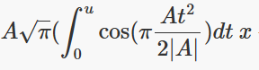

# Section 3 - Vertical Alignment

## General

The parameter is distance along the alignment.

$L =$ Horizontal Length

$g_{s} =$ Start Gradient

$g_{e} =$ End Gradient

## Placement Matrix

Vertical alignment is evaluated in a "distance along, elevation" plane.
This is a 2D space. The "y" value is really an elevation, so we want
that value in the "z" position of the placement matrix. The slope of the
curve (RefDirection) is in the "distance along, elevation" plane. The
normal to the curve slope, in the general up direction, is the Axis
direction. Since we are in a 2D plane, the Y direction is (0,1,0,0). The
general positioning matrix for a point on the `IfcGradientCurve` is

$$M_{v} = \begin{bmatrix}
dx & 0 & - dy & d \\
0 & 1 & 0 & 0 \\
dy & 0 & dx & y \\
0 & 0 & 0 & 1
\end{bmatrix}$$

Matrix multiply horizontal and vertical to get placement in 3D. Note
however that $M_{h}$ has the X-Y plane coordinate. The "X" coordinate in
$M_{v}$ represents the "distance along" the horizontal alignment. If
this value is multiplied with (X,Y) in $M_{h}$, incorrect coordinates
will result. To remedy, revise $M_{v}$ by setting the $d$ value to 0.0
as follows

$${M'}_{v} = \begin{bmatrix}
dx & 0 & - dy & 0 \\
0 & 1 & 0 & 0 \\
dy & 0 & dx & y \\
0 & 0 & 0 & 1
\end{bmatrix}$$

The 3D position is computed from

$$M = M_{h}{M'}_{v}$$

Column 1 = RefDirection = Tangent to 3D curve, in the direction of the
curve

Column 2 = Y = RefDirection X Axis

Column 3 = Axis = "Up" direction that is orthogonal to RefDirection

Column 4 = Location = Point on 3D curve

Y = RefDirection CrossProduct (0,0,1)

Axis = Y CrossProduct RefDirection

## Constant Gradient

### Parent Curve Parametric Equations

$$x(s) = p_{x} + s$$

$$y(s) = p_{y} + s(dy/dx)$$

Note that these equations are different from the equations for
horizontal.

### Semantic Definition to Geometry Mapping

Mapping of the semantic definition of the linear segment to the
geometric definition is described with the following example.

Consider a vertical gradient at an uphill slope of 0.5 starting at point
(0,10). The horizontal projection of the segment length is 100.

~~~
#44 = IFCALIGNMENTVERTICALSEGMENT($, $, 0., 100., 10., 0.5, 0., $, .CONSTANTGRADIENT.);
~~~

Define the direction of the `IfcLine` so it matches the vertical segment

$$dx = \cos\left( \tan^{- 1}{0.5} \right) = 0.894427191$$

$$dy = \sin\left( \tan^{- 1}{0.5} \right) = 0.44713595$$

Define the `IfcLine` as passing through point (0,0)

~~~
#80 = IFCLINE(#81, #82);
#81 = IFCCARTESIANPOINT((0., 0.));
#82 = IFCVECTOR(#83, 1.);
#83 = IFCDIRECTION((0.894427190999916, 0.447213595499958));
~~~

Place the curve segment at (0,10) with a tangent direction
(0.894427190999916, 0.447213595499958).

~~~
#77 = IFCAXIS2PLACEMENT2D(#78, #79);
#78 = IFCCARTESIANPOINT((0., 10.));
#79 = IFCDIRECTION((0.894427190999916, 0.447213595499958));
~~~

`IfcCurveSegment.SegmentLength` is the length measured along the trimmed
curve. For a horizontal length of 100, the length along the curve is
100/0.894427190999916 = 111.803398874989

The curve segment is defined as

~~~
#71 = IFCCURVESEGMENT(.CONTINUOUS., #77, IFCLENGTHMEASURE(0.), IFCLENGTHMEASURE(111.803398874989), #80);
~~~

## Circular Arc

Vertical circular arcs are tricky. For vertical, the "distance along" is
a horizontal dimension. The `IfcCurveSegment` trimming parameters `SegmentStart` and `SegmentLength` are measured along the `IfcCircle`. 

The following procedure maps the semantic parameters of a vertical circular arc to its geometric definition.

Determine the tangent slope angle at the start and end of the segment.

$\theta_{start} = tan^{-1}(g_{start})$

$\theta_{end} = tan^{-1}(g_{end})$

Compute the radius of the circle and the direction of vectors that are perpendicular to the circle, directed away from the center point.

if $\theta_{start} < \theta_{end}$

Curve is sagging (curve is on the bottom half of the circle)

$$h_l = $$ horizontal length = `IfcAlignmentVerticalSegment.HorizontalLength`

$R = \frac{h_l}{sin(\theta_{end}) - sin(\theta_{start})}$

$\Delta_{start} = \theta_{start} + \frac{3}{2}\pi$

$\Delta_{end} = \theta_{end} + \frac{3}{2}\pi$

else

Curve is cresting (curve is on top half of the circle)

$R = \frac{ul}{sin(\theta_{start}) - sin(\theta_{end})}$

$\Delta_{start} = \theta_{start} + \frac{1}{2}\pi$

$\Delta_{end} = \theta_{end} + \frac{1}{2}\pi$

Compute the curve trimming parameters `SegmentStart` and `SegmentLength`

$Segment Start = R\Delta_{start}$

$Segment Length = R(\Delta_{end} - \Delta_{start})$

### Example

Given the following semantic definition of a vertical circular arc, create the geometric definition.

~~~
#320 = IFCALIGNMENTVERTICALSEGMENT($, $, 144.917656958471, 239.704902937655, 25.3780433292418, -8.17722122076371E-4, -1.28040164299203E-2, -20000., .CIRCULARARC.);
~~~

#### Compute radius for the parent curve

$g_{start} = -8.17722122076371E-4$
$\theta_{start} = tan^{-1}(-8.17722122076371E-4) = -8.177219398E-4$

$g_{end} = -1.28040164299203E-2$
$\theta_{end} = tan^{-1}(-1.28040164299203E-2) = -1.2803316789E-4$

$ul = 239.704902937655$

$R = \frac{239.704902937655}{sin(-1.2803316789E-4) - sin(-8.177219398E-4)} = -20000.0$

Radius is negative which means a CW direction, so the curve is cresting. Radius needs to be a positive value for `IfcCircle` so use the absolute value.

~~~
#1983 = IFCCIRCLE(#1984, 20000.);
#1984 = IFCAXIS2PLACEMENT2D(#1985, #1986);
#1985 = IFCCARTESIANPOINT((0., 0.));
#1986 = IFCDIRECTION((1., 0.));
~~~

#### Compute curve trimming parameters

$\Delta_{start} = \theta_{start} + \frac{1}{2}\pi = 1.56997860486$

$\Delta_{end} = \theta_{end} + \frac{1}{2}\pi = 1.55799301001$

$Segment Start = R\Delta_{start} = (20000.0)(1.56997860486) = 31399.5720971$

$Segment Length = R(\Delta_{end} - \Delta_{start}) = (20000.0)(1.55799301001 - 1.56997860486) = -239.711897$

~~~
#1974 = IFCCURVESEGMENT(.CONTSAMEGRADIENT., #1980, IFCLENGTHMEASURE(31399.5720971016), IFCLENGTHMEASURE(-239.711897000001), #1983);
~~~

#### Placement of trimmed curve

X = `IfcAlignmentVerticalSegment.StartDistAlong` = 144.917656958471

Y = `IfcAlignmentVerticalSegment.StartHeight` = 25.3780433292418

$dx = cos(\theta_{start}) = cos(-8.177219398x10^{-4} = 0.9999966566$
$dy = sin(\theta_{start}) = sin(-8.177219398x10^{-4}) = -8.1772184868x10^{-4}$

~~~
#1980 = IFCAXIS2PLACEMENT2D(#1981, #1982);
#1981 = IFCCARTESIANPOINT((144.917656958471, 25.3780433292418));
#1982 = IFCDIRECTION((9.99999665665433E-1, -8.177218486836E-4));
~~~

## Clothoid

:warning: **[Finish this]** :warning:

Start angle = atan(startGradient)

End angle = atan(endGradient)

Start radius = start radius of curvature

End radius = end radius of curvature

Set equal to horizontal length, adjust curve length until computed value
is equal to the specified horizontal length. Numerically solve 

## Parabolic Arc
The geometric representation of vertical parabolic curves as a parabola is a little bit tricky.

Consider the equation for a parabola in the form 
 $y(x) = Ax^2 + Bx + C$

where:

A = (end gradient - start gradient)/(2 * horizontal length)

B = start gradient

C = start height

These parameters are obtained from the semantic definition of the curve segment, `IfcAlignmentVerticalSegment`.

The parent curve for `IfcCurveSegment.ParentCurve` is `IfcPolynomialCurve`. The coefficients are:

~~~
IfcPolynomialCurve.CoefficientsX = (0,1)
IfcPolynomialCurve.CoefficientsY = (C, B, A)
~~~

---
:information_source: Note 1: Even though vertical is typically Z, we are using 2.5D geometry and the coordinate system of gradient curve is "Distance along Horizontal", "Elevation" which is a 2D curve in the plane of the horizontal curve. When the `IfcGradientCurve` and `IfcCompositeCurve` are combined to get a 3D point, the elevation is then mapped to Z.

:information_source: Note 2: The coefficients A, B, and C must have the following unit of measure, consistent with the project units:

A = $Length{^-1}$

B = $Length^0$

C = $Length^1$

The coefficients of `IfcPolynomialCurve` expect real numbers without explictit unit of measure. This is a problem with the IFC Specification. See the discussion of `IfcAlignmentHorizontalSegment` and `IfcPolynomialCurve` for Cubic Transition Curve in [Section 2 - Horizontal Alignment](./2_Horizontal.md). Implicit units of measure are required for the polynomial coefficients.

---

The challenging part is `IfcCurveSegment.SegmentLength`. The length along the parabolic curve is needed.

The distance along a curve is

$s(x) = \int_{}^{}(\sqrt{(y')^{2} + 1}) dx$

The parabola equation is

 $y(x) = Ax^2 + Bx + C$

 and it's derivative is

 $y'(x) = 2Ax + B$

The equation along the parabolic curve is then:

$s(x) = \int_{}^{}\sqrt{4A^2x^2 + 4ABx + B^2 + 1} dx$

This equation can be solved numerically.

Alternatively, there is a closed form solution, see https://www.integral-table.com, equation #37.

$s(x)=\int_{}^{}\sqrt{ax^2 + bx + c} dx = \frac{b+2x}{4a}\sqrt{ax^2 + bx + c} + \frac{4ac-b^2}{8 a^\frac{3}{2}} ln\left|2ax + b + 2\sqrt{a(ax^2 + bx + c)}\right|$

Let

$a = 4A^2$

$b = 4AB$

$c = B^2 + 1$

Substitute into the above closed form equation. The curve length is

$Lc = s(L) - s(0.0)$

Finally, `IfcCurveSegment.SegmentLength = Lc`

In summary,

~~~
IfcCurveSegment.Placement = IfcAxis2Placement2D
with 
IfcAxis2Placement2D.Location=IfcCartesianPoint(start distance along, start height)
IfcAxis2Placement2D.RefDirection=IfcDirection(1,0)

IfcCurveSegment.SegmentStart=0.0

IfcCurveSegment.SegmentLength=Lc

IfcCurveSegment.ParentCurve = IfcPolynomialCurve
~~~
