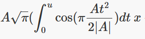

# Section 3.0 - Vertical Alignment

A vertical alignment defines the elevation profile of a route as a function of distance along its horizontal path. Combined with the horizontal alignment, it establishes the complete three-dimensional geometry of a road, railway, or other linear infrastructure element. 

## 3.1 General

The geometric representation of a vertical alignment is accomplished with `IfcGradientCurve`. This defines the vertical alignment in a "distance along, elevation" coordinate system. Distance along is measured along `IfcGradientCurve.BaseCurve` = `IfcCompositeCurve`.

Table 3.1 maps each `IfcAlignmentVertical.PredefinedType` to its corresponding parent curve type.

  Business Logic (`IfcAlignmentVertical.PredefinedType`) | Geometric Representation (`IfcCurveSegment.ParentCurve`)
  ---------------------------------------|-----------------------------------
  CONSTANTGRADIENT                       |`IfcLine`
  CIRCULARARC                            |`IfcCircle`
  CLOTHOID                               |`IfcClothoid`
  PARABOLICARC                           |`IfcPolynomialCurve`

  *Table 3.1 — Mapping of business logic to geometric representation for vertical alignment*

The following parameters are used throughout this section:

$L =$ Horizontal Length

$g_{s} =$ Start Gradient

$g_{e} =$ End Gradient

## 3.2 Curve Segment Evaluation Algorithm

Vertical segments are evaluated in a two-dimensional "distance along, elevation" coordinate system. In this system $x(s)$ is the distance measured along the horizontal `IfcCompositeCurve` and $y(s)$ is the elevation above datum. The grade angle at arc-length $s$ is $\theta(s) = \tan^{-1}(g(s))$ where $g(s)$ is the gradient.

**Steps 1–4** follow the identical procedure described in Section 2.2 for horizontal segments, substituting distance along for the horizontal $x$-coordinate and elevation for the horizontal $y$-coordinate. Let $s_0$ = `SegmentStart`.

**Step 1 — Evaluate the parent curve at the trim start**

Compute the distance along $d_0 = x(s_0)$, elevation $z_0 = y(s_0)$, and grade angle $\theta_0 = \theta(s_0)$.

$$M_{PCS} = \begin{bmatrix} \cos\theta_0 & -\sin\theta_0 & 0 & d_0 \\ \sin\theta_0 & \cos\theta_0 & 0 & z_0 \\ 0 & 0 & 1 & 0 \\ 0 & 0 & 0 & 1 \end{bmatrix}$$

**Step 2 — Form the normalization matrix $M_N$**

$M_N$ simultaneously translates the trim-start point to the origin and rotates so that the tangent at $s_0$ aligns with the positive $x$-direction.

$$M_N = \begin{bmatrix}
\cos\theta_0 & \sin\theta_0 & 0 & -d_0\cos\theta_0 - z_0\sin\theta_0 \\
-\sin\theta_0 & \cos\theta_0 & 0 & -d_0\sin\theta_0 - z_0\cos\theta_0 \\
0 & 0 & 1 & 0 \\
0 & 0 & 0 & 1
\end{bmatrix}$$

**Step 3 — Form the curve segment placement matrix $M_{CSP}$**

$M_{CSP}$ is constructed from `IfcCurveSegment.Placement`, where $(d_p, z_p)$ is the `Location` (distance along, elevation) and $\theta_p$ is the grade angle of the `RefDirection`.

$$M_{CSP} = \begin{bmatrix} \cos\theta_p & -\sin\theta_p & 0 & d_p \\ \sin\theta_p & \cos\theta_p & 0 & z_p \\ 0 & 0 & 1 & 0 \\ 0 & 0 & 0 & 1 \end{bmatrix}$$

**Step 4 — Evaluate and map each point in the vertical plane**

For the point at arc-length $s$, compute $x(s)$, $y(s)$, and $\theta(s)$:

$$M_{PC} = \begin{bmatrix} \cos\theta(s) & -\sin\theta(s) & 0 & x(s) \\ \sin\theta(s) & \cos\theta(s) & 0 & y(s) \\ 0 & 0 & 1 & 0 \\ 0 & 0 & 0 & 1 \end{bmatrix}$$

$$M_v = M_{CSP}\, M_N\, M_{PC}$$

Column 4 of $M_v$ contains the distance along $d$ and elevation $z$ of the evaluated point. Column 1 contains $(dx_v, dy_v) = (\cos\theta_v, \sin\theta_v)$, the grade direction at that point. Step 6 is performed immediately for this point before moving to the next arc-length $s$.

**Step 6 — Combine with the horizontal alignment to produce the 3D placement matrix**

The vertical result lives in the (distance along, elevation) plane and must be merged with the horizontal alignment to form a 3D position and orientation. The "distance along" axis corresponds to the curve tangent of the horizontal alignment and the vertical $y$ is elevation (Z in 3D).

Evaluate the horizontal placement matrix $M_h$ at distance $d$ along the `IfcCompositeCurve`. This yields the horizontal 2D position $(x_h, y_h)$ and the horizontal alignment tangent direction $(dx_h, dy_h) = (\cos\theta_h, \sin\theta_h)$.

$M_v$ is a two-dimensional matrix whose rows index the vertical frame: row 1 = distance-along, row 2 = elevation, row 3 = out-of-plane. Three modifications produce $M'_v$, the form required for multiplication with $M_h$.

**Column 4** — The distance-along value $d$ is replaced with zero. The horizontal position already comes from $M_h$; retaining $d$ would displace the point a second time along the horizontal tangent.

**Rows 2 and 3** — $M_h$'s third row $(0,\ 0,\ 1,\ 0)$ passes row 3 of the right operand through unchanged into row 3 of the product. Because row 3 of $M_{3D}$ must carry the elevation (Z) component of every vector, elevation must occupy row 3 of $M'_v$ — not row 2 as in $M_v$. The row semantics are therefore swapped: in $M'_v$, row 2 is the cross-track (lateral) component and row 3 is the elevation (Z) component.

**Columns 2 and 3** — The row reordering reindexes the column values and exchanges the columns. $M_v$ column 2, the in-plane normal $(-dy_v,\ dx_v,\ 0)$ in [d-along, elevation, out-of-plane] ordering, becomes $(-dy_v,\ 0,\ dx_v)$ in [d-along, cross-track, elevation] ordering — the 3D up direction — and moves to column 3. $M_v$ column 3, the out-of-plane unit direction $(0,\ 0,\ 1)$, becomes $(0,\ 1,\ 0)$ — the cross-track direction — and moves to column 2.

$${M'}_v = \begin{bmatrix} dx_v & 0 & -dy_v & 0 \\ 0 & 1 & 0 & 0 \\ dy_v & 0 & dx_v & z \\ 0 & 0 & 0 & 1 \end{bmatrix}$$

The columns of $M'_v$ define directions in the 3D frame local to the alignment:

- **Column 1** $(dx_v,\ 0,\ dy_v)$: the grade direction — $dx_v$ scales the contribution along the horizontal tangent; $dy_v$ is the elevation rate of change (Z component of the 3D tangent).
- **Column 2** $(0,\ 1,\ 0)$: the cross-track direction, always lateral to the alignment and always horizontal.
- **Column 3** $(-dy_v,\ 0,\ dx_v)$: the "up" direction in the vertical plane of the alignment, orthogonal to the grade direction.
- **Column 4** $(0,\ 0,\ z)$: the elevation offset with no horizontal displacement.

The 3D placement matrix is:

$$M_{3D} = M_h \cdot {M'}_v$$

Multiplying out, the columns of $M_{3D}$ are:

- **Column 1** (RefDirection / 3D tangent): $(dx_h \cdot dx_v,\ dy_h \cdot dx_v,\ dy_v)$ — the horizontal tangent scaled by $\cos\theta_v$, with $\sin\theta_v$ as the Z component.
- **Column 2** (Y / cross-track): $(-dy_h,\ dx_h,\ 0)$ — the horizontal normal direction, unchanged from $M_h$.
- **Column 3** (Axis / up): $(-dx_h \cdot dy_v,\ -dy_h \cdot dy_v,\ dx_v)$ — orthogonal to both the 3D tangent and the cross-track direction.
- **Column 4** (Location): $(x_h,\ y_h,\ z)$ — the full 3D position.

## 3.3 Constant Gradient

A constant gradient is geometrically represented with a segment trimmed from an `IfcLine` parent curve.

### 3.3.1 Parent Curve Parametric Equations

$$x(s) = p_{x} + s$$

$$y(s) = p_{y} + s(dy/dx)$$

Note that these equations are different from the equations for
horizontal.

[todo: can this be reformulated to be the same as horizontal?]

### 3.3.2 Semantic Definition to Geometry Mapping

Mapping of the semantic definition of the linear segment to the
geometric definition is described with the following example.

Consider a vertical gradient at an uphill slope of 0.5 starting at point
(0,10). The horizontal projection of the segment length is 100.

~~~
#44 = IFCALIGNMENTVERTICALSEGMENT($, $, 0., 100., 10., 0.5, 0., $, .CONSTANTGRADIENT.);
~~~

Define the direction of the `IfcLine` so it matches the vertical segment

$$dx = \cos\left( \tan^{- 1}{0.5} \right) = 0.894427191$$

$$dy = \sin\left( \tan^{- 1}{0.5} \right) = 0.44713595$$

Define the `IfcLine` as passing through point (0,0)

~~~
#80 = IFCLINE(#81, #82);
#81 = IFCCARTESIANPOINT((0., 0.));
#82 = IFCVECTOR(#83, 1.);
#83 = IFCDIRECTION((0.894427190999916, 0.447213595499958));
~~~

Place the curve segment at (0,10) with a tangent direction
(0.894427190999916, 0.447213595499958).

~~~
#77 = IFCAXIS2PLACEMENT2D(#78, #79);
#78 = IFCCARTESIANPOINT((0., 10.));
#79 = IFCDIRECTION((0.894427190999916, 0.447213595499958));
~~~

`IfcCurveSegment.SegmentLength` is the length measured along the trimmed
curve. For a horizontal length of 100, the length along the curve is
100/0.894427190999916 = 111.803398874989

The curve segment is defined as

~~~
#71 = IFCCURVESEGMENT(.CONTINUOUS., #77, IFCLENGTHMEASURE(0.), IFCLENGTHMEASURE(111.803398874989), #80);
~~~

### 3.3.3 Compute Point on Curve

Compute the vertical placement matrix for the point at horizontal distance $u = 50$ m from the start of the curve segment.

**Step 1 — Evaluate the parent curve at the trim start**

The trim begins at $s_0 = \text{SegmentStart} = 0$. For the `IfcLine` through the origin with direction $(dx,\ dy) = (0.894427191,\ 0.447213595)$:

$$d_0 = x(0) = 0 \quad z_0 = y(0) = 0 \quad \theta_0 = \arctan\!\left(\frac{dy}{dx}\right) = \arctan(0.5) = 0.463647609\ \text{rad}$$

**Step 2 — Form the normalization matrix $M_N$**

$$M_N = \begin{bmatrix}
0.894427191 & 0.447213595 & 0 & 0 \\
-0.447213595 & 0.894427191 & 0 & 0 \\
0 & 0 & 1 & 0 \\
0 & 0 & 0 & 1
\end{bmatrix}$$

**Step 3 — Form the curve segment placement matrix $M_{CSP}$**

From `IfcCurveSegment.Placement`: $(d_p,\ z_p) = (0,\ 10)$, $\theta_p = 0.463647609\ \text{rad}$:

$cos\theta_p = cos(0.463647609)=0.894427191 \quad sin\theta_p = sin(0.463647609)=0.447213595$

$$M_{CSP} = \begin{bmatrix}
0.894427191 & -0.447213595 & 0 & 0 \\
0.447213595 & 0.894427191 & 0 & 10 \\
0 & 0 & 1 & 0 \\
0 & 0 & 0 & 1
\end{bmatrix}$$

**Step 4 — Evaluate and map the point**

The horizontal distance $u = 50$ m is not the arc-length parameter. Convert to arc-length $s$ along the `IfcLine`:

$$s = s_0 + \frac{u}{dx} = 0 + \frac{50}{0.894427191} = 55.9016994\ \text{m}$$

Evaluate the parent curve at $s = 55.9016994$:

$$d = x(55.9016994) = 55.9016994 \times 0.894427191 = 50.000\ \text{m}$$

$$z = y(55.9016994) = 55.9016994 \times 0.447213595 = 25.000\ \text{m}$$

$$\theta = 0.463647609\ \text{rad} \quad \text{(constant for a line)}$$

$$M_{PC} = \begin{bmatrix}
0.894427191 & -0.447213595 & 0 & 50.000 \\
0.447213595 & 0.894427191 & 0 & 25.000 \\
0 & 0 & 1 & 0 \\
0 & 0 & 0 & 1
\end{bmatrix}$$

The vertical placement matrix is:

$$M_v = M_{CSP}\ M_N\ M_{PC} = \begin{bmatrix}
0.894427191 & -0.447213595 & 0 & 0 \\
0.447213595 & 0.894427191 & 0 & 10 \\
0 & 0 & 1 & 0 \\
0 & 0 & 0 & 1
\end{bmatrix}
\begin{bmatrix}
0.894427191 & 0.447213595 & 0 & 0 \\
-0.447213595 & 0.894427191 & 0 & 0 \\
0 & 0 & 1 & 0 \\
0 & 0 & 0 & 1
\end{bmatrix}
\begin{bmatrix}
0.894427191 & -0.447213595 & 0 & 50.000 \\
0.447213595 & 0.894427191 & 0 & 25.000 \\
0 & 0 & 1 & 0 \\
0 & 0 & 0 & 1
\end{bmatrix}$$

$$M_v = \begin{bmatrix}
0.894427191 & -0.447213595 & 0 & 50.000 \\
0.447213595 & 0.894427191 & 0 & 35.000 \\
0 & 0 & 1 & 0 \\
0 & 0 & 0 & 1
\end{bmatrix}$$

Column 4 of $M_v$ gives the result: **distance along = 50.0 m, elevation = 35.0 m**.

## 3.4 Circular Arc

A circular vertical curve is geometrically represented with a segment trimmed from an `IfcCircle` parent curve.

### 3.4.1 Parent Curve Parametric Equations

### 3.4.2 Semantic Definition to Geometry Mapping

Vertical circular arcs are tricky. The "distance along" dimension is
horizontal while the `IfcCurveSegment` trimming parameters `SegmentStart` and `SegmentLength` are measured along the `IfcCircle`. 

The following procedure maps the semantic parameters of a vertical circular arc to its geometric definition.

Given the following semantic definition of a vertical circular arc, create the geometric definition.

~~~
#320 = IFCALIGNMENTVERTICALSEGMENT($, $, 144.917656958471, 239.704902937655, 25.3780433292418, -8.17722122076371E-4, -1.28040164299203E-2, -20000., .CIRCULARARC.);
~~~

Determine the tangent slope angle at the start and end of the segment.

$g_{start} = -8.17722122076371 \cdot 10^{-4}$

$\theta_{start} = tan^{-1}(g_{start})$

$\theta_{start} = tan^{-1}(-8.17722122076371 \cdot 10^{-4}) = -8.177219398 \cdot 10^{-4}$

$g_{end} = -1.28040164299203 \cdot 10^{-2}$

$\theta_{end} = tan^{-1}(g_{end})$

$\theta_{end} = tan^{-1}(-1.28040164299203 \cdot 10^{-2}) = -1.2803316789 \cdot 10^{-2}$

Compute the radius of the circle.

`IfcAlignmentVerticalSegment.RadiusOfCurvature` is optional. If provided, it should be consistent with the `HorizontalLength`, `StartGradient` and `EndGradient`, but is not guarenteed. For this reason, the radius is computed from the required  `HorizontalLength`, `StartGradient` and `EndGradient` attributes. Note that in computing the radius, it is taken to be an absolute value because `IfcCircle.Radius` is a `IfcPositiveLengthMeasure`.

$R = \left| \frac{h_l}{sin(\theta_{start}) - sin(\theta_{end})}\right |$

$h_l = horizontal length$

`IfcAlignmentVerticalSegment.HorizontalLength` $= 239.704902937655$

 $h_l = 239.704902937655$

$R = \left| \frac{239.704902937655}{sin(-1.2803316789\cdot10^{-4}) - sin(-8.177219398\cdot10^{-4})} \right | = 20000.0$

 Comptue the direction of vectors that are perpendicular to the circle, directed away from the center point

if $\theta_{start} < \theta_{end}$

Curve is sagging (curve is on the bottom half of the circle)

$\Delta_{start} = \theta_{start} + \frac{3}{2}\pi$

$\Delta_{end} = \theta_{end} + \frac{3}{2}\pi$

else

Curve is cresting (curve is on top half of the circle)

$\Delta_{start} = \theta_{start} + \frac{1}{2}\pi = 1.56997860486$

$\Delta_{end} = \theta_{end} + \frac{1}{2}\pi = 1.55799301001$

Compute the curve trimming parameters `SegmentStart` and `SegmentLength`

$Segment Start = R\Delta_{start} = (20000.0)(1.56997860486) = 31399.5720971$

$Segment Length = R(\Delta_{end} - \Delta_{start}) = (20000.0)(1.55799301001 - 1.56997860486) = -239.711897$

For a cresting curve, the segment length is negative which means the trim occurs in CW direction. 

Determine the placement of the trimmed curve

X = `IfcAlignmentVerticalSegment.StartDistAlong` = 144.917656958471

Y = `IfcAlignmentVerticalSegment.StartHeight` = 25.3780433292418

$dx = cos(\theta_{start}) = cos(-8.177219398x10^{-4} = 0.9999966566$

$dy = sin(\theta_{start}) = sin(-8.177219398x10^{-4}) = -8.1772184868x10^{-4}$

The geometric representation is

~~~
#1974 = IFCCURVESEGMENT(.CONTSAMEGRADIENT., #1980, IFCLENGTHMEASURE(31399.5720971016), IFCLENGTHMEASURE(-239.711897000001), #1983);
#1980 = IFCAXIS2PLACEMENT2D(#1981, #1982);
#1981 = IFCCARTESIANPOINT((144.917656958471, 25.3780433292418));
#1982 = IFCDIRECTION((9.99999665665433E-1, -8.177218486836E-4));
#1983 = IFCCIRCLE(#1984, 20000.);
#1984 = IFCAXIS2PLACEMENT2D(#1985, #1986);
#1985 = IFCCARTESIANPOINT((0., 0.));
#1986 = IFCDIRECTION((1., 0.));
~~~

### 3.4.3 Compute Point on Curve

[todo: provide example calcs for steps 1 - 5. compute at u = 150, be clear u is horizontal]

## 3.5 Clothoid

:warning: **[Finish this]** :warning:

Start angle = atan(startGradient)

End angle = atan(endGradient)

Start radius = start radius of curvature

End radius = end radius of curvature

Set equal to horizontal length, adjust curve length until computed value
is equal to the specified horizontal length. Numerically solve 

## 3.6 Parabolic Arc
The most common transition curve in a vertical profile is a parabola. The geometric representation is `IfcPolynomialCurve`. Mapping of the semantic definition to the geometric definition can be a bit tricky.

### 3.6.1 Parent Curve Parametric Equations

The general form of a parabola is 

$$y(x) = A_2 x^2 + A_1 x + A_0 $$

where: 

$A_2$ = (end gradient - start gradient)/(2 * horizontal length)

$A_1$ = start gradient

$A_0$ = start height

The gradient of the curve is

$$y'(x) = 2A_2x + A_1$$

### 3.6.2 Semantic Definition to Geometry Mapping

Consider a 1600 m parabolic vertical cover that starts 1200 m along the horizontal alignment. The entry grade is 1.75% and the exit grade is -1%. The elevation at the start of the curve is 121 m.

The semantic definition is

~~~
#289=IFCALIGNMENTVERTICALSEGMENT($,$,1200.,1600.,121.,0.017500000000000002,-0.01,$,.PARABOLICARC.);
~~~

These parameters are obtained from the semantic definition of the curve segment, `IfcAlignmentVerticalSegment`.

The parent curve for `IfcCurveSegment.ParentCurve` is `IfcPolynomialCurve`. The coefficients are:

IfcPolynomialCurve.CoefficientsX = (0,1)

IfcPolynomialCurve.CoefficientsY = ($A_0$, $A_1$, $A_2$)

> Note 1: Even though vertical is typically Z, we are using 2.5D geometry and the coordinate system of gradient curve is "Distance along Horizontal", "Elevation" which is a 2D curve in the plane of the horizontal curve. When the `IfcGradientCurve` and `IfcCompositeCurve` are combined to get a 3D point, the elevation is then mapped to Z. See example in Section 3.7 below.

> Note 2: The coefficients $A_0$, $A_1$, and $A_2$ must have the following unit of measure, consistent with the project units:
>
> $A_0 = Length^1$
>
> $A_1 = Length^0$
>
> $A_2 = Length^{-1}$
>
> The coefficients of `IfcPolynomialCurve` expect real numbers without explictit unit of measure. This is a problem with the IFC Specification. See the discussion of `IfcAlignmentHorizontalSegment` and `IfcPolynomialCurve` for Cubic Transition Curve in [Section 2.0 - Horizontal Alignment](./2_Horizontal.md). Implicit units of measure are required for the polynomial coefficients.

The challenging part is `IfcCurveSegment.SegmentLength`. The length along the parabolic curve is needed.

The distance along a curve is

$s(x) = \int_{}^{}(\sqrt{(y')^{2} + 1}) dx$

The length along the parabolic curve is then:

$s(x) = \int_{}^{}\sqrt{4A_2^2x^2 + 4A_2A_1x + A_1^2 + 1} dx$

Fortunately, there is a closed form solution.

<!-- see https://www.integral-table.com, equation #37 -->

$s(x)=\int_{}^{}\left(\sqrt{ax^2 + bx + c}\right) dx = \frac{b+2x}{4a}\sqrt{ax^2 + bx + c} + \frac{4ac-b^2}{8 a^\frac{3}{2}} ln\left|2ax + b + 2\sqrt{a(ax^2 + bx + c)}\right|$

Let

$a = 4A_2^2$

$b = 4A_2A_1$

$c = A_1^2 + 1$

Substitute into the above closed form equation. The curve length is

$L_c = s(L) - s(0.0)$

$A_0 = 121.$

$A_1 = 0.0175$

$A_2 = \frac{-0.01-0.0175}{2\cdot 1600.} = -8.59375 \cdot 10^{-6}$

[todo: add the computation details for Lc]

$L_c = 1600.0616641340894$

~~~
#291=IFCCARTESIANPOINT((0.,0.));
#292=IFCDIRECTION((1.,0.));
#293=IFCAXIS2PLACEMENT2D(#291,#292);
#294=IFCPOLYNOMIALCURVE(#293,(0.,1.),(121.,0.017500000000000002,-8.5937500000000005E-06),$);
#295=IFCCARTESIANPOINT((1200.,121.));
#296=IFCDIRECTION((0.99984691016192495,0.017497320927833689));
#297=IFCAXIS2PLACEMENT2D(#295,#296);
#298=IFCCURVESEGMENT(.CONTSAMEGRADIENT.,#297,IFCLENGTHMEASURE(0.),IFCLENGTHMEASURE(1600.0616641340894),#294);
~~~

<!--
In summary,

~~~
IfcCurveSegment.Placement = IfcAxis2Placement2D
with 
IfcAxis2Placement2D.Location=IfcCartesianPoint(start distance along, start height)
IfcAxis2Placement2D.RefDirection=IfcDirection(1,0)

IfcCurveSegment.SegmentStart=0.0

IfcCurveSegment.SegmentLength=Lc

IfcCurveSegment.ParentCurve = IfcPolynomialCurve
~~~
-->

### 3.6.3 Compute Point on Curve

[todo: provide example calcs for steps 1 - 5. compute at d = 1500, u = 1500-1200 = 300, be clear u is horizontal from the start of the parabola]

## 3.7 Combined 3D

todo:
* in this section, recall the tangent line from Section 2 and combine it with the parabolic curve from this chapter to illustrate the calculation of the final 3D point. Do the calculation at u = 1500 (after the start of the parabola, before the end of the tangent line)
