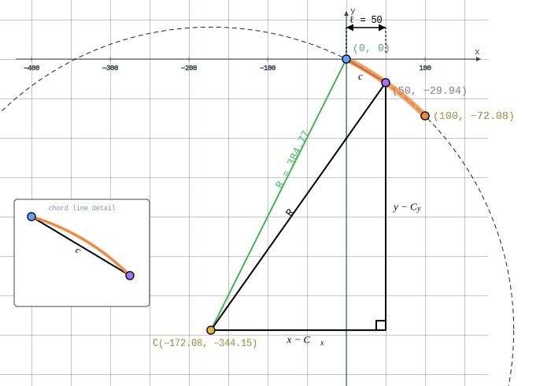

# Chapter 3 - Vertical Alignments

## 3.0 Introduction

The geometric representation of a vertical alignment is accomplished with `IfcGradientCurve`. It represents the elevation profile as a two-dimensional curve in a (distance along, elevation) coordinate system, where distance along is measured along the horizontal `IfcCompositeCurve` (`IfcGradientCurve.BaseCurve`). Combined with the horizontal alignment, the gradient curve establishes the three-dimensional geometry of the route.

Table 3.0-1 maps each `IfcAlignmentVerticalSegment.PredefinedType` to its corresponding parent curve type.

| Business Logic (`IfcAlignmentVerticalSegment.PredefinedType`) | Geometric Representation (`IfcCurveSegment.ParentCurve`) |
|---------------------------------------------------------------|----------------------------------------------------------|
| CONSTANTGRADIENT                                              | `IfcLine`                                                |
| CIRCULARARC                                                   | `IfcCircle`                                              |
| CLOTHOID                                                      | `IfcClothoid`                                            |
| PARABOLICARC                                                  | `IfcPolynomialCurve`                                     |

*Table 3.0-1 — Mapping of business logic to geometric representation for vertical alignment*

This chapter covers:

- The four-step evaluation algorithm: Steps 1–3 follow the same matrix composition as horizontal segments; Step 4 combines the vertical result with the horizontal placement matrix to produce a full 3D placement.
- Parametric equations and geometry mapping examples for the curve types in Table 3.0-1.
- The combined 3D evaluation that produces position, tangent, cross-track, and up-axis vectors from the `IfcGradientCurve`.
- Known limitation: vertical clothoid curves are not addressed in this guide.

## 3.1 General

Each vertical segment is parameterized by arc-length $s$ along its parent curve, where $s = 0$ at the start of the parent curve. The key semantic attributes are `IfcAlignmentVerticalSegment.StartDistAlong` (horizontal distance from the alignment start to the segment start), `HorizontalLength` (the horizontal projection of the segment), `StartHeight` (elevation at the segment start), and `StartGradient` and `EndGradient` (decimal slopes; e.g., $0.005 = 0.5\%$).

`IfcCurveSegment.SegmentLength` stores arc-length along the parent curve, not horizontal distance. The evaluator parameter is horizontal distance $\ell$, which must be converted to arc-length $s$ before calling the parent curve equations. For the grades typical in road and railway design ($\leq 5\%$), the difference is small but non-zero.

The grade angle at horizontal distance $\ell$ is $\theta(\ell) = \arctan(g(\ell))$, where $g(\ell)$ is the gradient. The cosine and sine of $\theta$ form the `RefDirection` of the vertical curve at that point.

## 3.2 Curve Segment Evaluation Algorithm

Vertical segments are evaluated in a two-dimensional "distance along, elevation" coordinate system. In this system $x(s)$ is the distance measured along the horizontal `IfcCompositeCurve` and $y(s)$ is the elevation. The grade angle is $\theta(\ell) = \tan^{-1}(g(\ell))$ where $g(\ell)$ is the gradient.

**Steps 1–3** follow the identical procedure described in Section 2.2 for horizontal segments, substituting distance along for the horizontal $x$-coordinate and elevation for the horizontal $y$-coordinate. Let $s_0$ = `IfcAlignmentVerticalSegment.StartDistAlong`.

**Step 1 — Form the curve segment placement matrix $M_{CSP}$**

$M_{CSP}$ is constructed from `IfcCurveSegment.Placement`, where $(d_p, z_p)$ is the `Location` (distance along, elevation) and $\theta_p$ is the grade angle of the `RefDirection`.

$$M_{CSP} = \begin{bmatrix} 
\cos\theta_p & -\sin\theta_p & 0 & d_p \\
\sin\theta_p & \cos\theta_p & 0 & z_p \\
0 & 0 & 1 & 0 \\
0 & 0 & 0 & 1 
\end{bmatrix}$$

**Step 2 — Evaluate the parent curve at the trim start and form the normalization matrix $M_N$**

Compute the distance along $d_0 = x(s_0)$, elevation $z_0 = y(s_0) = \text{IfcAlignmentVerticalSegment.StartHeight}$, and grade angle $\theta_0 = \theta(s_0)$.

$M_N$ simultaneously translates the trim-start point to the origin and rotates so that the tangent at $s_0$ aligns with the positive $x$-direction.

$$M_N = \begin{bmatrix}
\cos\theta_0 & \sin\theta_0 & 0 & -d_0\cos\theta_0 - z_0\sin\theta_0 \\
-\sin\theta_0 & \cos\theta_0 & 0 & d_0\sin\theta_0 - z_0\cos\theta_0 \\
0 & 0 & 1 & 0 \\
0 & 0 & 0 & 1
\end{bmatrix}$$

**Step 3 — Evaluate and map each point in the vertical plane**

For the point at distance along $s$, compute $x(s)$, $y(s)$, and $\theta(\ell)$:

$$M_{PC} = \begin{bmatrix} 
\cos\theta(\ell) & -\sin\theta(\ell) & 0 & x(s) \\ 
\sin\theta(\ell) & \cos\theta(\ell) & 0 & y(s) \\ 
0 & 0 & 1 & 0 \\
0 & 0 & 0 & 1 
\end{bmatrix}$$

$$M_v = M_{CSP} M_N M_{PC}$$

Column 4 of $M_v$ contains the distance along $d$ and elevation $z$ of the evaluated point. Column 1 contains $(dx_v, dy_v) = (\cos\theta_v, \sin\theta_v)$, the grade direction at that point. Step 4 is performed immediately for this point before moving to the next point.

**Step 4 — Combine with the horizontal alignment point to produce the 3D placement matrix**

The vertical result lives in the (distance along, elevation) plane and must be merged with the horizontal alignment to form a 3D position and orientation. The "distance along" axis corresponds to the curve tangent of the horizontal alignment and the vertical $y$ is elevation (Z in 3D).

Evaluate the horizontal placement matrix $M_h$ at distance $d$ along the `IfcCompositeCurve`. This yields the horizontal 2D position $(x_h, y_h)$ and the horizontal alignment tangent direction $(dx_h, dy_h) = (\cos\theta_h, \sin\theta_h)$.

$M_v$ is a two-dimensional matrix whose rows index the vertical frame: row 1 = distance-along, row 2 = elevation, row 3 = out-of-plane. Three modifications produce $M'_v$, the form required for multiplication with $M_h$.

**Column 4** — The distance-along value $d$ is replaced with zero. The horizontal position already comes from $M_h$; retaining $d$ would displace the point a second time along the horizontal tangent.

**Rows 2 and 3** — $M_h$'s third row $(0,\ 0,\ 1,\ 0)$ passes row 3 of the right operand through unchanged into row 3 of the product. Because row 3 of $M_{3D}$ must carry the elevation (Z) component of every vector, elevation must occupy row 3 of $M'_v$ — not row 2 as in $M_v$. The row semantics are therefore swapped: in $M'_v$, row 2 is the cross-track (lateral) component and row 3 is the elevation (Z) component.

**Columns 2 and 3** — The row reordering reindexes the column values and exchanges the columns. $M_v$ column 2, the in-plane normal $(-dy_v,\ dx_v,\ 0)$ in [d-along, elevation, out-of-plane] ordering, becomes $(-dy_v,\ 0,\ dx_v)$ in [d-along, cross-track, elevation] ordering — the 3D up direction — and moves to column 3. $M_v$ column 3, the out-of-plane unit direction $(0,\ 0,\ 1)$, becomes $(0,\ 1,\ 0)$ — the cross-track direction — and moves to column 2.

$${M'}_v = \begin{bmatrix} 
dx_v & 0 & -dy_v & 0 \\
0 & 1 & 0 & 0 \\
dy_v & 0 & dx_v & z \\ 
0 & 0 & 0 & 1 
\end{bmatrix}$$

The columns of $M'_v$ define directions in the 3D frame local to the alignment:

- **Column 1** $(dx_v,\ 0,\ dy_v)$: the grade direction — $dx_v$ scales the contribution along the horizontal tangent; $dy_v$ is the elevation rate of change (Z component of the 3D tangent).
- **Column 2** $(0,\ 1,\ 0)$: the cross-track direction, always lateral to the alignment and always horizontal.
- **Column 3** $(-dy_v,\ 0,\ dx_v)$: the "up" direction in the vertical plane of the alignment, orthogonal to the grade direction.
- **Column 4** $(0,\ 0,\ z)$: the elevation offset with no horizontal displacement.

The 3D placement matrix is:

$$M_{3D} = M_h \cdot {M'}_v$$

Multiplying out, the columns of $M_{3D}$ are:

- **Column 1** (RefDirection / 3D tangent): $(dx_h \cdot dx_v,\ dy_h \cdot dx_v,\ dy_v)$ — the horizontal tangent scaled by $\cos\theta_v$, with $\sin\theta_v$ as the Z component.
- **Column 2** (Y / cross-track): $(-dy_h,\ dx_h,\ 0)$ — the horizontal normal direction, unchanged from $M_h$.
- **Column 3** (Axis / up): $(-dx_h \cdot dy_v,\ -dy_h \cdot dy_v,\ dx_v)$ — orthogonal to both the 3D tangent and the cross-track direction.
- **Column 4** (Location): $(x_h,\ y_h,\ z)$ — the full 3D position.

## 3.3 Constant Gradient

A constant gradient is geometrically represented with a segment trimmed from an `IfcLine` parent curve.

### 3.3.1 Parent Curve Parametric Equations

$$x(s) = p_{x} + s \cdot dx$$

$$y(s) = p_{y} + s \cdot dy$$

where $(p_x,\ p_y)$ is the `IfcLine` origin and $dx$ and $dy$ are the direction parameters.

### 3.3.2 Semantic Definition to Geometry Mapping

Mapping of the semantic definition of the linear segment to the
geometric definition is described with the following example.

Consider a vertical gradient at an uphill slope of 0.5 starting at point
(0,10). The horizontal projection of the segment length is 100.

~~~
#44 = IFCALIGNMENTVERTICALSEGMENT($, $, 0., 100., 10., 0.5, 0.5, $, .CONSTANTGRADIENT.);
~~~

Define the direction of the `IfcLine` so it is horizontal

$$dx = 1$$

$$dy = 0$$

Define the `IfcLine` as passing through point (0,0)

~~~
#80 = IFCLINE(#81, #82);
#81 = IFCCARTESIANPOINT((0., 0.));
#82 = IFCVECTOR(#83, 1.);
#83 = IFCDIRECTION((1., 0.));
~~~

Place the curve segment at (0,10) with a tangent direction

$$dx = \cos\left( \tan^{- 1}{0.5} \right) = 0.894427191$$
$$dy = \sin\left( \tan^{- 1}{0.5} \right) = 0.44713595$$

~~~
#77 = IFCAXIS2PLACEMENT2D(#78, #79);
#78 = IFCCARTESIANPOINT((0., 10.));
#79 = IFCDIRECTION((0.894427190999916, 0.447213595499958));
~~~

`IfcCurveSegment.SegmentLength` is the length measured along the trimmed
curve. For a horizontal length of $100\ m$, the length along the curve is
$100/0.894427190999916 = 111.803398874989\ m$

The curve segment is defined as

~~~
#71 = IFCCURVESEGMENT(.CONTINUOUS., #77, IFCLENGTHMEASURE(0.), IFCLENGTHMEASURE(111.803398874989), #80);
~~~

### 3.3.3 Compute Point on Curve

Compute the vertical placement matrix for the point at horizontal distance $\ell = 50$ m from the start of the curve segment.

**Step 1 — Form the curve segment placement matrix $M_{CSP}$**

From `IfcCurveSegment.Placement`: $(d_p,\ z_p) = (0,\ 10)$, $\theta_p = 0.463647609\ \text{rad}$:

$cos\theta_p = cos(0.463647609)=0.894427191 \quad sin\theta_p = sin(0.463647609)=0.447213595$

$$M_{CSP} = \begin{bmatrix}
0.894427191 & -0.447213595 & 0 & 0 \\
0.447213595 & 0.894427191 & 0 & 10 \\
0 & 0 & 1 & 0 \\
0 & 0 & 0 & 1
\end{bmatrix}$$

**Step 2 — Evaluate the parent curve at the trim start and form the normalization matrix $M_N$**

The trim begins at $s_0 = \text{SegmentStart} = 0$. For the `IfcLine` through the origin with direction $(dx,\ dy) = (1.,\ 0.)$:

$$d_0 = x(0) = 0 \quad z_0 = y(0) = 0 \quad \theta_0 = tan^{-1}\left(\frac{dy}{dx}\right) = tan^{-1}\left(\frac{0.}{1.}\right) = 0.\ \text{rad}$$

$$M_N = \begin{bmatrix}
1 & 0 & 0 & 0 \\
0 & 1 & 0 & 0 \\
0 & 0 & 1 & 0 \\
0 & 0 & 0 & 1
\end{bmatrix}$$

**Step 3 — Evaluate and map each point in the vertical plane**

The horizontal distance $\ell = 50$ m is not the arc-length parameter. Convert to arc-length $s$ along the `IfcLine`:

$$s = s_0 + \frac{\ell}{dx} = 0 + \frac{50}{0.894427191} = 55.9016994\ \text{m}$$

Evaluate the parent curve at $s = 55.9016994$:

$$d = x(55.9016994) = 55.9016994 \times 1 = 55.9016994\ \text{m}$$

$$z = y(55.9016994) = 55.9016994 \times 0 = 0\ \text{m}$$

$$\theta = 0.$$

$$M_{PC} = \begin{bmatrix}
1 & 0 & 0 & 55.9016994 \\
0 & 1 & 0 & 0 \\
0 & 0 & 1 & 0 \\
0 & 0 & 0 & 1
\end{bmatrix}$$

The vertical placement matrix is:

$$M_v = M_{CSP}\ M_N\ M_{PC} = \begin{bmatrix}
0.894427191 & -0.447213595 & 0 & 0 \\
0.447213595 & 0.894427191 & 0 & 10 \\
0 & 0 & 1 & 0 \\
0 & 0 & 0 & 1
\end{bmatrix}
\begin{bmatrix}
1 & 0 & 0 & 0 \\
0 & 1 & 0 & 0 \\
0 & 0 & 1 & 0 \\
0 & 0 & 0 & 1
\end{bmatrix}
\begin{bmatrix}
1 & 0 & 0 & 55.9016994 \\
0 & 1 & 0 & 0 \\
0 & 0 & 1 & 0 \\
0 & 0 & 0 & 1
\end{bmatrix}$$

$$M_v = \begin{bmatrix}
0.894427191 & -0.447213595 & 0 & 50.000 \\
0.447213595 & 0.894427191 & 0 & 35.000 \\
0 & 0 & 1 & 0 \\
0 & 0 & 0 & 1
\end{bmatrix}$$

## 3.4 Circular Arc

A circular vertical curve is geometrically represented with a segment trimmed from an `IfcCircle` parent curve.

### 3.4.1 Parent Curve Parametric Equations

The `IfcCircle` parametric equations for a vertical circular arc are identical to the horizontal case (Section 2.4.1), with $x(s)$ representing distance along the horizontal alignment and $y(s)$ representing elevation.

$$\theta(s) = \frac{s}{R}$$

$$\kappa(s) = \frac{1}{R}$$

$$x(s) = \int{\cos\left( \theta(s) \right)ds} = R\sin\!\left(\theta(s)\right)$$

$$y(s) = \int{\sin\left( \theta(s) \right)ds} = R\!\left(1 - \cos\!\left(\theta(s)\right)\right)$$

where $R$ is `IfcCircle.Radius` and $s$ is arc length along the circle. The grade at arc length $s$ is $g(s) = \tan(\theta(s))$.

### 3.4.2 Semantic Definition to Geometry Mapping

Vertical circular arcs are tricky. The "distance along" dimension is
horizontal while the `IfcCurveSegment` trimming parameters `SegmentStart` and `SegmentLength` are measured along the `IfcCircle`. 

The following procedure maps the semantic parameters of a vertical circular arc to its geometric definition.

Given the following semantic definition of a vertical circular arc, create the geometric definition.

~~~
#44 = IFCALIGNMENTVERTICALSEGMENT($, $, 0., 100., 10., -5.E-1, -1., 384.773458895502, .CIRCULARARC.);
~~~

Determine the tangent slope angle at the start and end of the segment.

$g_{start} = -0.5$

$\theta_{start} = tan^{-1}(g_{start})$

$\theta_{start} = tan^{-1}(-0.5) = -0.463648$

$g_{end} = -1$

$\theta_{end} = tan^{-1}(g_{end})$

$\theta_{end} = tan^{-1}(-1) = -0.785398$

Compute the radius of the circle.

`IfcAlignmentVerticalSegment.RadiusOfCurvature` is optional. If provided, it should be consistent with the `HorizontalLength`, `StartGradient` and `EndGradient`, but is not guaranteed. For this reason, the radius is computed from the required  `HorizontalLength`, `StartGradient` and `EndGradient` attributes. Note that in computing the radius, it is taken to be an absolute value because `IfcCircle.Radius` is a `IfcPositiveLengthMeasure`.

$R = \left| \frac{h_l}{sin(\theta_{start}) - sin(\theta_{end})}\right |$

$h_l = \text{IfcAlignmentVerticalSegment.HorizontalLength} =  100.$

$R = \left| \frac{328.083989501312}{sin(-0.785398) - sin(-0.463648)} \right | = 384.773458895502$

Compute the arc-length trimming parameters `SegmentStart` and `SegmentLength`.

For an `IfcCircle` with CCW parametrization and `RefDirection` = (1, 0), the arc-length parameter at a point where the grade angle is $\theta$ depends on which half of the circle the vertical curve occupies.

If $\theta_{start} < \theta_{end}$ — sagging curve (lower half of circle):

$$\text{SegmentStart} = R\left(\theta_{start} + \tfrac{3}{2}\pi\right)$$

If $\theta_{start} > \theta_{end}$ — cresting curve (upper half of circle):

$$\text{SegmentStart} = R\left(\theta_{start} + \tfrac{1}{2}\pi\right)$$

In both cases:

$$\text{SegmentLength} = R(\theta_{end} - \theta_{start})$$

For a cresting curve $\theta_{end} < \theta_{start}$, so `SegmentLength` is negative — the segment is traversed clockwise.

For this example (cresting):

$\text{SegmentStart} = R\left(\theta_{start} + \tfrac{\pi}{2}\right) = (384.773458895502)(-0.463647609+ \tfrac{\pi}{2}) = 426.001441657352$

$\text{SegmentLength} = R(\theta_{end} - \theta_{start}) = (384.773458895502)(-0.785398 - (-0.463647609)) = -123.801073716741$

Determine the placement of the trimmed curve

X = `IfcAlignmentVerticalSegment.StartDistAlong` = 0.0

Y = `IfcAlignmentVerticalSegment.StartHeight` = 10.0

$$C_x = R d_y = 384.773458895502(-0.447213595) = -172.075922$$

$$C_y = -R d_x = -384.773458895502(0.894427191) = -344.151844$$

$dx = cos(\theta_{start}) = cos(-0.463647609) = 0.894427191$

$dy = sin(\theta_{start}) = sin(-0.463647609) = -0.447213595$

The geometric representation is

~~~
#71 = IFCCURVESEGMENT(.CONTINUOUS., #77, IFCLENGTHMEASURE(426.001441657352), IFCLENGTHMEASURE(-123.801073716741), #80);
#77 = IFCAXIS2PLACEMENT2D(#78, #79);
#78 = IFCCARTESIANPOINT((0., 10.));
#79 = IFCDIRECTION((8.94427190999916E-1, -4.47213595499958E-1));
#80 = IFCCIRCLE(#81, 384.773458895502);
#81 = IFCAXIS2PLACEMENT2D(#82, #83);
#82 = IFCCARTESIANPOINT((-172.075922005613, -344.151844011225));
#83 = IFCDIRECTION((1., 0.));

~~~

### 3.4.3 Compute Point on Curve

Compute the vertical placement matrix for the point at horizontal distance $\ell = 50$ m from the start of the curve segment.

**Step 1 — Form the curve segment placement matrix $M_{CSP}$**

From `IfcCurveSegment.Placement`: $(d_p,\ z_p) = (0.,10.)$, $dx_p = 0.894427190999916,\ dy_p = -0.447213595499958$

$$M_{CSP} = \begin{bmatrix}
0.894427190999916 & 0.447213595499958 & 0 & 0 \\
-0.447213595499958 & 0.894427190999916 & 0 & 10. \\
0 & 0 & 1 & 0 \\
0 & 0 & 0 & 1
\end{bmatrix}$$

**Step 2 — Evaluate the parent curve at the trim start and form the normalization matrix $M_N$**

$$\Delta_0 = tan^{-1}\left(\tfrac{-344.151844011225}{-172.075922005613}\right) = 1.1071487177940900$$

$$x_0 = C_x + R \cos(\Delta_0) = -172.075922 + 384.773458895502\cos(1.1071487177940900) = 0$$
$$y_0 = C_y + R \sin(\Delta_0) = -344.151844 + 384.773458895502\sin(1.1071487177940900) = 0$$

$$\theta_0 = \Delta_0 - \tfrac{\pi}{2} = -0.463647609$$

$dx_0 =\cos(\theta_0) = 0.89442719099991$

$dy_0 =\sin(\theta_0) = -0.447213595499958$

$$M_N = \begin{bmatrix}
0.89442719099991 & -0.447213595499958 & 0 & 0 \\
0.447213595499958 & 0.89442719099991 & 0 & 0 \\
0 & 0 & 1 & 0 \\
0 & 0 & 0 & 1
\end{bmatrix}$$

**Step 3 — Evaluate and map each point in the vertical plane**

Compute the vertical placement matrix for the point at horizontal distance $\ell = 50\ m$ from the start of the curve segment.

The center point of the trimmed circular arc is

$C_x = -172.075922005613,\ C_y = -344.151844011225$

From Step 2

$x_0 = 0,\ y_0 = 0,\ \theta_0 = -0.463647609$

Compute the chord length, $c$ between the start and end of the trimmed segment. This is accomplished by locating the point on the parent curve that corresponds to a horizontal distance of $\ell = 50\ m$. From Figure 3.4.3-1 the point on the parent curve is located using the right triangle shown. Once the point on the parent curve is known, a chord distance between the start of the trim and this point can be computed (see inset chord line detail). From here a sweep angle $\Delta$ is computed and then the tangent direction at the point.

*Figure 3.4.3-1 — Geometry of a vertical circular arc. The chord $c$ connects two points on the arc. The right triangle simplifies locating points on the arc. The inset highlights the distinction between the straight chord and the curved arc.*

Location point on parent curve corresponding to $\ell = 50$

$$x = x_0 + \ell = 0 + 50 = 50\ m$$

From the right triangle

$$R^2 = (x-C_x)^2 + (y-C_y)^2$$

Solving for $y$,

$$y = C_y - \tfrac{L}{|L|}\sqrt{R^2 - (x - C_x)^2 } = -344.151844011225 - \tfrac{-123.801073716741}{|-123.801073716741|}\sqrt{(384.773458895502)^2 - (50 - (-172.075922005613))^2}=-29.933926737614911$$

Compute the chord length from the trim start to the point

$$c = \sqrt{(x - x_0)^2 + (y - y_0)^2} = \sqrt{(50-(0))^2 + (-29.933926737614911 - 10)^2} = 58.275552077461235\ m$$

Angle subtented by the trimmed segment

$$\Delta = 2\sin^{-1}\left(\tfrac{c}{2R}\right) = 2\sin^{-1}\left(\tfrac{58.275552077461235}{2 \cdot 384.773458895502}\right) = 0.15159931828379261$$

Arc-length of the trimmed segment = $R\Delta = (384.773458895502)(0.15159931828379261) = 58.331394062255001$

Radial angle at $\ell = 50\ m$

$\Delta_{pc} = \Delta_0 - \Delta = 1.1071487177940900 - 0.15159931828379261 = 0.95554939951029738$

Compute point on trimmed segment at $\ell$.

$$x_{pc} = C_x + R cos(\Delta_{pc}) = (-172.075922005613) + 384.77345889550202\cos(0.95554939951029738) = 50$$
$$y_{pc} = C_y + R sin(\Delta_{pc}) = (-344.15184401122502) + 384.77345889550202\sin(0.95554939951029738) = -29.933926737614570$$

$$dx_{pc} = -\tfrac{L}{|L|}\sin(\Delta_{pc}) = -\tfrac{-123.801073716741}{|-123.801073716741|}\sin(0.95554939951029738) = 0.81663095520043849$$
$$dy_{pc} = \tfrac{L}{|L|}\cos(\Delta_{pc}) = \tfrac{-123.801073716741}{|-123.801073716741|}\cos(0.95554939951029738) = -0.57716018834325311$$

$$M_{PC} = \begin{bmatrix}
0.81663095520043849 & 0.57716018834325311 & 0 & 50\\
-0.57716018834325311 & 0.81663095520043849 & 0 & -29.933926737614570 \\
0 & 0 & 1 & 0 \\
0 & 0 & 0 & 1
\end{bmatrix}$$

The vertical placement matrix is:

$$M_v = M_{CSP}\ M_N\ M_{PC} = \begin{bmatrix}
0.894427190999916 & 0.447213595499958 & 0 & 0 \\
-0.447213595499958 & 0.894427190999916 & 0 & 10. \\
0 & 0 & 1 & 0 \\
0 & 0 & 0 & 1
\end{bmatrix}
\begin{bmatrix}
0.89442719099991 & -0.447213595499958 & 0 & 0 \\
0.447213595499958 & 0.89442719099991 & 0 & 0 \\
0 & 0 & 1 & 0 \\
0 & 0 & 0 & 1
\end{bmatrix}
\begin{bmatrix}
0.81663095520043849 & 0.57716018834325311 & 0 & 50\\
-0.57716018834325311 & 0.81663095520043849 & 0 & -29.933926737614570 \\
0 & 0 & 1 & 0 \\
0 & 0 & 0 & 1
\end{bmatrix}$$

$$M_v = \begin{bmatrix}
0.81663096 & 0.57716019 & 0. & 50. \\
-0.57716019 & 0.81663096 & 0. & -19.93392674 \\
0 & 0 & 1 & 0 \\
0 & 0 & 0 & 1
 \end{bmatrix}$$

## 3.5 Clothoid

Vertical clothoid transition curves are not addressed in this guide. The available reference implementation ([bSI-RailwayRoom/IFC-Rail-Unit-Test-Reference-Code](https://github.com/bSI-RailwayRoom/IFC-Rail-Unit-Test-Reference-Code/tree/master/EnrichIFC4x3/EnrichIFC4x3/business2geometry)) produces degenerate results for this case — the generated IFC files have zero-length vertical alignments and a clothoid constant of zero, making them unsuitable as reference material. Until a correct reference or authoritative worked example is available, the geometric mapping for `IfcClothoid` in a vertical context remains undocumented here.
An example of a file generated from the reference implementation is [https://github.com/bSI-RailwayRoom/IFC-Rail-Unit-Test-Reference-Code/blob/master/alignment_testset/IFC-WithGeneratedGeometry/GENERATED__VerticalAlignment_Clothoid_100.0_10.0_0.5_0.0_1_Meter.ifc](https://github.com/bSI-RailwayRoom/IFC-Rail-Unit-Test-Reference-Code/blob/master/alignment_testset/IFC-WithGeneratedGeometry/GENERATED__VerticalAlignment_Clothoid_100.0_10.0_0.5_0.0_1_Meter.ifc).

The mapping from the sementic curve definition to the gemoetric defintion is shown in this IFC coding.
~~~
// Semantic defintion
#41 = IFCALIGNMENTVERTICAL('1FNFyDAJeHwv87wDZHIYI1', $, $, $, $, #89, $);
#42 = IFCALIGNMENTSEGMENT('1FNFyHAJeHwuDtwDZHIYI2', #3, $, $, $, #72, #75, #44);
#43 = IFCRELNESTS('4CGecNrjCHwxOSbERtTLTf', $, $, $, #41, (#42));
#44 = IFCALIGNMENTVERTICALSEGMENT($, $, 0., 100., 10., 5.E-1, 0., $, .CLOTHOID.);

// Geometric definition
#70 = IFCGRADIENTCURVE((#71), .F., #45, #86);
#71 = IFCCURVESEGMENT(.CONTINUOUS., #77, IFCLENGTHMEASURE(0.), IFCLENGTHMEASURE(0.), #80);
#77 = IFCAXIS2PLACEMENT2D(#78, #79);
#78 = IFCCARTESIANPOINT((0., 10.));
#79 = IFCDIRECTION((8.94427190999916E-1, 4.47213595499958E-1));
#80 = IFCCLOTHOID(#81, 0.); // <--- degenerate clothoid
#81 = IFCAXIS2PLACEMENT2D(#82, $);
#82 = IFCCARTESIANPOINT((0., 0.));
~~~

<!--
Start angle = atan(startGradient)

End angle = atan(endGradient)

Start radius = start radius of curvature

End radius = end radius of curvature

Set equal to horizontal length, adjust curve length until computed value
is equal to the specified horizontal length. Numerically solve 

*Figure 3.5-1 Vertical clothoid*
-->

## 3.6 Parabolic Arc
The most common transition curve in a vertical profile is a parabola. The geometric representation is `IfcPolynomialCurve`. Mapping of the semantic definition to the geometric definition can be a bit tricky.

### 3.6.1 Parent Curve Parametric Equations

The general form of a parabola is 

$$y(x) = A_2 x^2 + A_1 x + A_0 $$

where: 

$A_2$ = (end gradient - start gradient)/(2 * horizontal length)

$A_1$ = start gradient

$A_0$ = start height

The gradient of the curve is

$$y'(x) = 2A_2x + A_1$$

### 3.6.2 Semantic Definition to Geometry Mapping

Consider a 1600 m parabolic vertical curve that starts 1200 m along the horizontal alignment. The entry grade is 1.75% and the exit grade is -1%. The elevation at the start of the curve is 121 m.

The semantic definition is

~~~
#289=IFCALIGNMENTVERTICALSEGMENT($,$,1200.,1600.,121.,0.017500000000000002,-0.01,$,.PARABOLICARC.);
~~~

Compute the polynomial curve coefficients

$A_0 = 121.\ m$

$A_1 = 0.0175$

$A_2 = \frac{-0.01-0.0175}{2\cdot 1600.} = -8.59375 \cdot 10^{-6}\ m^{-1}$

It is easiest to place the parent curve at the origin and orient it with the global coordinate system. The parent curve is defined as

~~~
#291=IFCCARTESIANPOINT((0.,0.));
#292=IFCDIRECTION((1.,0.));
#293=IFCAXIS2PLACEMENT2D(#291,#292);
#294=IFCPOLYNOMIALCURVE(#293,(0.,1.),(121.,0.017500000000000002,-8.5937500000000005E-06),$);
~~~

> Note 1: Even though vertical is typically $z$, alignment is 2.5D geometry and the coordinate system of gradient curve is "Distance along Horizontal", "Elevation" which is a 2D curve in the plane of the horizontal curve. When the `IfcGradientCurve` and `IfcCompositeCurve` are combined to get a 3D point, the elevation is then mapped to Z. See example in Section 3.7 below.

> Note 2: The coefficients $A_0$, $A_1$, and $A_2$ must have the following unit of measure, consistent with the project units:
>
> $A_0 = Length^1$
>
> $A_1 = Length^0$
>
> $A_2 = Length^{-1}$
>
> The coefficients of `IfcPolynomialCurve` expect real numbers without explictit unit of measure. This is a problem with the IFC Specification. See the discussion of `IfcAlignmentHorizontalSegment` and `IfcPolynomialCurve` for Cubic Transition Curve in [Chapter 2 - Horizontal Alignments](./2_Horizontal_Alignments.md). Implicit units of measure are required for the polynomial coefficients.

The polynomial curve is trimmed using `IfcCurveSegment.SegmentStart` and `IfcCurveSegment.SegmentLength`. These parameters are measured along the length of the curve. The horizontal projection of the segment length, from `IfcAlignmentVerticalSegment.HorizontalLength` is $h_l = 1600$. `SegmentLength` will be slightly longer because it is the distance along the curve.

The distance along a curve is

$s(x) = \int_{}^{}(\sqrt{(y')^{2} + 1}) dx$

The length along the parabolic curve is then:

$s(x) = \int_{}^{}\sqrt{4A_2^2x^2 + 4A_2A_1x + A_1^2 + 1} dx$

The solution to this integral is:

<!-- see https://www.integral-table.com, equation #37 -->

$s(x)=\int_{}^{}\left(\sqrt{ax^2 + bx + c}\right) dx = \frac{b+2ax}{4a}\sqrt{ax^2 + bx + c} + \frac{4ac-b^2}{8 a^\frac{3}{2}} ln\left|2ax + b + 2\sqrt{a(ax^2 + bx + c)}\right|$

The length along the curve is $L_c = s(h_l) - s(0.0)$.

Let $\quad a = 4A_2^2 \quad b = 4A_2A_1 \quad c = A_1^2 + 1$

Compute the coefficients $a, b, c$, substitute curve length equation and solve. The curve length is

$L_c = 1600.0616641340894$

The placement of the trimmed curve segment is noteworthy. From the `IfcAlignmentVerticalSegment` attributes, the parabolic segment of the vertical alignment starts at 1200 from the beginning of the horizontal alignment and is at an elevation of 121. The RefDirection vector at the start of the curve is needed as well.

The gradient is $y'(x=0) = 0.0175$

$\theta_p =  tan^{-1}(0.0175) = 0.017498213869856595$

$dx = cos(0.017498213869856595) = 0.017497320927833689$

$dy = sin(0.017498213869856595) = 0.99984691016192495$

The geometric representation is
~~~
#291=IFCCARTESIANPOINT((0.,0.));
#292=IFCDIRECTION((1.,0.));
#293=IFCAXIS2PLACEMENT2D(#291,#292);
#294=IFCPOLYNOMIALCURVE(#293,(0.,1.),(121.,0.017500000000000002,-8.5937500000000005E-06),$);
#295=IFCCARTESIANPOINT((1200.,121.));
#296=IFCDIRECTION((0.99984691016192495,0.017497320927833689));
#297=IFCAXIS2PLACEMENT2D(#295,#296);
#298=IFCCURVESEGMENT(.CONTSAMEGRADIENT.,#297,IFCLENGTHMEASURE(0.),IFCLENGTHMEASURE(1600.0616641340894),#294);
~~~

### 3.6.3 Compute Point on Curve

Compute the vertical placement matrix for the point at horizontal distance $1500$ m from the start of the alignment. This vertical alignment segments starts at $1200$ from the start of the alignment. The evaluation point is $\ell=1500-1200=300$ from the start of the segment.

**Step 1 — Form the curve segment placement matrix $M_{CSP}$**

From `IfcCurveSegment.Placement`: $(d_p,\ z_p) = (1200,\ 121)$, $dx_p = 0.99984691016192495$, $dy_p = 0.017497320927833689$

$$M_{CSP} = \begin{bmatrix}
0.99984691016192495 & -0.017497320927833689 & 0 & 1200 \\
0.017497320927833689 & 0.99984691016192495 & 0 & 121 \\
0 & 0 & 1 & 0 \\
0 & 0 & 0 & 1
\end{bmatrix}$$

**Step 2 — Evaluate the parent curve at the trim start and form the normalization matrix $M_N$**

Because the parent curve is located at (0,0) in the direction (1,0), $x_0 = 0,\ y_0 = 0,\ \theta_0 = 0$.

Since $x_0 = 0,\ y_0 = 0,\ \theta_0 = 0,\ M_N = \begin{bmatrix}I\end{bmatrix}$

**Step 3 — Evaluate and map each point in the vertical plane**

Evaluate the parent curve at $x = 300$

$y(300) = -8.59375 \cdot 10^{-6} 300^2 + 0.0175(300) + 121 = 125.4765625$

$y'(300) = 2(-8.59375 \cdot 10^{-6}) 300 + 0.0175 = 0.01234375$

$dx = \frac{1}{\sqrt{(0.01234375)^2+1}} = 0.999923825$

$dy = \frac{0.01234375}{\sqrt{(0.01234375)^2+1}} = 0.01234281$

$$M_{PC} = \begin{bmatrix}
0.999923825 & -0.01234281 & 0 & 300 \\
0.01234281 & 0.999923825 & 0 & 125.4765625 \\
0 & 0 & 1 & 0 \\
0 & 0 & 0 & 1
\end{bmatrix}$$

The vertical placement matrix is:

$$M_v = M_{CSP}\ M_N\ M_{PC} = \begin{bmatrix}
0.99984691016192495 & -0.017497320927833689 & 0 & 1200 \\
0.017497320927833689 & 0.99984691016192495 & 0 & 121 \\
0 & 0 & 1 & 0 \\
0 & 0 & 0 & 1
\end{bmatrix}
\begin{bmatrix}
I
\end{bmatrix}
\begin{bmatrix}
0.999923825 & -0.01234281 & 0 & 300 \\
0.01234281 & 0.999923825 & 0 & 125.4765625 \\
0 & 0 & 1 & 0 \\
0 & 0 & 0 & 1
\end{bmatrix}$$

$$M_v = \begin{bmatrix}
0.9999998299568322 & -0.0005831691921746294 & 0.0 & 1500.0 \\
0.0005831691921746294 & 0.9999998299568322 & 0.0 & 125.4765625 \\
0 & 0 & 1 & 0 \\
0 & 0 & 0 & 1
\end{bmatrix}$$

## 3.7 Combined 3D

To complete evaluation of a point on the alignment, the 2D vertical is combined with the 2D horizontal resulting in a point in 3D space.

From line example in Section 2.3, the horizontal alignment point at $1500\ m$ is

$$M_{h} = \begin{bmatrix}
0.83925279 & 0.54374114 & 0 & 1758.879185 \\
 -0.54374114 & 0.83925279 & 0 & 1684.3878387 \\
0 & 0 & 1 & 0 \\
0 & 0 & 0 & 1
\end{bmatrix}$$

From the parabolic arc example in Section 3.6, the corresponding vertical alignment point is

$$M_v = \begin{bmatrix}
0.9999998299568322 & -0.0005831691921746294 & 0.0 & 1500.0 \\
0.0005831691921746294 & 0.9999998299568322 & 0.0 & 125.4765625 \\
0 & 0 & 1 & 0 \\
0 & 0 & 0 & 1
\end{bmatrix}$$

 **Step 4 — Combine with the horizontal alignment point to produce the 3D placement matrix**

Modify the $M_v$ matrix into $M'_v$ to put the vertical point into the same reference frame as the horizontal. Swap rows and columns 2 and 3. Set the distance along to 0.0.

$${M'}_v = \begin{bmatrix} 
dx_v & 0 & -dy_v & 0 \\
0 & 1 & 0 & 0 \\
dy_v & 0 & dx_v & z \\ 
0 & 0 & 0 & 1 
\end{bmatrix} = \begin{bmatrix}
0.9999998299568322 & 0.0 & -0.0005831691921746294 & 0.0 \\
0 & 1 & 0 & 0 \\
0.0005831691921746294 & 0 & 0.9999998299568322 & 125.4765625 \\
0 & 0 & 0 & 1
\end{bmatrix}$$

The 3D placement matrix is:

$$M_{3D} = M_h \cdot {M'}_v$$

$$M_{3D} = \begin{bmatrix}
0.83925279 & 0.54374114 & 0 & 1758.879185 \\
-0.54374114 & 0.83925279 & 0 & 1684.3878387 \\
0 & 0 & 1 & 0 \\
0 & 0 & 0 & 1
\end{bmatrix}
\begin{bmatrix}
0.9999998299568322 & 0.0 & -0.0005831691921746294 & 0.0 \\
0 & 1 & 0 & 0 \\
0.0005831691921746294 & 0 & 0.9999998299568322 & 125.4765625 \\
0 & 0 & 0 & 1
\end{bmatrix}$$

$$M_{3D} = \begin{bmatrix}
0.8391888595725846 & 0.5437414408769801 & -0.010358737485349092 & 1758.8791849555332 \\
-0.5437000211676682 & 0.8392527899703555 & 0.006711297136288405 & 1684.38783868453 \\
0.012342809710188737 & 0.0 & 0.999923824622885 & 125.4765625 \\
0.0 & 0.0 & 0.0 & 1.0
\end{bmatrix}$$

## 3.8 Summary and Implementation Checklist

| # | Item | Notes |
|---|---|---|
| 1 | `SegmentStart` and `SegmentLength` are arc-length parameters, but vertical segments are evaluated at horizontal distance | Convert horizontal distance $\ell$ to arc-length $s$ using the parent curve geometry before passing to the evaluator; for low grades the difference is small but non-zero |
| 2 | `SegmentLength` is negative for crest (cresting) circular arc curves | A negative `SegmentLength` indicates the arc is traversed clockwise; use its absolute value for length accumulation and preserve the sign for trim direction |
| 3 | Do not rely on `IfcAlignmentVerticalSegment.RadiusOfCurvature` | This attribute is optional and may be absent or inconsistent; always compute the radius from `HorizontalLength`, `StartGradient`, and `EndGradient` |
| 4 | Treat `IfcPolynomialCurve` coefficients as having implicit units of $\text{Length}^{(1-i)}$ | For a parabolic arc, $A_2$ has implicit units of Length$^{-1}$; evaluate as $y(x) = A_2 x^2 + A_1 x + A_0$ where $x$ is a length |
| 5 | When forming $M'_v$ for Step 4, zero the distance-along component and swap rows/columns 2 and 3 | This maps elevation from the vertical plane's row 2 to row 3 of the 3D matrix, placing it on the Z axis where $M_h$ expects it |
