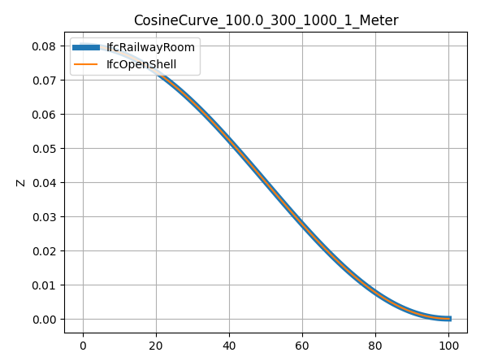

# Section 4 - Cant Alignment

## General

The `IfcSegmentedReferenceCurve` is a curve defined in the linear
parameter space of its base curve that is set in the attribute
BaseCurve. The base curve provides a basis for the positioning of the
collection of `IfcCurveSegment` occurrences. A deviating explicit position
of a curve segment (`IfcCurveSegment.Placement`) from the axis of the
basis curve produces a superelevation (i.e. depression or elevation from
the axis of the base curve). The superelevation rate of change is
directly proportionate to the curve segment parent curve
parameterization (`IfcCurveSegment.ParentCurve`) in the linear parameter
space of the base curve. If no deviation in the position of the curve
segment to the base curve axis is specified, the axes (Axis and
RefDirection) directions of `IfcAxis2Placement` are interpolated between
the initial curve segment placement and the placement of the subsequent
curve segment.

Informally, a `IfcSegmentedReferenceCurve` is a curve defined in a
"horizontal distance along base curve, deviating elevation" coordinate
system. The `IfcCurveSegment.ParentCurve` defines the change in cross
slope between rail heads over the length of the segment. When the
`IfcCurveSegment.Placement.Location` differs from the
`IfcCurveSegmentPlacement.Location` of the next segment, the
`IfcCurveSegment.ParentCurve` also defines the deviating elevation. If the
`IfcCurveSegment.Placement.Location` is the same as for the start of the
next segment, the deviating elevation along the length of the segment is
constant.

Evaluation of a `IfcCurveSegment` that is part of a
`IfcSegmentedReferenceCurve` is illustrated with an example (source model
GENERATED\_\_CantAlignment_CosineCurve_100.0_300_100_1_Meter.ifc).
Consider a `IfcCurveSegment` with a `IfcCosineSpiral` parent curve. The
curve segment has a position of (0.0,0.08,0.0) and an Axis of (0.0,
0.10606, 0.99436). The curve segment has a length of 100 m. The next
curve segment has a position of (100.0, 0.0, 0.0) and an Axis of (0.0,
0.0, 1.0). The constant and cosine terms are both 2500000 m.

The parent curve equation is
$\frac{D(s)}{L^{2}} = \frac{1}{A_{o}} + \frac{1}{A_{1}}\cos{(\pi\frac{s}{L})}$
where $A_{0}$ is the constant term and $A_{1}$ is the cosine term.

The deviating elevation at the start of the segment is
$D_{s} = D(0) = 0.08\ m$

The deviating elevation at the end of the segment is
$D_{e} = D(100) = 0.0\ m$

:warning: [Plot of deviating elevation (clean up and use consistent labels for all
graphs)] :warning:

The deviating elevation at the segment mid-point is
$D = (100m)^{2}\left( \frac{1}{250000m} + \frac{1}{250000m}\cos\left( \pi\frac{50m}{100m} \right) \right) = 0.04m$

The cross slope at the start of the segment is
$\theta_{s} = \tan^{- 1}\frac{0.99436}{0.10606} = 1.46454$

The cross slope at the end of the segment is
${\theta_{e} = \tan^{- 1}}\frac{1.0}{0.0} = 1.570796$

The cross slope at the segment mid-point is
$\theta = \theta_{s} + \left( \frac{\theta_{e} - \theta_{s}}{D_{e} - D_{s}} \right)\left( D - D_{s} \right) = 1.46484 + \left( \frac{1.570796 - 1.46454}{0.0m - 0.08m} \right)(0.04m - 0.08m) = 1.517968$

The Axis at the segment mid-point is (0.0, $\cos\theta$, $\sin\theta$) =
(0.0, 0.05234, 0.99863)

The slope of the deviating elevation curve is the derivative of the
parent curve.

$$\frac{d}{ds}D(s) = L^{2}\left( - \frac{1}{A_{1}}\frac{\pi}{L}\ \sin\left( \pi\frac{s}{L} \right) \right)$$

$$slope = (100m)^{2}\left( - \frac{1}{250000m}\frac{\pi}{100m}\sin\left( \pi\frac{50m}{100m} \right) \right) = - 0.00125663706$$

Placement Matrix

d = distance along horizontal

y = D(s)

slope = D'(s)

slope_Angle = atan(slope)

dx = cos(slope_angle)

dy = sin(slope_angle)

RefDirection, X-Direction = (dx,dy,0,0)

Z-Direction = (0.0, $\cos\theta$, $\sin\theta$, 0.0)

Y-Direction = Z-Direction $\bigotimes$ X-Direction

Axis = X-Direction $\bigotimes$ Y-Direction

$$M_{c} = \begin{bmatrix}
X.x & Y.x & Axis.x & d \\
X.y & Y.y & Axis.y & 0 \\
X.z & Y.z & Axis.z & y \\
0 & 0 & 0 & 1
\end{bmatrix}$$

Matrix multiple cant, horizontal, and vertical to get placement in 3D.
Note however that $M_{h}$ has the X-Y plane coordinate. The "X"
coordinate in $M_{c}$ represents the "distance along" the horizontal
alignment. If this value is multiplied with (X,Y) in $M_{c}$, incorrect
coordinates will result. To remedy, revise $M_{c}$ as follows

$${M'}_{c} = \begin{bmatrix}
X.x & Y.x & Axis.x & 0 \\
X.y & Y.y & Axis.y & 0 \\
X.z & Y.z & Axis.z & D \\
0 & 0 & 0 & 1
\end{bmatrix}$$

The matrix multiplication rotates the vectors, but should not alter the
position. For this reason save the position columns of the $M_{v}'$ and
$M_{c}'$ matrices and then remove the position values

$$P_{v} = M_{v}'(column\ 4,\ set\ row\ 4\ value = 0)$$

$$P_{c} = M_{c}'(column\ 4,\ set\ row\ 4\ value = 0)$$

$$M_{v}" = M_{v}'(column\ 4\ set\ to\ 0,0,0,1)$$

$$M_{c}" = M_{c}'(column\ 4\ set\ to\ 0,0,0,1)$$

The 3D positioning vectors are computed from

$$M' = M_{h}M_{v}"M_{c}"$$

Finally, add back the positions $P_{v}$ and $P_{c}$

$$M = M' + \begin{bmatrix}
0 & 0 & 0 & P_{v}(1) \\
0 & 0 & 0 & P_{v}(2) \\
0 & 0 & 0 & P_{v}(3) \\
0 & 0 & 0 & 0
\end{bmatrix} + \begin{bmatrix}
0 & 0 & 0 & P_{c}(1) \\
0 & 0 & 0 & P_{c}(2) \\
0 & 0 & 0 & P_{c}(3) \\
0 & 0 & 0 & 0
\end{bmatrix}$$

The cant cross slope (inclination between railheads) is the Axis vector
and this vector rotates at the same rate as the cant changes in
elevation along the length of the segment.

## Deviation from EnrichIfc4x3 Reference Implementation

These calculations deviate from the ones performed by the EnrichIfc4x3
reference implementation. The calculations in the reference implement
yield coefficients for sine, cosine, and polynomial spirals that are
unitless. The IFC specification is clear that the coefficients have
units of length and are represented by `IfcLengthMeasure`.

## Constant Cant

Constant cant is unique compared to the cant equations related to spiral
geometry. Constant cant has a constant value and the rate of change is
0.0.

$$D(s) = D_{1}$$

$$\frac{d}{ds}D(s) = 0.0$$

Example

GENERATED\_\_CantAlignment_ConstantCant_100.0_inf_300_1_Meter.ifc

~~~
#61 = IFCALIGNMENTCANT(1FNFyDAJeHwv87wDZHIYI7, $, $, $, $, #131, $, 1.5);
#64 = IFCALIGNMENTCANTSEGMENT($, $, 0., 100., 0., 0., 0., 1.6E-1, .CONSTANTCANT.);
#112 = IFCSEGMENTEDREFERENCECURVE((#113), .F., #89, #127);
#113 = IFCCURVESEGMENT(.CONTINUOUS., #119, IFCLENGTHMEASURE(0.), IFCLENGTHMEASURE(100.), #123);
#119 = IFCAXIS2PLACEMENT3D(#120, #121, #122);
#120 = IFCCARTESIANPOINT((0., 0., 0.));
#121 = IFCDIRECTION((0., -0., 1.));
#122 = IFCDIRECTION((1., 0., 0.));
#123 = IFCLINE(#124, #125);
#124 = IFCCARTESIANPOINT((0., 0.));
#125 = IFCVECTOR(#126, 1.);
#126 = IFCDIRECTION((1., 0.));
#127 = IFCAXIS2PLACEMENT3D(#128, #129, #130);
#128 = IFCCARTESIANPOINT((100., 8.E-2, 0.));
#129 = IFCDIRECTION((-0., 1.06064981392206E-1, 9.94359200551929E-1));
~~~

In this example, #64, the StartCantRight should be the same as the
EndCantRight, but it's not. The constant cant is 0.08

The `IfcLine` is defined by a vector in (1,0) passing through point (0,0).
In this case, the segmented reference curve optional EndPoint is at
(100,0.08,0). The 0.08 establishes the constant cant value. This seems
like an error to me. The segment reference curve should have a zero
length segment with the correct placement. The linear segment should
have a placement at (0,0.08) if the line has a slope of (1,0). The line
should have a slope 0.08. y=mx+b, m = 0.08, b = 0, y = 0.08x, dy/dx =
0.08, :warning: **Should be #126 = IFCDIRECTION(cos(atan(0.08),sin(atan(0.08)) =
IFCDIRECTION(0.996815278,0.079745222) [???]** :warning:

## Linear Transition

IfcClothoid

Business logical to Geometry

$$a_{0} = D_{1}$$

$$A_{0} = \frac{L^{2}}{a_{0}}$$

$$a_{1} = \Delta D$$

$$A_{1} = \frac{L^{\frac{3}{2}}}{\sqrt{\left| a_{1} \right|}}\frac{a_{1}}{\left| a_{1} \right|}$$

Cant equation

$$\frac{D(s)}{L^{2}} = \frac{1}{A_{0}} + \frac{A_{1}}{\left| A_{1}^{3} \right|}s\ $$

Cant slope (rate of change of cant along the curve segment)

$$\frac{d}{ds}D(s) = L^{2}\frac{A_{1}}{\left| A_{1}^{3} \right|}$$

Example\
GENERATED\_\_CantAlignment_LinearTransition_100.0_300_1000_1_Meter.ifc

~~~
#61 = IFCALIGNMENTCANT(1FNFyDAJeHwv87wDZHIYI7, $, $, $, $, #131, $, 1.5);
#64 = IFCALIGNMENTCANTSEGMENT($, $, 0., 100., 0., 0., 1.6E-1, 0., .LINEARTRANSITION.);
#112 = IFCSEGMENTEDREFERENCECURVE((#113), .F., #89, #127);
#113 = IFCCURVESEGMENT(.CONTINUOUS., #119, IFCLENGTHMEASURE(0.), IFCLENGTHMEASURE(100.), #123);
#119 = IFCAXIS2PLACEMENT3D(#120, #121, #122);
#120 = IFCCARTESIANPOINT((0., 8.E-2, 0.));
#121 = IFCDIRECTION((8.48519579611424E-5, 1.06064947451428E-1, 9.94359200551929E-1));
#122 = IFCDIRECTION((9.99999680000154E-1, -7.99999744000123E-4, 0.));
#123 = IFCCLOTHOID(#124, -353.553390593274);
#124 = IFCAXIS2PLACEMENT2D(#125, #126);
#125 = IFCCARTESIANPOINT((0., 8.E-4));
#126 = IFCDIRECTION((1., 0.));
#127 = IFCAXIS2PLACEMENT3D(#128, #129, #130);
#128 = IFCCARTESIANPOINT((100., 0., 0.));
#129 = IFCDIRECTION((0., -0., 1.));
#130 = IFCDIRECTION((1., 0., 0.));
~~~

$$D_{1} = \frac{0 + 0.16}{2} = 0.08,m\ D_{2} = \frac{0 + 0}{2} = 0m,\ \mathrm{\Delta}D = 0 - 0.08 = -0.08m$$

$$f = \mathrm{\Delta}D = -0.08m$$

$$a_{0} = 0.08m$$

$$A_{0} = \frac{(100m)^{2}}{0.08m} = 125000m$$

$$a_{1} = - 0.08m$$

$$A_{1} = \frac{{(100m)}^{\frac{3}{2}}}{\sqrt{|-0.08m|}}\frac{-0.08m}{|-0.08m|} = - 3535.533906m$$

Evaluate

$$D(0m) = (100m)^{2}\left( \frac{1}{125000m} + 100m\frac{-3535.533906m}{\left| {-3535.533906m}^{3} \right|}0m \right) = 0.08m$$

$$D(50m) = (100m)^{2}\left( \frac{1}{125000m} + \frac{100m(-3535.533906m)}{\left| (-3535.533906m)^{3} \right|}(50m) \right) = 0.04m$$

$$D(100m) = (100m)^{2}\left( \frac{1}{125000m} + \frac{100m(-3535.533906m)}{\left| (-3535.533906m)^{3} \right|}(100m) \right) = 0.0m$$

Placement

$$\left( DistAlong,\frac{L^{2}}{A_{0}},\ 0.0 \right) = \left( DistAlong,D_{s},\ 0.0 \right)$$

$$\left( 0.0,\frac{(100m)^{2}}{125000m},0.0 \right) = (0.0,\ 0.08m,\ 0.0)$$

$$angle = \tan^{- 1}{\left( \frac{A_{1}L^{2}}{\left| A_{1}^{3} \right|} \right) = \tan^{-1}\left( \frac{(-3535.533906m)(100m)^{2}}{\left| (-3535.533906m)^{3} \right|} \right)} = -0.0008$$

$$RefDirection = \left( \cos(-0.0008),\sin(-0.0008),0.0 \right) = (0.99999, -0.0008, 0.0)$$

## Helmert Curve

`IfcSecondOrderPolynomialSpiral`

$$\frac{D(s)}{L^{2}} = \frac{1}{A_{2}^{3}}s^{2} + \frac{A_{1}}{\left| A_{1}^{3} \right|}s + \frac{1}{A_{0}}$$

$$\frac{d}{ds}D(s) = L^{2}\left( \frac{2s}{A_{2}^{3}} + \frac{A_{1}}{\left| A_{1}^{3} \right|} \right)$$

Business logic to geometry

$$D_{1} = D_{sl} + D_{sr},\ D_{2} = D_{el} + D_{er},\ \mathrm{\Delta}D = D_{2} - D_{1}$$

$$f = \mathrm{\Delta}D$$

The polynomial coefficients must have units of length. The basic form of
the coefficient of the $i^{th}$ term is

$$A_{i} = \frac{L^{\frac{i + 2}{i + 1}}}{\sqrt[(i + 1)]{\left| a_{i} \right|}}\frac{a_{i}}{\left| a_{i} \right|}$$

First half:

$$\frac{D(s)}{\left( \frac{L}{2} \right)^{2}} = \frac{1}{A_{2}^{3}}s^{2} + \frac{A_{1}}{\left| A_{1}^{3} \right|}s + \frac{1}{A_{0}}$$

Constant Term: $a_{01} = 2D_{1}$,
$A_{01} = \frac{L^{2}}{\left| a_{o1} \right|}\frac{a_{01}}{\left| a_{o1} \right|}$

Linear Term: $a_{11} = 0$,
$A_{11} = \frac{L^{\frac{3}{2}}}{\sqrt{\left| a_{11} \right|}}\frac{a_{11}}{\left| a_{11} \right|}$

Quadratic Term: $a_{21} = 4f$,
$A_{21} = \frac{L^{4\text{/}3}}{\sqrt[3]{\left| a_{21} \right|}}\frac{a_{21}}{\left| a_{21} \right|}$

Second Half:

Constant Term: $a_{02} = -2f + 2D_{1}$,
$A_{02} = \frac{L^{2}}{\left| a_{02} \right|}\frac{a_{01}}{\left| a_{02} \right|}$

Linear Term: $a_{12} = 8f$,
$A_{12} = \frac{L^{\frac{3}{2}}}{\sqrt{\left| a_{12} \right|}}\frac{a_{12}}{\left| a_{12} \right|}$

Quadratic Term: $a_{22} = -4f$,
$A_{22} = \frac{L^{\frac{4}{3}}}{\sqrt[3]{\left| a_{22} \right|}}\frac{a_{22}}{\left| a_{22} \right|}$

Example:

File: GENERATED\_\_CantAlignment_HelmertCurve_100.0_300_1000_1_Meter.ifc

~~~
#61 = IFCALIGNMENTCANT(1FNFyDAJeHwv87wDZHIYI7, $, $, $, $, #150, $, 1.5);
#64 = IFCALIGNMENTCANTSEGMENT($, $, 0., 100., 0., 0., 0., 1.6E-1, .HELMERTCURVE.);
#120 = IFCSEGMENTEDREFERENCECURVE((#121, #138), .F., #97, #146);
#121 = IFCCURVESEGMENT(.CONTSAMEGRADIENTSAMECURVATURE., #131, IFCLENGTHMEASURE(0.), IFCLENGTHMEASURE(50.), #135);
#131 = IFCAXIS2PLACEMENT3D(#132, #133, #134);
#132 = IFCCARTESIANPOINT((0., 8.E-2, 0.));
#133 = IFCDIRECTION((-0., 1.06064981392206E-1, 9.94359200551929E-1));
#134 = IFCDIRECTION((1., 0., 0.));
#135 = IFCSECONDORDERPOLYNOMIALSPIRAL(#136, -146.200886910643, $, 625.);
#136 = IFCAXIS2PLACEMENT2D(#137, $);
#137 = IFCCARTESIANPOINT((0., 0.));
#138 = IFCCURVESEGMENT(.CONTINUOUS., #139, IFCLENGTHMEASURE(50.), IFCLENGTHMEASURE(50.), #143);
#139 = IFCAXIS2PLACEMENT3D(#140, #141, #142);
#140 = IFCCARTESIANPOINT((50., 4.E-2, 0.));
#141 = IFCDIRECTION((-2.52784639988507E-4, -1.57990298878961E-1, 9.87440631916706E-1));
#142 = IFCDIRECTION((9.99998720000819E-1, -1.59999897600066E-3, 0.));
#143 = IFCSECONDORDERPOLYNOMIALSPIRAL(#144, 146.200886910643, -125., 312.5);
#144 = IFCAXIS2PLACEMENT2D(#145, $);
#145 = IFCCARTESIANPOINT((0., 0.));
#146 = IFCAXIS2PLACEMENT3D(#147, #148, #149);
#147 = IFCCARTESIANPOINT((100., 0., 0.));
#148 = IFCDIRECTION((0., -0., 1.));
#149 = IFCDIRECTION((1., 0., 0.));
#150 = IFCLOCALPLACEMENT($, #151);
#151 = IFCAXIS2PLACEMENT3D(#152, $, $);
#152 = IFCCARTESIANPOINT((0., 0., 0.));
~~~

$$L = 100m$$

$$D_{sl} = 0m,\ D_{el} = 0m$$

$$D_{sr} = 0.16m,\ D_{er} = 0m$$

$$D_{1} = 0 + 0.16m = 0.16m$$

$$D_{2} = 0 + 0 = 0.m$$

$$\Delta D = 0.0 - 0.16 = -0.16m$$

$$f = \Delta D = -0.16m$$

First half:

$$a_{01} = 2D_{1} = 0.32m$$

$$A_{01} = \frac{L^{2}}{\left| a_{o1} \right|}\frac{a_{01}}{\left| a_{o1} \right|} = \frac{(100m)^{2}}{|0.32m|}\frac{0.32m}{|0.32m|} = 31250m$$

$$a_{11} = 0,\ A_{11} = 0$$

$$a_{21} = 4f = 4(-0.64m) = -0.64m$$

$$A_{21} = \frac{L^{4\text{/}3}}{\sqrt[3]{\left| a_{21} \right|}}\frac{a_{21}}{\left| a_{21} \right|} = \frac{(100m)^{4\text{/}3}}{\sqrt[3]{| - 0.64m|}}\frac{-0.64m}{|-0.64m|} = -538.6086725m$$

$$D(0m) = (50m)^{2}\left( \frac{1}{31250m} + \frac{1}{(-538.6086725m)^{3}}(0m)^{2} \right) = 0.08m$$

$$D(50m) = (50m)^{2}\left( \frac{1}{31250m} + \frac{1}{(-538.6086725m)^{3}}(50m)^{2} \right) = 0.04m$$

Placement Y = 0.08

Change in cant = $D(50) - D(0) = 0.04 - 0.08= -0.04$

$$Y = 0.08 - 0.04 = 0.04$$

$$slope = (50m)^{2}\frac{(2)(50m)}{(-538.6086725m)^{3}} = -0.0016$$

$$dx = cos(\tan^{-1}{-0.0016)) = 0.99999872}$$

$$dy = \sin\left( \tan^{-1}(-0.0016) \right) = -0.0015999795$$

Second Half:

$$a_{02} = -f + D_{1} = -(-0.16m) + 0.16m = 0.32m$$

$$A_{02} = \frac{L^{2}}{\left| a_{02} \right|}\frac{a_{01}}{\left| a_{02} \right|} = \frac{(100m)^{2}}{|0.32m|}\frac{0.32m}{|0.32m|} = 31250m$$

$$a_{12} = 4f = 4(-0.16m) = -0.64m$$

$$A_{12} = \frac{L^{\frac{3}{2}}}{\sqrt{\left| a_{12} \right|}}\frac{a_{12}}{\left| a_{12} \right|} = \frac{(100m)^{\frac{3}{2}}}{\sqrt{|-0.64m|}}\frac{-0.64m}{|-0.64m|} = -1250m$$

$$a_{22} = -2f = -2(-0.16m) = 0.32m$$

$$A_{22} = \frac{L^{\frac{4}{3}}}{\sqrt[3]{\left| a_{22} \right|}}\frac{a_{22}}{\left| a_{22} \right|} = \frac{(100m)^{\frac{4}{3}}}{\sqrt[3]{|0.32m|}}\frac{0.32m}{|0.32m|} = 678.6044041m$$

$$slope = (100m)^{2}\left( \frac{(2)(50m)}{(678.6044041m)^{3}} + \frac{-1250m}{|(-1250m)^{3}|} \right) = -0.0032$$

$$dx = cos(\tan^{-1}{(-0.0032)) = 0.99999488}$$

$$dy = \sin\left( \tan^{-1}(-0.0032) \right) = -0.0031999836$$

$$D(50m) = (50m)^{2}\left( \frac{1}{(678.6044041m)^{3}}(50m)^{2} + \frac{-1250m}{\left| (-1250m)^{3} \right|}(50m) + \frac{1}{31250m} \right) = 0.02m$$

$$D(100m) = (50m)^{2}\left( \frac{1}{(678.6044041m)^{3}}(100m)^{2} + \frac{-1250m}{\left| (-1250m)^{3} \right|}(100m) + \frac{1}{31250m} \right) = 0.0m$$

## Bloss Curve

$$\frac{D(s)}{L^{2}} = \frac{A_{3}}{\left| A_{3}^{5} \right|}s^{3} + \frac{1}{A_{2}^{3}}s^{2} + \frac{A_{1}}{2\left| A_{1}^{3} \right|}s + \frac{1}{A_{0}}$$

$$\frac{d}{ds}D(s) = L^{2}\left( \frac{3A_{3}}{\left| A_{3}^{5} \right|}s^{2} + \frac{2}{A_{2}^{3}}s + \frac{A_{1}}{2\left| A_{1}^{3} \right|} \right)$$

$$D_{1} = \frac{D_{sl} + D_{sr}}{2},\ D_{2} = \frac{D_{el} + D_{er}}{2},\ \mathrm{\Delta}D = D_{2} - D_{1}$$

$$f = \mathrm{\Delta}D$$

The polynomial coefficients must have units of length. The basic form of
the coefficient of the $i^{th}$ term is

$$A_{i} = \frac{L^{\frac{i + 2}{i + 1}}}{\sqrt[(i + 1)]{\left| a_{i} \right|}}\frac{a_{i}}{\left| a_{i} \right|}$$

Perform a dimensional analysis with $l$ representing term with length
units. We see that the resulting coefficient $A_{i}$ has units of length.

$$\frac{l^{\frac{i + 2}{i + 1}}}{\sqrt[(i + 1)]{|l|}}\frac{l}{|l|} = \frac{l^{\frac{i + 2}{i + 1}}}{l^{\frac{1}{i + 1}}} = l^{\frac{i + 2}{i + 1}}l^{\frac{- 1}{(i + 1)}} = l^{\frac{i + 1}{i + 1}} = l$$

Constant Term

$$a_{0} = D_{1},\ A_{0} = \frac{L^{2}}{\left| a_{0} \right|}\frac{a_{0}}{\left| a_{0} \right|}$$

Linear Term

$$a_{1} = 0,\ A_{1} = \frac{L^{\frac{3}{2}}}{\sqrt{\left| a_{1} \right|}}\frac{a_{1}}{\left| a_{1} \right|}$$

Quadratic Term

$$a_{2} = 3f,\ A_{2} = \frac{L^{\frac{4}{3}}}{\sqrt[3]{\left| a_{2} \right|}}\frac{a_{2}}{\left| a_{2} \right|}$$

Cubic Term

$$a_{3} = - 2f,\ A_{3} = \frac{L^{\frac{5}{4}}}{\sqrt[4]{\left| a_{3} \right|}}\ \frac{a_{3}}{\left| a_{3} \right|}$$

Example

GENERATED\_\_CantAlignment_BlossCurve_100.0_1000_300_1_Meter.ifc

~~~
#61 = IFCALIGNMENTCANT(1FNFyDAJeHwv87wDZHIYI7, $, $, $, $, #134, $, 1.5);
#64 = IFCALIGNMENTCANTSEGMENT($, $, 0., 100., 0., 0., 0., 1.6E-1, .BLOSSCURVE.);
#112 = IFCSEGMENTEDREFERENCECURVE((#113), .F., #89, #130);
#113 = IFCCURVESEGMENT(.CONTINUOUS., #123, IFCLENGTHMEASURE(0.), IFCLENGTHMEASURE(100.), #127);
#123 = IFCAXIS2PLACEMENT3D(#124, #125, #126);
#124 = IFCCARTESIANPOINT((0., 0., 0.));
#125 = IFCDIRECTION((0., -0., 1.));
#126 = IFCDIRECTION((1., 0., 0.));
#127 = IFCTHIRDORDERPOLYNOMIALSPIRAL(#128, -158.113883008419, 160.914897434272, $, $);
#128 = IFCAXIS2PLACEMENT2D(#129, $);
#129 = IFCCARTESIANPOINT((0., 0.));
#130 = IFCAXIS2PLACEMENT3D(#131, #132, #133);
#131 = IFCCARTESIANPOINT((100., 8.E-2, 0.));
#132 = IFCDIRECTION((-0., 1.06064981392206E-1, 9.94359200551929E-1));
#133 = IFCDIRECTION((1., 0., 0.));
~~~

$$D_{1} = \frac{0 + 0}{2} = 0m,\ D_{2} = \frac{0 + 0.16}{2} = 0.08m,\ \mathrm{\Delta}D = 0.08 - 0 = 0.08m$$

$$f = \mathrm{\Delta}D = 0.08m$$

Constant Term
$$a_{0} = 0m,\ A_{0} = \frac{L^{2}}{\left| a_{0} \right|}\frac{a_{0}}{\left| a_{0} \right|} = \ 0m$$

Linear Term
$A_{1} = \ 0m$

Quadratic Term

$a_{2} = 3f = 3(0.08m) = 0.24m,\ A_{2} = \frac{(100m)^{\frac{4}{3}}}{\sqrt[3]{0.24m}}\left( \frac{0.24m}{|0.24m|} \right) = 746.9007911m$

Cubic Term

$a_{3} = - 2f = - 2(0.08m) = - 0.16m,\ A_{3} = \frac{{(100m)}^{\frac{5}{4}}}{\sqrt[4]{0.16m}}\left( \frac{0.16m}{| - 0.16m|} \right) = - 500m$

Evaluate at start end of the segment

$$D(0m) = \frac{A_{3}L^{2}}{\left| A_{3}^{5} \right|}0^{3} + \frac{L^{2}}{A_{2}^{3}}0^{2} = 0.0m$$

$$D(50m) = \frac{- 500m}{\left| ( - 500m)^{5} \right|}(100m)^{2}(50m)^{3} + \frac{(100m)^{2}}{(746.9007811m)^{3}}(50m)^{2} = 0.04m$$

$$D(100m) = \frac{- 500m}{\left| ( - 500m)^{5} \right|}(100m)^{2}(100m)^{3} + \frac{(100m)^{2}}{(746.9007811m)^{3}}(100m)^{2} = 0.08m$$

Placement

$$\left( 0.0,\frac{L^{2}}{A_{0}},\ 0.0 \right) = (0.0,\ 0.0,\ 0.0)$$

## Cosine Curve

$$\frac{D(s)}{L^{2}} = \frac{1}{A_{0}} + \frac{1}{A_{1}}\cos\left( \pi\frac{s}{L} \right)$$

$$\frac{d}{ds}D(s) = L^{2}\left( - \frac{\pi}{L}\sin\left( \pi\frac{s}{L} \right) \right)$$

Constant term,
$A_{0} = \frac{L^{2}}{D_{1} + \frac{1}{2}\mathrm{\Delta}D}$

Cosine term, $A_{1} = \frac{L^{2}}{- \frac{1}{2}\mathrm{\Delta}D}$

Example

GENERATED\_\_CantAlignment_CosineCurve_100.0_1000_300_1_Meter.ifc

~~~
#61 = IFCALIGNMENTCANT(1FNFyDAJeHwv87wDZHIYI7, $, $, $, $, #134, $, 1.5);
#64 = IFCALIGNMENTCANTSEGMENT($, $, 0., 100., 0., 0., 0., 1.6E-1, .COSINECURVE.);
#112 = IFCSEGMENTEDREFERENCECURVE((#113), .F., #89, #130);
#113 = IFCCURVESEGMENT(.CONTINUOUS., #123, IFCLENGTHMEASURE(0.), IFCLENGTHMEASURE(100.), #127);
#123 = IFCAXIS2PLACEMENT3D(#124, #125, #126);
#124 = IFCCARTESIANPOINT((0., 0., 0.));
#125 = IFCDIRECTION((0., -0., 1.));
#126 = IFCDIRECTION((1., 0., 0.));
#127 = IFCCOSINESPIRAL(#128, -2500., 2500.);
#128 = IFCAXIS2PLACEMENT2D(#129, $);
#129 = IFCCARTESIANPOINT((0., 0.));
#130 = IFCAXIS2PLACEMENT3D(#131, #132, #133);
#131 = IFCCARTESIANPOINT((100., 8.E-2, 0.));
#132 = IFCDIRECTION((-0., 1.06064981392206E-1, 9.94359200551929E-1));
~~~

$$D_{1} = \frac{0 + 0}{2} = 0m,\ D_{2} = \frac{0 + 0.16}{2} = 0.08m,\ \mathrm{\Delta}D = 0.08 - 0 = 0.08m$$

$$A_{0} = \frac{({100m)}^{2}}{0 + \frac{1}{2}0.08m} = 250000\ m$$

$$A_{1} = \frac{{(100m)}^{2}}{- \frac{1}{2}0.08m} = - 250000\ m$$

$$D(s) = \frac{{(100m)}^{2}}{250000m} + (\frac{({100m)}^{2}}{- 250000m})\cos\left( \pi\frac{s}{100} \right)$$

Evaluate

$$D(0m) = \frac{{(100m)}^{2}}{250000m} - \frac{{(100m)}^{2}}{250000m}\cos(0) = 0\ m$$

$$D(50m) = \frac{({100m)}^{2}}{250000m} - \frac{(100m)^{2}}{250000m}\cos\left( \pi\frac{50m}{100m} \right) = 0.04\ m$$

$$D(100m) = \frac{({100m)}^{2}}{250000m} - \frac{(100m)^{2}}{250000m}\cos\left( \pi\frac{100m}{100m} \right) = 0.08\ m$$

## Sine Curve

$$\frac{D(s)}{L^{2}} = \frac{1}{A_{0}} + \frac{A_{1}}{\left| A_{1} \right|}\left( \frac{1}{A_{1}} \right)^{2}s + \frac{1}{A_{2}}\sin\left( 2\pi\frac{s}{L} \right)$$

$$\frac{d}{ds}D(s) = L^{2}\left( \frac{A_{1}}{\left| A_{1} \right|}\left( \frac{1}{A_{1}} \right)^{2} + \frac{2\pi}{LA_{2}}\cos\left( 2\pi\frac{s}{L} \right) \right)$$

Constant term: $A_{0} = \frac{L^{2}}{D_{1}}\ $

Linear term: $A_{1} = \frac{L^{\frac{3}{2}}}{\sqrt{\mathrm{\Delta}D}}$

Sine term: $A_{2} = \frac{L^{2}}{- \frac{1}{2\pi}\mathrm{\Delta}D}$

Example

GENERATED\_\_CantAlignment_SineCurve_100.0_300_1000_1_Meter.ifc

~~~
#61 = IFCALIGNMENTCANT(1FNFyDAJeHwv87wDZHIYI7, $, $, $, $, #134, $, 1.5);
#64 = IFCALIGNMENTCANTSEGMENT($, $, 0., 100., 0., 0., 1.6E-1, 0., .SINECURVE.);
#112 = IFCSEGMENTEDREFERENCECURVE((#113), .F., #89, #130);
#113 = IFCCURVESEGMENT(.CONTINUOUS., #123, IFCLENGTHMEASURE(0.), IFCLENGTHMEASURE(100.), #127);
#123 = IFCAXIS2PLACEMENT3D(#124, #125, #126);
#124 = IFCCARTESIANPOINT((0., 8.E-2, 0.));
#125 = IFCDIRECTION((-0., 1.06064981392206E-1, 9.94359200551929E-1));
#126 = IFCDIRECTION((1., 0., 0.));
#127 = IFCSINESPIRAL(#128, 7853.98163397448, -353.553390593274, 1250.);
#128 = IFCAXIS2PLACEMENT2D(#129, $);
#129 = IFCCARTESIANPOINT((0., 0.));
#130 = IFCAXIS2PLACEMENT3D(#131, #132, #133);
#131 = IFCCARTESIANPOINT((100., 0., 0.));
#132 = IFCDIRECTION((0., -0., 1.));
#133 = IFCDIRECTION((1., 0., 0.));
~~~

$$D_{1} = \frac{0m + 0.16m}{2} = 0.08m,\ D_{2} = \frac{0 + 0}{2} = 0m,\ \mathrm{\Delta}D = 0 - 0.08 = - 0.08m$$

Constant term:
$A_{0} = \frac{L^{2}}{D_{1}} = \frac{(100m)^{2}}{0.08m} = 125000m$

Linear term:
$A_{1} = \frac{L^{\frac{3}{2}}}{\sqrt{\mathrm{\Delta}D}} = \frac{(100m)^{\frac{3}{2}}}{\sqrt{| - 0.08m|}}\frac{- 0.08m}{| - 0.08m|} = - 3535.533906m$

Sine term:
$A_{2} = \frac{L^{2}}{- \frac{1}{2\pi}\mathrm{\Delta}D} = \frac{(100m)^{2}}{- \frac{1}{2\pi}( - 0.08m)} = 78539.81634m$

$$D(0m) = \frac{(100m)^{2}}{125000m} + \left( \frac{- 3535.533906m}{| - 3535.533906m|} \right)\left( \frac{1}{- 3535.533906m} \right)^{2}(0m)(100m)^{2} + \frac{(100m)^{2}}{78539.81634m}\sin\left( 2\pi\frac{0m}{100m} \right) = 0.08m$$

$$D(50m) = \frac{(100m)^{2}}{125000m} + \left( \frac{- 3535.533906m}{| - 3535.533906m|} \right)\left( \frac{1}{- 3535.533906m} \right)^{2}(50m)(100m)^{2} + \frac{(100m)^{2}}{78539.81634m}\sin\left( 2\pi\frac{50m}{100m} \right) = 0.04m$$

$$D(100m) = \frac{(100m)^{2}}{125000m} + \left( \frac{- 3535.533906m}{| - 3535.533906m|} \right)\left( \frac{1}{- 3535.533906m} \right)^{2}(100m)(100m)^{2} + \frac{(100m)^{2}}{78539.81634m}\sin\left( 2\pi\frac{100m}{100m} \right) = 0.0m$$

## Viennese Bend

Parent Curve: `IfcSeventhOrderPolynomialSpiral`

$$\frac{D(s)}{L^{2}} = \frac{A_7}{|A_7^9|}s^7 + \frac{1}{A_6^7}s^6 + \frac{A_5}{|A_5^7|}s^5 + \frac{1}{A_4^5}s^4 + \frac{A_{3}}{\left| A_{3}^{5} \right|}s^{3} + \frac{1}{A_{2}^{3}}s^{2} + \frac{A_{1}}{2\left| A_{1}^{3} \right|}s + \frac{1}{A_{0}}$$

$$\frac{d}{ds}D(s) = L^{2}\left( \frac{7A_7}{|A_7^9|}s^6 + \frac{6}{A_6^7}s^5 + \frac{5A_5}{|A_5^7|}s^4 + \frac{4}{A_4^5}s^3 + \frac{3A_{3}}{\left| A_{3}^{5} \right|}s^{2} + \frac{2}{A_{2}^{3}}s + \frac{A_{1}}{2\left| A_{1}^{3} \right|} \right)$$

$$D_{1} = \frac{D_{sl} + D_{sr}}{2},\ D_{2} = \frac{D_{el} + D_{er}}{2},\ \mathrm{\Delta}D = D_{2} - D_{1}$$

$$f = \mathrm{\Delta}D$$

The polynomial coefficients must have units of length. The basic form of
the coefficient of the $i^{th}$ term is

$$A_{i} = \frac{L^{\frac{i + 2}{i + 1}}}{\sqrt[(i + 1)]{\left| a_{i} \right|}}\frac{a_{i}}{\left| a_{i} \right|}$$

Perform a dimensional analysis with $l$ representing term with length
units. We see that the resulting coefficient $A_{i}$ has units of length.

$$\frac{l^{\frac{i + 2}{i + 1}}}{\sqrt[(i + 1)]{|l|}}\frac{l}{|l|} = \frac{l^{\frac{i + 2}{i + 1}}}{l^{\frac{1}{i + 1}}} = l^{\frac{i + 2}{i + 1}}l^{\frac{- 1}{(i + 1)}} = l^{\frac{i + 1}{i + 1}} = l$$

Constant Term

$$a_{0} = D_{1}, A_{0} = \frac{L^{2}}{\left| a_{0} \right|}\frac{a_{0}}{\left| a_{0} \right|}$$

Linear Term

$$a_{1} = 0, A_{1} = \frac{L^{\frac{3}{2}}}{\sqrt{\left| a_{1} \right|}}\frac{a_{1}}{\left| a_{1} \right|}$$

Quadratic Term

$$a_{2} = 0, A_{2} = \frac{L^{\frac{4}{3}}}{\sqrt[3]{\left| a_{2} \right|}}\frac{a_{2}}{\left| a_{2} \right|}$$

Cubic Term

$$a_{3} = 0, A_{3} = \frac{L^{\frac{5}{4}}}{\sqrt[4]{\left| a_{3} \right|}}\ \frac{a_{3}}{\left| a_{3} \right|}$$

Quartic Term

$$a_{4} = 35f, A_{4} = \frac{L^{\frac{6}{5}}}{\sqrt[5]{\left| a_{4} \right|}}\ \frac{a_{4}}{\left| a_{4} \right|}$$

Quintic Term

$$a_{5} = -84f, A_{5} = \frac{L^{\frac{7}{6}}}{\sqrt[6]{\left| a_{5} \right|}}\ \frac{a_{5}}{\left| a_{5} \right|}$$

Sextic Term

$$a_{6} = 70f, A_{6} = \frac{L^{\frac{8}{7}}}{\sqrt[7]{\left| a_{6} \right|}}\ \frac{a_{6}}{\left| a_{6} \right|}$$

Septic Term

$$a_{7} = -20f, A_{7} = \frac{L^{\frac{9}{8}}}{\sqrt[8]{\left| a_{7} \right|}}\ \frac{a_{7}}{\left| a_{7} \right|}$$

### Example
[GENERATED__CantAlignment_VienneseBend_100.0_300_1000_1_Meter.ifc](https://github.com/bSI-RailwayRoom/IFC-Rail-Unit-Test-Reference-Code/blob/master/alignment_testset/IFC-WithGeneratedGeometry/GENERATED__CantAlignment_VienneseBend_100.0_300_1000_1_Meter.ifc)

~~~
#61=IFCALIGNMENTCANT('1FNFyDAJeHwv87wDZHIYI7',$,$,$,$,$,$,1.5);
#62=IFCALIGNMENTSEGMENT('1FNFyHAJeHwuDtwDZHIYI3',#3,$,$,$,$,$,#64);
#64=IFCALIGNMENTCANTSEGMENT($,$,0.,100.,0.,0.,0.1,0.03,.VIENNESEBEND.);

#79=IFCSEGMENTEDREFERENCECURVE((#104),.F.,#78,$);
#99=IFCSEVENTHORDERPOLYNOMIALSPIRAL(#98,185.935683676356,-169.870955956539,180.001218460868,-241.197489008512,$,$,$,200000.);
#100=IFCCARTESIANPOINT((0.,0.05,0.));
#101=IFCDIRECTION((0.,0.0665190105237739,0.997785157856609));
#102=IFCDIRECTION((1.,0.,0.));
#103=IFCAXIS2PLACEMENT3D(#100,#101,#102);
#104=IFCCURVESEGMENT(.DISCONTINUOUS.,#103,IFCLENGTHMEASURE(0.),IFCLENGTHMEASURE(100.),#99);
~~~

$$D_{sl} = 0.0$$
$$D_{el} = 0.0$$
$$D_{sr} = 0.1$$
$$D_{er} = 0.03$$

$$D_{1} = \frac{0 + 0.1}{2} = 0.05m, D_{2} = \frac{0 + 0.03}{2} = 0.015m,\ \mathrm{\Delta}D = 0.015 - 0.05 = -0.035m$$

$$f = \mathrm{\Delta}D = -0.035m$$

Constant Term
$$a_{0} = 0.05m, A_{0} = \frac{100m^{2}}{\left| 0.05 \right|}\frac{0.05}{\left| 0.05 \right|} = 20000m$$

Linear Term
$$a_{1} = 0, A_{1} = 0m$$

Quadratic Term

$$a_{2} = 0, A_{2} = 0m$$

Cubic Term

$$a_{3} = 0, A_{3} = 0m$$

Quartic Term

$$a_{4} = 35(-0.035m) = -1.225m, A_{4} = \frac{100m^{\frac{6}{5}}}{\sqrt[5]{\left| -1.225m \right|}}\ \frac{-1.225m}{\left| -1.225m \right|} = -241.1974890085123m$$

Quintic Term

$$a_{5} = -84(-0.035m)=2.94m, A_{5} = \frac{100m^{\frac{7}{6}}}{\sqrt[6]{\left| 2.94m \right|}}\ \frac{2.94m}{\left| 2.94m \right|} = 180.0012184608678m$$

Sextic Term

$$a_{6} = 70(-0.035m)=-2.45m, A_{6} = \frac{100m^{\frac{8}{7}}}{\sqrt[7]{\left| -2.45m \right|}}\ \frac{-2.45m}{\left|-2.45m\right|} = -169.87095595653895m$$

Septic Term

$$a_{7} = -20(-0.035m) = 0.7m, A_{7} = \frac{100m^{\frac{9}{8}}}{\sqrt[8]{\left| 0.7m \right|}}\ \frac{0.7m}{\left| 0.7m \right|} = 185.93568367635672m$$

Evaluate at start, middle, and end of the segment.

$Cant(u) = D(u) - D(0) + Cant(0)$

$Cant(0)$ = `IfcCurveSegment.Placement.Location.Coordinates[2]` = $0.05m$

$$D(0m) = (100m)^2 \left(\frac{185.93568367635672m}{|(185.93568367635672m)^9|}(0m)^7 + \frac{1}{(-169.87095595653895m)^7}(0m)^6 + \frac{180.0012184608678m}{|(180.0012184608678m)^7|}(0m)^5 + \frac{1}{(-241.1974890085123m)^5}(0m)^4  + \frac{1}{20000m}\right) = 0.5m$$

$$Cant(0m) = 0.5m - 0.5m + 0.05m = 0.05m$$

$$D(50m) = (100m)^2 \left(\frac{185.93568367635672m}{|(185.93568367635672m)^9|}(50m)^7 + \frac{1}{(-169.87095595653895m)^7}(50m)^6 + \frac{180.0012184608678m}{|(180.0012184608678m)^7|}(50m)^5 + \frac{1}{(-241.1974890085123m)^5}(50m)^4  + \frac{1}{20000m}\right) = 0.4825m$$

$$Cant(50m) = 0.4825m - 0.5m + 0.05m = 0.0325m$$

$$D(100m) = (100m)^2 \left(\frac{185.93568367635672m}{|(185.93568367635672m)^9|}(100m)^7 + \frac{1}{(-169.87095595653895m)^7}(100m)^6 + \frac{180.0012184608678m}{|(180.0012184608678m)^7|}(100m)^5 + \frac{1}{(-241.1974890085123m)^5}(100m)^4  + \frac{1}{20000m}\right) = 0.465m$$

$$Cant(100m) = 0.465m - 0.5m + 0.05m = 0.015m$$

Placement

$$\left( 0.0,\frac{L^{2}}{A_{0}},\ 0.0 \right) = (0.0, 0.05, 0.0)$$
