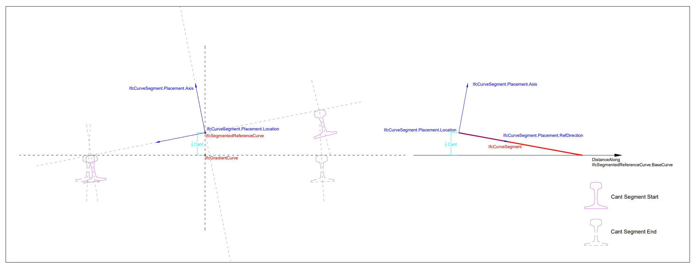
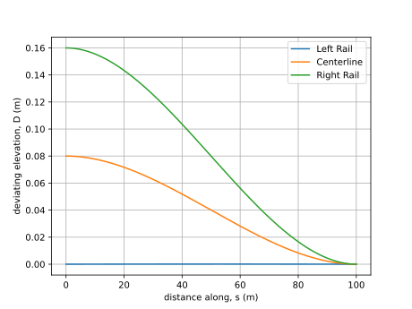
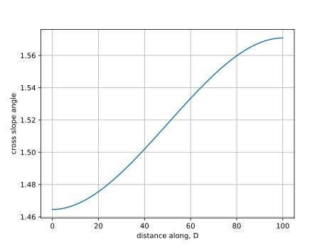

# Section 4.0 - Cant Alignment

Cant (also called superelevation) is the transverse inclination of a railway track cross-section: the elevation difference between the two railheads when one rail is raised above the other. By tilting the track into a curve, cant directs a component of gravitational force inward, partially offsetting the centrifugal acceleration experienced by vehicles negotiating the curve. The result is improved ride quality, reduced wheel–rail lateral forces, and the ability to operate at higher speeds through curves without exceeding comfort or safety limits.

Cant is measured as a length — the height difference between railheads — rather than as an angle. The conversion between the two depends on track gauge. `IfcAlignmentCant.RailHeadDistance` supplies the centre-to-centre distance between railheads, which is the lever arm for this conversion.

## 4.1 General

An `IfcSegmentedReferenceCurve` describes the cross slope of superelevated rail lines as a track banks through curves. When the point of rotation is about one of the railheads, the alignment elevation must deviate to accomodate the cross slope. 

An `IfcSegmentedReferenceCurve` also describes this deviation in elevation. As a subtype of `IfcCompositeCurve`, an `IfcSegmentedReferenceCurve` consists of an end to start collection of `IfcCurveSegment`. An `IfcSegmentedReferenceCurve` also has a `BasisCurve` which is typically an `IfcGradientCurve`.

Table 4.1-1 maps each `IfcAlignmentCantSegment.PredefinedType` to its corresponding parent curve type.

  Business Logic (`IfcAlignmentCantSegment.PredefinedType`) | Geometric Representation (`IfcCurveSegment.ParentCurve`)
  -----------------------------------------|-----------------------------------
  CONSTANTCANT                             |`IfcLine`
  LINEARTRANSITION                         |`IfcClothoid`
  HELMERTCURVE                             |`IfcSecondOrderPolynomialSpiral`
  BLOSSCURVE                               |`IfcThirdOrderPolynomialSpiral`
  COSINECURVE                              |`IfcCosineSpiral`
  SINECURVE                                |`IfcSineSpiral`
  VIENNESEBEND                             |`IfcSeventhOrderPolynomialSpiral`

  *Table 4.1-1 — Mapping of business logic to geometric representation for cant alignment*

### 4.1.1 Cant Transition

Cant transitions occur when the segment start elevation differs from the
segment start elevation of the next segment. The left section in Figure 4.1-1 shows the cross section of a rail line. At the start of the segment, right rail is elevated above the left rail. The y-ordinate of `IfcCurveSegment.Placement.Location` indicates the deviating elevation at the centerline between rails, which is one-half the cant value at the right rail. The y-ordinate of `IfcCurveSegment.Placement.Location` for the next segment indicates a value of 0.0 meaning that the cant transitioned from the starting value to zero over the length of the segment. This transition is the rotation of the right rail about the left rail, and the corresponding change in deviating elevation at the centerline over the length of the segment. The cant transition is shown in the right section of Figure 4.1.1-1 as a linear transition. `IfcCurveSegment.ParentCurve` defines how the transition occurs. Figure 4.1.1-2 shows a non-linear transition of the centerline and right rail deviating elevations. Notice that the deviating elevation of the left rail is constant at zero because it is the point of rotation.

When the segment start elevation is the same as the start of the next segment, the deviating elevation along the length of the segment is constant. This occurs when centrifugal forces are constant or zero, in constant radius curvature and straight sections of the railway, respectively.

*Figure 4.1.1-1 - cross section and elevation of a cant segment (source: bSI)*

*Figure 4.1.1-2 - Deviating elevation of rails*

The railhead cross slope angle is defined by the `IfcCurveSegment.Placement.Axis` attribute. The `Axis` direction is generally upwards. Figure 4.1.1-3 shows the cross slope angle for the transitions in Figure 4.1.1-2. The direction perpendicular to the plane of the railhead is about 1.46 rad at the start of the segment and increases to about 1.57 as the rotation decreases. When the left and right rails are at the same elevation, The cross slope angle is measured from the y-axis is $\tfrac{\pi}{2}$.

*Figure 4.1.1-3 - Rail head cross slope*

### 4.1.2 Coordinate System

The coordinate system is shown in Figure 4.1.1-1, but it is difficult to understand.

`IfcCurveSegment.Placement.RefDirection` is tangent to the "distance along" the base curve in the horizontal plane, (e.g. `IfcSegmentedReferenceCurve.BaseCurve` => `IfcGradientCurve.BaseCurve` => `IfcCompositeCurve`).

The railway cross section is in the plane defined by `Y` and `Z`. Looking in the positive sense down the alignment, `Y` is towards the left and `Z` is upwards. The cross slope angle is measured clockwise from `Y`.

### 4.1.3 Transition Functions
The transition functions used to shape cant variation have the same functional form as functions used for horizontal transition curves: line, clothoid (linear cant), Helmert, Bloss, cosine, sine, and Viennese bend. In practice, the cant transition type always matches the horizontal transition type and segment length, though IFC does not enforce this constraint.

As an example, the horizontal tangent direction, $\theta(t)$, and the radius of curvature, $\kappa(t)$, for a Helmert curve is a second order polynomial of the form

$$\theta(t) = \tfrac{t^{3}}{3A_{2}^{3}} + \tfrac{A_{1}}{2\left| A_{1}^{3} \right|}t^{2} + \tfrac{t}{A_{0}}$$

$$\kappa(t) = \tfrac{\theta(t)}{dt} = \tfrac{1}{A_{2}^{3}}t^{2} + \tfrac{A_{1}}{\left| A_{1}^{3} \right|}t + \tfrac{1}{A_{0}}$$

The cant deviating elevation for a Helmert transition is of the same form as the curvature

$$\tfrac{D(s)}{L^{2}} = \tfrac{1}{A_{2}^{3}}s^{2} + \tfrac{A_{1}}{\left| A_{1}^{3} \right|}s + \tfrac{1}{A_{0}}$$

The deviating elevation has the same functional form as the radius of curvature of the horizontal alignment segment. 

In IFC, the semantic cant profile is encoded in `IfcAlignmentCant` and its child `IfcAlignmentCantSegment` entities. The geometric representation is an `IfcSegmentedReferenceCurve`, which evaluates the cant at every point along the alignment and, in conjunction with the horizontal alignment `IfcCompositeCurve` and the vertical alignment `IfcGradientCurve`, produces the full 3D track centerline geometry.

Each `IfcCurveSegment` in an `IfcSegmentedReferenceCurve` is evaluated in a two-dimensional coordinate system whose axes are *distance along the horizontal alignment* $\ell$ and *deviating elevation* $D$. The deviating elevation is the vertical offset applied to the track centerline, away from the gradient curve, to produce the correct cross-slope angle at every point along the segment.

The `StartCantLeft` $D_{sl}$, `EndCantLeft` $D_{el}$, `StartCantRight` $D_{sr}$, and `EndCantRight` $D_{er}$ attributes of `IfcAlignmentCantSegment` determine $D_s$ and $D_e$ as the averages of their respective left and right values:

$$D_s = \tfrac{D_{sl} + D_{sr}}{2}, \quad D_e = \tfrac{D_{el} + D_{er}}{2} \quad \Delta D = D_e - D_s$$

The cross-slope angle $\phi$ at a given point is not obtained directly from the parent curve equation; instead it is interpolated between the start and end cross-slope angles encoded in the `Axis` vector of the `IfcCurveSegment.Placement`, using the deviating elevation as the interpolation parameter:

$$\phi(\ell) = \phi_s + \left(\tfrac{\phi_e - \phi_s}{\Delta D}\right)\bigl(D(\ell) - D_s\bigr)$$

$$\phi_s = \cos^{-1}\left(\tfrac{D_{sr} - D_{sl}}{D_{rh}} \right)$$

where $\phi_s$ and $\phi_e$ are the cross-slope angles at the start and end of the segment and $D(\ell)$ is the deviating elevation at $\ell$. The cross-slope angle $\phi$ is the angle from the transverse $y$ axis to the projection of the `Axis` vector onto the Y-Z plane. In sections without cant, $\phi = \tfrac{\pi}{2}$.

The cross-slope angle can be determined from the `Axis` vector as $\phi = tan^{-1}\left(\tfrac{Axis.dz}{Axis.dy}\right)$

Together, the distance along, the deviating elevation $D(\ell)$, and the cross-slope angle $\phi(\ell)$ fully specify a 3D placement frame for the track centerline at each $\ell$. Section 4.2 describes an algorithm for constructing that frame and composing it with the horizontal and vertical matrices to produce a 3D position.

All examples use a railhead distance $D_{rh} = 1.5\ m$.

## 4.2 Curve Segment Evaluation Algorithm

Cant segments are evaluated in a two-dimensional "distance along, deviating elevation" $(\ell,D(\ell))$ coordinate system in which $\ell$ is the distance measured along the horizontal `IfcCompositeCurve` and $D(\ell)$ is the deviating elevation: the vertical offset applied to the track centerline to accommodate the cross slope. Unlike horizontal and vertical segments, each cant point also carries a cross slope angle $\phi(s)$, making the local frame inherently three-dimensional.

Let $s_0 = $ `IfcAlignmentCantSegment.StartDistAlong`.

**Step 1 — Form the curve segment placement matrix $M_{CSP}$**

$M_{CSP}$ is constructed from `IfcCurveSegment.Placement`: $(s_p, D_p)$ is the `Location` (distance along, deviating elevation).

$\mathbf{Y}_p = \mathbf{Axis}_p \times \mathbf{RefDir}_p$

$\mathbf{X}_p = \mathbf{Y}_p \times \mathbf{Axis}_p$

$\mathbf{Z}_p = \mathbf{Axis}_p$

The placement in matrix form is

$$M_{CSP} = \begin{bmatrix} 
X_p.x & Y_p.x & Z_p.x & s_p \\
X_p.y & Y_p.y & Z_p.y & D_p \\
X_p.z & Y_p.z & Z_p.z & 0 \\
0 & 0 & 0 & 1 
\end{bmatrix}$$

**Step 2 — Evaluate the parent curve at the trim start - $M_{PCS}$**

Compute the deviating elevation $D_s = D(s_0)$ and the slope angle $\theta_s = \tan^{-1}(D'(s_0))$.

Compute the cross slope
$$\phi(s_0) = \phi_s + \left(\tfrac{\phi_e - \phi_s}{\Delta D}\right)(D(s_0) - D_s)$$

Because $D(s_0) = D_s,\ \phi(s_0) = \phi_s$.

Construct the orthoginal vectors

$$\mathbf{X}_{pcs} = (\cos\theta_s,\ \sin\theta_s,\ 0)$$
$$\mathbf{Z}_{pcs} = (0,\ \cos\phi_s,\ \sin\phi_s)$$
$$\mathbf{Y}_{pcs} = \mathbf{Z}_{pcs} \times \mathbf{X}_{pcs}$$
$$\mathbf{Axis}_{pcs} = \mathbf{X}_{pcs} \times \mathbf{Y}_{pcs}$$
$$\mathbf{RefDir}_{pcs} = \mathbf{Y}_{pcs} \times \mathbf{Axis}_{pcs}$$

In matrix form

$$M_{PCS} = \begin{bmatrix}
RefDir_{pcs}.x & Y_{pcs}.x & Axis_{pcs}.x & s_0 \\
RefDir_{pcs}.y & Y_{pcs}.y & Axis_{pcs}.y & D_s \\
RefDir_{pcs}.z & Y_{pcs}.z & Axis_{pcs}.z & 0 \\
0 & 0 & 0 & 1
\end{bmatrix}$$

**Step 3 — Evaluate the parent curve at the point under consideration, $\ell$ - $M_{PC\ell}$**

This step follows the same calculations as Step 2, except $D$ and $D'$ are evaluated at $\ell$.

The resulting matrix is

$$M_{PC\ell} = \begin{bmatrix}
RefDir_{\ell}.x & Y_{\ell}.x & Axis_{\ell}.x & {\ell} \\
RefDir_{\ell}.y & Y_{\ell}.y & Axis_{\ell}.y & D_{\ell} \\
RefDir_{\ell}.z & Y_{\ell}.z & Axis_{\ell}.z & 0 \\
0 & 0 & 0 & 1
\end{bmatrix}$$

**Step 4 — Compute resulting cant**

The resulting cant is the cant at the start of the segment plus the change from $s_0$ to $\ell$.

**Apply rotations**

Let $R$ be the 3x3 rotation matrix for each matrix $M$.

$R_c = R_{CSP} \times R_{PC\ell} \times R_{PCS}^T$

**Apply translation**

Let $T$ ge the 1x3 positional vector in column 4 for each matrix $M$.

$T_c = T_{CSP} + R_{PC\ell} - R_{PCS}$

**Combine into final matrix**

Treat $R$ and $T$ as 4x4 matrices and combine.

**[todo - need to represent this with property mathematics. this is effectively the same sort of separated rotation and translation calculation in step 5. they should be presented similarly]**

$M_c = R_c + T_c$

Step 5 is performed immediately for this point before moving to the next $\ell$.

**Step 5 — Combine with horizontal and vertical to produce the 3D placement matrix**

The cant result must be combined with the horizontal matrix $M_h$ (evaluated at distance $\ell$ along the `IfcCompositeCurve`) and the vertical matrix $M_v$ (evaluated at the same $\ell$). All three coordinate systems share the distance-along axis, so the positional components of $M_v$ and $M_c$ must be extracted before multiplication and added back afterward to avoid incorrectly rotating the position offsets.

Construct $M'_v$ as described in Section 3.2.

Construct $M'_c$ by zeroing the distance-along $\ell$ component in row 1, column 4 and moving the deviating elevation $D_{\ell}$ from row 2 to row 3 in column 4 of $M_c$:

$${M'}_c = \begin{bmatrix} 
X.x & Y.x & Z.x & 0 \\ 
X.y & Y.y & Z.y & 0 \\ 
X.z & Y.z & Z.z & D_{\ell} \\ 
0 & 0 & 0 & 1 
\end{bmatrix}$$

Extract position vectors from each modified matrix, $M'_v,\ M'_c$, (setting row 4 to zero), then zero column 4 before multiplying:

$$P_v = M'_v \text{ column 4, row 4 set to 0} = \begin{bmatrix} 0 \\ 0 \\ z \\ 0 \end{bmatrix}, \qquad P_c = M'_c \text{ column 4, row 4 set to 0} = \begin{bmatrix} 0 \\ 0 \\ D \\ 0 \end{bmatrix}$$

$$M''_v = M'_v \text{ with column 4 set to } (0,0,0,1)^T, \qquad M''_c = M'_c \text{ with column 4 set to } (0,0,0,1)^T$$

Multiply the three orientation matrices, then add back both position offsets:

$$M' = M_h \cdot M''_v \cdot M''_c$$

$$M_{3Dcant} = M' + 
\begin{bmatrix} 
0 & 0 & 0 & P_{v.x} \\
 0 & 0 & 0 & P_{v.y} \\ 
 0 & 0 & 0 & P_{v.z} \\ 
 0 & 0 & 0 & 0 
 \end{bmatrix} 
 + 
 \begin{bmatrix} 
 0 & 0 & 0 & P_{c.x} \\
  0 & 0 & 0 & P_{c.y} \\
   0 & 0 & 0 & P_{c.z} \\ 
   0 & 0 & 0 & 0 
   \end{bmatrix}$$

Column 4 of the final matrix $M_{3Dcant}$ is the full 3D position of the track centerline. Column 3 is the cross-slope direction, encoding the railhead superelevation at that point.

## 4.3 Constant Cant

Cant has a constant deviating elevation and cross-slope angle in rail segments between curves or in the circular portion of curves where the tracks are banked at a constant rate.

The parent curve is `IfcLine`. The slope-intercept form of a line is $y = mx + b$, where $m$ is the slope and $b$ is the $y$-intercept. The derivative is $y' = m$, and the second derivative is $y''= 0$.

In the context of cant, $D(s) = y'(x)$, so the deviating elevation is a constant value, $m$, and the rate of change of the deviating elevation $D'(s) = y''(x) = 0$.

### 4.3.1 Parent Curve Parametric Equations

The deviating elevation and its rate of change are given by the following equations.

$$D(s) = D_s = D_e$$

$$\tfrac{d}{ds}D(s) = D'(s) = 0.0$$

### 4.3.2 Semantic Definition to Geometry Mapping

Consider 100 m long segment of a railway that is turning towards the left. The right rail is raised 0.16 m through the circular portion of the curve. The semantic definition is

~~~
#64 = IFCALIGNMENTCANTSEGMENT($, $, 0., 100., 0., 0., 0.16, 0.16, .CONSTANTCANT.);
~~~

$D_s = \tfrac{0.0\ m + 0.16\ m}{2} = 0.08\ m$

$D_e = \tfrac{0.0\ m + 0.16\ m}{2} = 0.08\ m$

$\Delta D = D_e - D_s = 0.08\ m - 0.08\ m = 0.0\ m$

The parent curve has a constant deviating elevation at $0.08\ m$ and a slope of $0.0$.

Define the parent curve as an `IfcLine` passing through (0,0) in the direction (1,0).

~~~
#96=IFCCARTESIANPOINT((0.,0.));
#97=IFCDIRECTION((1.,0.));
#98=IFCVECTOR(#97,1.);
#99=IFCLINE(#96,#98);
~~~

The `IfcCurveSegment` trims a segment from the parent curve. The curve segment placement must capture the cross-slope rotation between the rail heads. For this reason the placement is an `IfcAxis2Placement3D` (instead of `IfcAxis2Placement2D` used for horizontal and vertical representations).

The cross-slope at the start of the segment is

$\phi_s = \cos^{-1}\left(\tfrac{D_{sr} - D_{sl}}{D_{rh}}\right) = \cos^{-1}\left(\tfrac{0.16 - 0.0}{1.5}\right) = 1.463926346$

The cross slope orientation is

$dy_z = cos(\phi_s) = cos(1.463926346) = 0.106666667$

$dz_z = sin(\phi_s) = sin(1.463926346) = 0.994294837$

~~~
#100=IFCCARTESIANPOINT((0.,0.08,0.));
#101=IFCDIRECTION((0.,0.10666666666666667,0.99429483666678176));
#102=IFCDIRECTION((1.,0.,0.));
#103=IFCAXIS2PLACEMENT3D(#100,#101,#102);
#104=IFCCURVESEGMENT(.DISCONTINUOUS.,#103,IFCLENGTHMEASURE(0.),IFCLENGTHMEASURE(100.),#99);
~~~

### 4.3.3 Compute Point on Curve

Compute the placement matrix for a point $\ell = 50\ m$ from the start of the curve segment using the algorithm in Section 4.2.

**Step 1 — Form the curve segment placement matrix $M_{CSP}$**

$\mathbf{RefDir}_p = (1,\ 0,\ 0)$

$\mathbf{Axis}_p = (0,\ 0.106667,\ 0.994295)$

$\mathbf{Y}_p = \mathbf{Axis}_p \times \mathbf{RefDir}_p = (0,\ 0.994295,\ -0.106667)$

$$M_{CSP} = \begin{bmatrix} 
        1 &         0 &         0 &         0 \\
       0 &  0.994295 &  0.106667 &      0.08 \\
        0 & -0.106667 &  0.994295 &         0 \\
        0 &         0 &         0 &         1
\end{bmatrix}$$

**Step 2 — Evaluate the parent curve at the trim start — $M_{PCS}$**

$s_0 = 0,\ D(0) = 0\ m,\ D'(0) = 0,\ \theta_s = 0$

For constant cant $\Delta D = 0$, so $\phi(s_0) = \phi_s = \phi_e = 1.463926346$.

$\mathbf{X}_s = (1,\ 0,\ 0)$

$\mathbf{Z}_s = (0,\ 0.106667,\ 0.994295)$

$\mathbf{Y}_s = \mathbf{Z}_s \times \mathbf{X}_s = (0,\ 0.994295,\ -0.106667)$

$\mathbf{Axis}_s = \mathbf{X}_s \times \mathbf{Y}_s = (0,\ 0.106667,\ 0.994295)$

$\mathbf{RefDir}_s = \mathbf{Y}_s \times \mathbf{Axis}_s = (1,\ 0,\ 0)$

$$M_{PCS} = \begin{bmatrix}
        1 &        0 &         0 &         0 \\
        0 &  0.994295 & -0.106667 &         0 \\
        0 &  0.106667 &  0.994295 &         0 \\
        0 &         0 &         0 &         1
\end{bmatrix}$$

**Step 3 — Evaluate the parent curve at $\ell = 50\ m$ — $M_{PC\ell}$**

$D(50\ m) = 0\ m,\ D'(50\ m) = 0,\ \theta_\ell = 0$

Since $\Delta D = 0$, $\phi(50\ m) = \phi_s = 1.463926346$.

$\mathbf{Z}_\ell = (0,\ 0.106667,\ 0.994295)$

$\mathbf{Y}_\ell = \mathbf{Z}_\ell \times \mathbf{X}_\ell = (0,\ 0.994295,\ -0.106667)$

**Y and Z dont match the matrix**

$$M_{PC\ell} = \begin{bmatrix}
        1 &        0 &         0 &        50 \\
        0 &  0.994295 & -0.106667 &         0 \\
        0 &  0.106667 &  0.994295 &         0 \\
        0 &         0 &         0 &         1
\end{bmatrix}$$

**Step 4 — Compute resulting cant**

$$M_c = M_{CSP} + M_{PC\ell} - M_{PCS}$$

**to do - need to show this calculation as the rotation and translation parts**

$$M_c = \begin{bmatrix} 
        1 &         0 &         0 &        50 \\
        0 &  0.994295 &  0.106667 &      0.08 \\
        0 & -0.106667 &  0.994295 &         0 \\
        0 &         0 &         0 &         1
\end{bmatrix}$$

## 4.4 Linear Transition

A linear transition in cant is represented with an `IfcClothoid`.

### 4.4.1 Parent Curve Parametric Equations

The deviating elevation and its rate of change are given by the following equations.

$$\tfrac{D(s)}{L^{2}} = \tfrac{1}{A_{0}} + \tfrac{A_{1}}{\left| A_{1}^{3} \right|}s\ $$

$$\tfrac{d}{ds}D(s) = L^{2}\tfrac{A_{1}}{\left| A_{1}^{3} \right|}$$

$$a_{0} = D_{s},\ A_{0} = \tfrac{L^{2/1}}{\sqrt[1]a_{0}}\tfrac{a_0}{\left|a_0\right|},\ A_{0} = \tfrac{L^{2}}{a_{0}}$$

$$a_1 = \Delta D,\ A_1 = \tfrac{L^{\tfrac{3}{2}}}{\sqrt{\left| a_{1} \right|}}\tfrac{a_{1}}{\left| a_{1} \right|}$$

$A_1$ is the clothoid constant.

### 4.4.2 Semantic Definition to Geometry Mapping

Consider an alignment segment that has a clothoid transition curve towards the left. The track banks at a constantly increasing rate resulting in a linear deviation in the right rail elevation relative to the left rail. The right rail raises 160 mm over the 100 m segment length.

The semantic representation of the cant alignment is

~~~
#64 = IFCALIGNMENTCANTSEGMENT($, $, 0., 100., 0., 0., 0.16, 0., .LINEARTRANSITION.);
~~~

Compute the parent curve parameters.

$D_{sl} = 0\ m\quad D_{el} = 0\ m$

$D_{sr} = 0.16\ m\quad D_{er} = 0\ m$

$D_s = \tfrac{(0.16 + 0)}{2} = 0.08\ m$

$D_e = \tfrac{(0 + 0)}{2} = 0\ m$

$\Delta D = D_e - D_s = 0.0 - 0.08 = -0.08\ m$

$a_0 = D_s = 0.08\ m,\ A_0 = \tfrac{(100\ m)^2}{0.08\ m} = 125000\ m$

$a_{1} = \Delta D = -0.08\ m \quad A_{1} = \tfrac{{(100\ m)}^{\tfrac{3}{2}}}{\sqrt{|-0.08\ m|}}\tfrac{-0.08\ m}{|-0.08\ m|} = -3535.533906\ m$

The clothoid parent curve is

~~~
#96=IFCCARTESIANPOINT((0.,0.));
#97=IFCDIRECTION((1.,0.));
#98=IFCAXIS2PLACEMENT2D(#96,#97);
#99=IFCCLOTHOID(#98,-3535.533905932738);
~~~

The cant segment begins with a deviating elevation of

$$D(0\ m) = (100\ m)^2\left(\tfrac{1}{125000} + \tfrac{-3535.533906}{|-3535.533906|^3}(0\ m)\right) = 0.08\ m$$

The slope at the start of the segment is

$$D'(0\ m) = (100\ m)^{2}\tfrac{-3535.533906}{\left| -3535.533906^{3} \right|} = -0.0008$$

$$\theta_0 = tan^{-1}(-0.0008) = -0.00079999$$

$dx_x = cos(\theta_0) = 0.999999680$

$dy_x = sin(\theta_0) = -0.000799999744$

The cross-slope at the start of the segment is

$\phi_s = \cos^{-1}\left(\tfrac{D_{sr} - D_{sl}}{D_{rh}}\right) = \cos^{-1}\left(\tfrac{0.16 - 0.0}{1.5}\right) = 1.463926346$

The cross slope orientation is

$dy_z = cos(\phi_s) = cos(1.463926346) = 0.106666667$

$dz_z = sin(\phi_s) = sin(1.463926346) = 0.994294837$

~~~
#100=IFCCARTESIANPOINT((0.,0.08,0.));
#101=IFCDIRECTION((0.,0.10666666666666667,0.99429483666678176));
#102=IFCDIRECTION((0.999999680,-0.000799999744,0.));
#103=IFCAXIS2PLACEMENT3D(#100,#101,#102);
#104=IFCCURVESEGMENT(.DISCONTINUOUS.,#103,IFCLENGTHMEASURE(0.),IFCLENGTHMEASURE(100.),#99);
~~~

### 4.4.3 Compute Point on Curve

Compute the cant placement matrix for a point $\ell = 50\ m$ from the start of the curve segment using the algorithm in Section 4.2.

**Step 1 — Form the curve segment placement matrix $M_{CSP}$**

$\mathbf{RefDir}_p = (0.9999996800,\ -0.000799999744,\ 0)$

$\mathbf{Axis}_p = (0,\ 0.106064981,\ 0.994359201)$

$\mathbf{Y}_p = \mathbf{Axis}_p \times \mathbf{RefDir}_p = (0.0007954871,\ 0.9943588828,\ -0.1060649471)$

$$M_{CSP} = \begin{bmatrix}
           1 &  0.000795436 &            0 &            0 \\
-0.000790898 &     0.994295 &     0.106667 &         0.08 \\
 8.48465e-05 &    -0.106667 &     0.994295 &            0 \\
           0 &            0 &            0 &            1
\end{bmatrix}$$

**Step 2 — Evaluate the parent curve at the trim start — $M_{PCS}$**

$s_0 = 0,\ D(0) = 0\ m,\ D'(0) = -0.0008,\ \theta_s = -0.00079999$

$\phi_s = \cos^{-1}\left(\tfrac{D_{sr} - D_{sl}}{D_{rh}}\right) = \cos^{-1}\left(\tfrac{0.16 - 0.0}{1.5}\right) = 1.463926346$

The cross slope orientation is

$dy_z = cos(\phi_s) = cos(1.463926346) = 0.106666667$

$dz_z = sin(\phi_s) = sin(1.463926346) = 0.994294837$

**todo - check the vector math**

$\mathbf{X}_s = (0.999999680,\ -0.000799999744,\ 0)$

$\mathbf{Z}_s = (0,\ 0.106666667,\ 0.994294837)$

$\mathbf{Y}_s = \mathbf{Z}_s \times \mathbf{X}_s = (0.0007954871,\ 0.9943588828,\ -0.1060649471)$

$\mathbf{Axis}_s = \mathbf{X}_s \times \mathbf{Y}_s = (0.0000849,\ 0.106666667,\ 0.994294837)$

$\mathbf{RefDir}_s = \mathbf{Y}_s \times \mathbf{Axis}_s = (0.999999680,\ -0.000799999744,\ 0)$

$$M_{PCS} = \begin{bmatrix}
          1 & 7.95436e-06 & 8.53333e-07 &           0 \\
     -8e-06 &    0.994295 &    0.106667 &          0 \\
          0 &   -0.106667 &    0.994295 &           0 \\
          0 &           0 &           0 &           1
\end{bmatrix}$$

**Step 3 — Evaluate the parent curve at $\ell = 50\ m$ — $M_{PC\ell}$**

$D(50\ m) = 0.04\ m,\ D'(50\ m) = -0.0008,\ \theta_\ell = -0.00079999$

$\phi_e = \tfrac{\pi}{2}$ (both rails level at segment end)

$\phi(50\ m) = 1.464531464 + \left(\tfrac{\tfrac{\pi}{2} - 1.464531464}{-0.08}\right)(0.04 - 0.08) = 1.517663895$

**todo - check the vector math**

$\mathbf{X}_\ell = (0.999999680,\ -0.000799999744,\ 0)$

$\mathbf{Z}_\ell = (0,\ 0.053107436,\ 0.998588804)$

$\mathbf{Y}_\ell = \mathbf{Z}_\ell \times \mathbf{X}_\ell = (0.000798871,\ 0.998588485,\ -0.053107419)$ 

$$M_{PC\ell} = \begin{bmatrix}
          1 & 7.98858e-06 & 4.27277e-07 &          50 \\
     -8e-06 &    0.998573 &   0.0534096 &       -0.04 \\
          0 &  -0.0534096 &    0.998573 &           0 \\
          0 &           0 &           0 &           1
\end{bmatrix}$$

**Step 4 — Compute resulting cant**

$$M_c = M_{CSP} + M_{PC\ell} - M_{PCS}$$

**to do - need to show this calculation as the rotation and translation parts**

$$M_c = \begin{bmatrix}
           1 &   0.00079547 & -4.26057e-07 &           50 \\
-0.000794312 &     0.998572 &    0.0534096 &         0.04 \\
 4.29111e-05 &   -0.0534095 &     0.998573 &            0 \\
           0 &            0 &            0 &            1
\end{bmatrix}$$

## 4.5 Helmert Curve

Like the Helmert transition spiral, the Helmert cant semantic definition maps to two `IfcCurveSegment` instances for the geometric representation. The parent curve is `IfcSecondOrderPolynomialSpiral`.

### 4.5.1 Parent Curve Parametric Equations

The deviating elevation and its rate of change are given by the following equations.

$$\tfrac{D(s)}{L^{2}} = \tfrac{1}{A_{2}^{3}}s^{2} + \tfrac{A_{1}}{\left| A_{1}^{3} \right|}s + \tfrac{1}{A_{0}}$$

$$\tfrac{d}{ds}D(s) = L^{2}\left( \tfrac{2s}{A_{2}^{3}} + \tfrac{A_{1}}{\left| A_{1}^{3} \right|} \right)$$

The polynomial coefficients carry a second subscript to indicate first half $1$, and second half $2$. For example, $A_{21}$ is coefficient $A_2$ for the first half and $A_{02}$ is coefficient $A_0$ for the second half. 

In the first half of the cant transition

Constant Term:

 $a_{01} = 4D_{s}$,
$A_{01} = \tfrac{L^{2}}{\left| a_{o1} \right|}\tfrac{a_{01}}{\left| a_{o1} \right|}$

Linear Term: 

$a_{11} = 0$,
$A_{11} = \tfrac{L^{\tfrac{3}{2}}}{\sqrt{\left| a_{11} \right|}}\tfrac{a_{11}}{\left| a_{11} \right|} = 0$

Quadratic Term:

$a_{21} = 8\Delta D$,
$A_{21} = \tfrac{L^{4\text{/}3}}{\sqrt[3]{\left| a_{21} \right|}}\tfrac{a_{21}}{\left| a_{21} \right|}$

In the second half

Constant Term: 

$a_{02} = -4\Delta D + 4D_{s}$,
$A_{02} = \tfrac{L^{2}}{\left| a_{02} \right|}\tfrac{a_{01}}{\left| a_{02} \right|}$

Linear Term: 

$a_{12} = 16\Delta D$,
$A_{12} = \tfrac{L^{\tfrac{3}{2}}}{\sqrt{\left| a_{12} \right|}}\tfrac{a_{12}}{\left| a_{12} \right|}$

Quadratic Term: 

$a_{22} = -8\Delta D$,
$A_{22} = \tfrac{L^{\tfrac{4}{3}}}{\sqrt[3]{\left| a_{22} \right|}}\tfrac{a_{22}}{\left| a_{22} \right|}$

### 4.5.2 Semantic Definition to Geometry Mapping

Consider an alignment segment that has a Helmert transition curve towards the left. The start cant is $160\ mm$ and transitions to zero over $100\ m$.

~~~
#64=IFCALIGNMENTCANTSEGMENT($,$,0.,100.,0.,0.,0.16,0.,.HELMERTCURVE.);
~~~

Compute the parent curve parameters

$$L = 100\ m$$

$$D_{sl} = 0\ m,\ D_{el} = 0\ m$$

$$D_{sr} = 0.16\ m,\ D_{er} = 0\ m$$

$$D_{s} = \tfrac{0 + 0.16\ m}{2} = 0.08\ m$$

$$D_{e} = \tfrac{0 + 0}{2} = 0.\ m$$

$$\Delta D = 0.0 - 0.08 = -0.08\ m$$

First half:

$$a_{01} = 4D_{s} = 4(0.08\ m) = 0.32\ m$$

$$A_{01} = \tfrac{L^{2}}{\left| a_{o1} \right|}\tfrac{a_{01}}{\left| a_{o1} \right|} = \tfrac{(100\ m)^{2}}{|0.32\ m|}\tfrac{0.32\ m}{|0.32\ m|} = 31250\ m$$

$$a_{11} = 0,\ A_{11} = 0$$

$$a_{21} = 8\Delta D = 8(-0.08\ m) = -0.64\ m$$

$$A_{21} = \tfrac{L^{4\text{/}3}}{\sqrt[3]{\left| a_{21} \right|}}\tfrac{a_{21}}{\left| a_{21} \right|} = \tfrac{(100\ m)^\tfrac{4}{3}}{\sqrt[3]{| - 0.64\ m|}}\tfrac{-0.64\ m}{|-0.64\ m|} = -538.6086725\ m$$

The first half parent curve `IfcSecondOrderPolynomialSpiral` is
~~~
#104=IFCCARTESIANPOINT((0.,0.));
#105=IFCDIRECTION((1.,0.));
#106=IFCAXIS2PLACEMENT2D(#104,#105);
#107=IFCSECONDORDERPOLYNOMIALSPIRAL(#106,-538.60867250797071,$,31250.);
~~~

Determine the first half placement and trimming.

Note that the length of the first half curve is $L_1 =50\ m$, half the length of the full Helmert transition.

[todo - Need to do a better job explaining why L/2 when A is computed on full L. There is a plot of the two parent curves planned, perhaps this will help explain the situation.]

The deviation elevation at the start of the first half transition is

$$D(0\ m) = (50\ m)^{2}\left( \tfrac{1}{31250\ m} + \tfrac{1}{(-538.6086725\ m)^{3}}(0\ m)^{2} \right) = 0.08\ m$$

$$D'(0\ m) = (50\ m)^{2}\left( \tfrac{2(0\ m)}{(-538.6086725\ m)^{3}}\right) = 0$$

$\theta = 0,\ dx_x = 1, dy_x = 0$

The cross-slope at the start of the segment is

$\phi_s = \cos^{-1}\left(\tfrac{D_{sr} - D_{sl}}{D_{rh}}\right) = \cos^{-1}\left(\tfrac{0.16 - 0.0}{1.5}\right) = 1.463926346$

The cross slope orientation is

$dy_z = cos(\phi_s) = cos(1.463926346) = 0.106666667$

$dz_z = sin(\phi_s) = sin(1.463926346) = 0.994294837$

~~~
#108=IFCCARTESIANPOINT((0.,0.08,0.));
#109=IFCDIRECTION((0.,0.10666666666666667,0.99429483666678176));
#110=IFCDIRECTION((1.,0.,0.));
#111=IFCAXIS2PLACEMENT3D(#108,#109,#110);
#112=IFCCURVESEGMENT(.CONTINUOUS.,#111,IFCLENGTHMEASURE(0.),IFCLENGTHMEASURE(50.),#107);
~~~

Second half:

$$a_{02} = -4\Delta D + 4D_{s} = -4(-0.08\ m) + 4(0.08)\ m = 0.64\ m$$

$$A_{02} = \tfrac{L^{2}}{\left| a_{02} \right|}\tfrac{a_{01}}{\left| a_{02} \right|} = \tfrac{(100\ m)^{2}}{|0.64\ m|}\tfrac{0.64\ m}{|0.64\ m|} = 15625\ m$$

$$a_{12} = 16\Delta D = 16(-0.08\ m) = -1.28\ m$$
$$A_{12} = \tfrac{L^{\tfrac{3}{2}}}{\sqrt{\left| a_{12} \right|}}\tfrac{a_{12}}{\left| a_{12} \right|} = \tfrac{(100\ m)^{\tfrac{3}{2}}}{\sqrt{|-1.28\ m|}}\tfrac{-1.28\ m}{|-1.28\ m|} = -883.8834765\ m$$

$$a_{22} = -8\Delta D = -8(-0.08\ m) = 0.64\ m$$

$$A_{22} = \tfrac{L^{\tfrac{4}{3}}}{\sqrt[3]{\left| a_{22} \right|}}\tfrac{a_{22}}{\left| a_{22} \right|} = \tfrac{(100\ m)^{\tfrac{4}{3}}}{\sqrt[3]{|0.64\ m|}}\tfrac{0.64\ m}{|0.64\ m|} = 538.6086725\ m$$

The second half parent curve `IfcSecondOrderPolynomialSpiral` is
~~~
#113=IFCCARTESIANPOINT((0.,0.));
#114=IFCDIRECTION((1.,0.));
#115=IFCAXIS2PLACEMENT2D(#113,#114);
#116=IFCSECONDORDERPOLYNOMIALSPIRAL(#115,538.60867250797071,-883.8834764831845,15625.);
~~~

Determine the second half placement and trimming.

The starting elevation of the second half is the end elevation of the first half. Use the first half parent curve to determine the start of the second half curve.

$$D(50\ m) = (50\ m)^{2}\left( \tfrac{1}{31250\ m} + \tfrac{1}{(-538.6086725\ m)^{3}}(50\ m)^{2} \right) = 0.04\ m$$

$$D'(50\ m) = (50\ m)^2\left(\tfrac{2\cdot 50\ m}{(-538.6086725\ m)^3}\right) = -0.0016$$

$dx_x = \tfrac{1}{\sqrt{(-0.0016)^2 + 1}} = 0.999998724,\ dy_x = \tfrac{-0.0016}{\sqrt{(-0.0016)^2 + 1}} = -0.00159999795$

The cant at the end of the first half is one-half of the total cant change over the length of the transition segment.

$\tfrac{(D_{sr} - D_{sl}) + (D_{er} - D_{el})}{2} = \tfrac{(0.16 - 0.0) + (0.0 + 0.0)}{2} = 0.08$

The cross slope at the end of the first half is 

$\phi(50\ m) = \cos^{-1}\left(\tfrac{0.08}{D_{rh}}\right) = \cos^{-1}\left(\tfrac{0.08}{1.5}\right) = 1.517437677$

$dy_z = cos(\phi_s) = cos(1.517437677) = 0.053333333$

$dz_z = sin(\phi_s) = sin(1.517437677) = 0.998576765$

The trimming begins at $50\ m$ and progresses for a length of $50\ m$ for the second half segment.
~~~
#117=IFCCARTESIANPOINT((50.,0.04,0.));
#118=IFCDIRECTION((0.,0.053333333333333337,0.99857676497881498));
#119=IFCDIRECTION((0.9999987200024576,-0.0015999979520039342,0.));
#120=IFCAXIS2PLACEMENT3D(#117,#118,#119);
#121=IFCCURVESEGMENT(.CONTINUOUS.,#120,IFCLENGTHMEASURE(50.),IFCLENGTHMEASURE(50.),#116);
~~~

### 4.5.3 Compute Point on Curve

Compute the cant placement matrix for a point $\ell = 50\ m$ from the start of the curve segment using the algorithm in Section 4.2.

**Step 1 — Form the curve segment placement matrix $M_{CSP}$**

**todo update - this is from bloss and is a placeholder here**

$\mathbf{RefDir}_p = (0.9999987200024576,\ -0.0015999979520039342,\ 0.)$

$\mathbf{Axis}_p = (0.,\ 0.053333333333333337,\ 0.99857676497881498)$

$\mathbf{Y}_p = \mathbf{Axis}_p \times \mathbf{RefDir}_p = (0.00159772,\ 0.998575,\  -0.0533333)$

$$M_{CSP} = \begin{bmatrix}
   0.999999 &  0.00159772 &           0 &          50 \\
-0.00159545 &    0.998575 &   0.0533333 &        0.04 \\
8.52118e-05 &  -0.0533333 &    0.998577 &           0 \\
          0 &           0 &           0 &           1\end{bmatrix}$$

**Step 2 — Evaluate the parent curve at the trim start — $M_{PCS}$**

**todo update - this is from bloss and is a placeholder here**
$$s_0 = 50\ m$$

$$D(50\ m) = (50\ m)^{2}\left( \tfrac{1}{31250\ m} + \tfrac{1}{(-538.6086725\ m)^{3}}(50\ m)^{2} \right) = 0.04\ m$$

$$D'(50\ m) = (50\ m)^2\left(\tfrac{2\cdot 50\ m}{(-538.6086725\ m)^3}\right) = -0.0016$$

$dx_x = \tfrac{1}{\sqrt{(-0.0016)^2 + 1}} = 0.999998724$

$dy_x = \tfrac{-0.0016}{\sqrt{(-0.0016)^2 + 1}} = -0.00159999795$

$$\phi_s = \tan^{-1}\left(\tfrac{dz_z}{dz_y} \right) = \tan^{-1}\left(\tfrac{ 0.998577}{0.0533333} \right) = 1.517437677$$

$\mathbf{X}_s = (0.999998724,\ -0.00159999795,\ 0)$

$\mathbf{Z}_s = (0,\ 0.0533333,\ 0.998577)$

$\mathbf{Y}_s = \mathbf{Z}_s \times \mathbf{X}_s = (0,\ 0.994295,\ -0.106667)$

$\mathbf{Axis}_s = \mathbf{X}_s \times \mathbf{Y}_s = (0,\ 0.0533333,\ 0.998577)$

$\mathbf{RefDir}_s = \mathbf{Y}_s \times \mathbf{Axis}_s = (0.999998724,\ -0.00159999795,\ 0)$

$$M_{PCS} = \begin{bmatrix}
   0.999999 &  0.00159772 &           0 &           0 \\
    -0.0016 &    0.998575 &   0.0533333 &        0.04 \\
          0 &  -0.0533333 &    0.998577 &           0 \\
          0 &           0 &           0 &           1
\end{bmatrix}$$

**Step 3 — Evaluate the parent curve at $\ell = 50\ m$ — $M_{PC\ell}$**

**todo update - check all the math**

$$D(75\ m) = (100\ m)^2\left(\tfrac{1}{(538.6086725\ m)^3}(75\ m)^2 + \tfrac{-883.8834765\ m}{\left| (-883.8834765\ m)^3 \right|}(75\ m) + \tfrac{1}{15625\ m} \right) = 0.04\ m$$

$$D'(75\ m) = (100\ m)^{2}\left( \tfrac{2(75\ m)}{(538.6086725\ m)^{3}} + \tfrac{-883.8834765\ m}{\left| (-883.8834765\ m)^{3} \right|} \right) = -0.032$$

$\theta = tan^{-1}(-0.0032) = -0.00319998908$

$dx_x = cos(\theta) = 0.99999488004$

$dx_y = sin(\theta) = -0.00319998362$

$\phi(\ell) = 1.517437677 + \left(\tfrac{\tfrac{\pi}{2} - 1.517437677}{-0.08}\right)(0.04 - 0.08) = 1.544117002$

$\mathbf{X}_\ell = (0.99999999,\ -0.0008,\ 0)$

$\mathbf{Z}_\ell = (0,\ 0.0133393,\ 0.999911)$

$\mathbf{Y}_\ell = \mathbf{Z}_\ell \times \mathbf{X}_\ell = (0.000799929,\ 0.999911,\ -0.0133393)$

$\mathbf{Axis}_\ell = \mathbf{X}_\ell \times \mathbf{Y}_\ell = (0.,\ 0.0133393,\ 0.999911)$

$\mathbf{RefDir}_\ell = \mathbf{Y}_\ell \times \mathbf{Axis}_\ell = (0.99999,\ -0.0008,\ 0)$

$$M_{PC\ell} = \begin{bmatrix}
          1 & 0.000799929 & 1.06714e-05 &          25 \\
    -0.0008 &    0.999911 &   0.0133393 &        0.01 \\
          0 &  -0.0133393 &    0.999911 &           0 \\
          0 &           0 &           0 &           1
\end{bmatrix}$$

**Step 4 — Compute resulting cant**

$$M_c = M_{CSP} + M_{PC\ell} - M_{PCS}$$

**to do - need to show this calculation as the rotation and translation parts**

$$M_c = \begin{bmatrix}
           1 &  0.000799929 & -7.46618e-05 &           75 \\
-0.000798861 &     0.999911 &    0.0133393 &         0.01 \\
 8.53256e-05 &   -0.0133393 &     0.999911 &            0 \\
           0 &            0 &            0 &            1
\end{bmatrix}$$

## 4.6 Bloss Curve

A Bloss transition in cant is represented with an `IfcThirdOrderPolynomialSpiral`.

### 4.6.1 Parent Curve Parametric Equations

The deviating elevation and its rate of change are given by the following equations.

$$\tfrac{D(s)}{L^{2}} = \tfrac{A_{3}}{\left| A_{3}^{5} \right|}s^{3} + \tfrac{1}{A_{2}^{3}}s^{2} + \tfrac{A_{1}}{2\left| A_{1}^{3} \right|}s + \tfrac{1}{A_{0}}$$

$$\tfrac{d}{ds}D(s) = L^{2}\left( \tfrac{3A_{3}}{\left| A_{3}^{5} \right|}s^{2} + \tfrac{2}{A_{2}^{3}}s + \tfrac{A_{1}}{2\left| A_{1}^{3} \right|} \right)$$

Constant Term

$a_{0} = D_s,\ A_{0} = \tfrac{L^{\tfrac{2}{1}}}{\sqrt[0]{|a_0|}}\tfrac{a_0}{|a_0|} = \tfrac{L^{2}}{\left| a_{0} \right|}\tfrac{a_{0}}{\left| a_{0} \right|}$

Linear Term

$a_1 = 0,\ A_{1}$

Quadratic Term

$a_{2} = 3\Delta D,\ A_{2} = \tfrac{L^{\tfrac{4}{3}}}{\sqrt[3]{|a_2|}}\tfrac{a_2}{|a_2|}$

Cubic Term

$a_{3} = -2\Delta D,\ A_{3} = \tfrac{{L}^{\tfrac{5}{4}}}{\sqrt[4]{|a_3|}}\tfrac{a_3}{|a_3|}$

### 4.6.2 Semantic Definition to Geometry Mapping

Consider an alignment segment that has a Bloss transition curve towards the left. The start cant is $160\ mm$ and transitions to zero over $100\ m$.

~~~
#64=IFCALIGNMENTCANTSEGMENT($,$,0.,100.,0.,0.,0.16,0.,.BLOSSCURVE.);
~~~

Compute the parent curve parameters

$D_{s} = \tfrac{0 + 0.16}{2} = 0.08\ m,\ D_{e} = \tfrac{0 + 0\ m}{2} = 0.\ m,\ \Delta D = 0.0 - 0.16 = -0.08\ m$

Constant Term

$a_{0} = -0.08\ m,\ A_{0} = \tfrac{(100\ m)^{2}}{\left|-0.08\ m \right|}\tfrac{-0.08\ m}{\left| -0.08\ m \right|} = 125000\ m$

Linear Term

$A_{1} = 0\ m$

Quadratic Term

$a_{2} = 3(-0.08\ m) = -0.24\ m,\ A_{2} = \tfrac{(100\ m)^{\tfrac{4}{3}}}{\sqrt[3]{|-0.24\ m|}}\left( \tfrac{-0.24\ m}{|-0.24\ m|} \right) = -746.9007911\ m$

Cubic Term

$a_{3} = -2\Delta D = -2(-0.08\ m) = 0.16\ m,\ A_{3} = \tfrac{{(100\ m)}^{\tfrac{5}{4}}}{\sqrt[4]{|0.16\ m|}}\left( \tfrac{0.16\ m}{| 0.16\ m|} \right) = 500\ m$

The parent curve is

~~~
#96=IFCCARTESIANPOINT((0.,0.));
#97=IFCDIRECTION((1.,0.));
#98=IFCAXIS2PLACEMENT2D(#96,#97);
#99=IFCTHIRDORDERPOLYNOMIALSPIRAL(#98,500.00000000000006,-746.90079109286057,$,125000.);
~~~

$$D_0 = D(0\ m) = (100\ m)^2\left( \tfrac{500\ m}{\left| (500\ m)^{5} \right|}(0\ m)^{3} + \tfrac{1}{(-746.9007911\ m)^{3}}(0\ m)^{2} + \tfrac{1}{125000\ m} \right) = 0.08\ m$$

$$D'(0) = 0,\ \theta_0 = 0$$

$dx_x = cos(\theta_0) = 1$

$dy_x = sin(\theta_0) = 0$

The cross-slope at the start of the segment is

$\phi_s = \cos^{-1}\left(\tfrac{D_{sr} - D_{sl}}{D_{rh}}\right) = \cos^{-1}\left(\tfrac{0.16 - 0.0}{1.5}\right) = 1.463926346$

The cross slope orientation is

$dy_z = cos(\phi_s) = cos(1.463926346) = 0.106666667$

$dz_z = sin(\phi_s) = sin(1.463926346) = 0.994294837$

~~~
#100=IFCCARTESIANPOINT((0.,0.08,0.));
#101=IFCDIRECTION((0.,0.10666666666666667,0.99429483666678176));
#102=IFCDIRECTION((1.,0.,0.));
#103=IFCAXIS2PLACEMENT3D(#100,#101,#102);
#104=IFCCURVESEGMENT(.DISCONTINUOUS.,#103,IFCLENGTHMEASURE(0.),IFCLENGTHMEASURE(100.),#99);
~~~

### 4.6.3 Compute Point on Curve

Compute the cant placement matrix for a point $\ell = 50\ m$ from the start of the curve segment using the algorithm in Section 4.2.

**Step 1 — Form the curve segment placement matrix $M_{CSP}$**

$\mathbf{RefDir}_p = (1,\ 0,\ 0)$

$\mathbf{Axis}_p = (0,\ 0.106667,\ 0.994295)$

$\mathbf{Y}_p = \mathbf{Axis}_p \times \mathbf{RefDir}_p = (0,\ 0.994295,\ -0.1066667)$

$$M_{CSP} = \begin{bmatrix}
        1 &         0 &         0 &         0 \\
        0 &  0.994295 &  0.106667 &      0.08 \\
        0 & -0.106667 &  0.994295 &         0 \\
        0 &         0 &         0 &         1
\end{bmatrix}$$

**Step 2 — Evaluate the parent curve at the trim start — $M_{PCS}$**

$s_0 = 0,\ D(0) = 0.08\ m,\ D'(0) = 0,\ \theta_s = 0$

$$\phi_s = \cos^{-1}\left(\tfrac{D_{sr} - D_{sl}}{D_{rh}} \right) = \cos^{-1}\left(\tfrac{{0.16 - 0}}{1.5} \right) = 1.464531464$$

$\mathbf{X}_s = (1,\ 0,\ 0)$

$\mathbf{Z}_s = (0,\ 0.106667,\ 0.994295)$

$\mathbf{Y}_s = \mathbf{Z}_s \times \mathbf{X}_s = (0,\ 0.994295,\ -0.106667)$

$\mathbf{Axis}_s = \mathbf{X}_s \times \mathbf{Y}_s = (0,\ 0.106667,\ 0.994295)$

$\mathbf{RefDir}_s = \mathbf{Y}_s \times \mathbf{Axis}_s = (1,\ 0,\ 0)$

$$M_{PCS} = \begin{bmatrix}
        1 &         0 &         0 &         0 \\
        0 &  0.994295 &  0.106667 &      0.08 \\
        0 & -0.106667 &  0.994295 &         0 \\
        0 &         0 &         0 &         1
\end{bmatrix}$$

$M_{PCS} = M_{CSP}$, because $\theta_s = 0$ and the placement location and orientation match the parent curve at the trim start exactly.

**Step 3 — Evaluate the parent curve at $\ell = 50\ m$ — $M_{PC\ell}$**

$D(50\ m) = 0.04\ m$

$D'(50\ m) = (100\ m)^{2}\left( 3\tfrac{500\ m}{\left| (500\ m)^{5} \right|}(50\ m)^{2} + \tfrac{2}{(-746.9007911\ m)^{3}}(50\ m) \right) = -0.0012$

$\theta_\ell =\tan^{-1}(-0.0012) = -0.0011999994240005001$

$\phi(\ell) = 1.464531464 + \left(\tfrac{\tfrac{\pi}{2} - 1.464531464}{-0.08}\right)(0.04 - 0.08) = 1.517663895$

$\mathbf{X}_\ell = (0.9999980,\ -0.0019997,\ 0)$

$\mathbf{Z}_\ell = (0,\ 0.053107436,\ 0.998588804)$

$\mathbf{Y}_\ell = \mathbf{Z}_\ell \times \mathbf{X}_\ell = (0.001997,\ 0.998587,\ -0.053107)$

$\mathbf{Axis}_\ell = \mathbf{X}_\ell \times \mathbf{Y}_\ell = (0.000106,\ 0.053107,\ 0.998589)$

$\mathbf{RefDir}_\ell = \mathbf{Y}_\ell \times \mathbf{Axis}_\ell = (0.9999980,\ -0.0019997,\ 0)$

$$M_{PC\ell} = \begin{bmatrix}
   0.999999 &  0.00119829 & 6.40914e-05 &          50 \\
    -0.0012 &    0.998572 &   0.0534095 &        0.04 \\
          0 &  -0.0534095 &    0.998573 &           0 \\
          0 &           0 &           0 &           1
\end{bmatrix}$$

**Step 4 — Compute resulting cant**

$$M_c = M_{CSP} + M_{PC\ell} - M_{PCS}$$

**to do - need to show this calculation as the rotation and translation parts**

$$M_c = \begin{bmatrix}
   0.999999 &  0.00119829 & 6.40914e-05 &          50 \\
    -0.0012 &    0.998572 &   0.0534095 &        0.04 \\
          0 &  -0.0534095 &    0.998573 &           0 \\
          0 &           0 &           0 &           1
\end{bmatrix}$$

## 4.7 Cosine Curve

A Cosine transition in cant is represented with an `IfcCosineSpiral`.

### 4.7.1 Parent Curve Parametric Equations

The deviating elevation and its rate of change are given by the following equations.

$\tfrac{D(s)}{L^{2}} = \tfrac{1}{A_{0}} + \tfrac{1}{A_{1}}\cos\left( \pi\tfrac{s}{L} \right)$

$\tfrac{d}{ds}D(s) = L^{2}\left( -\tfrac{\pi}{A_1 L}\sin\left( \pi\tfrac{s}{L} \right) \right)$

Constant term,

$a_0 = D_s + \tfrac{\Delta D}{2}$

$A_0 = L^{2}\tfrac{1}{a_0}\tfrac{a_0}{|a_0|}$

Cosine term, 

$a_1 = -\tfrac{1}{2} \Delta D$

$A_1 = L^{2}\tfrac{1}{a_1}\tfrac{a_1}{|a_1|}$

### 4.7.2 Semantic Definition to Geometry Mapping

Consider and alignment segment that has a Cosine transition curve towards the left. The start cant is $160\ mm$ and transitions to zero over $100\ m$.

~~~
#64=IFCALIGNMENTCANTSEGMENT($,$,0.,100.,0.,0.,0.16,0.,.COSINECURVE.);
~~~

Compute the parent curve parameters

$D_{s} = \tfrac{0 + 0.16}{2} = 0.08\ m,\ D_{e} = \tfrac{0 + 0\ m}{2} = 0.\ m,\ \Delta D = 0.0\ m - 0.08\ m = -0.08\ m$

$a_0 = 0.08\ m + \tfrac{-0.08\ m}{2} = 0.04$

$A_0 = (100\ m)^{2} \tfrac{1}{0.04\ m}\tfrac{0.04\ m}{|0.04\ m|} = 250000\ m$

$a_1 = -\tfrac{1}{2}(-0.08\ m) = -0.04\ m$

$A_1 = (100\ m)^2\tfrac{1}{-0.04\ m}\tfrac{-0.04\ m}{|-0.04\ m|} = 250000\ m$

The parent curve is

~~~
#96=IFCCARTESIANPOINT((0.,0.));
#97=IFCDIRECTION((1.,0.));
#98=IFCAXIS2PLACEMENT2D(#96,#97);
#99=IFCCOSINESPIRAL(#98,250000.,250000.);
~~~

$$D(0\ m) = (100\ m)^{2}\left( \tfrac{1}{250000\ m} + \tfrac{1}{250000\ m}\cos\left( \pi\tfrac{0\ m}{100\ m} \right) \right) = 0.08\ m$$

$$ D'(0\ m) = (100\ m)^{2}\left( -\tfrac{\pi}{(250000\ m)(100\ m)}\sin\left( \pi\tfrac{0\ m}{100\ m} \right) \right) = 0$$

$\theta_0 = 0,\ dx_x = 1,\ dy_x = 0$

The cross-slope at the start of the segment is

$\phi_s = \cos^{-1}\left(\tfrac{D_{sr} - D_{sl}}{D_{rh}}\right) = \cos^{-1}\left(\tfrac{0.16 - 0.0}{1.5}\right) = 1.463926346$

The cross slope orientation is

$dy_z = cos(\phi_s) = cos(1.463926346) = 0.106666667$

$dz_z = sin(\phi_s) = sin(1.463926346) = 0.994294837$

~~~
#100=IFCCARTESIANPOINT((0.,0.08,0.));
#101=IFCDIRECTION((0.,0.10666666666666667,0.99429483666678176));
#102=IFCDIRECTION((1.,0.,0.));
#103=IFCAXIS2PLACEMENT3D(#100,#101,#102);
#104=IFCCURVESEGMENT(.DISCONTINUOUS.,#103,IFCLENGTHMEASURE(0.),IFCLENGTHMEASURE(100.),#99);
~~~

### 4.7.3 Compute Point on Curve

Compute the cant placement matrix for a point $\ell = 50\ m$ from the start of the curve segment using the algorithm in Section 4.2.

**Step 1 — Form the curve segment placement matrix $M_{CSP}$**

$\mathbf{RefDir}_p = (1,\ 0,\ 0)$

$\mathbf{Axis}_p = (0,\ 0.106064981,\ 0.994359201)$

$\mathbf{Y}_p = \mathbf{Axis}_p \times \mathbf{RefDir}_p = (0,\ 0.9943592,\ -0.10606498)$

$$M_{CSP} = \begin{bmatrix}
        1 &         0 &         0 &         0 \\
        0 &  0.994295 &  0.106667 &      0.08 \\
        0 & -0.106667 &  0.994295 &         0 \\
        0 &         0 &         0 &         1
\end{bmatrix}$$

**Step 2 — Evaluate the parent curve at the trim start — $M_{PCS}$**

$s_0 = 0,\ D(0) = 0.08\ m,\ D'(0) = 0,\ \theta_s = 0$

$$\phi_s = \cos^{-1}\left(\tfrac{D_{sr} - D_{sl}}{D_{rh}} \right) = \cos^{-1}\left(\tfrac{0.16 - 0}{1.5} \right) = 1.464531464$$

$\mathbf{X}_s = (1,\ 0,\ 0)$

$\mathbf{Z}_s = (0,\ 0.106064981,\ 0.994359201)$

$\mathbf{Y}_s = \mathbf{Z}_s \times \mathbf{X}_s = (0,\ 0.9943592,\ -0.10606498)$

$\mathbf{Axis}_s = \mathbf{X}_s \times \mathbf{Y}_s = (0,\ 0.106064981,\ 0.994359201)$

$\mathbf{RefDir}_s = \mathbf{Y}_s \times \mathbf{Axis}_s = (1,\ 0,\ 0)$

$$M_{PCS} = \begin{bmatrix}
        1 &         0 &         0 &         0 \\
        0 &  0.994295 &  0.106667 &      0.08 \\
        0 & -0.106667 &  0.994295 &         0 \\
        0 &         0 &         0 &         1
\end{bmatrix}$$

$M_{PCS} = M_{CSP}$, because $\theta_s = 0$ and the placement location and orientation match the parent curve at the trim start exactly.

**Step 3 — Evaluate the parent curve at $\ell = 50\ m$ — $M_{PC\ell}$**

$D(50\ m) = 0.04\ m,\ D'(50\ m) = -0.00125664,\ \theta_\ell = -0.001256636$

$\phi(\ell) = 1.464531464 + \left(\tfrac{\tfrac{\pi}{2} - 1.464531464}{-0.08}\right)(0.04 - 0.08) = 1.517663895$

$\mathbf{X}_\ell = (0.99999921,\ -0.001256636,\ 0)$

$\mathbf{Z}_\ell = (0,\ 0.053107436,\ 0.998588804)$

$\mathbf{Y}_\ell = \mathbf{Z}_\ell \times \mathbf{X}_\ell = (0.001255,\ 0.998588,\ -0.053107)$

$\mathbf{Axis}_\ell = \mathbf{X}_\ell \times \mathbf{Y}_\ell = (0.0000667,\ 0.053107,\ 0.998589)$

$\mathbf{RefDir}_\ell = \mathbf{Y}_\ell \times \mathbf{Axis}_\ell = (0.99999921,\ -0.001256636,\ 0)$

$$M_{PC\ell} = \begin{bmatrix}
           1 &  1.25484e-05 &  6.71164e-07 &           50 \\
-1.25664e-05 &     0.998573 &    0.0534096 &         0.04 \\
           0 &   -0.0534096 &     0.998573 &            0 \\
           0 &            0 &            0 &            1
\end{bmatrix}$$

**Step 4 — Compute resulting cant**

$$M_c = M_{CSP} + M_{PC\ell} - M_{PCS}$$

**to do - need to show this calculation as the rotation and translation parts**

$$M_c = \begin{bmatrix}
           1 &  1.25484e-05 &  6.71164e-07 &           50 \\
-1.25664e-05 &     0.998573 &    0.0534096 &         0.04 \\
           0 &   -0.0534096 &     0.998573 &            0 \\
           0 &            0 &            0 &            1
\end{bmatrix}$$

## 4.8 Sine Curve

A Sine transition in cant is represented with an `IfcSineSpiral`

### 4.8.1 Parent Curve Parametric Equations

The deviation elevation and its rate of change are given by the following equations.

$$\tfrac{D(s)}{L^{2}} = \tfrac{1}{A_{0}} + \tfrac{A_{1}}{\left| A_{1} \right|}\left( \tfrac{1}{A_{1}} \right)^{2}s + \tfrac{1}{A_{2}}\sin\left( 2\pi\tfrac{s}{L} \right)$$

$$\tfrac{d}{ds}D(s) = L^{2}\left( \tfrac{A_{1}}{\left| A_{1} \right|}\left( \tfrac{1}{A_{1}} \right)^{2} + \tfrac{2\pi}{LA_{2}}\cos\left( 2\pi\tfrac{s}{L} \right) \right)$$

Constant term: 
$$a_0 = D_s$$
$$A_0 = L^2\tfrac{1}{a_0}\tfrac{a_0}{|a_0|} $$

Linear term: 

$$a_1 = \Delta D$$
$$A_1 = L^{\tfrac{3}{2}}\tfrac{1}{\sqrt{|a_1|}}\tfrac{a_1}{|a_1|} $$

Sine term: 
$$a_2 = -\tfrac{1}{2\pi} \Delta D$$
$$A_2 = L^2\tfrac{1}{a_2}\tfrac{a_2}{|a_2|} $$

### 4.8.2 Semantic Definition to Geometry Mapping

Consider an alignment segment that has a Sine transition curve towards the left. The start cant is $160\ mm$ and transitions to zero over $100\ m$.

~~~
#64=IFCALIGNMENTCANTSEGMENT($,$,0.,100.,0.,0.,0.16,0.,.SINECURVE.);
~~~

Compute the paraent curve parameters

$D_{s} = \tfrac{0 + 0.16}{2} = 0.08\ m,\ D_{e} = \tfrac{0 + 0\ m}{2} = 0.\ m,\ \Delta D = 0.0\ m - 0.08\ m = -0.08\ m$

Constant term:
$a_0 = 0.08\ m$

$A_0 = (100\ m)^2\tfrac{1}{0.08\ m}\tfrac{0.08\ m}{|0.08\ m|} = 125000\ m$

Linear term:
$a_1 = -0.08\ m$

$A_1 = (100\ m)^{\tfrac{3}{2}} \tfrac{1}{\sqrt{| -0.08\ m|}}\tfrac{-0.08\ m}{| -0.08\ m|} = -3535.533906\ m$

Sine term:
$a_2 = -\tfrac{1}{2\pi} (0.08\ m) = -0.0127324\ m$

$A_2 = (100\ m)^2\tfrac{1}{-0.0127324\ m}\tfrac{-0.0127324\ m}{|-0.0127324\ m|} = 785398.1634\ m$

The parent curve is

~~~
#96=IFCCARTESIANPOINT((0.,0.));
#97=IFCDIRECTION((1.,0.));
#98=IFCAXIS2PLACEMENT2D(#96,#97);
#99=IFCSINESPIRAL(#98,785398.16339744814,-3535.533905932738,125000.);
~~~

$$D(0\ m) = (100\ m)^{2}\left(\tfrac{1}{125000\ m} + \left( \tfrac{-3535.533906\ m}{| -3535.533906\ m|} \right)\left( \tfrac{1}{-3535.533906\ m} \right)^{2}(0\ m) + \tfrac{1}{785398.1634\ m}\sin\left( 2\pi\tfrac{0\ m}{100\ m} \right) \right) = 0.08\ m$$

$$D'(0\ m) = (100\ m)^{2}\left( \tfrac{-3535.533906}{\left| -3535.533906 \right|}\left( \tfrac{1}{-3535.533906} \right)^{2} + \tfrac{2\pi}{(100\ m)(785398.1634\ m)}\cos\left( 2\pi\tfrac{0\ m}{100\ m} \right) \right) = 0.$$

$\theta_0 = 0$

$dx_x = cos(\theta_0) = 1$

$dx_y = sin(\theta_0) = 0$

The cross-slope at the start of the segment is

$\phi_s = \cos^{-1}\left(\tfrac{D_{sr} - D_{sl}}{D_{rh}}\right) = \cos^{-1}\left(\tfrac{0.16 - 0.0}{1.5}\right) = 1.463926346$

The cross slope orientation is

$dy_z = cos(\phi_s) = cos(1.463926346) = 0.106666667$

$dz_z = sin(\phi_s) = sin(1.463926346) = 0.994294837$

~~~
#100=IFCCARTESIANPOINT((0.,0.08,0.));
#101=IFCDIRECTION((0.,0.10666666666666667,0.99429483666678176));
#102=IFCDIRECTION((1.,0.,0.));
#103=IFCAXIS2PLACEMENT3D(#100,#101,#102);
#104=IFCCURVESEGMENT(.DISCONTINUOUS.,#103,IFCLENGTHMEASURE(0.),IFCLENGTHMEASURE(100.),#99);
~~~

### 4.8.3 Compute Point on Curve

Compute the cant placement matrix for a point $\ell = 50\ m$ from the start of the curve segment using the algorithm in Section 4.2.

**Step 1 — Form the curve segment placement matrix $M_{CSP}$**

$\mathbf{RefDir}_p = (1,\ 0,\ 0)$

$\mathbf{Axis}_p = (0,\ 0.106064981,\ 0.994359201)$

$\mathbf{Y}_p = \mathbf{Axis}_p \times \mathbf{RefDir}_p = (0,\ 0.9943592,\ -0.10606498)$

$$M_{CSP} = \begin{bmatrix}
        1 &         0 &         0 &         0 \\
        0 &  0.994295 &  0.106667 &      0.08 \\
        0 & -0.106667 &  0.994295 &         0 \\
        0 &         0 &         0 &         1
\end{bmatrix}$$

**Step 2 — Evaluate the parent curve at the trim start — $M_{PCS}$**

$s_0 = 0,\ D(0) = 0.08\ m,\ D'(0) = 0,\ \theta_s = 0$

**todo - check this value, it is different than above for the same inputs**

$$\phi_s = \cos^{-1}\left(\tfrac{D_{sr} - D_{sl}}{D_{rh}} \right) = \cos^{-1}\left(\tfrac{0.16 - 0}{1.5} \right) = 1.464531464$$

$\mathbf{X}_s = (1,\ 0,\ 0)$

$\mathbf{Z}_s = (0,\ 0.106064981,\ 0.994359201)$

$\mathbf{Y}_s = \mathbf{Z}_s \times \mathbf{X}_s = (0,\ 0.9943592,\ -0.10606498)$

$\mathbf{Axis}_s = \mathbf{X}_s \times \mathbf{Y}_s = (0,\ 0.106064981,\ 0.994359201)$

$\mathbf{RefDir}_s = \mathbf{Y}_s \times \mathbf{Axis}_s = (1,\ 0,\ 0)$

$$M_{PCS} = \begin{bmatrix}
           1 &  -3.3688e-21 & -3.61401e-22 &            0 \\
 3.38813e-21 &     0.994295 &     0.106667 &         0.08 \\
           0 &    -0.106667 &     0.994295 &            0 \\
           0 &            0 &            0 &            1
\end{bmatrix}$$

$M_{PCS} = M_{CSP}$, because $\theta_s = 0$ and the placement location and orientation match the parent curve at the trim start exactly.

**Step 3 — Evaluate the parent curve at $\ell = 50\ m$ — $M_{PC\ell}$**

$D(50\ m) = 0.04\ m,\ D'(50\ m) = -0.0016,\ \theta_\ell = -0.0016$

$\phi(\ell) = 1.464531464 + \left(\tfrac{\tfrac{\pi}{2} - 1.464531464}{-0.08}\right)(0.04 - 0.08) = 1.517663895$

$\mathbf{X}_\ell = (0.99999872,\ -0.0016,\ 0)$

$\mathbf{Z}_\ell = (0,\ 0.053107436,\ 0.998588804)$

$\mathbf{Y}_\ell = \mathbf{Z}_\ell \times \mathbf{X}_\ell = (0.001598,\ 0.998588,\ -0.053107)$

$\mathbf{Axis}_\ell = \mathbf{X}_\ell \times \mathbf{Y}_\ell = (0.0000850,\ 0.053107,\ 0.998589)$

$\mathbf{RefDir}_\ell = \mathbf{Y}_\ell \times \mathbf{Axis}_\ell = (0.99999872,\ -0.0016,\ 0)$

$$M_{PC\ell} = \begin{bmatrix}
          1 & 1.59772e-05 & 8.54553e-07 &          50 \\
   -1.6e-05 &    0.998573 &   0.0534096 &        0.04 \\
          0 &  -0.0534096 &    0.998573 &           0 \\
          0 &           0 &           0 &           1
\end{bmatrix}$$

**Step 4 — Compute resulting cant**

$$M_c = M_{CSP} + M_{PC\ell} - M_{PCS}$$

**to do - need to show this calculation as the rotation and translation parts**

$$M_c = \begin{bmatrix}
           1 &  1.59772e-05 &  8.54553e-07 &           50 \\
    -1.6e-05 &     0.998573 &    0.0534096 &         0.04 \\
-1.80959e-22 &   -0.0534096 &     0.998573 &            0 \\
           0 &            0 &            0 &            1
\end{bmatrix}$$

$\mathbf{Axis} = (0.0000850,\ 0.053107,\ 0.998589),\quad \phi(50\ m) = 1.517663895$

## 4.9 Viennese Bend

A Viennese Bend transition in cant is represented with an `IfcSeventhOrderPolynomialSpiral`.

### 4.9.1 Parent Curve Parametric Equations

The deviating elevation and its rate of change are given by the following equations.

$$\tfrac{D(s)}{L^{2}} = \tfrac{A_7}{|A_7^9|}s^7 + \tfrac{1}{A_6^7}s^6 + \tfrac{A_5}{|A_5^7|}s^5 + \tfrac{1}{A_4^5}s^4 + \tfrac{A_{3}}{\left| A_{3}^{5} \right|}s^{3} + \tfrac{1}{A_{2}^{3}}s^{2} + \tfrac{A_{1}}{2\left| A_{1}^{3} \right|}s + \tfrac{1}{A_{0}}$$

$$\tfrac{d}{ds}D(s) = L^{2}\left( \tfrac{7A_7}{|A_7^9|}s^6 + \tfrac{6}{A_6^7}s^5 + \tfrac{5A_5}{|A_5^7|}s^4 + \tfrac{4}{A_4^5}s^3 + \tfrac{3A_{3}}{\left| A_{3}^{5} \right|}s^{2} + \tfrac{2}{A_{2}^{3}}s + \tfrac{A_{1}}{2\left| A_{1}^{3} \right|} \right)$$

$$D_s = \tfrac{D_{sl} + D_{sr}}{2},\ D_e = \tfrac{D_{el} + D_{er}}{2},\ \mathrm{\Delta}D = D_e - D_s$$

Constant Term

$$a_{0} = D_{1}, A_{0} = \tfrac{L^{2}}{\left| a_{0} \right|}\tfrac{a_{0}}{\left| a_{0} \right|}$$

Linear Term

$$a_{1} = 0, A_{1} = \tfrac{L^{\tfrac{3}{2}}}{\sqrt{\left| a_{1} \right|}}\tfrac{a_{1}}{\left| a_{1} \right|}$$

Quadratic Term

$$a_{2} = 0, A_{2} = \tfrac{L^{\tfrac{4}{3}}}{\sqrt[3]{\left| a_{2} \right|}}\tfrac{a_{2}}{\left| a_{2} \right|}$$

Cubic Term

$$a_{3} = 0, A_{3} = \tfrac{L^{\tfrac{5}{4}}}{\sqrt[4]{\left| a_{3} \right|}}\ \tfrac{a_{3}}{\left| a_{3} \right|}$$

Quartic Term

$$a_{4} = 35\Delta D, A_{4} = \tfrac{L^{\tfrac{6}{5}}}{\sqrt[5]{\left| a_{4} \right|}}\ \tfrac{a_{4}}{\left| a_{4} \right|}$$

Quintic Term

$$a_{5} = -84\Delta D, A_{5} = \tfrac{L^{\tfrac{7}{6}}}{\sqrt[6]{\left| a_{5} \right|}}\ \tfrac{a_{5}}{\left| a_{5} \right|}$$

Sextic Term

$$a_{6} = 70\Delta D, A_{6} = \tfrac{L^{\tfrac{8}{7}}}{\sqrt[7]{\left| a_{6} \right|}}\ \tfrac{a_{6}}{\left| a_{6} \right|}$$

Septic Term

$$a_{7} = -20\Delta D, A_{7} = \tfrac{L^{\tfrac{9}{8}}}{\sqrt[8]{\left| a_{7} \right|}}\ \tfrac{a_{7}}{\left| a_{7} \right|}$$

### 4.9.2 Semantic Definition to Geometry Mapping

Consider an alignment segment that has a Viennese Bend transition curve **???**.

[todo - finish the description]

~~~
#64=IFCALIGNMENTCANTSEGMENT($,$,0.,100.,0.,0.,0.10,0.03,.VIENNESEBEND.);
~~~

Compute the parent curve parameters.

$$D_{sl} = 0.0\ m$$
$$D_{el} = 0.0\ m$$
$$D_{sr} = 0.1\ m$$
$$D_{er} = 0.03\ m$$

$$D_s = \tfrac{0\ m + 0.1\ m}{2} = 0.05\ m, D_e = \tfrac{0\ m + 0.03\ m}{2} = 0.015\ m,\ \mathrm{\Delta}D = 0.015 - 0.05 = -0.035\ m$$

Constant Term
$$a_{0} = 0.05\ m, A_{0} = \tfrac{(100\ m)^{2}}{\left| 0.05\ m \right|}\tfrac{0.05\ m}{\left| 0.05\ m \right|} = 200000\ m$$

Linear Term
$$a_{1} = 0, A_{1} = 0\ m$$

Quadratic Term

$$a_{2} = 0, A_{2} = 0\ m$$

Cubic Term

$$a_{3} = 0, A_{3} = 0\ m$$

Quartic Term

$$a_{4} = 35(-0.035\ m) = -1.225\ m, A_{4} = \tfrac{(100\ m)^{\tfrac{6}{5}}}{\sqrt[5]{\left| -1.225\ m \right|}}\ \tfrac{-1.225\ m}{\left| -1.225\ m \right|} = -241.1974890085123\ m$$

Quintic Term

$$a_{5} = -84(-0.035\ m) = 2.94\ m, A_{5} = \tfrac{(100\ m)^{\tfrac{7}{6}}}{\sqrt[6]{\left| 2.94\ m \right|}}\ \tfrac{2.94\ m}{\left| 2.94\ m \right|} = 180.0012184608678\ m$$

Sextic Term

$$a_{6} = 70(-0.035\ m)=-2.45\ m, A_{6} = \tfrac{(100\ m)^{\tfrac{8}{7}}}{\sqrt[7]{\left| -2.45\ m \right|}}\ \tfrac{-2.45\ m}{\left|-2.45\ m\right|} = -169.87095595653895\ m$$

Septic Term

$$a_{7} = -20(-0.035\ m) = 0.7\ m, A_{7} = \tfrac{(100\ m)^{\tfrac{9}{8}}}{\sqrt[8]{\left| 0.7\ m \right|}}\ \tfrac{0.7\ m}{\left| 0.7\ m \right|} = 185.93568367635672\ m$$

The parent curve is

~~~
#97=IFCDIRECTION((1.,0.));
#98=IFCAXIS2PLACEMENT2D(#96,#97);
#99=IFCSEVENTHORDERPOLYNOMIALSPIRAL(#98,185.93568367635649,-169.87095595653892,180.00121846086768,-241.19748900851218,$,$,$,200000.);
~~~

$$D(0\ m) = (100\ m)^2 \left(\tfrac{185.93568367635672\ m}{|(185.93568367635672\ m)^9|}(0\ m)^7 + \tfrac{1}{(-169.87095595653895\ m)^7}(0\ m)^6 + \tfrac{180.0012184608678\ m}{|(180.0012184608678\ m)^7|}(0\ m)^5 + \tfrac{1}{(-241.1974890085123\ m)^5}(0\ m)^4  + \tfrac{1}{200000\ m}\right) = 0.05\ m$$

$D'(0) = 0,\ \theta_0 = 0$

$dx_x = cos(\theta) = 1$

$dx_y = sin(\theta) = 0$

**todo - fix this, mixing cos and tan**

The cross-slope at the start of the segment is

$\phi_s = \cos^{-1}\left(\tfrac{D_{sr}-D{sl}}{D_{rh}}\right) = tan^{-1}\left(\tfrac{0.1-0.0}{1.5} \right) = 1.504080178$

The cross slope orientation is

$dy_z = cos(\phi_s) = 0.066666667$

$dz_z = sin(\phi_s) = 0.997775303$

~~~
#100=IFCCARTESIANPOINT((0.,0.05,0.));
#101=IFCDIRECTION((0.,0.066666666666666666,0.99777530313971774));
#102=IFCDIRECTION((1.,0.,0.));
#103=IFCAXIS2PLACEMENT3D(#100,#101,#102);
#104=IFCCURVESEGMENT(.DISCONTINUOUS.,#103,IFCLENGTHMEASURE(0.),IFCLENGTHMEASURE(100.),#99);
~~~

### 4.9.3 Compute Point on Curve

Compute the cant placement matrix for a point $\ell = 50\ m$ from the start of the curve segment using the algorithm in Section 4.2.

**Step 1 — Form the curve segment placement matrix $M_{CSP}$**

$\mathbf{RefDir}_p = (1,\ 0,\ 0)$

$\mathbf{Axis}_p = (0,\ 0.066519011,\ 0.99778516)$

$\mathbf{Y}_p = \mathbf{Axis}_p \times \mathbf{RefDir}_p = (0,\ 0.99778516,\ -0.066519011)$

$$M_{CSP} = \begin{bmatrix}
         1 &          0 &          0 &          0 \\
        0 &   0.997775 &  0.0666667 &       0.05 \\
         0 & -0.0666667 &   0.997775 &          0 \\
         0 &          0 &          0 &          1
\end{bmatrix}$$

**Step 2 — Evaluate the parent curve at the trim start — $M_{PCS}$**

$s_0 = 0,\ D(0) = 0.05\ m,\ D'(0) = 0,\ \theta_s = 0$

$$\phi_s = \cos^{-1}\left(\tfrac{D_{sr} - D_{sl}}{D_{rh}} \right) = \cos^{-1}\left(\tfrac{0.10 - 0.0}{1.5} \right) = 1.504228163$$

$\mathbf{X}_s = (1,\ 0,\ 0)$

$\mathbf{Z}_s = (0,\ 0.066519011,\ 0.99778516)$

$\mathbf{Y}_s = \mathbf{Z}_s \times \mathbf{X}_s = (0,\ 0.99778516,\ -0.066519011)$

$\mathbf{Axis}_s = \mathbf{X}_s \times \mathbf{Y}_s = (0,\ 0.066519011,\ 0.99778516)$

$\mathbf{RefDir}_s = \mathbf{Y}_s \times \mathbf{Axis}_s = (1,\ 0,\ 0)$

$$M_{PCS} = \begin{bmatrix}
         1 &          0 &         0 &          0 \\
         0 &   0.997775 &  0.0666667 &       0.05 \\
         0 & -0.0666667 &   0.997775 &          0 \\
         0 &          0 &          0 &          1
\end{bmatrix}$$

$M_{PCS} = M_{CSP}$, because $\theta_s = 0$ and the placement location and orientation match the parent curve at the trim start exactly.

**Step 3 — Evaluate the parent curve at $\ell = 50\ m$ — $M_{PC\ell}$**

$D(50\ m) = 0.0325\ m,\ D'(50\ m) = -0.00076525,\ \theta_\ell = -0.00076562$

**todo - fix this calculation**

$\phi_e = tan^{-1}\left(\tfrac{D_{rh}}{D_{er} - D_{el}}\right) = tan^{-1}\left(\tfrac{1.5}{0.03 - 0.0}\right) = 1.550799$

$\phi(\ell) = 1.504228163 + \left(\tfrac{1.550799 - 1.504228163}{-0.035}\right)(0.0325 - 0.05) = 1.527513$

$\mathbf{X}_\ell = (0.999999707,\ -0.00076562,\ 0)$

$\mathbf{Z}_\ell = (0,\ 0.04327,\ 0.999063)$

$\mathbf{Y}_\ell = \mathbf{Z}_\ell \times \mathbf{X}_\ell = (0.000765,\ 0.999063,\ -0.04327)$

$\mathbf{Axis}_\ell = \mathbf{X}_\ell \times \mathbf{Y}_\ell = (3.31e-05,\ 0.04327,\ 0.999063)$

$\mathbf{RefDir}_\ell = \mathbf{Y}_\ell \times \mathbf{Axis}_\ell = (0.999999707,\ -0.00076562,\ 0)$

$$M_{PC\ell} = \begin{bmatrix}
           1 &  0.000765199 &   2.5535e-05 &           50 \\
-0.000765625 &     0.999443 &    0.0333519 &       0.0325 \\
           0 &   -0.0333519 &     0.999444 &            0 \\
           0 &            0 &            0 &            1
\end{bmatrix}$$

**Step 4 — Compute resulting cant**

$$M_c = M_{CSP} + M_{PC\ell} - M_{PCS}$$

**to do - need to show this calculation as the rotation and translation parts**

$$M_c = \begin{bmatrix}
           1 &  0.000765199 &   2.5535e-05 &           50 \\
-0.000765625 &     0.999443 &    0.0333519 &       0.0325 \\
           0 &   -0.0333519 &     0.999444 &            0 \\
           0 &            0 &            0 &            1
\end{bmatrix}$$

## 4.10 Combined 3D

The cant segment result is computed with the 2D vertical and 2D horizontal to complete the evaluation of a point on the alignment. The result is a 3D point and reference frame.

Using the example horizontal Bloss curve from Section 2.8 $M_h$ at $s = 50\ m$ is

$$M_{h} = 
\begin{bmatrix}
0.999512 & -0.031245 & 0 & 49.9962109\\
0.031245 & 0.999512 & 0 & 0.416638875\\
0 & 0 & 1 & 0\\
0 & 0 & 0 & 1 
\end{bmatrix}$$

Assume a vertical alignment that is flat. At $s = 50\ m$

$$M_v = \begin{bmatrix}
1 & 0 & 0 & 50\\
0 & 1 & 0 & 0\\
0 & 0 & 1 & 0\\
0 & 0 & 0 & 1 
\end{bmatrix}$$

From the Bloss cant example in Section 4.6

$$M_c = \begin{bmatrix}
0.999999280 & 0.00119830570 & 0.0 & 50.0 \\
-0.00119999914 & 0.998588085 & 0.0531073592 & 0.04 \\
0 & 0 & 0.9985888041 & 0 \\
0 & 0 & 0 & 1
\end{bmatrix}$$

**Step 5 — Combine with horizontal and vertical to produce the 3D placement matrix**

Construct $M'_v$ as described in Section 3.2

$$M'_v =
 \begin{bmatrix}
1 & 0 & 0 & 0\\
0 & 0 & 1 & 0\\
0 & 1 & 0 & 0\\
0 & 0 & 0 & 1 
\end{bmatrix}$$

Construct $M'_c$ by zeroing the distance-along $\ell$ component in row 1, column 4 and moving the deviating elevation $D$ from row 2 to row 3 in column 4 of $M_c$:

$$M'_c = \begin{bmatrix}
0.999999280 & 0.00119830570 & 0.0 & 0.0 \\
-0.00119999914 & 0.998588085 & 0.0531073592 & 0 \\
0 & 0 & 0.9985888041 & 0.04 \\
0 & 0 & 0 & 1
\end{bmatrix}$$

Extract position vectors from each modified matrix, $M'_v,\ M'_c$, (setting row 4 to zero), then zero column 4:

$$P_v = M'_v \text{ column 4, row 4 set to 0} = \begin{bmatrix} 0 \\ 0 \\ 0 \\ 0 \end{bmatrix}, \qquad P_c = M'_c \text{ column 4, row 4 set to 0} = \begin{bmatrix} 0 \\ 0 \\ 0.04 \\ 0 \end{bmatrix}$$

$$M''_v = M'_v \text{ with column 4 set to } (0,0,0,1)^T, \qquad M''_c = M'_c \text{ with column 4 set to } (0,0,0,1)^T$$

$$M''_{v} = \begin{bmatrix}
1 & 0 & 0 & 0\\  
0 & 0 & 1 & 0\\  
0 & 1 & 0 & 0\\  
0 & 0 & 0 & 1   
\end{bmatrix}$$

$$M''_c = \begin{bmatrix}
0.999999280 & 0.00119830570 & 0.0 & 0.0 \\
-0.00119999914 & 0.998588085 & 0.0531073592 & 0.0 \\
0 & 0 & 0.9985888041 & 0 \\
0 & 0 & 0 & 1
\end{bmatrix}$$

Multiply the three orientation matrices, then add back both position offsets:

$$M' = M_h \cdot M''_v \cdot M''_c$$
$$M' = 
\begin{bmatrix}
0.999512 & -0.031245 & 0 & 49.9962109\\
0.031245 & 0.999512 & 0 & 0.416638875\\
0 & 0 & 1 & 0\\
0 & 0 & 0 & 1 
\end{bmatrix}
\begin{bmatrix}
1 & 0 & 0 & 0\\  
0 & 0 & 1 & 0\\  
0 & 1 & 0 & 0\\  
0 & 0 & 0 & 1   
\end{bmatrix}
\begin{bmatrix}
0.999999280 & 0.00119830570 & 0.0 & 0.0 \\
-0.00119999914 & 0.998588085 & 0.0531073592 & 0.0 \\
0 & 0 & 0.9985888041 & 0 \\
0 & 0 & 0 & 1
\end{bmatrix}
$$

$$M' = \begin{bmatrix}
0.999473545 & -0.0324443047 & 0 &  49.9962109\\
0.0324443047 &  0.999473545 & 0 &  0.416638875\\
 0 & 0 & 1 & 0 \\
 0 & 0 & 0 & 1
 \end{bmatrix}$$

$$M_{3Dcant} = 
\begin{bmatrix}
0.999473545 & -0.0324443047 & 0 &  49.9962109\\
0.0324443047 &  0.999473545 & 0 & 0.416638875\\
0 & 0 & 1 & 0\\
0 & 0 & 0 & 1
\end{bmatrix}
+
\begin{bmatrix}
0 & 0 & 0 & 0\\
0 & 0 & 0 & 0\\
0 & 0 & 0 & 0\\
0 & 0 & 0 & 0
\end{bmatrix}
+
\begin{bmatrix}
0 & 0 & 0 & 0\\
0 & 0 & 0 & 0\\
0 & 0 & 0 & 0.04\\
0 & 0 & 0 & 0
\end{bmatrix}
$$

$$M_{3Dcant} = 
\begin{bmatrix}
0.999473545 & -0.0324443047 & 0 &  49.9962109\\
0.0324443047 &  0.999473545 & 0 & 0.416638875\\
0 & 0 & 1 & 0.04\\
0 & 0 & 0 & 1
\end{bmatrix}
$$

## 4.11 Deviation from EnrichIfc4x3 Reference Implementation

The cant calculations in this section deviate from the ones performed by the EnrichIfc4x3
reference implementation. The calculations in the reference implementation, published at
[IFC-Rail-Unit-Test-Reference-Code/EnrichIFC4x3/EnrichIFC4x3/business2geometry
at master · bSI-RailwayRoom/IFC-Rail-Unit-Test-Reference-Code
(github.com)](https://github.com/bSI-RailwayRoom/IFC-Rail-Unit-Test-Reference-Code/tree/master/EnrichIFC4x3/EnrichIFC4x3/business2geometry), yield coefficients for sine, cosine, clothoid, and polynomial spirals that are not in units of length. The IFC specification is clear that the coefficients have
units of length and are represented by `IfcLengthMeasure`.

The basic form of the coefficient of the $i^{th}$ term is 

$$A_{i} = \tfrac{L^{\tfrac{i + 2}{i + 1}}}{\sqrt[(i + 1)]{\left| a_{i} \right|}}\tfrac{a_{i}}{\left| a_{i} \right|}$$

Performing a dimensional analysis with $l$ representing term with length units, we see that the resulting coefficient $A_{i}$ has units of length. 

$$\tfrac{l^{\tfrac{i + 2}{i + 1}}}{\sqrt[(i + 1)]{|l|}}\tfrac{l}{|l|} = \tfrac{l^{\tfrac{i + 2}{i + 1}}}{l^{\tfrac{1}{i + 1}}} = l^{\tfrac{i + 2}{i + 1}}l^{\tfrac{- 1}{(i + 1)}} = l^{\tfrac{i + 1}{i + 1}} = l$$

The error in the EnrichIfc4x3 reference implementation is illustrated by way of an example. Consider the Bloss Curve example [GENERATED__CantAlignment_BlossCurve_100.0_1000_300_1_Meter.ifc](https://github.com/bSI-RailwayRoom/IFC-Rail-Unit-Test-Reference-Code/blob/master/alignment_testset/IFC-WithGeneratedGeometry/GENERATED__CantAlignment_BlossCurve_100.0_1000_300_1_Meter.ifc). 

The semantic definition of the cant transition segment is 
~~~
#64=IFCALIGNMENTCANTSEGMENT($,$,0.,100.,0.,0.,0.,0.16,.BLOSSCURVE.);
~~~

The EnrichIfc4x3 reference implementation maps the semantic definition to the geometric representation as follows:

$D_s = \tfrac{0.0 + 0.0}{2} = 0\ m,\ D_e = \tfrac{0.0 + 0.16}{2} = 0.08\ m,\ \Delta D = 0.08 - 0.0 = 0.08\ m$

Quadratic Term:

$a_{2} = 3\Delta D = 3(0.08\ m) = 0.24\ m$

$A_{2} = \tfrac{(100\ m)}{\sqrt[3]{|0.24\ m|}}\left( \tfrac{0.24\ m}{|0.24\ m|} \right) = 160.917897\ m^{2/3}$

Cubic Term:

 $a_{3} = -2\Delta D = -0.016\ m$
 
 $A_{3} = \tfrac{100\ m}{\sqrt[4]{|-0.16\ m|}}\tfrac{-0.16\ m}{|-0.16\ m|} = -158.113883\ m^{3/4}$

Notice that the polynomial coefficents do not have whole length units (e.g. the units aren't $m$).

 The mapped geometric representation is
 ~~~
#127 = IFCTHIRDORDERPOLYNOMIALSPIRAL(#128, -158.113883008419, 160.914897434272, $, $);
 ~~~

Recalling from Bloss Curve example above, 

Quadratic Term

$A_{2} = \tfrac{(100m)^{\tfrac{4}{3}}}{\sqrt[3]{|0.24m|}}\left( \tfrac{0.24m}{|0.24m|} \right) = 746.9007911\ m$

Cubic Term

$A_{3} = \tfrac{{(100\ m)}^{\tfrac{5}{4}}}{\sqrt[4]{|-0.16\ m|}}\left( \tfrac{-0.16\ m}{| -0.16\ m|} \right) = -500\ m$

The polynomial coefficients have units of length as required by IFC.

The resulting geometric representation is
~~~
#127=IFCTHIRDORDERPOLYNOMIALSPIRAL(#98,-500.,746.900791092861,$,$);
~~~

Table 4.10-1 compares the third order polynomal terms.

| Polynomial Term | EnrichIfc4x3 | This Guide |
|---|---|---|
| Constant | $0.0$ (unitless) | $0\ m$|
| Linear | $0\ m^{1/2}$ | $0\ m$|
| Quadratic | $160.91789\ m^{2/3}$| $746.90078\ m$|
| Cubic | $-158.113883\ m^{3/4}$| $-500\ m$|

*Table 4.10-1 — Comparison of polynomial coefficients*

The EnrichIfc4x3 reference implementation computes the correct value for the deviating elevation. This is because there is a compensating error in the implementation. The deviating elevation is computed as

$D(s) = L\left( \tfrac{A_3}{|A_3^5|}s^3 + \tfrac{1}{A_2^3}s^2\right)$

Evaluated at $s = 50\ m$

$D(50\ m) = (100\ m)\left( \tfrac{-158.113883\ m^{3/4}}{|(-158.113883\ m^{3/4})^5|}(100\ m)^3 + \tfrac{1}{(160.914897434272\ m^{2/3})^3}(100\ m)^2\right) = (100\ m)(-0.0002+0.0006) = 0.04\ m$

The deviating elevation as computed in this guide is

$D(s)= L^2\left( \tfrac{A_3}{|A_3^5|}s^3 + \tfrac{1}{A_2^3}s^2\right)$

Notice that the first term is $L^2$, not $L$ as in the reference implementation.

$D(50\ m) = (100\ m)^2\left( \tfrac{-500\ m}{|(-500\ m)^5|}(100\ m)^3 + \tfrac{1}{(746.90079\ m)^3}(100\ m)^2\right) = (100\ m)^2(-0.000002\ m^{-1} + 0.000006\ m^{-1}) = 0.04\ m$

Both approaches give the same result, however, a serious problem emerges if the EnrichIfc4x3 semantic to geometry mapping is mixed with the deviating elevation equation from this guide and visa-versa. Table 4.10-2 compares the results for all the combinations of the sematic to geometry mapping and deviation elevation computations for the Bloss curve evaluated at $s=50\ m$. The deviating elevation can be incorrect proportional (or inversely proportional) to the length of the segment (100 or 1/100 in this example). 

| Mapping | $D(s)$ Equation | $D(50\ m)$ |
|---|---|---|
| EnrichIfc4x3 | EnrichIfc4x3 | $0.04\ m$ |
| This Guide | This Guide | $0.04\ m$ |
| EnrichIfc4x3 | This Guide | $4.0\ m$ |
| This Guide | EnrichIfc4x3 | $0.0004\ m$ |

*Table 4.10-2 — Comparison of deviation elevation results*
