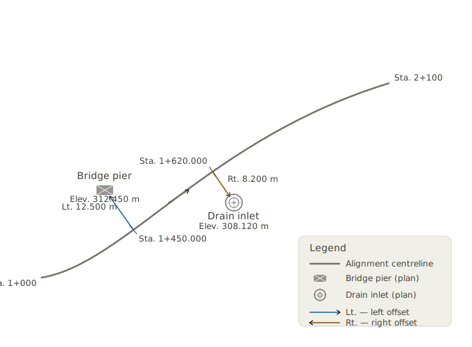
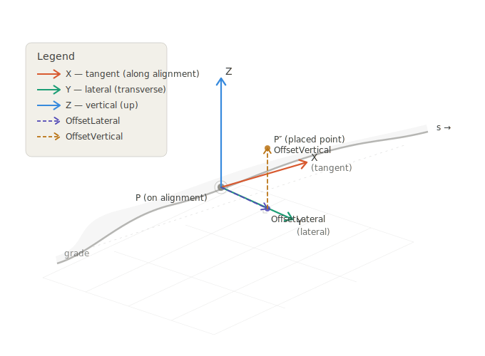
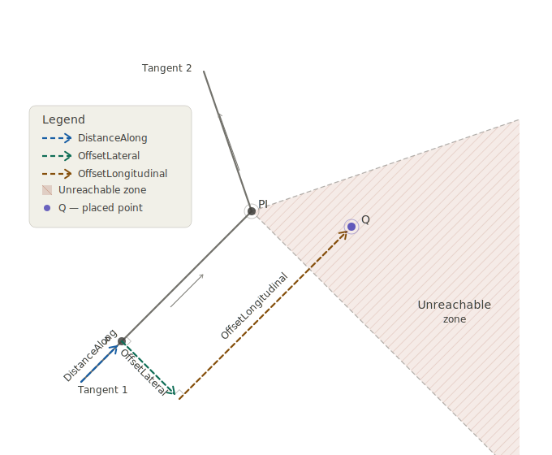

# Section 5.0 - Linear Placement

Most elements in the built environment for infrastructure works are located **relative to an alignment** rather than by absolute coordinates. A bridge pier, a drainage inlet, a light pole, a traffic sign — all are described in traditional engineering plans by where they fall along a road or railway centerline, how far they sit to the left or right of that centerline, and how high above (or below) a reference elevation they stand. This intuitive “station, offset, elevation” system has been the language of civil engineers for over a century.

`IfcLinearPlacement` is the IFC mechanism that formalizes this concept. It places an object relative to a *directrix* — typically an alignment curve — using a distance along the curve combined with optional lateral and vertical offsets.

This section covers:

- The concept of linear placement and how it maps from traditional engineering practice into IFC.
- The IFC class hierarchy: `IfcLinearPlacement`, `IfcAxis2PlacementLinear`, and `IfcPointByDistanceExpression`.
- How the local coordinate system is constructed at a placement point.
- Special cases: longitudinal offset for unreachable points, and placement along `IfcOffsetCurveByDistances`.
- ISO 19148 Linear Referencing and how its concepts relate to IFC linear placement.

## 5.1 Linear Placement in Practice

### 5.1.1 The Traditional Approach

Before examining IFC, it helps to recall how placement is expressed in conventional civil engineering plans. Two common cases illustrate the idea:

**Case 1 — Bridge Pier (2D plan view).** A bridge pier is located in plan by its station along the roadway alignment and its lateral offset from the centerline. A plan note might read “Pier 2 CL: Sta. 142+35.75, 12.50 ft Lt.” The elevation of the pier top is read separately from a profile view. No absolute coordinates are needed; the alignment provides the reference frame.

**Case 2 — Drainage Inlet (3D).** A storm drain inlet is placed at Sta. 98+12.4, offset 18.0 ft right of centerline, with its top grate set at elevation 312.75 ft (NAVD88). Here all three spatial dimensions are given: station gives position along the alignment, lateral offset gives the transverse position, and the elevation fixes the vertical position independently of the alignment profile.

Both cases share the same structure: **a distance along a reference curve, plus offsets from it**. `IfcLinearPlacement` captures exactly this structure.

### 5.1.2 The IFC Object Graph

The IFC classes that implement linear placement form a short chain:

```
IfcProduct
  └─ ObjectPlacement: IfcLinearPlacement
       ├─ PlacementRelTo: (omitted or reference to alignment context)
       └─ RelativePlacement: IfcAxis2PlacementLinear
            ├─ Location: IfcPointByDistanceExpression
            │    ├─ DistanceAlong: IfcLengthMeasure  (or IfcExpressionBasedValue)
            │    └─ BasisCurve: IfcCurve  (typically the alignment or its composite curve)
            ├─ Axis: IfcDirection  (optional — "up" direction)
            └─ RefDirection: IfcDirection  (optional — "forward" direction)
```

The `PlacementRelTo` attribute of `IfcLinearPlacement` establishes the reference context. When it is **omitted**, the placement is measured from the start of the basis curve defined in `IfcPointByDistanceExpression`. This is the standard case when the basis curve is an alignment defined in the project coordinate system.

Figure 5.1.2-1 schematically represents the linear placement of a bridge pier and a drain inlet.



*Figure 5.1.2-1 — Conceptual diagram showing a plan view of an alignment with a bridge pier placed at a station/offset and a drain inlet placed at station/offset/elevation.*

## 5.2 IfcLinearPlacement and IfcAxis2PlacementLinear

### 5.2.1 Distance Along the Directrix

`IfcAxis2PlacementLinear.Location` is typed as `IfcPoint` but is constrained by a WHERE rule to be `IfcPointByDistanceExpression`. This class has two key attributes:

|Attribute           |Type                       |Description                                                                                                                                                |
|--------------------|---------------------------|-----------------------------------------------------------------------------------------------------------------------------------------------------------|
|`DistanceAlong`     |`IfcCurveMeasureSelect`    |The parametric distance measured along `BasisCurve`. Typically a plain `IfcLengthMeasure`.               |
|`BasisCurve`        |`IfcCurve`                 |The curve along which the distance is measured.                                                                                                            |
|`OffsetLateral`     |`OPTIONAL IfcLengthMeasure`|Signed lateral offset. Positive to the left of the curve’s forward tangent; negative to the right (consistent with ISO 19148).                             |
|`OffsetVertical`    |`OPTIONAL IfcLengthMeasure`|Signed vertical offset. Positive upward.                                                                                                                   |
|`OffsetLongitudinal`|`OPTIONAL IfcLengthMeasure`|Signed offset along the tangent direction. See §5.4 for uses.                                                                                              |

The `BasisCurve` attribute of `IfcPointByDistanceExpression` is the key to understanding which curve the distance is measured along. For a full 3D alignment (`IfcGradientCurve` or `IfcSegmentedReferenceCurve`), the `DistanceAlong` is measured along the **horizontal projection** of the 3D curve — that is, along the underlying `IfcCompositeCurve` that represents the plan layout. This is consistent with how stationing is defined in transportation engineering: stationing is a horizontal measure.

### 5.2.2 Stationing and DistanceAlong

Stationing is addressed comprehensively in Section 8. For the purposes of linear placement, the key point is that `DistanceAlong` is a **geometric distance from the start of the basis curve**, not a station label. These two quantities are related but not identical:

- **Geometric distance** begins at zero and increases continuously to the total length of the curve.
- **Station value** may begin at an arbitrary value (e.g., 10+00.00 = 1000 ft from some project reference), may include equation gaps or overlaps where stationing is reset, and may use different units (feet vs. metres).

When using `IfcPointByDistanceExpression`, supply the **geometric distance**, not the raw station label. If the alignment has an `IfcReferent` that defines the starting station, the geometric distance equals the station value minus the starting station value (adjusted for any station equations encountered along the way).

## 5.3 The Placement Coordinate System

### 5.3.1 Role of Axis and RefDirection

`IfcAxis2PlacementLinear` defines a local right-handed coordinate system at the placement point. Two optional attributes control its orientation:

|Attribute     |Role in local CS          |Default                              |
|--------------|--------------------------|-------------------------------------|
|`RefDirection`|X-axis (forward direction)|Tangent to the 3D curve at `Location`|
|`Axis`        |Z-axis (up direction)     |See §5.3.2                           |

The Y-axis is derived as the cross product of `Axis` × `RefDirection` (after normalisation).

When `Axis` and `RefDirection` are both omitted, the implementation must supply defaults. This is the most common scenario and is described below.

### 5.3.2 Default Axis — An Open Issue

The default value of `Axis` is not unambiguously defined in the IFC schema documentation. A known open issue in the buildingSMART community tracks this ambiguity (see [IFC4.x-IF Issue #125](https://github.com/buildingSMART/IFC4.x-IF/issues/125)).

Two interpretations exist in practice:

1. **Axis = global Z = (0, 0, 1).** This is the most common implementation. It produces a coordinate system whose Z-axis is always vertical, regardless of the slope of the alignment. The X-axis (RefDirection) follows the horizontal tangent direction even when the curve has a vertical grade. This is natural for plan-oriented placement and matches traditional station-offset-elevation thinking.
1. **Axis = perpendicular to RefDirection in the plane containing RefDirection and global Z.** This produces a coordinate system whose Z-axis tilts with the grade of the alignment. The local X-axis is truly tangent to the 3D curve. This is more mathematically rigorous but less intuitive for typical civil engineering use.

**Recommendation:** Use interpretation 1 (Axis = global Z) unless the application specifically requires the tilted interpretation. When writing files, explicitly supply `Axis = (0, 0, 1)` to remove ambiguity.

### 5.3.3 Step-by-Step Construction of the Default Local CS

When `Axis` and `RefDirection` are not provided, the local coordinate system is constructed as follows. Let **T** be the unit tangent vector to the 3D alignment curve at the placement distance, and let **Z_g** = (0, 0, 1) be the global vertical.

1. **Set Z** = (0, 0, 1)  *(the Axis direction)*
1. **Compute RefDirection** = unit tangent **T** to the 3D curve at `DistanceAlong`.  
   For a horizontal curve (grade = 0), **T** lies in the XY plane.  
   For a graded curve, **T** has a non-zero Z component.
1. **Y** = normalise(**Z** × **T**)  *(points to the left of travel)*
1. **X** = normalise(**Y** × **Z**)  *(points forward, projected onto the horizontal plane)*

The result is a coordinate system whose:

- X-axis points forward along the alignment (horizontal projection of the tangent),
- Y-axis points to the left (lateral direction in the horizontal plane),
- Z-axis points upward (global vertical).

This is the classic highway “station-offset” reference frame and is illusrated in Figure 5.3.3-1.



*Figure 5.3.3-1 — Diagram showing the local coordinate system axes (X forward, Y left, Z up) at a point on a curved, graded alignment, with annotations for DistanceAlong, OffsetLateral, and OffsetVertical.*

## 5.4 Longitudinal Offset and Unreachable Points

### 5.4.1 What Is an Unreachable Point?

In plane geometry, every point off a smooth curve can be reached by some combination of distance along the curve plus a perpendicular offset. However, certain geometric configurations in horizontal alignment create locations that **cannot be expressed** as a station plus a purely transverse offset.

The classic example is an **angle point** — the intersection of two tangents in a horizontal alignment where no curve has been inserted. At an angle point, the curve has a sharp corner. A point located “outside” the angle — beyond the apex — lies in a zone where the perpendicular from the curve never reaches. This is depicted in Figure 5.4.1-1.



*Figure 5.4.1-1 — Plan view showing two tangent lines meeting at an angle point (PI). The shaded region outside the angle cannot be reached by a station + lateral offset alone. An object in this region requires a longitudinal offset.*

### 5.4.2 Using OffsetLongitudinal

`IfcPointByDistanceExpression.OffsetLongitudinal` provides the solution. A non-zero `OffsetLongitudinal` moves the placement point along the local X-axis (the forward tangent direction) after the perpendicular offset is applied. The procedure is:

1. Locate the point on the basis curve at `DistanceAlong`.
1. Apply `OffsetLateral` perpendicular to the curve tangent in the local XY plane.
1. Apply `OffsetVertical` in the local Z direction.
1. Apply `OffsetLongitudinal` along the local X direction (the tangent at step 1).

The resulting point is no longer “on” a perpendicular to the curve at `DistanceAlong`, but it is precisely located in 3D space.

**Practical note:** `OffsetLongitudinal` should be used only when necessary. For all ordinary station-offset placements, it should be omitted.

## 5.5 IFC Entity Reference

The following table summarises the IFC entities used in linear placement and their key attributes.

|Entity                        |Key Attributes                                                                        |Notes                                                                                     |
|------------------------------|--------------------------------------------------------------------------------------|------------------------------------------------------------------------------------------|
|`IfcLinearPlacement`          |`PlacementRelTo`, `RelativePlacement`                                                 |Subtype of `IfcObjectPlacement`. `PlacementRelTo` omitted → relative to basis curve start.|
|`IfcAxis2PlacementLinear`     |`Location`, `Axis`, `RefDirection`                                                    |`Location` must be `IfcPointByDistanceExpression` (WHERE rule).                           |
|`IfcPointByDistanceExpression`|`DistanceAlong`, `BasisCurve`, `OffsetLateral`, `OffsetVertical`, `OffsetLongitudinal`|Core placement geometry. Offsets are optional.                                            |

## 5.6 Linear Placement along IfcOffsetCurveByDistances

`IfcOffsetCurveByDistances` is an interpolated curve defined by a series of offset values measured from a basis curve. The offset values at intermediate positions are linearly interpolated between the defined sample points, forming a piecewise-linear offset profile. This is used, for example, to define a road edge line whose lateral distance from the centreline varies gradually. Offset curves are comprehensively discussed in [Section 6.0](6_OffsetCurves.md).

### 5.6.1 The Approximate Length Problem

Because `IfcOffsetCurveByDistances` is a sampled, interpolated curve rather than an analytically defined curve, its **arc length is only approximate**. The arc length depends on the density of the sample points along the curve: more sample points produce a more accurate length estimate, but the length is never exact for a truly curved basis.

This approximation has a critical consequence for linear placement: when `IfcPointByDistanceExpression.BasisCurve` is an `IfcOffsetCurveByDistances`, the `DistanceAlong` value cannot be mapped to a unique, precisely determined point on the curve. Two implementations with different sampling densities may compute slightly different positions for the same `DistanceAlong` value.

### 5.6.2 Recommendations

For applications requiring precise linear placement:

1. **Prefer using the parent alignment** (e.g., the `IfcCompositeCurve` representing the horizontal alignment) as the `BasisCurve`, and use `OffsetLateral` to account for any transverse offset from the centreline. This avoids the approximation problem entirely.
1. **If placement along an offset curve is unavoidable**, document the sampling density of the `IfcOffsetCurveByDistances` so that receivers can evaluate the precision of derived positions.
1. **Do not rely on** `DistanceAlong` values along an `IfcOffsetCurveByDistances` being reproducible across different software implementations.

## 5.7 ISO 19148 Linear Referencing

### 5.7.1 Background

ISO 19148 *Geographic information — Linear referencing* is the international standard that formalises the concept of locating features along a linear element. IFC4x3’s infrastructure extensions draw on ISO 19148 concepts, and `Pset_LinearReferencingMethod` (applicable to `IfcAlignment` and `IfcReferent`) is defined in terms of ISO 19148.

Understanding the ISO 19148 model helps implementers correctly interpret `DistanceAlong` values, especially when data is exchanged between systems that use different linear referencing conventions.

### 5.7.2 Key ISO 19148 Concepts

**Linear Referencing Method (LRM).** An LRM defines the rules for measuring distance along a linear element. The most common types are:

|LRM Type             |Description                                                  |Highway Example                   |
|---------------------|-------------------------------------------------------------|----------------------------------|
|Absolute             |Distance measured continuously from a fixed start point.     |Route mileage from a state border.|
|Relative             |Distance measured from a nominated referent (not the start). |“0.4 km past interchange 12.”     |
|Interpolated Position|Location expressed as a fraction between two known referents.|Between mileposts 43 and 44.      |

`Pset_LinearReferencingMethod` records the LRM type (`LRMType`), its name (`LRMName`), and the units of measure (`LRMUnit`) for an alignment or referent element.

**Referents and Milestones vs. Stationing.** In European road practice, distance along a route is often expressed using *kilometre posts* (KP) or *reference posts* — physical markers at known locations. A KP system is a Relative or Reference Post LRM: distance is measured to the nearest upstream post, plus an offset. In North American highway practice, *stationing* is an Absolute LRM: every point on the alignment is assigned a cumulative distance from the project start, expressed as `ccc+dd.dd` (hundreds of feet) or in metres.

The key difference:

- **Stationing (Absolute LRM):** `DistanceAlong` in IFC closely matches the station value (after accounting for any starting station offset defined by an `IfcReferent`).
- **KP / Reference Post (Relative LRM):** `DistanceAlong` in IFC is always the absolute geometric distance from the curve start. A KP value must be converted to a geometric distance before use in `IfcPointByDistanceExpression`.

### 5.7.3 LRM Name Examples from ISO 19148 Annex C

ISO 19148 Annex C lists recognised LRM name aliases. Common examples include:

|Name           |Common Alias|Typical Region       |
|---------------|------------|---------------------|
|milepoint      |milepost, MP|USA, Canada          |
|kilometre point|KP, PK      |Europe, Latin America|
|chainage       |ch          |UK, Australia, India |
|reference post |RP          |Rail, some roads     |

`Pset_LinearReferencingMethod.LRMName` should use one of these recognised names where possible for maximum interoperability.

### 5.7.4 Impact on DistanceAlong

Regardless of the LRM in use for labelling purposes, `IfcPointByDistanceExpression.DistanceAlong` is always the **geometric distance from the start of `BasisCurve`**. LRM labels (station values, KP values, etc.) are a display convention managed through `IfcReferent` and `Pset_LinearReferencingMethod`, not through `DistanceAlong` directly.

See Section 8 (Referents and Stationing) for a detailed treatment of how station labels are stored and how to convert between station labels and geometric distances.

## 5.8 Complete Example

The following example illustrates a point located at distance 1435.75 m along an alignment, offset 5.25 m to the right of centreline.

~~~
#100 = IFCALIGNMENT(...);
#101 = IFCALIGNMENTHORIZONTAL(...);
#102 = IFCCOMPOSITECURVE(...);     /* horizontal geometry */

/* Point on alignment at distance 1435.75 m, 5.25 m right (negative lateral offset) */
#200 = IFCPOINTBYDISTANCEEXPRESSION(1435.75, $, -5.25, $, #102);

/* Axis2Placement using default Axis and RefDirection */
#201 = IFCAXIS2PLACEMENTLINEAR(#200, $, $);

/* LinearPlacement — PlacementRelTo omitted → relative to curve start */
#202 = IFCLINEARPLACEMENT($, #201);
~~~

In this example:

- `DistanceAlong = 1435.75` is the geometric distance from the start of `#102`.
- `OffsetLateral = -5.25` places the point 5.25 m to the right of the horizontal alignment (negative = right of travel).
- `OffsetVertical` is omitted; the is placed in the same plane as the horizontal alignment.
- `Axis` and `RefDirection` are omitted; the default CS is constructed as described in §5.3.3.

## 5.9 Summary and Implementation Checklist

|#|Item                                                                                              |Notes                                                                                                   |
|-|--------------------------------------------------------------------------------------------------|--------------------------------------------------------------------------------------------------------|
|1|Use `IfcLinearPlacement` for all infrastructure elements located relative to an alignment.        |Prefer this over `IfcLocalPlacement` with absolute coordinates for alignment-relative objects.          |
|2|Supply `DistanceAlong` as the geometric arc length from the start of `BasisCurve`.                |Convert station labels to geometric distances first; use `IfcReferent` to record station label metadata.|
|3|Use signed `OffsetLateral`: positive = left, negative = right.                                    |Consistent with ISO 19148 convention.                                                                   |
|4|Set `Axis = (0,0,1)` explicitly to remove ambiguity.                                              |Do not rely on the default; the default is not unambiguously defined in the IFC schema.                 |
|5|Use `OffsetLongitudinal` only for geometrically unreachable points (e.g., outside an angle point).|For all ordinary placements, omit or set to zero.                                                       |
|6|Avoid using `IfcOffsetCurveByDistances` as `BasisCurve` for precise placement.                    |Use the parent alignment with `OffsetLateral` instead.                                                  |
|7|Record the LRM type and units in `Pset_LinearReferencingMethod` on the `IfcAlignment`.            |Required for correct interpretation of `IfcReferent` stationing labels.                                 |
