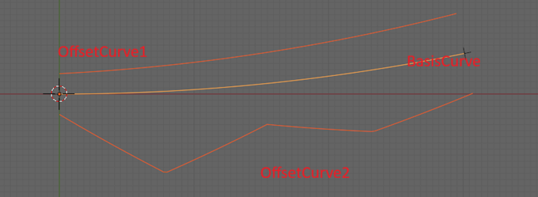

# Section 6 - Offset Curves

Offset curves are very common in infrastructure geometry. Some examples
are:

- Edge of pavement

- Bridge girder centerlines

- Lane striping

`IfcOffsetCurveByDistance` defines the geometry of offset curves. It has
two attributes:

- BasisCurve : The curve from which offsets are measured

- OffsetValues: Defines the offsets along the curve

A single offset value indicates a constant offset over the entire length
of the curve.

If the offsets do not span the full length of the curve, the first and
last offset are implicitly continued to the head and tail of the basis
curve, respectively.

The `IfcOffsetCurveByDistance.OffsetValues` are of type
`IfcPointByDistanceExpression`. `IfcOffsetCurveByDistance.BasisCurve` and
`IfcPointByDistanceExpression.BasisCurve` must reference the same curve.

The `IfcOffsetCurveByDistance` geometry is derived by interpoloating the `OffsetValues`.

*Figure 6.1 Offset curves*

Figure 6.1 shows two offset curves that share a single basis curve. Offset curve 1 has offsets defined at the start and the end of the basis curve. The offset have different values. Offset curve 1 is interpoloated to be the average offset value at the mid-point of the basis curve.

Offset curve 2 has several offsets. Again, linear interpolotation is used to determine the offset from the basis curve to the offset curve. Linear interpolotation is used between each pair of consequitive offset points.

Example model:
[IfcOffsetCurveByDistances.ifc](examples/IfcOffsetCurveByDistances.ifc)