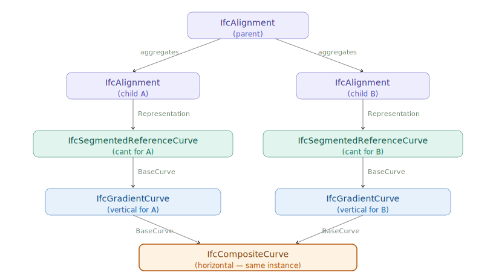
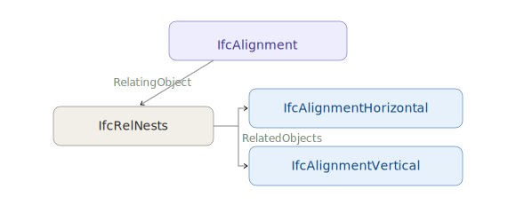
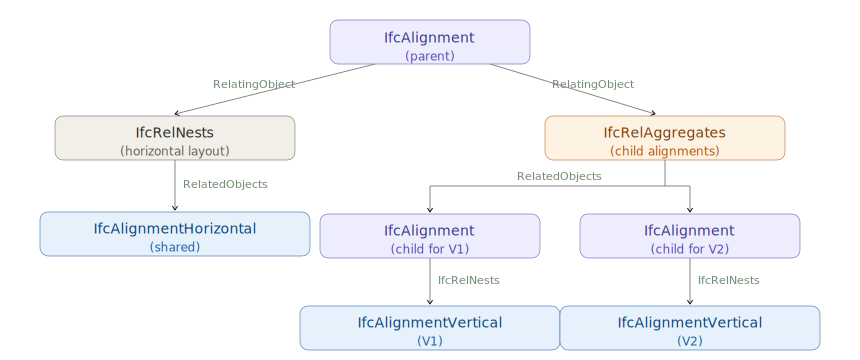

# Chapter 7 — Alignments Reusing Horizontal Layout

## 7.0 Introduction

In infrastructure projects it is common for several alignments to share the same
horizontal path. Three situations arise frequently:

**Design alternatives.** A corridor study fixes the horizontal alignment and evaluates
multiple vertical profiles. Each profile becomes its own alignment sharing the common
horizontal baseline. Comparison software can overlay the profiles without any coordinate
transformation.

**Existing versus proposed.** When an existing road is to be reconstructed, the existing
centerline may be surveyed and represented as one alignment; the proposed centerline
shares the same horizontal but carries a new vertical profile.

**Parallel infrastructure elements.** Features that follow the same horizontal path at
different elevations — top of sub-grade, finished grade, top of rail — can each be
modelled as a separate alignment sharing a common horizontal. This is more precise than
using `IfcOffsetCurveByDistances` for vertical offset, because each element carries its
own parametric vertical definition rather than a sampled elevation difference.

IFC4x3 accommodates all three cases directly. Because horizontal layout is represented by
discrete entities in the model, those entities can be referenced by more than one
alignment. The horizontal curve is defined once and shared; each alignment then adds its own vertical
and, if applicable, cant definition on top of that shared base.

The shared-horizontal pattern relies on a **parent `IfcAlignment`** that owns the common
horizontal layout, and **child `IfcAlignment`** instances — each with its own vertical
profile — aggregated under that parent. This parent/child structure is prescribed by
Concept Template 4.1.4.4.1.2 *Alignment Layout — Reusing Horizontal Layout*.

This section describes the alignment layout structure for the reusing-horizontal-layout
pattern, the geometric representations of the child alignments, and the open
implementation questions that remain to be resolved in the specification.

## 7.1 Alignment Layout and Geometric Representation

### 7.1.1 Alignment Layout — Parent/Child Structure

The alignment layout uses a three-tier hierarchy:

1. A **parent `IfcAlignment`** nests a single shared `IfcAlignmentHorizontal` via
   `IfcRelNests`.
2. One or more **child `IfcAlignment`** instances are aggregated under the parent via
   `IfcRelAggregates`.
3. Each child `IfcAlignment` nests its own `IfcAlignmentVertical` (and, for rail
   alignments, its own `IfcAlignmentCant`) via `IfcRelNests`.

The shared `IfcAlignmentHorizontal` exists exactly once in the model, owned by the parent
via `IfcRelNests`. No child alignment nests an `IfcAlignmentHorizontal` of its own; they
reuse the horizontal definition from the parent. The parent itself carries no vertical
layout; its sole role is to hold the shared horizontal and aggregate the children. Children
that require cant also nest an `IfcAlignmentCant` via `IfcRelNests`. Figure 7.1.1-1 shows
the complete parent/child layout structure.

*Figure 7.1.1-1 — Alignment layout for the reusing-horizontal-layout pattern.*

Only the `IfcAlignmentHorizontal` is shared. Each child alignment owns its
`IfcAlignmentVertical` and `IfcAlignmentCant` exclusively — those layout entities are
never shared between children.

At the geometric level, `IfcSegmentedReferenceCurve` adds cant to a gradient curve by
taking an `IfcGradientCurve` as its own `BaseCurve`. Each child alignment that needs a
cant definition gets its own `IfcSegmentedReferenceCurve` and its own `IfcGradientCurve`;
only the `IfcCompositeCurve` at the base of the chain is the shared instance, as shown in
Figure 7.1.1-2:

*Figure 7.1.1-2 — Geometric chain for child alignments with cant. Each child alignment has its own `IfcSegmentedReferenceCurve` and `IfcGradientCurve`; the `IfcCompositeCurve` is the shared instance.*

### 7.1.2 Geometric Representation — Shared BaseCurve

Each child alignment's 3D curve references the horizontal `IfcCompositeCurve` through its
`BaseCurve` attribute. `IfcGradientCurve` carries `BaseCurve: IfcBoundedCurve` as the 2D
horizontal curve, and two `IfcGradientCurve` instances can reference the same `BaseCurve`
entity. The horizontal geometry — typically an `IfcCompositeCurve` composed of
`IfcCurveSegment` instances — exists in the model exactly once and is referenced by both
gradient curves. Figure 7.1.1-2 illustrates this shared reference.

#### Shape Representation Placement

Pending resolution of the open questions in §7.2, the following placement convention is
recommended based on implementation experience:

- The `IfcAlignment` entity carries the `IfcCompositeCurve` as its own
  `IfcShapeRepresentation` with `RepresentationIdentifier` = `"FootPrint"` and
  `RepresentationType` = `"Curve2D"`.
- Each child `IfcAlignment` carries its full 3D curve as its own `IfcShapeRepresentation`
  with `RepresentationIdentifier` = `"Axis"` and `RepresentationType` = `"Curve3D"`.
  
  This recommendation consistently relates the geometric representation to an instance of `IfcAlignment`.

## 7.2 Open Implementation Questions

The IFC4x3 specification does not yet provide a concept template for the geometric
representation when reusing horizontal layout. The following questions are not resolved
and remain active topics for a future normative concept template:

- **Representation ownership.** Should all representations be contained within the parent
  `IfcAlignment.Representation.Representations`, within each child alignment's
  `Representation.Representations`, or split between them?
- **Horizontal curve ownership.** Should the `IfcCompositeCurve` representation of the
  horizontal layout be a representation on the parent `IfcAlignment` or on the
  `IfcAlignmentHorizontal`?
- **All-or-nothing geometry.** Is the presence of a geometric representation for one
  alignment a requirement for all alignments in the group to have geometric
  representations?
- **Mixed representation types.** Are mixed representation types valid within the same
  group — for example, one child alignment represented as an `IfcGradientCurve` and
  another as an `IfcOffsetCurveByDistances`?

Until these questions are resolved normatively, implementations should follow the
convention described in §7.1.2 and document which representation placement strategy has
been adopted.

## 7.3 Concept Template Transitions in Live Model Management

An application that maintains an IFC model incrementally — adding and removing vertical
layouts as the designer works — must handle transitions between two different concept
templates:

| Vertical count | Required concept template |
|---|---|
| 1 | CT 4.1.4.4.1.1 — Alignment Layout – Horizontal, Vertical and Cant |
| 2 or more | CT 4.1.4.4.1.2 — Alignment Layout – Reusing Horizontal Layout |

These two templates have structurally different models. CT 4.1.4.4.1.1 nests both
`IfcAlignmentHorizontal` and `IfcAlignmentVertical` directly under a single
`IfcAlignment` via `IfcRelNests`. CT 4.1.4.4.1.2 uses the parent/child structure
described in §7.1.1: the parent nests only the `IfcAlignmentHorizontal`, and each
vertical lives in its own child `IfcAlignment` aggregated under the parent. Switching
between them is not additive — it requires restructuring the existing model.

### 7.3.1 Transitioning to Reusing Horizontal Layout

Figure 7.3.1-1 shows the CT 4.1.4.4.1.1 structure used when a single vertical is present:

*Figure 7.3.1-1 — CT 4.1.4.4.1.1: single `IfcAlignmentVertical` nested directly under `IfcAlignment`.*

When a second vertical is added, the model must be restructured to CT 4.1.4.4.1.2. The
`IfcAlignmentVertical (V1)` that was directly nested under the original `IfcAlignment`
must be moved into a new child alignment. A second child alignment is created for V2,
yielding the structure shown in Figure 7.3.1-2:

*Figure 7.3.1-2 — CT 4.1.4.4.1.2: vertical layouts moved into child alignments aggregated under the parent.*

The inverse transition is equally important but easier to overlook. When the designer
removes a vertical layout and only one remains, the model must revert back to CT 4.1.4.4.1.1.
The sole remaining `IfcAlignmentVertical` is re-nested directly under the alignment, the
child `IfcAlignment` instances are dissolved, and the `IfcRelAggregates` relationship is
removed — restoring the structure shown in Figure 7.3.1-1.

## 7.4 Relationship to Offset Curves

Chapter 5 describes `IfcOffsetCurveByDistances`, which defines a new curve laterally
displaced from a basis alignment. Offset curves address a different need: they shift the
curve horizontally (in plan) rather than reusing the same horizontal path at a different
elevation. A left edge-of-shoulder offset and a right edge-of-shoulder offset use
`IfcOffsetCurveByDistances` because their horizontal positions differ from the centerline.
Features that share the exact same horizontal trace but differ only in elevation use the
shared-horizontal-layout pattern described in this section.

The two patterns can coexist. For example, a road model might define:
- The centerline as a parent `IfcAlignment` with a full horizontal definition, plus a
  child carrying the design vertical profile
- The left and right edges of pavement as offset curves (lateral displacement, Chapter 5)
- The sub-grade profile as another child `IfcAlignment` under the same parent, sharing
  the centerline's horizontal but carrying an independent vertical profile (this section)

## 7.5 Use Cases Not Supported by Alignment - Reusing Horizontal Layout Concept Template

The following configurations arise in practice but cannot be fully represented using
Concept Template 4.1.4.4.1.2 as currently defined. The IFC specification does not provide other concept templates that support these use cases.

**Double-track railway.** In this configuration, sometimes called the **7-line geometry**
in railway practice, a single central horizontal reference defines both tracks. Each track
carries its own vertical profile and cant, while stationing is carried along the common
central alignment. The reusing-horizontal-layout template accommodates independent
verticals per child alignment, but it provides no mechanism to associate independent
horizontal offsets (one track to each side of the reference) with the shared horizontal.
The two tracks would require separate horizontal definitions even where they are
geometrically parallel, which defeats the purpose of horizontal sharing.

**Dual carriageway.** A highway with a central reference alignment defining two
independent carriageways faces the same problem: each carriageway has a distinct
horizontal position offset from the reference, so the shared-horizontal-layout pattern
does not apply. Modeling each carriageway as a child of a common parent would require
the child alignments to carry their own `IfcAlignmentHorizontal`, which is not permitted
under the concept template. IFC4x3 has no explicit concept template for dual-carriageway
or multi-track configurations.
