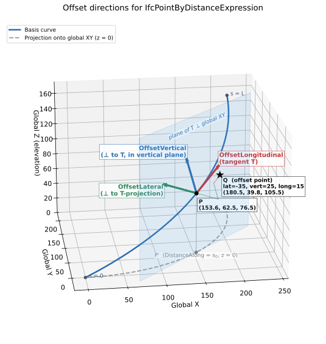

# Chapter 8 — Linear Placement

## 8.0 Introduction

Most elements in the built environment for infrastructure works are located **relative to an alignment** rather than by absolute coordinates. A bridge pier, a drainage inlet, a light pole, a traffic sign — all are described in traditional engineering plans by where they fall along a road or railway centerline, how far they sit to the left or right of that centerline, and how high above (or below) a reference elevation they stand. This intuitive “station, offset, elevation” system has been the language of civil engineers for over a century.

`IfcLinearPlacement` is the IFC mechanism that formalizes this concept. It places an object relative to a *directrix* — typically an alignment curve — using a distance along the curve combined with optional lateral and vertical offsets.

This section covers:

- The concept of linear placement and how it maps from traditional engineering practice into IFC.
- The IFC class hierarchy: `IfcLinearPlacement`, `IfcAxis2PlacementLinear`, and `IfcPointByDistanceExpression`.
- How the local coordinate system is constructed at a placement point.
- Special cases: longitudinal offset for unreachable points, and placement along `IfcOffsetCurveByDistances`.
- ISO 19148 Linear Referencing and how its concepts relate to IFC linear placement.

## 8.1 Linear Placement in Practice

### 8.1.1 The Traditional Approach

Before examining IFC, it helps to recall how placement is expressed in conventional civil engineering plans. Two common cases illustrate the idea:

**Case 1 — Bridge Pier (2D plan view).** A bridge pier is located in plan by its station along the roadway alignment and its lateral offset from the centerline. A plan note might read “Pier 2 CL: Sta. 142+35.75, 12.50 ft Lt.” The elevation of the pier top is read separately from a profile view. No absolute coordinates are needed; the alignment provides the reference frame.

**Case 2 — Drainage Inlet (3D).** A storm drain inlet is placed at Sta. 98+12.4, offset 18.0 ft right of centerline, with its top grate set at elevation 312.75 ft (NAVD88). Here all three spatial dimensions are given: station gives position along the alignment, lateral offset gives the transverse position, and the elevation fixes the vertical position independently of the alignment profile.

Both cases share the same structure: **a distance along a reference curve, plus offsets from it**. `IfcLinearPlacement` captures exactly this structure.

### 8.1.2 The IFC Object Graph

The IFC classes that implement linear placement form a short chain, shown in Figure 8.1.2-1.

*Figure 8.1.2-1 — IFC object graph for linear placement.*

The `PlacementRelTo` attribute of `IfcLinearPlacement` establishes the reference context. When it is **omitted**, the placement is measured from the start of the basis curve defined in `IfcPointByDistanceExpression`. This is the standard case when the basis curve is an alignment defined in the project coordinate system.

Figure 8.1.2-2 schematically represents the linear placement of a bridge pier and a drain inlet.

*Figure 8.1.2-2 — Conceptual diagram showing a plan view of an alignment with a bridge pier placed at a station/offset and a drain inlet placed at station/offset/elevation.*

## 8.2 IfcLinearPlacement and IfcAxis2PlacementLinear

`IfcAxis2PlacementLinear.Location` is typed as `IfcPoint` but is constrained by a WHERE rule to be `IfcPointByDistanceExpression`.

### 8.2.1 Distance Along the Basis Curve

 `IfcPointByDistanceExpression` class has five key attributes:

|Attribute            |Type                        |Description                                                                                    |
|---------------------------|------------------------------------|------------------------------------|
|`BasisCurve`         |`IfcCurve`                  |The curve along which the distance is measured.                                                         |
|`DistanceAlong`      |`IfcCurveMeasureSelect`     |The parametric distance measured along `BasisCurve`. Typically a plain `IfcLengthMeasure`.              |
|`OffsetLateral`      |`OPTIONAL IfcLengthMeasure` |Signed lateral offset. Positive to the left of the curve’s forward tangent; negative to the right (consistent with ISO 19148). |
|`OffsetVertical`     |`OPTIONAL IfcLengthMeasure` |Signed vertical offset. Positive upward.                                                                 |
|`OffsetLongitudinal` |`OPTIONAL IfcLengthMeasure` |Signed offset along the tangent direction. See §8.2.1.1 for uses.                                        |

For a full 3D alignment (`IfcGradientCurve` or `IfcSegmentedReferenceCurve`), the `DistanceAlong` is measured along the **horizontal projection** of the 3D curve — that is, along the underlying `IfcCompositeCurve` that represents the plan layout. This is consistent with how stationing is defined in transportation engineering: stationing is a horizontal measure.

The `OffsetLateral`, `OffsetVertical` and `OffsetLongitudinal` are measured in the local coordinate system at the point on the curve as shown in Figure 8.2.1-1.

*Figure 8.2.1-1 — IfcPointByDistanceExpression offsets*

#### 8.2.1.1 Longitudinal Offset and Unreachable Points

**What Is an Unreachable Point?**

In plane geometry, every point off a smooth curve can be reached by some combination of distance along the curve plus a perpendicular offset. However, certain geometric configurations in horizontal alignment create locations that **cannot be expressed** as a station plus a purely transverse offset.

The classic example is an **angle point** — the intersection of two tangents in a horizontal alignment where no curve has been inserted. At an angle point, the curve has a sharp corner. A point located “outside” the angle — beyond the apex — lies in a zone where the perpendicular from the curve never reaches. This is depicted in Figure 8.2.1.1-1.

*Figure 8.2.1.1-1 — Plan view showing two tangent lines meeting at an angle point (PI). The shaded region outside the angle cannot be reached by a station + lateral offset alone. An object in this region requires a longitudinal offset.*

**Using OffsetLongitudinal**

`IfcPointByDistanceExpression.OffsetLongitudinal` provides the solution. A non-zero `OffsetLongitudinal` moves the placement point along the local X-axis (the forward tangent direction) after the perpendicular offset is applied. The procedure is:

1. Locate the point on the basis curve at `DistanceAlong`.
1. Apply `OffsetLateral` perpendicular to the curve tangent in the local XY plane.
1. Apply `OffsetVertical` in the local Z direction.
1. Apply `OffsetLongitudinal` along the local X direction (the tangent at step 1).

The resulting point is no longer “on” a perpendicular to the curve at `DistanceAlong`, but it is precisely located in 3D space.

> **Practical note:** `OffsetLongitudinal` should be used only when necessary. For all ordinary station-offset placements, it should be omitted.

### 8.2.2 Stationing and DistanceAlong

Stationing is addressed comprehensively in Chapter 9. For the purposes of linear placement, the key point is that `DistanceAlong` is a **geometric distance from the start of the basis curve**, not a station label. These two quantities are related but not identical:

- **Geometric distance** begins at zero and increases continuously to the total length of the curve.
- **Station value** may begin at an arbitrary value (e.g., 10+00.00 = 1000 ft from some project reference), may include equation gaps or overlaps where stationing is reset, and may use different units (feet vs. meters).

When using `IfcPointByDistanceExpression`, supply the **geometric distance**, not the raw station label. If the alignment has an `IfcReferent` that defines the starting station, the geometric distance equals the station value minus the starting station value (adjusted for any station equations encountered along the way).

## 8.3 The Placement Coordinate System

### 8.3.1 Role of Axis and RefDirection

`IfcAxis2PlacementLinear` defines a local right-handed coordinate system at the placement point. Two optional attributes control its orientation:

|Attribute     |Role in local CS          |Default                              |
|--------------------|-----------------------------------|---------------------------------------------|
|`RefDirection`|X-axis (forward direction)|Tangent to the 3D curve at `Location`|
|`Axis`        |Z-axis (up direction)     |See §8.3.2                           |

The Y-axis is derived as the cross product of `Axis` × `RefDirection` (after normalization).

When `Axis` and `RefDirection` are both omitted, the implementation must supply defaults. This is the most common scenario and is described below.

### 8.3.2 Default Axis — An Open Issue

The ambiguity originates in how `IfcAxis2PlacementLinear` describes its optional attributes compared to its 3D counterpart. `IfcAxis2Placement3D` is explicit: its specification states that when `Axis` is omitted it defaults to `(0, 0, 1)` and when `RefDirection` is omitted it defaults to `(1, 0, 0)`. No interpretation is required.

`IfcAxis2PlacementLinear` takes a different approach. Its specification states:

> "Relative placement axes (`Axis` and `RefDirection`) are relative to the curve used for linear referencing provided in `IfcPlacement.Location` (`IfcPointByDistanceExpression.BasisCurve`), maintaining the relationship to the tangent of the curve."

This sentence says the axes are *derived from the curve*, not from global coordinates. The natural reading is that `RefDirection` defaults to the curve tangent — which implementations broadly agree on — and that `Axis` defaults to something perpendicular to that tangent in the general upward direction. On a flat alignment those two readings coincide: the upward perpendicular to a horizontal tangent is `(0, 0, 1)`. On a graded alignment they diverge: "perpendicular to the 3D tangent in the upward direction" tilts with the grade and is no longer `(0, 0, 1)`. The specification never resolves what "upward relative to the curve" concretely means, and that silence is the source of the ambiguity. A known open issue in the buildingSMART community tracks it (see [IFC4.x-IF Issue #125](https://github.com/buildingSMART/IFC4.x-IF/issues/125)).

Two interpretations exist in practice:

1. **Axis = global Z = (0, 0, 1).** The Z-axis is always vertical regardless of alignment slope. The X-axis follows the horizontal tangent direction even when the curve has a vertical grade. This is natural for plan-oriented placement and matches traditional station-offset-elevation thinking.
2. **Axis = perpendicular to RefDirection in the plane containing RefDirection and global Z.** The Z-axis tilts with the grade of the alignment. The local X-axis is truly tangent to the 3D curve. This reading follows directly from the curve-relative language in the specification, and produces the same orientation that `IfcExtrudedAreaSolid` would use when sweeping along the same path.

The connection between interpretation 2 and the broader IFC linear referencing model is not incidental. When evaluating a point along a 3D curve such as `IfcGradientCurve` or `IfcSegmentedReferenceCurve`, the resulting coordinate frame at that point is derived from the curve itself — the tangent at the evaluation distance determines the local forward direction, and the normal plane at that point governs the transverse and vertical axes. This is the frame that implementations compute when moving along a 3D alignment, as illustrated in the discussions of vertical and cant alignment geometry in Chapters 3 and 4. The perpendicular-to-3D-tangent interpretation of `Axis` is most consistent with that model: both derive orientation from the same 3D curve tangent, so a placement using interpretation 2 produces a frame congruent with what an implementation computes when evaluating the directrix at the same distance.

The practical consequence of this ambiguity is graphically illustrated in §10.5 — Figure 10.5-2 shows the same `IfcSectionedSolidHorizontal` model with `Axis` omitted rendered by two viewers that adopted opposite defaults, producing visibly different geometry on a 10% grade.

### 8.3.3 Linear Placement Example

This example shows the placement of a sign. The sign is to be located at a `DistanceAlong` of 201.0 m and a lateral offset of 2.0 m. The sign is to be 2.5 m above the alignment and vertical. The expected placement of the sign is at `(201.0, 2.0, 52.75)`.

The horizontal alignment is straight towards the East. The vertical alignment is a constant gradient at a slope of 0.25 and starts at elevation 0.0.

The gradient parameters for a slope of $0.25$ are $d_x = 0.9701425,\ d_y = 0.2425356$.

One option is to define the sign position relative to the gradient curve using horizontal and vertical offsets. The relevant IFC is:

~~~
#5208 = IFCGRADIENTCURVE(/*details omitted*/)
#5297 = IFCLINEARPLACEMENT($, #5303, $);
#5303 = IFCAXIS2PLACEMENTLINEAR(#5304, #5305, $);

/* Placement defined relative to gradient curve */
#5304 = IFCPOINTBYDISTANCEEXPRESSION(IFCLENGTHMEASURE(201.), 2., 2.5, $, #5208);

/* Explicitly defined Axis direction */
#5305 = IFCDIRECTION((0., 0., 1.));
~~~

The sign will be oriented vertically because the `IfcAxis2PlacementLinear.Axis` is explicitly defined as `(0,0,1)`. If `IfcAxis2PlacementLinear.Axis` is omitted, the default orientation of the sign may depend on the implementaton as discussed in §8.3.2.

The point on the gradient curve is:

$$x = 201.0$$
$$z = (201.0)\frac{(0.2425356)}{(0.9701425)} = 50.25$$

The vertical offset is perpendicular to the vertical gradient. The offset from the gradient curve point is:

$$\Delta x = (2.5)(-0.2425356) = -0.606$$
$$\Delta y = (2.5)(0.9701425) = 2.425$$

The resulting placement is:

$$x + \Delta x = 201.0 - 0.606 = 200.394$$
$$y + \Delta y = 50.25 + 2.425 = 52.675$$

The sign placement is `(200.394, 2.0, 52.675)`. This is not the expected placement. The sign is not in the correct location because the vertical offset is measured relative to the alignment.

To correct this problem, use an `IfcLinearPlacement.PlacementRelTo` with $z = 2.5$.

~~~
/* Local placement with z = 2.5. Linear placement is relative to this coordinate frame. */
#5139 = IFCLOCALPLACEMENT($, #5143);
#5140 = IFCDIRECTION((0., 0., 1.));
#5141 = IFCDIRECTION((1., 0., 0.));
#5142 = IFCCARTESIANPOINT((0., 0., 2.5));
#5143 = IFCAXIS2PLACEMENT3D(#5142, #5140, #5141);

#5208 = IFCGRADIENTCURVE(/*details omitted*/)

/* Linear placement relative to the local placement defined above. */
#5297 = IFCLINEARPLACEMENT(#5139, #5303, $);

#5303 = IFCAXIS2PLACEMENTLINEAR(#5304, #5305, $);

/* Placement defined relative to gradient curve. Note that vertical offset is omitted */
#5304 = IFCPOINTBYDISTANCEEXPRESSION(IFCLENGTHMEASURE(201.), 2., $, $, #5208);

/* Explicitly defined Axis direction */
#5305 = IFCDIRECTION((0., 0., 1.));
~~~

From before, the point on the gradient curve is:

$$x = 201.0,\quad z = 50.25$$

There is no vertical offset relative to the gradient curve. However, this point is relative to a local placement with $z = 2.5$. The elevation of the sign is $50.25 + 2.5 = 52.75$. 

The sign placement is `(201.0, 2.0, 52.75)` as expected.

## 8.4 Fallback Cartesian Position

`IfcLinearPlacement.CartesianPosition` is an optional `IfcAxis2Placement3D` attribute that provides a fallback geometry placement for receiving applications that do not support linear placement. An importing application that does not implement linear placement evaluation can read the stored Cartesian frame directly, without evaluating any curve geometry.

The attribute is populated by the exporting application, which evaluates `RelativePlacement` against the alignment geometry and stores the resulting absolute 3D frame in the project coordinate system before writing the file. The buildingSMART Validation Service treats `CartesianPosition` as a best-practice requirement: a file that omits it will be flagged as not conforming to best practices, and a file that includes it must pass consistency checking — the origin and axes of `CartesianPosition` must match the evaluated result of `RelativePlacement` to within model tolerance. A mismatched fallback is worse than no fallback, because it silently places the object at the wrong location for receivers that fall back to the Cartesian frame.

## 8.5 Linear Placement along IfcOffsetCurveByDistances

`IfcOffsetCurveByDistances` is an interpolated curve defined by a series of offset values measured from a basis curve. The offset values at intermediate positions are linearly interpolated between the defined sample points, forming a piecewise-linear offset profile. This is used, for example, to define a road edge line whose lateral distance from the centerline varies gradually. Offset curves are comprehensively discussed in [Chapter 5](5_OffsetCurves.md).

### 8.5.1 The Approximate Length Problem

Because `IfcOffsetCurveByDistances` is a sampled, interpolated curve rather than an analytically defined curve, its **arc length is only approximate**. The arc length depends on the density of the sample points along the curve: more sample points produce a more accurate length estimate, but the length is never exact for a truly curved basis.

This approximation has a critical consequence for linear placement: when `IfcPointByDistanceExpression.BasisCurve` is an `IfcOffsetCurveByDistances`, the `DistanceAlong` value cannot be mapped to a unique, precisely determined point on the curve. Two implementations with different sampling densities may compute slightly different positions for the same `DistanceAlong` value.

### 8.5.2 Recommendations

For applications requiring precise linear placement:

1. **Prefer using the parent alignment** (e.g., the `IfcCompositeCurve` representing the horizontal alignment) as the `BasisCurve`, and use `OffsetLateral` to account for any transverse offset from the centerline. This avoids the approximation problem entirely.
1. **If placement along an offset curve is unavoidable**, document the sampling density of the `IfcOffsetCurveByDistances` so that receivers can evaluate the precision of derived positions.
1. **Do not rely on** `DistanceAlong` values along an `IfcOffsetCurveByDistances` being reproducible across different software implementations.

## 8.6 ISO 19148 Linear Referencing

### 8.6.1 Background

ISO 19148 *Geographic information — Linear referencing* is the international standard that formalizes the concept of locating features along a linear element. IFC4x3’s infrastructure extensions draw on ISO 19148 concepts, and `Pset_LinearReferencingMethod` (applicable to `IfcAlignment` and `IfcReferent`) is defined in terms of ISO 19148.

Understanding the ISO 19148 model helps implementers correctly interpret `DistanceAlong` values, especially when data is exchanged between systems that use different linear referencing conventions.

### 8.6.2 Key ISO 19148 Concepts

**Linear Referencing Method (LRM).** An LRM defines the rules for measuring distance along a linear element. The most common types are:

|LRM Type             |Description                                                  |Highway Example                   |
|--------------------|--------------------------------------------------|------------------------------|
|Absolute             |Distance measured continuously from a fixed start point.     |Route mileage from a state border.|
|Relative             |Distance measured from a nominated referent (not the start). |“0.4 km past interchange 12.”     |
|Interpolated Position|Location expressed as a fraction between two known referents.|Between mileposts 43 and 44.      |

`Pset_LinearReferencingMethod` records the LRM type (`LRMType`), its name (`LRMName`), and the units of measure (`LRMUnit`) for an alignment or referent element.

**Referents and Milestones vs. Stationing.** In European road practice, distance along a route is often expressed using *kilometer posts* (KP) or *reference posts* — physical markers at known locations. A KP system is a Relative or Reference Post LRM: distance is measured to the nearest upstream post, plus an offset. In North American highway practice, *stationing* is an Absolute LRM: every point on the alignment is assigned a cumulative distance from the project start, expressed as `ccc+dd.dd` (hundreds of feet) or in meters.

The key difference:

- **Stationing (Absolute LRM):** `DistanceAlong` in IFC closely matches the station value (after accounting for any starting station offset defined by an `IfcReferent`).
- **KP / Reference Post (Relative LRM):** `DistanceAlong` in IFC is always the absolute geometric distance from the curve start. A KP value must be converted to a geometric distance before use in `IfcPointByDistanceExpression`.

### 8.6.3 LRM Name Examples from ISO 19148 Annex C

ISO 19148 Annex C lists recognized LRM name aliases. Common examples include:

|Name           |Common Alias|Typical Region       |
|-----------------------------------|-------------------------|----------------------------------------|
|milepoint      |milepost, MP|USA, Canada          |
|kilometer point|KP, PK      |Europe, Latin America|
|chainage       |ch          |UK, Australia, India |
|reference post |RP          |Rail, some roads     |

`Pset_LinearReferencingMethod.LRMName` should use one of these recognized names where possible for maximum interoperability.

### 8.6.4 Impact on DistanceAlong

Regardless of the LRM in use for labelling purposes, `IfcPointByDistanceExpression.DistanceAlong` is always the **geometric distance from the start of `BasisCurve`**. LRM labels (station values, KP values, etc.) are a display convention managed through `IfcReferent` and `Pset_LinearReferencingMethod`, not through `DistanceAlong` directly.

See Chapter 9 (Referents and Stationing) for a detailed treatment of how station labels are stored and how to convert between station labels and geometric distances.

## 8.7 Complete Example

The following example illustrates a point located at distance 1435.75 m along an alignment, offset 5.25 m to the right of centerline.

~~~
#100 = IFCALIGNMENT(...);
#101 = IFCALIGNMENTHORIZONTAL(...);
#102 = IFCCOMPOSITECURVE(...);     /* horizontal geometry */

/* Point on alignment at distance 1435.75 m, 5.25 m right (negative lateral offset) */
#200 = IFCPOINTBYDISTANCEEXPRESSION(1435.75, -5.25, $, $, #102);

/* Axis2Placement using default Axis and RefDirection */
#201 = IFCAXIS2PLACEMENTLINEAR(#200, $, $);

/* LinearPlacement — PlacementRelTo omitted → relative to curve start */
#202 = IFCLINEARPLACEMENT($, #201);
~~~

In this example:

- `DistanceAlong = 1435.75` is the geometric distance from the start of `#102`.
- `OffsetLateral = -5.25` places the point 5.25 m to the right of the horizontal alignment (negative = right of travel).
- `OffsetVertical` is omitted; the point is placed in the same plane as the horizontal alignment.
- `Axis` and `RefDirection` are omitted; the resulting orientation is implementation-defined (see §8.3.2).

## 8.8 Summary and Implementation Checklist

|#|Item                                                                                              |Notes                                                                                                   |
|-----|-----------------------------------------------|------------------------------------------------|
|1|Use `IfcLinearPlacement` for all infrastructure elements located relative to an alignment.        |Prefer this over `IfcLocalPlacement` with absolute coordinates for alignment-relative objects.          |
|2|Supply `DistanceAlong` as the geometric arc length from the start of `BasisCurve`.                |Convert station labels to geometric distances first; use `IfcReferent` to record station label metadata.|
|3|Use signed `OffsetLateral`: positive = left, negative = right.                                    |Consistent with ISO 19148 convention.                                                                   |
|4|Set `Axis = (0,0,1)` explicitly to remove ambiguity.                                              |Do not rely on the default; the default is not unambiguously defined in the IFC schema.                 |
|5|Use `OffsetLongitudinal` only for geometrically unreachable points (e.g., outside an angle point).|For all ordinary placements, omit or set to zero.                                                       |
|6|Avoid using `IfcOffsetCurveByDistances` as `BasisCurve` for precise placement.                    |Use the parent alignment with `OffsetLateral` instead.                                                  |
|7|Record the LRM type and units in `Pset_LinearReferencingMethod` on the `IfcAlignment`.            |Required for correct interpretation of `IfcReferent` stationing labels.                                 |
|8|Provide `CartesianPosition` only when exchanging with applications that lack linear placement support; omit otherwise.|Regenerate it after any alignment geometry change; validate consistency with the buildingSMART Validation Service.|
