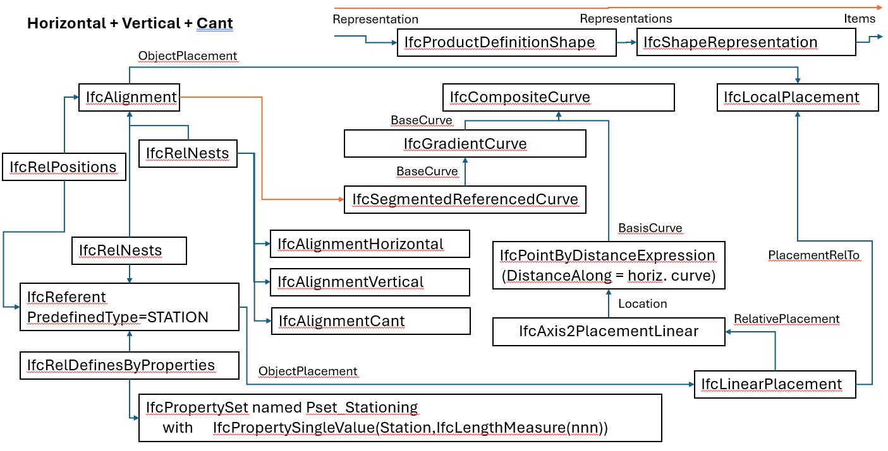
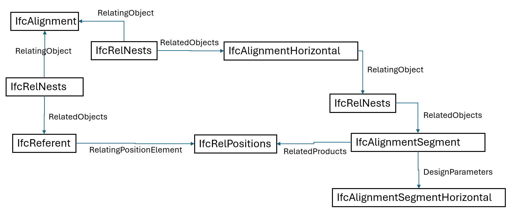

# Section 8 - IfcReferent and Stationing

The class `IfcReferent` defines a position at a particular offset along an
alignment curve. Stationing (also known as chainage) is a good example.

Referents can be nested to alignments, using `IfcRelNests` , to describe stations along an alignment. `IfcRelNests.RelatedObjects` is an ordered list so the first referent is the starting station of a given alignment.

`IfcRelNests.PredefinedType = STATION` is not well defined in the IFC specification, however it seems most appropriate for referents that only indicate a station.

The stationing value is is provided using `Pset_Stationing`. The `Station` property defines the station value at a location. Station equations can be defined by providing the `IncomingStation` and `Station` properties.

## IfcRelNests Usage
Alignment layouts and stationing referents both decompose `IfcAlignment` through `IfcRelNests`. The IFC specification is not clear if alignment layouts and referents belong in the same or different nests. Since alignment layout and referent are completely different things, it is recommended that they are contained within their own nests. This is illustrated in Figure 8.1.

*Figure 8.1 Recommended approach to nesting alignment layouts and referents*

Figure 8.1 shows two `IfcRelNests`, one each for alignment layout and referent. Also note the `IfcRelPositions` relationship. The referent defines the stationing and positions the alignment. The case show is for horizontal, vertical, and cant. Horizontal only and horizontal with vertical are similar.

## Critical Alignment Points

This is incorrect per https://ifc43-docs.standards.buildingsmart.org/IFC/RELEASE/IFC4x3/HTML/concepts/Object_Composition/Nesting/Object_Nesting/content.html. IfcReferent can only be hosted by IfcAlignment. 

Use IfcRelPositions to position IfcAlignmentSegment with its IfcTeferent.

Update coming soon. Also need to demostrate for reusing horizontal with multiple vertical and child alignments

Critical alignment points, such as Point Of Curvature (PC) of a horizontal curve can be located with an `IfcReferent`. These can be located in the `IfcRelNests.RelatedObjects` list for referents on the `IfcAlignment`. If there are a mix if critical points for horizontal and vertical, an logical alternative is to use `IfcRelNests.RelatingObject=IfcAlignmentHorizontal` (or `IfcRelNests.RelatingObject=IfcAlignmentVertical`) with `IfcRelNests.RelatedObjects=IfcReferent`.

*Figure 8.2 Recommended approach to nesting critical alignment points with alignment layouts*
