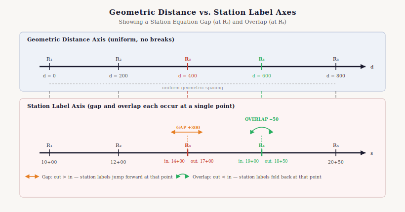
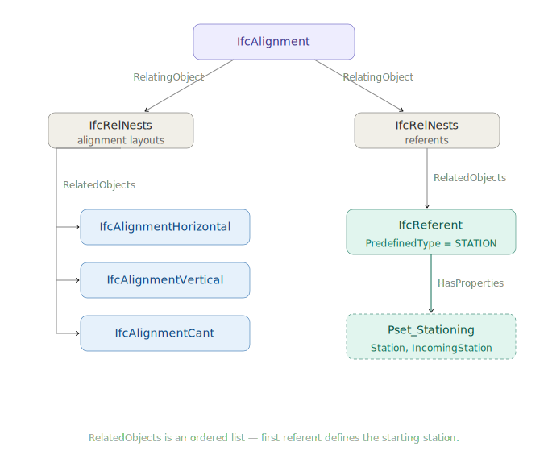
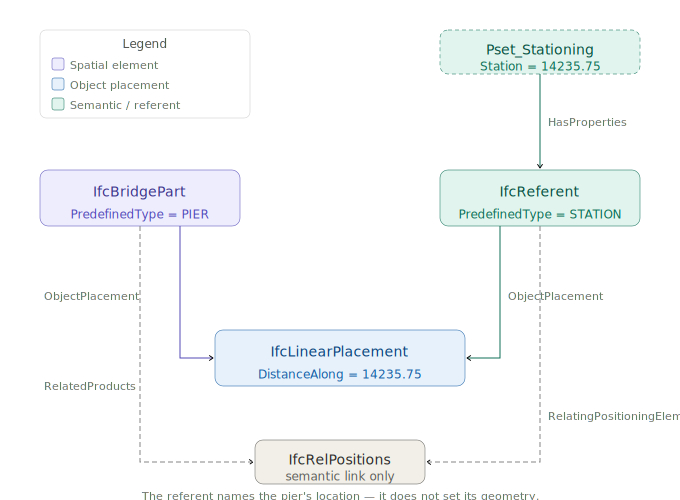

# Chapter 9 - IfcReferent and Stationing

## 9.0 Introduction

Chapter 8 established that `IfcPointByDistanceExpression.DistanceAlong` is a **geometric distance** — a raw arc-length measure from the start of a curve. But civil engineering practice does not communicate location this way. Engineers say “Pier 3 is at Station 14+235.75,” not “Pier 3 is 14,235.75 meters from the start of the survey baseline.” The station label is a human-readable, project-specific identifier that may begin at an arbitrary value, may use different units than the project, and may not even progress continuously along the alignment.

`IfcReferent` is the IFC mechanism that bridges these two worlds. It is a positioned object that attaches semantic location information — most importantly, stationing — to a specific geometric point on an alignment. It does not change the geometry; it annotates it.

This section covers:

- What `IfcReferent` is and the range of uses it serves beyond stationing.
- How stationing is expressed using `Pset_Stationing`, and how station values relate to geometric distances.
- Station equations: gap and overlap breaks, their physical causes, and how they affect `DistanceAlong` conversions.
- How referents are nested to alignments using `IfcRelNests`, including the recommended approach for mixed nesting with alignment layouts.
- How `IfcReferent` informs the semantic position of other objects via `IfcRelPositions`, without affecting their geometry.

-----

## 9.1 What Is a Referent?

`IfcReferent` is a subtype of `IfcPositioningElement`, which is itself a subtype of `IfcProduct`. Like any product, it has an `ObjectPlacement` (typically `IfcLinearPlacement`) that locates it geometrically on an alignment, and it can carry property sets that provide additional semantic information at that location.

The single attribute `IfcReferent` adds beyond its supertypes is `PredefinedType` (`IfcReferentTypeEnum`), which guides receivers on how to interpret the referent and which property sets are relevant:

- **Stationing / chainage** (`STATION`). The most common use. Marks a position with a human-readable station label, defines the alignment's starting station, records a station equation, or identifies a key geometry point such as PC, PT, or PVI.
- **Linear referencing events** (`SUPERELEVATIONEVENT`, `WIDTHEVENT`). Locations where a design parameter changes — superelevation transitions, width changes, and similar cross-section events.
- **Reference markers and mileposts** (`REFERENCEMARKER`, `KILOPOINT`, `MILEPOINT`). Physical objects in the right-of-way that are part of a real-world linear referencing system.
- **Administrative boundaries** (`BOUNDARY`). Locations where a jurisdiction, maintenance zone, or asset ownership boundary crosses the alignment.
- **Intersection locations** (`INTERSECTION`). Points where another road or route crosses the alignment.
- **General positioned location** (`POSITION`). A fully described linearly referenced location combining alignment, LRM, and measure value.

-----

## 9.2 Stationing: Concept and Practice

### 9.2.1 What Is a Station?

Stationing (also called *chainage* in British practice) is a distance-based coordinate system used to identify locations along a linear route. In North American highway practice, stations are expressed in the form `ccc+dd.dd`, where the number before the `+` is the count of hundreds of feet (or hundreds of meters in metric projects) and the digits after are the remainder. For example, Sta. 142+35.75 means 14,235.75 feet (or meters) from the project datum.

The project datum — the zero point of stationing — is defined by the first `IfcReferent` nested in the alignment (see §9.4). Stationing typically begins at a round number such as 10+00 or 100+00 rather than 0+00, to avoid negative stations at points that may be surveyed upstream of the formal project start.

Stationing is a **display convention**, not a geometric quantity. The geometric position of a point is fully determined by `DistanceAlong` in `IfcPointByDistanceExpression`. The station label is metadata that identifies that point to engineers and field crews in human-readable terms.

### 9.2.2 Pset_Stationing

Stationing metadata is stored in `Pset_Stationing`, attached to an `IfcReferent` via `IfcRelDefinesByProperties`. The property set has three properties:

|Property              |Type              |Description                                                                                                                                                                             |
|----------------------|------------------|----------------------------------------------------------------------------------------------------------------------------------------------------------------------------------------|
|`Station`             |`IfcLengthMeasure`|The station value at this referent’s location. For the first referent, this defines the starting station of the alignment.                                                              |
|`IncomingStation`     |`IfcLengthMeasure`|Present only at a station equation. The station value on the *incoming* (upstream) side of the break. The `Station` property holds the *outgoing* value immediately after the break.    |
|`HasIncreasingStation`|`IfcBoolean`      |Controls the direction of stationing. If `TRUE` (or absent), subsequently nested referents have increasing station values. If `FALSE`, they decrease. Covers reverse-stationing schemes.|

The `Station` value is expressed in the same units as the project length unit (typically meters or feet), **not** in the `ccc+dd.dd` string form. A station of 142+35.75 ft is stored as `14235.75` with feet as the project unit.

-----

## 9.3 Station Equations: Gaps and Overlaps

### 9.3.1 Why Station Equations Exist

A station equation (also called a *chainage break* or *stationing equation*) is a discontinuity in the stationing system at which the station value jumps. Equations arise in several common situations:

**Realignment.** When a road is realigned — a curve is straightened or a new bypass is built — the new alignment geometry is a different length than the old. Rather than re-station the entire project downstream of the change (which would invalidate all existing plan sheets, permits, and as-built records), engineers introduce a station equation at the point where the old and new alignments reconnect. The geometry changes; the stationing on the downstream portion is preserved.

**Survey accumulation.** Long routes are often surveyed in segments. Small differences in measurement between survey crews produce a gap or overlap at the junction point. Rather than re-survey everything, an equation is introduced.

**Existing route adoption.** When a new project ties into an existing road with its own stationing, an equation reconciles the two stationing systems at the junction.

### 9.3.2 Gap Equations

A **gap equation** (also called a *station ahead* or *forward equation*) occurs when stationing jumps forward. The alignment geometry is continuous, but the station number increases by more than the physical length at the equation point.

*Example:* The alignment arrives at a point with incoming station 142+35.75. Due to a realignment that shortened the route, the outgoing station is 145+00.00. There is a gap of 264.25 ft. A distance of 14,235.75 ft of geometry corresponds to a label of 145+00, not 142+35.75.

```
Incoming side:  … Sta. 142+35.75  ─────┐
                                        │  GAP (264.25 ft of stationing skipped)
Outgoing side:          Sta. 145+00.00  ┘ ──────────────────────────────────→
```

*Figure 9.3.2-1 — Station gap equation. Geometry is continuous; station numbers jump forward.*

### 9.3.3 Overlap Equations

An **overlap equation** (also called a *station back* or *backward equation*) occurs when stationing jumps backward. The alignment geometry is continuous, but the station number decreases at the equation point.

*Example:* Incoming station 78+42.10, outgoing station 76+00.00. There is an overlap of 242.10 ft. Two different geometric points — one upstream and one downstream of the equation — carry station labels between 76+00 and 78+42.

```
Incoming side:  Sta. 78+42.10  ─────┐
                                    │  OVERLAP (242.10 ft of station range used twice)
Outgoing side:  Sta. 76+00.00  ─────┘───────────────────────────────────→
```

*Figure 9.3.3-1 — Station overlap equation. Geometry is continuous; station numbers jump backward.*

### 9.3.4 Effect on DistanceAlong Conversion

The presence of station equations means that **you cannot convert a station label to `DistanceAlong` by simple subtraction of the starting station**. You must account for every equation encountered between the alignment start and the point of interest.

The conversion algorithm is:

1. Begin at the alignment start. Set `accumulated_distance = 0`, `current_station = starting_station`.
1. Process each `IfcReferent` in nesting order. At each referent with a `Pset_Stationing`:
- Compute the geometric distance from the previous referent to this one (from their `DistanceAlong` values).
- Add that geometric distance to `accumulated_distance`.
- If the referent has only `Station` (no `IncomingStation`): update `current_station = Station`. No equation.
- If the referent has both `IncomingStation` and `Station`: this is an equation. Verify that `current_station + elapsed_distance ≈ IncomingStation`. Then reset `current_station = Station` (the outgoing value).
1. For a target station label `S`, find the segment where `S` falls between consecutive referents (using the appropriate incoming/outgoing station values at equations), then compute:

$$\text{DistanceAlong} = \text{referent\_distance} + \frac{S - \text{segment\_start\_station}}{\text{segment\_station\_span}} \times \text{segment\_geometry\_length}$$

For simple alignments with no equations, this reduces to the familiar $\text{DistanceAlong} = S - \text{starting\_station}$.



*Figure 9.3.4-1 — Diagram showing a timeline of DistanceAlong (geometric) vs. station label for an alignment with one gap equation and one overlap equation.*

### 9.3.5 Example: Starting Station and One Equation

The following pseudo-STEP example shows an alignment with:

- Starting station = 10+00.00 (1000.00 ft)
- A gap equation at geometric distance 5432.10: incoming Sta. 154+32.10, outgoing Sta. 160+00.00 (gap = 567.90 ft)

```
/* Alignment */
#10 = IFCALIGNMENT(guid, $, 'Route 15 Mainline', ...);

/* === LAYOUT NEST === */
#11 = IFCALIGNMENTHORIZONTAL(guid, ...);
#12 = IFCRELNESTS(guid, $, $, $, #10, (#11));

/* Horizontal geometry composite curve */
#20 = IFCCOMPOSITECURVE(...);

/* === REFERENT NEST === */

/* Ref 1: Starting station = Sta. 10+00.00 = 1000.00 ft from project datum */
#30 = IFCPOINTBYDISTANCEEXPRESSION(0.0, $, $, $, #20);
#31 = IFCAXIS2PLACEMENTLINEAR(#30, $, $);
#32 = IFCLINEARPLACEMENT($, #31);
#33 = IFCREFERENT(guid, $, 'Start Station', $, $, #32, $, .STATION.);
#34 = IFCPROPERTYSINGLEVALUE('Station', $, IFCLENGTHMEASURE(1000.00), $);
#35 = IFCPROPERTYSET(guid, $, 'Pset_Stationing', $, (#34));
#36 = IFCRELDEFINESBYPROPERTIES(guid, $, $, $, (#33), #35);

/* Ref 2: Gap equation at geometric distance 5432.10 */
/*        IncomingStation = Sta. 154+32.10 = 15432.10 ft */
/*        Station (outgoing) = Sta. 160+00.00 = 16000.00 ft */
#50 = IFCPOINTBYDISTANCEEXPRESSION(5432.10, $, $, $, #20);
#51 = IFCAXIS2PLACEMENTLINEAR(#50, $, $);
#52 = IFCLINEARPLACEMENT($, #51);
#53 = IFCREFERENT(guid, $, 'Sta. Eq.', $, $, #52, $, .STATION.);
#54 = IFCPROPERTYSINGLEVALUE('IncomingStation', $, IFCLENGTHMEASURE(15432.10), $);
#55 = IFCPROPERTYSINGLEVALUE('Station', $, IFCLENGTHMEASURE(16000.00), $);
#56 = IFCPROPERTYSET(guid, $, 'Pset_Stationing', $, (#54, #55));
#57 = IFCRELDEFINESBYPROPERTIES(guid, $, $, $, (#53), #56);

/* IfcRelNests for referents */
#60 = IFCRELNESTS(guid, $, $, $, #10, (#33, #53));
```

**Conversion check:** To find the `DistanceAlong` for a feature at Sta. 162+45.00 (16245.00 ft):

1. Start: geometric distance 0 = Sta. 1000.00.
1. Equation referent at geometric distance 5432.10: incoming 15432.10, outgoing 16000.00 (gap of 567.90).
1. Target Sta. 16245.00 > 16000.00 (outgoing), so it falls after the equation.
1. `DistanceAlong = 5432.10 + (16245.00 - 16000.00) = 5432.10 + 245.00 = 5677.10`

Without accounting for the gap, a naive subtraction would give `16245.00 - 1000.00 = 15245.00` — an error of 432.10 ft.

-----

## 9.4 Nesting Referents to Alignments

### 9.4.1 IfcRelNests

`IfcReferent` instances are connected to their parent `IfcAlignment` through `IfcRelNests`. This relationship has two important properties:

1. **`RelatingObject`** — the `IfcAlignment` (the parent).
1. **`RelatedObjects`** — an **ordered list** of objects nested within. The order matters: referents must appear in the list in order of increasing `DistanceAlong` along the alignment.

The first `IfcReferent` in `RelatedObjects` defines the **starting station** of the alignment. Its `Pset_Stationing.Station` value is the station label at `DistanceAlong = 0.0` of the alignment curve. As a best practice, place this referent at `DistanceAlong = 0.0` so that the station origin and the geometric origin of the alignment coincide.

`IfcReferent` is a subtype of `IfcPositioningElement`, which requires an `ObjectPlacement`. The appropriate choice depends on whether the alignment carries a geometric representation:

- **Semantic-only alignment.** Set `IfcReferent.ObjectPlacement` equal to `IfcAlignment.ObjectPlacement`. Without geometric curves, a linear placement cannot be evaluated, so the referent borrows the alignment's own placement.
- **Alignment with geometry.** Use `IfcLinearPlacement` with an `IfcPointByDistanceExpression.DistanceAlong = 0.0` referencing the alignment's horizontal geometric curve.

Implementations that support both workflows — initially modeling without geometry, then adding a geometric representation later — must update the starting referent's `ObjectPlacement` when geometry is added. Leaving it as a copy of the alignment's placement after geometric curves exist will cause the referent's resolved position to diverge from its geometric intent.

### 9.4.2 The Mixed-Nesting Problem

`IfcRelNests` is also used to attach alignment layout components (`IfcAlignmentHorizontal`, `IfcAlignmentVertical`, `IfcAlignmentCant`) to `IfcAlignment`. Both layout sub-objects and referents decompose the same parent through the same relationship type. This creates ambiguity: should layout sub-objects and referents share a single `IfcRelNests` instance, or should they use separate ones?

The IFC specification does not resolve this clearly. Two patterns are seen in practice:

**Pattern A — Shared nest.** A single `IfcRelNests` instance contains both layout objects and referents interleaved or grouped. This works but can make parsing complex, because consumers must distinguish layout objects from referents by type.

**Pattern B — Separate nests (recommended).** Two distinct `IfcRelNests` instances are used: one whose `RelatedObjects` contains only the alignment layout sub-objects, and one whose `RelatedObjects` contains only `IfcReferent` instances.

**Recommendation:** Use Pattern B — separate nests. This is the pattern illustrated in the existing Figure 9.4.2-1 and is more robust for software implementations. The layout nest and the referent nest are independent, and each can be processed without concern for the content of the other.



*Figure 9.4.2-1 — Two `IfcRelNests` relationships: one for alignment layout sub-objects (horizontal, vertical, cant) and one for `IfcReferent` instances.*

### 9.4.3 Referent Ordering Requirement

Referents in `IfcRelNests.RelatedObjects` must be ordered by their geometric position (increasing `DistanceAlong`). This ordering is not enforced by a WHERE rule in the schema but is stated as a requirement in the IFC concept template for [4.1.4.4](https://ifc43-docs.standards.buildingsmart.org/IFC/RELEASE/IFC4x3/HTML/concepts/Object_Composition/Nesting/content.html) and [4.1.4.4.3 Object Nesting](https://ifc43-docs.standards.buildingsmart.org/IFC/RELEASE/IFC4x3/HTML/concepts/Object_Composition/Nesting/Object_Nesting/content.html) as applied to referents. Implementations that read referent data should not assume the list is sorted and should sort by `DistanceAlong` before processing; implementations that write referent data must produce a sorted list.

-----

## 9.5 Semantic vs. Geometric Positioning

### 9.5.1 The Distinction

It is important to understand that `IfcReferent` serves two distinct roles that must not be conflated:

**Geometric role.** When an `IfcReferent` carries an `IfcLinearPlacement`, it has a precise geometric location on the alignment. This location participates in coordinate computations.

**Semantic role.** An `IfcReferent` can *annotate* the position of another object — not by moving it, but by providing a human-readable station label that names its location. This is purely informational metadata.

The geometric placement of an infrastructure element (a bridge pier, a sign, a drain inlet) is defined entirely by its own `IfcLinearPlacement` with an `IfcPointByDistanceExpression`. An associated referent gives that location a name. Removing or changing the referent does not move the object.

### 9.5.2 IfcRelPositions

The relationship between an `IfcReferent` and the object whose position it annotates is `IfcRelPositions`:

- `RelatingPositioningElement` — the `IfcReferent` (the name-giver).
- `RelatedProducts` — the set of `IfcProduct` instances (the positioned objects) whose station label is defined by this referent.

*Example:* A bridge pier (`IfcBridgePart.PIER`) is geometrically placed at `DistanceAlong = 14235.75`. An `IfcReferent` with `PredefinedType = STATION` and `Pset_Stationing.Station = 14235.75` (relative to the starting station) is connected to the pier via `IfcRelPositions`. The pier’s station label is now Sta. 142+35.75. The pier’s geometry is unchanged. This is shown in Figure 9.5.2-1.



*Figure 9.5.2-1 — Object graph showing an `IfcBridgePart.PIER` with its own `IfcLinearPlacement`, an `IfcReferent` (STATION type) with `Pset_Stationing`, and the `IfcRelPositions` link between them.*

-----

## 9.6 Summary and Implementation Checklist

|# |Item                                                                                                                                                      |Notes                                                                                   |
|--|----------------------------------------------------------------------------------------------------------------------------------------------------------|----------------------------------------------------------------------------------------|
|1 |Use `IfcReferent` to attach station labels and other semantic location information to alignment positions.                                                |Referents are informational overlays on geometry, not geometry themselves.              |
|2 |Store the station value in `Pset_Stationing.Station` as a plain `IfcLengthMeasure` in project length units.                                               |Do not store the `ccc+dd.dd` string — compute it from the numeric value when displaying.|
|3 |Place the first referent at `DistanceAlong = 0.0` and set `Pset_Stationing.Station` to the starting station value.                                        |Commonly a round number like 1000.00 (Sta. 10+00). For semantic-only alignments, `ObjectPlacement` = alignment's placement; for geometric alignments, use `IfcLinearPlacement` at distance 0. Update when adding geometry.|
|4 |At a station equation, provide both `IncomingStation` and `Station` on the same referent.                                                                 |`IncomingStation` = upstream label; `Station` = downstream label.                       |
|5 |Do not convert station labels to `DistanceAlong` by simple subtraction. Iterate through all equation referents between the alignment start and the target.|See §9.3.4 for the full algorithm.                                                      |
|6 |Use separate `IfcRelNests` instances for alignment layout sub-objects and referents.                                                                      |Mixing them in a single nest is allowed but makes parsing harder.                       |
|7 |Order referents in `IfcRelNests.RelatedObjects` by increasing `DistanceAlong`.                                                                            |Required by the nesting concept template; sort defensively when reading.                |
|8 |Use `IfcRelPositions` to link a referent to the object(s) whose station it names.                                                                         |This is semantic annotation only; it does not affect geometry.                          |
|9 |Use named referents (PC, PT, PVC, PVI, etc.) for alignment key points, linked via `IfcRelPositions` to the corresponding `IfcAlignmentSegment`.           |Enables station-based queries without re-deriving geometry.                             |
|10|Set `Pset_Stationing.HasIncreasingStation = FALSE` only for reverse-stationing schemes.                                                                   |When absent or `TRUE`, stationing increases in the direction of the alignment.          |
