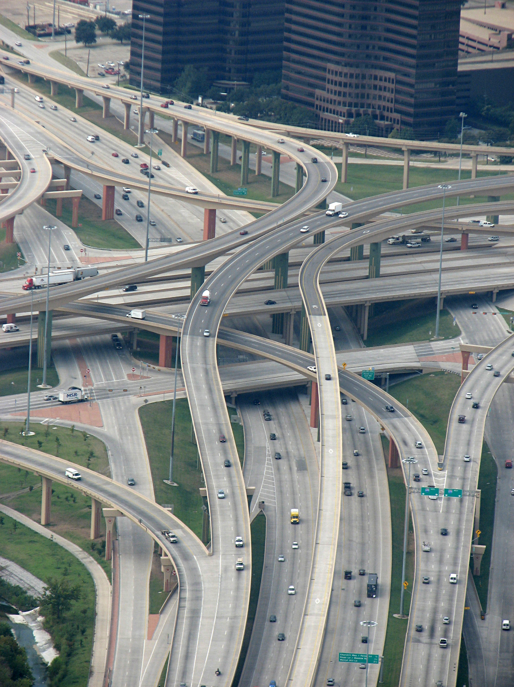

# IFC4x3 Alignment Geometry Implementation Guide
*A developer's guide to IFC4x3 alignment geometry*

*High Five Interchange at the intersection of I-635 and U.S. Route 75 in Dallas, Texas*

*Photo by [austrini](https://www.flickr.com/photos/fatguyinalittlecoat/2909850055/) — [CC BY 2.0](https://creativecommons.org/licenses/by/2.0/) via [Wikimedia Commons](https://commons.wikimedia.org/w/index.php?curid=10298513)*
