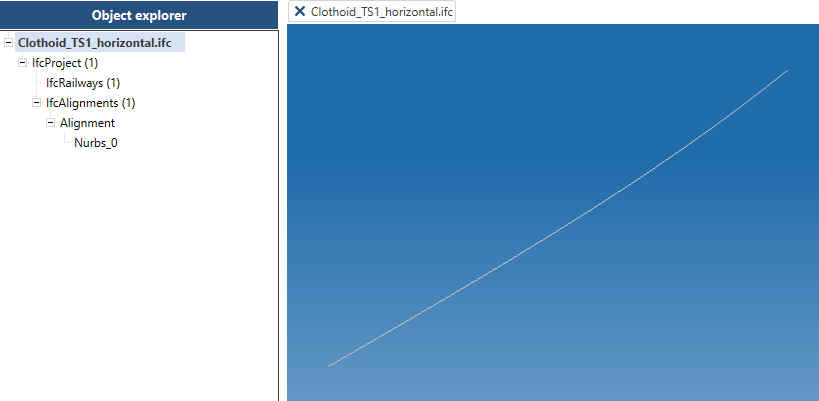
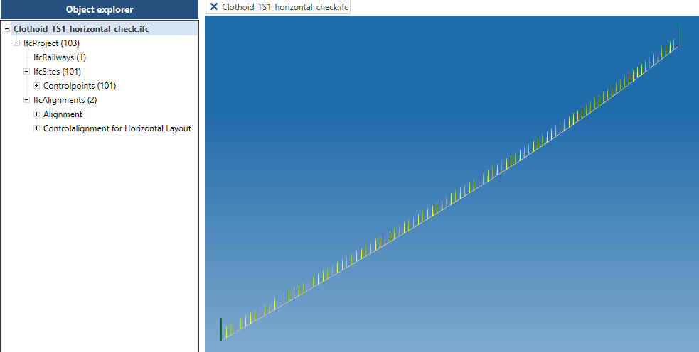
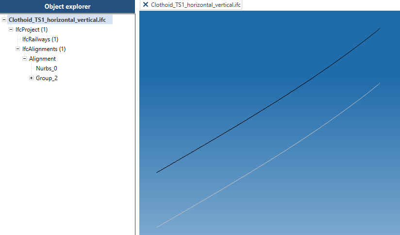
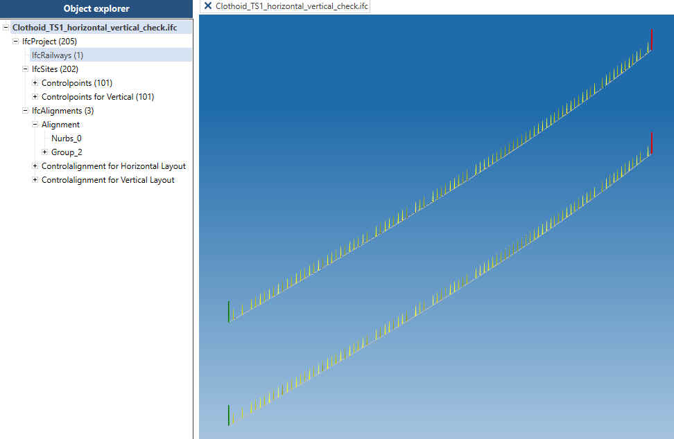
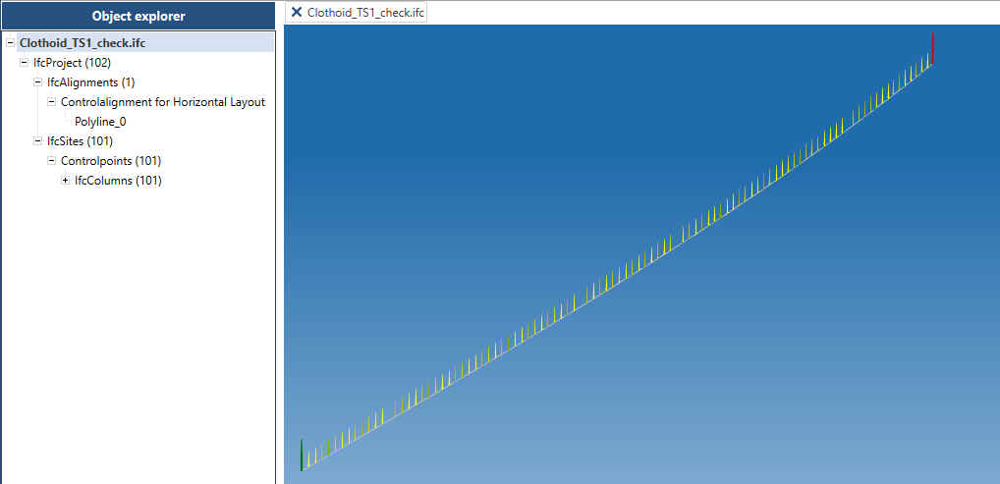

# Atomic testset for  IFC transition bends

Example files for six alignment transition bend types as defined in IFC (CLOTHOID, HELMERTCURVE, BLOSSCURVE, COSINECURVE, SINECURVE, VIENNESEBEND).

For each type eight variations of start curvarture and end curvature are provided.

For each of the 48 atomic testcases the following files are available:

- one Excel Report
- five different IFC-Files with schemaversion IFC4X3_ADD2 (ISO 16739-1:2024)
	- horizontal layout only
	- horizontal layout with check data
	- horizontal layout and vertical layout (no check data)
	- horizontal layout and vertical layout with check data
	- check data only
- one plot containing 2D x/y diagram, curvature diagram, cant diagram

Note 1: the vertical layout consists of a simple line with gradient 0

Note 2: IFC Files with cant layout can be expected soon

## IFC-Files 

### horizontal layout only

*Figure 1 IFC example file for Clothoid with horizontal layout in IFC Viewer*

### horizontal layout with check data

*Figure 2 IFC example file for Clothoid with horizontal layout and check data in IFC Viewer*

### horizontal layout and vertical layout (no check data)

*Figure 3 IFC example file for Clothoid with horizontal and vertical layout in IFC Viewer*

### horizontal layout and vertical layout with check data

*Figure 4 IFC example file for Clothoid with horizontal and vertical layout and check data in IFC Viewer*

### check data only

*Figure 5 IFC example file with check data (controlalignment and controlpoints) for Clothoid in IFC Viewer*

